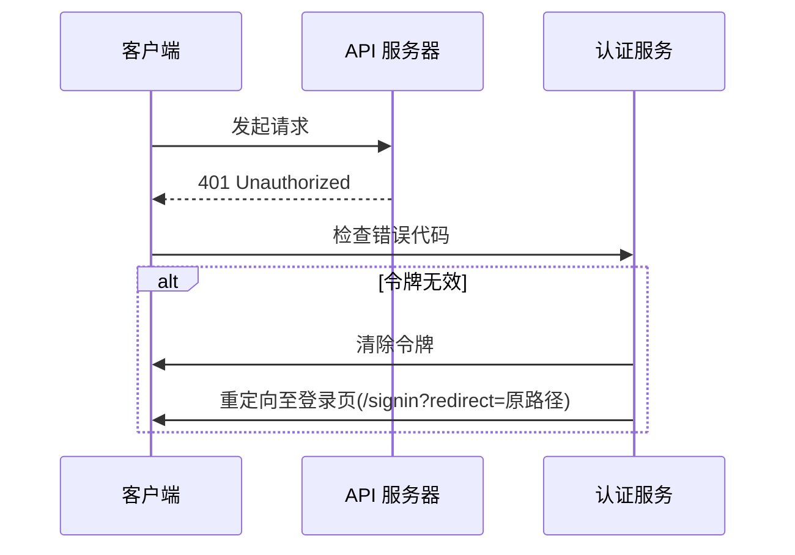

# 错误处理

<cite>
**本文档中引用的文件**  
- [no-permission-error.ts](file://packages/core/acl/src/errors/no-permission-error.ts)
- [error-handler.ts](file://packages/plugins/@nocobase/plugin-error-handler/src/server/error-handler.ts)
- [check-association-operate.ts](file://packages/plugins/@nocobase/plugin-acl/src/server/middlewares/check-association-operate.ts)
- [acl.ts](file://packages/core/acl/src/acl.ts)
- [APIClient.ts](file://packages/core/client/src/api-client/APIClient.ts)
- [interceptors.ts](file://packages/plugins/@nocobase/plugin-auth/src/client/interceptors.ts)
- [zh-CN.json](file://locales/zh-CN.json)
- [en-US.json](file://packages/plugins/@nocobase/plugin-error-handler/src/locale/en-US.json)
- [system-logger.ts](file://packages/core/logger/src/system-logger.ts)
</cite>

## 目录
1. [介绍](#介绍)
2. [NoPermissionError 的创建与抛出](#nopermissionerror-的创建与抛出)
3. [权限错误的结构与信息](#权限错误的结构与信息)
4. [全局错误处理器的捕获与格式化](#全局错误处理器的捕获与格式化)
5. [客户端权限错误处理](#客户端权限错误处理)
6. [多语言错误消息自定义](#多语言错误消息自定义)
7. [错误日志记录策略](#错误日志记录策略)
8. [总结](#总结)

## 介绍
本文档详细阐述了 NocoBase 权限错误处理机制，重点分析了 `NoPermissionError` 的创建、抛出和处理流程。文档涵盖了错误对象的结构、全局错误处理器如何捕获和格式化响应、客户端处理最佳实践、多语言支持以及日志记录策略，为开发者和运维人员提供全面的指导。

## NoPermissionError 的创建与抛出

NocoBase 的权限错误处理机制基于 `NoPermissionError` 类，该类继承自 JavaScript 的 `Error` 类，用于表示权限不足的异常情况。当系统检测到用户尝试访问其无权操作的资源时，会抛出此错误。

`NoPermissionError` 的创建和抛出主要发生在权限检查逻辑中。例如，在 `packages/core/acl/src/acl.ts` 文件的 `filterParams` 方法中，当检查到 `createdById` 字段不存在时，会直接抛出 `NoPermissionError`：

```typescript
if (!collection || !collection.getField('createdById')) {
  throw new NoPermissionError('createdById field not found');
}
```

此外，在中间件中也会捕获 `NoPermissionError` 并将其转换为 HTTP 403 响应。例如，在 `check-association-operate.ts` 中：

```typescript
try {
  // ... 权限检查逻辑
} catch (e) {
  if (e instanceof NoPermissionError) {
    ctx.throw(403, 'No permissions');
  }
  throw e;
}
```

**Section sources**
- [no-permission-error.ts](file://packages/core/acl/src/errors/no-permission-error.ts#L1-L11)
- [acl.ts](file://packages/core/acl/src/acl.ts#L467-L493)
- [check-association-operate.ts](file://packages/plugins/@nocobase/plugin-acl/src/server/middlewares/check-association-operate.ts#L52-L54)

## 权限错误的结构与信息

`NoPermissionError` 本身是一个标准的 JavaScript 错误对象，其核心信息包含在 `message` 属性中。当需要更丰富的错误信息时，系统会通过全局错误处理器将其包装成一个结构化的响应对象。

这个结构化的错误响应通常包含以下字段：
- `message`: 用户友好的错误描述。
- `code`: 错误代码，用于程序化处理。
- `title`: 错误标题（可选）。

在 `error-handler.ts` 中，`defaultHandler` 方法负责构建这个响应体：

```typescript
const errorData: { message: string; code: string; title?: string } = {
  message,
  code: err.code,
};

if (err?.title) {
  errorData.title = err.title;
}

ctx.body = {
  errors: [errorData],
};
```

**Section sources**
- [error-handler.ts](file://packages/plugins/@nocobase/plugin-error-handler/src/server/error-handler.ts#L29-L39)

## 全局错误处理器的捕获与格式化

NocoBase 使用一个全局的 `ErrorHandler` 类来统一处理所有未捕获的异常。该处理器通过 Koa 中间件的形式注入到应用的请求处理流程中。

`ErrorHandler` 的核心工作流程如下：
1.  **捕获异常**：中间件使用 `try...catch` 捕获在 `next()` 调用过程中抛出的任何错误。
2.  **日志记录**：捕获到错误后，首先使用 `ctx.log.error` 将错误信息、堆栈跟踪和上下文记录到日志系统中。
3.  **状态码设置**：根据错误对象的 `statusCode` 或 `status` 属性设置 HTTP 响应状态码。
4.  **渲染错误**：调用 `renderError` 方法，该方法会遍历所有注册的处理器（handlers），寻找第一个能处理该错误类型的处理器。如果找不到，则使用 `defaultHandler` 进行处理。

```mermaid
flowchart TD
A[请求进入] --> B{执行 next()}
B --> C[业务逻辑]
C --> D[成功响应]
B --> E[抛出异常]
E --> F[全局错误处理器捕获]
F --> G[记录错误日志]
G --> H{是否有匹配的处理器?}
H --> |是| I[调用特定处理器]
H --> |否| J[调用默认处理器]
I --> K[格式化响应]
J --> K
K --> L[返回错误响应]
```

**Diagram sources**
- [error-handler.ts](file://packages/plugins/@nocobase/plugin-error-handler/src/server/error-handler.ts#L53-L67)

**Section sources**
- [error-handler.ts](file://packages/plugins/@nocobase/plugin-error-handler/src/server/error-handler.ts#L53-L67)

## 客户端权限错误处理

在客户端，NocoBase 通过 `APIClient` 和 `authCheckMiddleware` 来处理权限错误，特别是与身份验证相关的错误。

`APIClient` 的拦截器会检查响应中的错误代码，并根据不同的代码执行相应的操作：
- `ROLE_NOT_FOUND_ERR` 或 `ROLE_NOT_FOUND_FOR_USER`：清除当前角色并刷新页面。
- `TOKEN_INVALID` 或 `USER_LOCKED`：清除当前令牌。

```typescript
if (errs.find((error: { code?: string }) => error.code === 'ROLE_NOT_FOUND_ERR')) {
  this.auth.setRole(null);
  window.location.reload();
}
if (errs.find((error: { code?: string }) => error.code === 'TOKEN_INVALID' || error.code === 'USER_LOCKED')) {
  this.auth.setToken(null);
}
```

`authCheckMiddleware` 则专门处理 401 未授权错误。当检测到令牌过期或无效时，它会将用户重定向到登录页面，并在 URL 中保留原始的重定向路径。



**Diagram sources**
- [APIClient.ts](file://packages/core/client/src/api-client/APIClient.ts#L122-L133)
- [interceptors.ts](file://packages/plugins/@nocobase/plugin-auth/src/client/interceptors.ts#L88-L94)

**Section sources**
- [APIClient.ts](file://packages/core/client/src/api-client/APIClient.ts#L114-L134)
- [interceptors.ts](file://packages/plugins/@nocobase/plugin-auth/src/client/interceptors.ts#L43-L98)

## 多语言错误消息自定义

NocoBase 支持多语言环境，其错误消息可以通过国际化（i18n）文件进行自定义。系统使用 `i18next` 库来管理多语言资源。

错误消息的自定义主要通过以下步骤实现：
1.  **定义语言文件**：在 `locales` 目录下为每种语言创建 JSON 文件（如 `zh-CN.json`, `en-US.json`）。
2.  **添加翻译键值对**：在语言文件中添加错误消息的翻译。例如，在 `plugin-error-handler` 插件的 `en-US.json` 中：
    ```json
    {
      "Validation error": "{{field}} validation error",
      "notNull Violation": "{{field}} cannot be null"
    }
    ```
3.  **在代码中使用**：通过 `ctx.t()` 方法根据当前语言环境获取翻译后的消息。

当全局错误处理器需要返回错误消息时，它会利用 `ctx.t()` 方法来确保消息以用户的首选语言显示。

**Section sources**
- [en-US.json](file://packages/plugins/@nocobase/plugin-error-handler/src/locale/en-US.json#L1-L6)
- [zh-CN.json](file://locales/zh-CN.json)
- [i18n.ts](file://packages/core/client/src/i18n/i18n.ts)

## 错误日志记录策略

NocoBase 使用 `winston` 库作为其日志系统，确保所有错误都能被可靠地记录和追踪。

关键的错误日志记录策略包括：
-  **集中式日志**：所有错误都通过 `ctx.log.error` 方法记录，该方法最终会调用 `SystemLogger`。
-  **详细上下文**：日志记录不仅包含错误消息和堆栈跟踪，还包含请求 ID (`reqId`)、应用名称 (`app`)、数据源键 (`dataSourceKey`) 等上下文信息，便于问题排查。
-  **分离错误日志**：系统支持将错误日志单独写入一个文件（如 `system_error.log`），与普通日志分开，方便监控和分析。
-  **日志级别**：使用不同的日志级别（如 `error`, `warn`, `info`）来区分问题的严重程度。

在 `system-logger.ts` 中，`log` 方法负责处理日志的格式化和输出，确保 `cause`（错误原因）也能被正确记录。

**Section sources**
- [system-logger.ts](file://packages/core/logger/src/system-logger.ts#L62-L88)
- [logger.js](file://packages/core/cli/src/logger.js)

## 总结
NocoBase 的权限错误处理机制是一个分层、健壮的系统。它从底层的 `NoPermissionError` 抛出，到全局错误处理器的捕获与格式化，再到客户端的重定向和用户提示，最后通过详细的日志记录为运维提供支持。结合多语言支持，该机制能够为不同用户提供清晰、友好的错误体验，同时为开发者和运维人员提供强大的调试和监控能力。