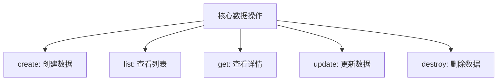
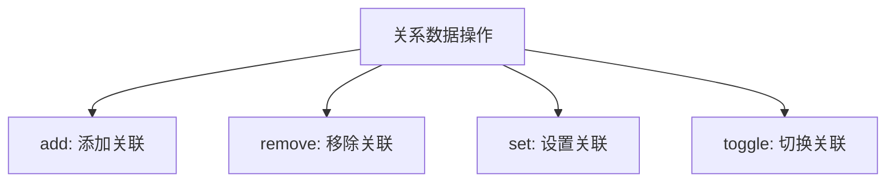
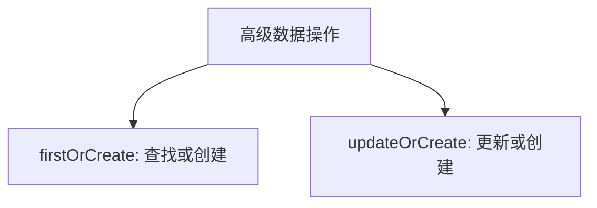
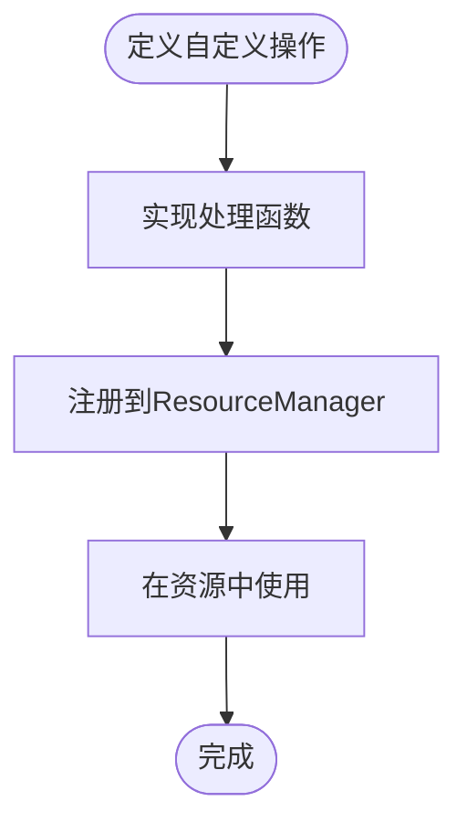
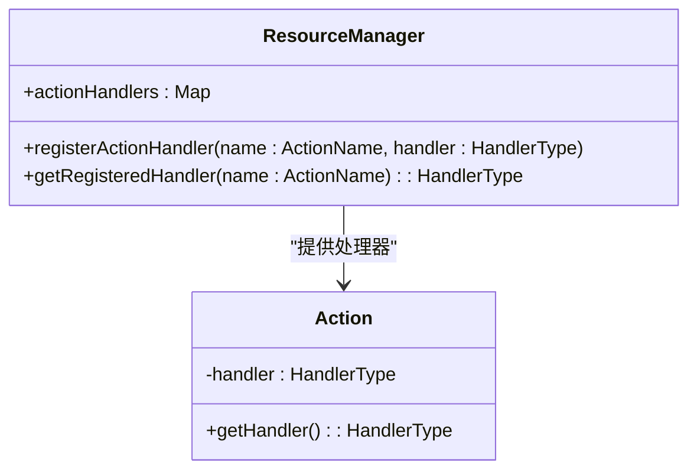
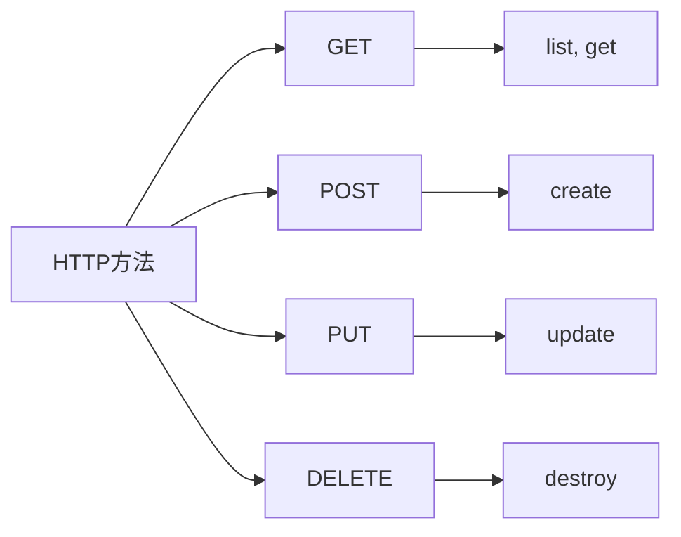
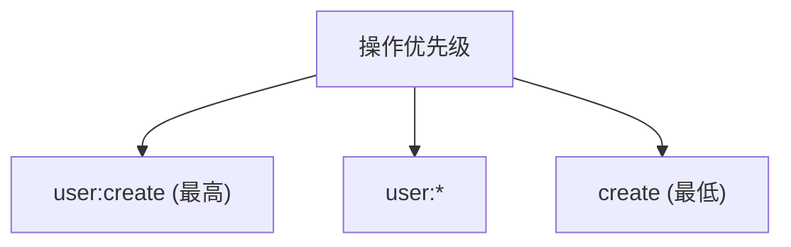
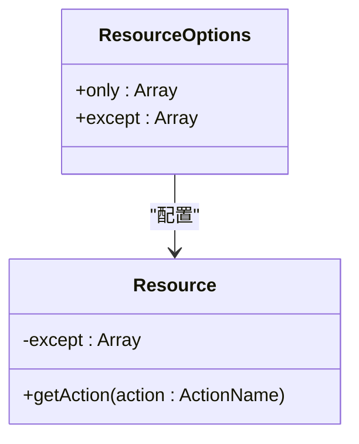
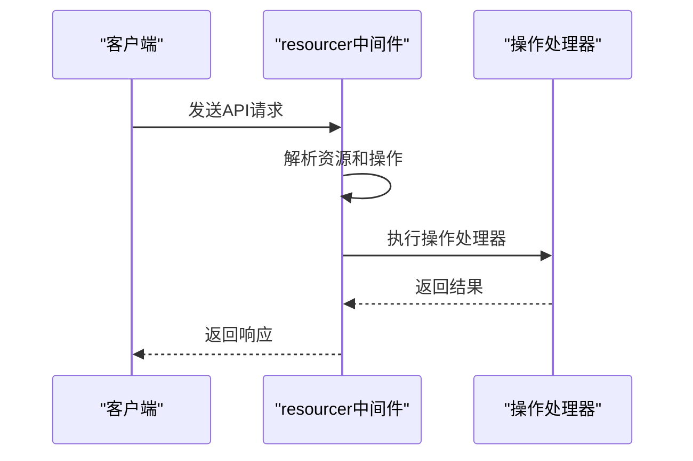

# 操作类型

<cite>
**本文档中引用的文件**  
- [index.ts](file://packages/core/actions/src/actions/index.ts)
- [list.ts](file://packages/core/actions/src/actions/list.ts)
- [create.ts](file://packages/core/actions/src/actions/create.ts)
- [update.ts](file://packages/core/actions/src/actions/update.ts)
- [destroy.ts](file://packages/core/actions/src/actions/destroy.ts)
- [get.ts](file://packages/core/actions/src/actions/get.ts)
- [add.ts](file://packages/core/actions/src/actions/add.ts)
- [set.ts](file://packages/core/actions/src/actions/set.ts)
- [remove.ts](file://packages/core/actions/src/actions/remove.ts)
- [toggle.ts](file://packages/core/actions/src/actions/toggle.ts)
- [first-or-create.ts](file://packages/core/actions/src/actions/first-or-create.ts)
- [update-or-create.ts](file://packages/core/actions/src/actions/update-or-create.ts)
- [utils.ts](file://packages/core/actions/src/utils.ts)
- [resourcer.ts](file://packages/core/resourcer/src/resourcer.ts)
- [resource.ts](file://packages/core/resourcer/src/resource.ts)
- [action.ts](file://packages/core/resourcer/src/action.ts)
- [load-default-actions.ts](file://packages/core/data-source-manager/src/load-default-actions.ts)
- [audit-manager/index.ts](file://packages/core/server/src/audit-manager/index.ts)
</cite>

## 目录
1. [引言](#引言)
2. [操作在权限系统中的角色](#操作在权限系统中的角色)
3. [预定义的标准操作类型](#预定义的标准操作类型)
4. [自定义操作类型的定义与注册](#自定义操作类型的定义与注册)
5. [操作与HTTP方法的映射关系](#操作与http方法的映射关系)
6. [操作粒度的控制策略](#操作粒度的控制策略)
7. [操作权限的组合与继承机制](#操作权限的组合与继承机制)
8. [前端界面与API路由中的操作识别](#前端界面与api路由中的操作识别)
9. [总结](#总结)

## 引言

NocoBase是一个低代码开发平台，其核心功能之一是灵活的权限控制系统。在该系统中，"操作"（Action）是权限管理的基本单元，用于定义用户对特定资源可以执行的具体行为。本文档将深入探讨NocoBase中的操作类型系统，包括其在权限系统中的角色、预定义的标准操作、自定义操作的实现方式、与HTTP方法的映射关系、粒度控制策略以及权限的组合与继承机制。

**本文档中引用的文件**  
- [index.ts](file://packages/core/actions/src/actions/index.ts)

## 操作在权限系统中的角色

在NocoBase的权限系统中，操作（Action）是连接用户权限与具体业务功能的桥梁。每个操作代表了对特定资源（Resource）的一类可执行行为。权限系统通过为用户或角色分配对特定资源的操作权限，来精确控制其访问和修改数据的能力。

操作在权限系统中的核心作用体现在以下几个方面：
- **权限粒度控制**：通过定义细粒度的操作，可以实现对数据访问的精确控制，例如区分"查看列表"和"查看详情"。
- **安全审计**：操作是审计日志记录的基本单位，每一次操作的执行都会被记录，便于追踪用户行为。
- **API访问控制**：前端界面和API路由的访问权限都基于操作进行控制，确保只有拥有相应权限的用户才能执行特定操作。

**本文档中引用的文件**  
- [audit-manager/index.ts](file://packages/core/server/src/audit-manager/index.ts#L102-L143)

## 预定义的标准操作类型

NocoBase提供了一系列预定义的标准操作类型，这些操作覆盖了常见的数据管理需求。这些标准操作在`packages/core/actions/src/actions/`目录下定义，并通过`index.ts`文件统一导出。

### 核心数据操作

这些操作是CRUD（创建、读取、更新、删除）模式的基础实现。

**图示来源**  
- [index.ts](file://packages/core/actions/src/actions/index.ts#L10-L14)

- **create**：用于创建新数据记录。该操作会调用数据仓库的`create`方法，接收`values`参数作为要创建的数据内容。
- **list**：用于获取数据列表。支持分页、过滤、排序等参数，是数据展示的基础操作。
- **get**：用于获取单条数据的详细信息。通常通过`filterByTk`参数指定要获取的记录主键。
- **update**：用于更新现有数据记录。支持通过`filterByTk`或`filter`参数定位目标记录。
- **destroy**：用于删除数据记录。同样通过`filterByTk`或`filter`参数指定要删除的记录。

### 关系数据操作

这些操作专门用于处理数据库中的关联关系。

**图示来源**  
- [index.ts](file://packages/core/actions/src/actions/index.ts#L15-L18)

- **add**：向多对多或一对多关系中添加关联记录。
- **remove**：从多对多或一对多关系中移除关联记录。
- **set**：设置一对一或一对多关系的目标记录。
- **toggle**：在多对多关系中切换关联状态（添加或移除）。

### 高级数据操作

这些操作提供了更复杂的数据处理能力。

**图示来源**  
- [index.ts](file://packages/core/actions/src/actions/index.ts#L19-L20)

- **firstOrCreate**：尝试根据条件查找记录，如果不存在则创建新记录。
- **updateOrCreate**：尝试根据条件更新记录，如果不存在则创建新记录。

## 自定义操作类型的定义与注册

除了预定义的操作，NocoBase允许开发者定义和注册自定义操作类型以满足特定的业务需求。自定义操作的实现主要通过`ResourceManager`的`registerActionHandler`方法完成。

### 定义自定义操作

自定义操作本质上是一个中间件函数，接收`Context`和`next`作为参数。以下是一个自定义操作的定义示例：

**图示来源**  
- [resourcer.ts](file://packages/core/resourcer/src/resourcer.ts#L258-L260)

1. **实现处理函数**：创建一个异步函数，该函数接收`ctx`（上下文）和`next`（下一个中间件）作为参数。
2. **注册操作**：使用`resourcer.registerActionHandler('actionName', handler)`将处理函数注册为全局操作。
3. **使用操作**：在资源定义中，可以通过`actions`配置项引用已注册的自定义操作。

### 注册机制

操作的注册机制基于`ResourceManager`类，它维护了一个`actionHandlers`的Map来存储所有已注册的操作处理器。当请求到达时，系统会根据请求的资源和操作名称查找对应的处理器并执行。

**图示来源**  
- [resourcer.ts](file://packages/core/resourcer/src/resourcer.ts#L171-L260)
- [action.ts](file://packages/core/resourcer/src/action.ts#L360-L365)

## 操作与HTTP方法的映射关系

在NocoBase中，操作与HTTP方法之间存在明确的映射关系，这种映射使得RESTful API的设计更加直观和一致。

### 默认映射规则

系统通过`KoaMiddlewareOptions`中的`accessors`配置项定义了操作与HTTP方法的默认映射关系：

**图示来源**  
- [resourcer.ts](file://packages/core/resourcer/src/resourcer.ts#L44-L75)

- **GET**：映射到`list`（查看列表）和`get`（查看详情）操作。
- **POST**：映射到`create`（创建数据）操作。
- **PUT**：映射到`update`（更新数据）操作。
- **DELETE**：映射到`destroy`（删除数据）操作。

### 自定义映射

开发者可以通过配置`accessors`选项来自定义这种映射关系，以适应不同的API设计需求。

## 操作粒度的控制策略

NocoBase提供了多层次的操作粒度控制策略，允许开发者根据需要精确控制权限的范围。

### 资源级别控制

操作可以与特定资源绑定，形成`resource:action`的命名模式。例如，`users:create`表示对用户资源的创建操作。

### 通配符控制

系统支持使用通配符`*`来定义更广泛的权限。例如，`users:*`表示对用户资源的所有操作权限。

### 优先级规则

当存在多个重叠的操作定义时，系统遵循"粒度越细，优先级越高"的原则。例如，对于`user:create`接口，以下优先级顺序为：`user:create` > `user:*` > `create`。

**图示来源**  
- [audit-manager/index.ts](file://packages/core/server/src/audit-manager/index.ts#L104-L110)

## 操作权限的组合与继承机制

NocoBase的操作权限系统支持复杂的组合与继承机制，使得权限管理更加灵活和高效。

### 权限继承

权限可以从父级资源继承到子级资源。例如，对某个数据表的权限可以继承到其关联字段的操作上。

### 权限组合

多个权限可以组合使用，形成更复杂的访问控制策略。系统通过`only`和`except`配置项来实现权限的白名单和黑名单控制。

**图示来源**  
- [resource.ts](file://packages/core/resourcer/src/resource.ts#L38-L43)

- **only**：指定资源仅允许执行的操作列表（白名单）。
- **except**：指定资源不允许执行的操作列表（黑名单）。

## 前端界面与API路由中的操作识别

操作在前端界面和API路由中扮演着关键角色，它们是功能可见性和可访问性的基础。

### 前端界面识别

在前端，操作通过`x-action`属性在Schema中声明。例如，`x-action="create"`表示该按钮触发创建操作。前端框架会根据用户的权限动态显示或隐藏相应的操作按钮。

### API路由识别

在后端，API路由通过`resourcer.middleware`中间件进行解析。该中间件会根据请求路径和方法解析出对应的资源和操作，然后执行相应的处理函数。

**图示来源**  
- [resourcer.ts](file://packages/core/resourcer/src/resourcer.ts#L311-L391)

## 总结

NocoBase的操作类型系统是一个强大而灵活的权限管理框架。通过预定义的标准操作、可扩展的自定义操作、清晰的HTTP方法映射、精细的粒度控制以及复杂的权限组合与继承机制，它为构建安全、可维护的低代码应用提供了坚实的基础。开发者可以充分利用这一系统，根据具体业务需求设计出既安全又易用的应用程序。