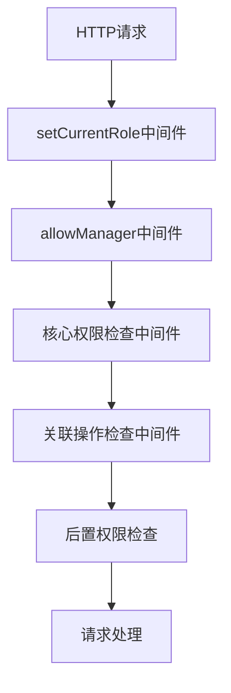
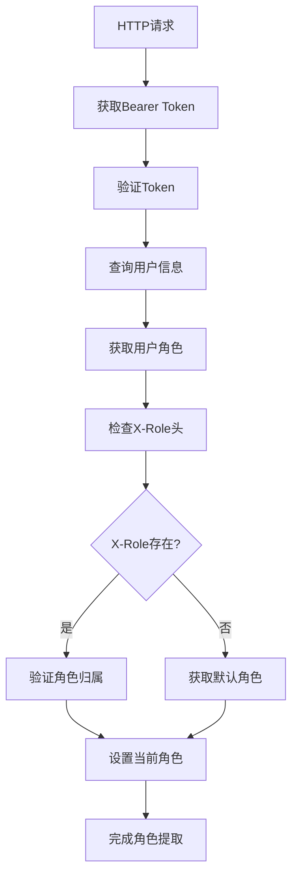
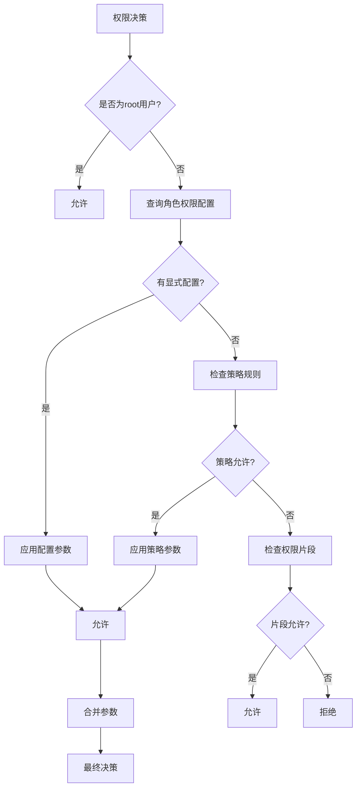
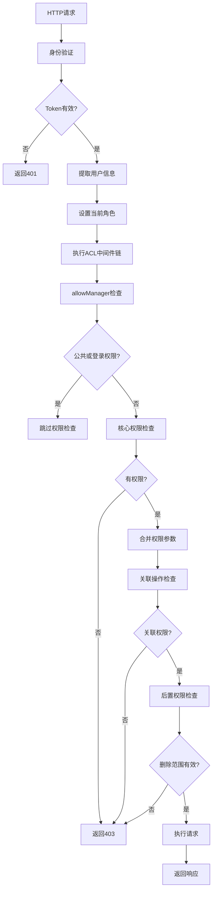

# 权限检查流程

<cite>
**本文档引用的文件**  
- [acl.ts](file://packages/core/acl/src/acl.ts)
- [allow-manager.ts](file://packages/core/acl/src/allow-manager.ts)
- [setCurrentRole.ts](file://packages/plugins/@nocobase/plugin-acl/src/server/middlewares/setCurrentRole.ts)
- [check-association-operate.ts](file://packages/plugins/@nocobase/plugin-acl/src/server/middlewares/check-association-operate.ts)
- [acl-role.ts](file://packages/core/acl/src/acl-role.ts)
- [fixed-params-manager.ts](file://packages/core/acl/src/fixed-params-manager.ts)
- [server.ts](file://packages/plugins/@nocobase/plugin-acl/src/server/server.ts)
</cite>

## 目录
1. [权限检查流程概述](#权限检查流程概述)
2. [ACL中间件注册与执行顺序](#acl中间件注册与执行顺序)
3. [请求上下文中的用户身份与角色提取](#请求上下文中的用户身份与角色提取)
4. [权限决策逻辑](#权限决策逻辑)
5. [权限缓存机制](#权限缓存机制)
6. [权限检查流程图](#权限检查流程图)
7. [调试权限相关问题](#调试权限相关问题)

## 权限检查流程概述

NocoBase的权限检查流程从HTTP请求进入系统开始，经过身份验证、角色提取、权限决策和缓存验证等多个阶段，最终决定是否允许请求继续执行。该流程主要由ACL（访问控制列表）系统实现，通过中间件链的方式对请求进行逐层处理。

**Section sources**
- [acl.ts](file://packages/core/acl/src/acl.ts#L381-L418)
- [server.ts](file://packages/plugins/@nocobase/plugin-acl/src/server/server.ts#L464)

## ACL中间件注册与执行顺序

ACL中间件在系统启动时被注册，并按照特定的执行顺序进行调用。核心中间件包括`setCurrentRole`、`allowManager`和核心权限检查中间件。

中间件的执行顺序如下：
1. `setCurrentRole`：设置当前用户角色
2. `allowManager`：处理公共权限和登录权限
3. 核心中间件：执行具体的权限检查
4. 关联操作检查：处理关联资源的操作权限
5. 后置检查：验证删除操作的权限范围



**Diagram sources**
- [server.ts](file://packages/plugins/@nocobase/plugin-acl/src/server/server.ts#L464)
- [acl.ts](file://packages/core/acl/src/acl.ts#L124)

**Section sources**
- [server.ts](file://packages/plugins/@nocobase/plugin-acl/src/server/server.ts#L464)
- [acl.ts](file://packages/core/acl/src/acl.ts#L124)

## 请求上下文中的用户身份与角色提取

用户身份和角色信息的提取是权限检查的关键步骤。系统通过以下流程提取相关信息：

1. 从请求头中获取Bearer Token
2. 验证Token的有效性
3. 从数据库中查询用户信息
4. 提取用户的角色信息
5. 根据X-Role头或默认角色确定当前角色

角色提取过程中会考虑用户所属部门的角色，并根据系统设置的角色模式（默认模式或联合角色模式）来确定最终的角色。



**Diagram sources**
- [setCurrentRole.ts](file://packages/plugins/@nocobase/plugin-acl/src/server/middlewares/setCurrentRole.ts#L17)
- [auth.ts](file://packages/core/auth/src/auth.ts#L74)

**Section sources**
- [setCurrentRole.ts](file://packages/plugins/@nocobase/plugin-acl/src/server/middlewares/setCurrentRole.ts#L17)
- [auth.ts](file://packages/core/auth/src/auth.ts#L74)

## 权限决策逻辑

权限决策是基于用户角色、资源和操作来查询权限规则，并进行允许或拒绝判断的过程。系统通过以下步骤进行权限决策：

1. 检查是否为root用户，root用户拥有所有权限
2. 查询角色对特定资源和操作的权限配置
3. 检查权限片段（snippet）是否允许
4. 应用策略规则（如own、all等）
5. 合并固定参数和动态参数
6. 最终判断是否允许请求

权限决策过程中会优先检查显式配置的权限，然后检查策略规则，最后考虑权限片段的配置。



**Diagram sources**
- [acl.ts](file://packages/core/acl/src/acl.ts#L243)
- [acl-role.ts](file://packages/core/acl/src/acl-role.ts#L82)

**Section sources**
- [acl.ts](file://packages/core/acl/src/acl.ts#L243)
- [acl-role.ts](file://packages/core/acl/src/acl-role.ts#L82)

## 权限缓存机制

权限系统实现了多层缓存机制来提高性能，包括角色缓存、权限规则缓存和计算结果缓存。

缓存键的生成策略：
- 角色缓存：`roles:{userId}`
- 默认角色缓存：`roles:{userId}:defaultRole`
- 系统设置缓存：`app:systemSettings`
- 配置缓存：`config`

缓存失效逻辑：
1. 用户角色变更时清除相关缓存
2. 系统设置变更时清除设置缓存
3. 角色配置变更时清除角色缓存
4. 定期清理过期的权限信息

```mermaid
flowchart TD
A[缓存机制] --> B[角色缓存]
A --> C[权限规则缓存]
A --> D[计算结果缓存]
B --> E[键: roles:{userId}]
C --> F[键: app:systemSettings]
D --> G[键: config]
A --> H[缓存失效]
H --> I[角色变更]
H --> J[设置变更]
H --> K[配置变更]
I --> L[清除角色缓存]
J --> M[清除设置缓存]
K --> N[清除配置缓存]
```

**Diagram sources**
- [setCurrentRole.ts](file://packages/plugins/@nocobase/plugin-acl/src/server/middlewares/setCurrentRole.ts#L32)
- [server.ts](file://packages/plugins/@nocobase/plugin-acl/src/server/server.ts#L342)

**Section sources**
- [setCurrentRole.ts](file://packages/plugins/@nocobase/plugin-acl/src/server/middlewares/setCurrentRole.ts#L32)
- [server.ts](file://packages/plugins/@nocobase/plugin-acl/src/server/server.ts#L342)

## 权限检查流程图

以下是完整的权限检查流程图，展示了从HTTP请求到最终响应的完整执行流程。



**Diagram sources**
- [acl.ts](file://packages/core/acl/src/acl.ts#L381)
- [server.ts](file://packages/plugins/@nocobase/plugin-acl/src/server/server.ts#L588)

**Section sources**
- [acl.ts](file://packages/core/acl/src/acl.ts#L381)
- [server.ts](file://packages/plugins/@nocobase/plugin-acl/src/server/server.ts#L588)

## 调试权限相关问题

调试权限问题时，可以关注以下几个关键点：

1. 检查请求头中的Authorization和X-Role字段
2. 验证用户角色配置是否正确
3. 查看权限决策日志
4. 检查缓存状态
5. 验证权限片段配置

系统提供了详细的日志记录，包括权限检查的原始条件和解析后的条件，有助于定位权限问题。

**Section sources**
- [acl.ts](file://packages/core/acl/src/acl.ts#L361)
- [setCurrentRole.ts](file://packages/plugins/@nocobase/plugin-acl/src/server/middlewares/setCurrentRole.ts#L77)