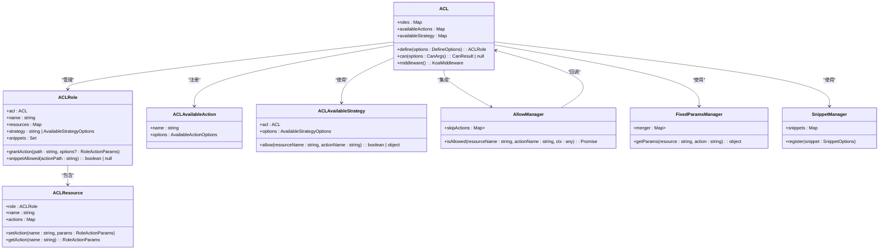
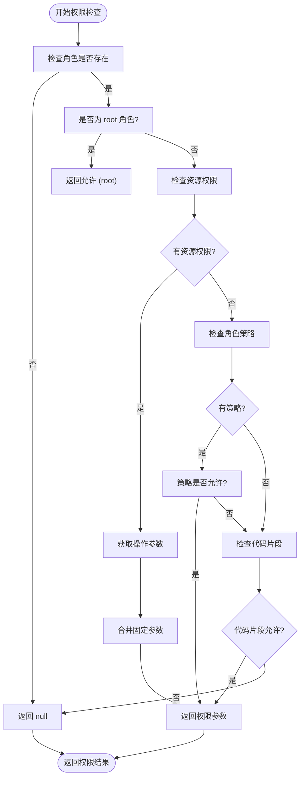
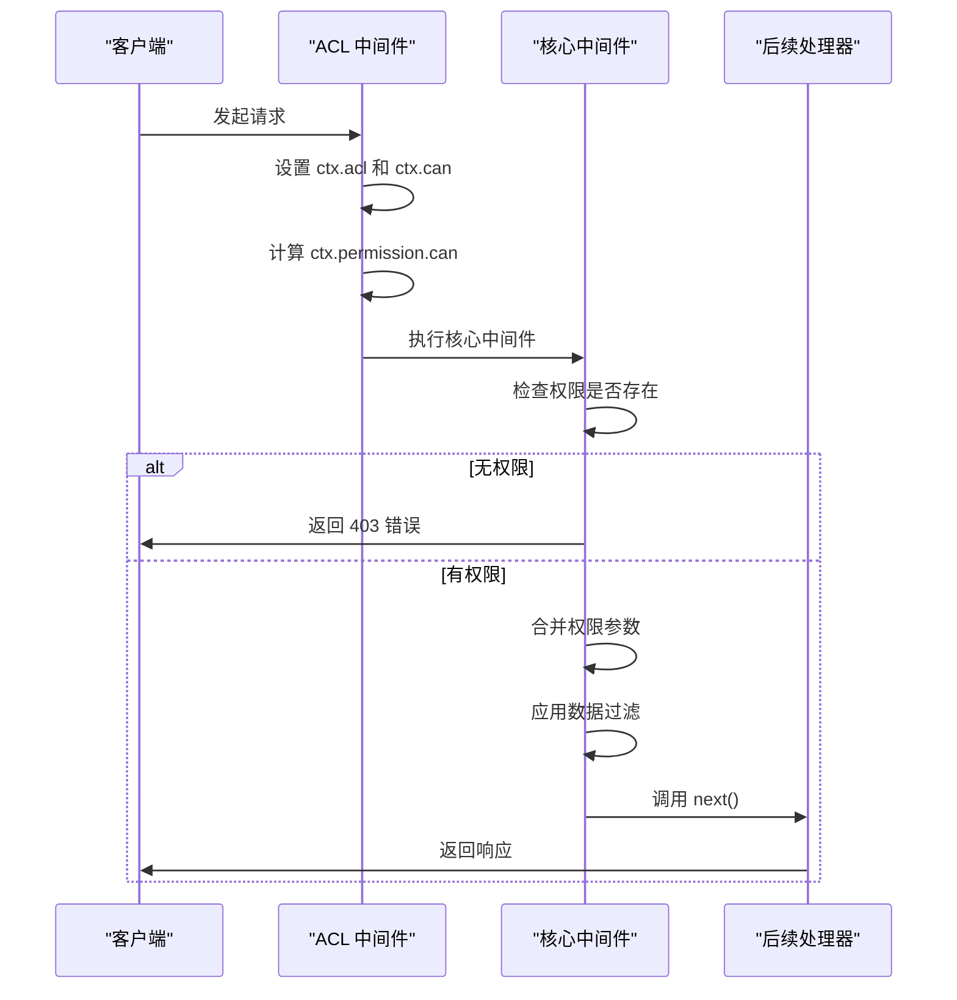
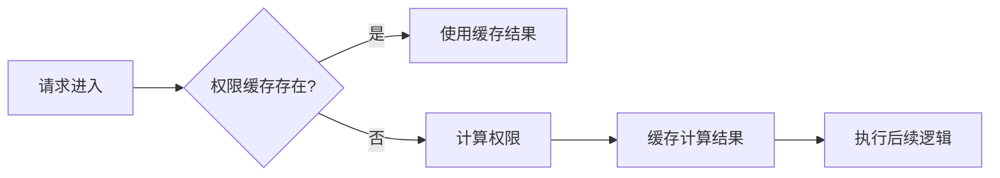

# 权限模型

<cite>
**本文档中引用的文件**  
- [ACL.ts](file://packages/core/acl/src/ACL.ts)
- [acl-resource.ts](file://packages/core/acl/src/acl-resource.ts)
- [acl-role.ts](file://packages/core/acl/src/acl-role.ts)
- [acl-available-action.ts](file://packages/core/acl/src/acl-available-action.ts)
- [acl-available-strategy.ts](file://packages/core/acl/src/acl-available-strategy.ts)
- [allow-manager.ts](file://packages/core/acl/src/allow-manager.ts)
- [fixed-params-manager.ts](file://packages/core/acl/src/fixed-params-manager.ts)
- [snippet-manager.ts](file://packages/core/acl/src/snippet-manager.ts)
- [no-permission-error.ts](file://packages/core/acl/src/errors/no-permission-error.ts)
</cite>

## 目录
1. [引言](#引言)
2. [核心概念](#核心概念)
3. [权限检查流程](#权限检查流程)
4. [中间件与权限拦截](#中间件与权限拦截)
5. [资源与操作的映射机制](#资源与操作的映射机制)
6. [权限继承与覆盖规则](#权限继承与覆盖规则)
7. [自定义资源与操作类型](#自定义资源与操作类型)
8. [数据库模型关联与关联数据权限](#数据库模型关联与关联数据权限)
9. [权限缓存机制与性能影响](#权限缓存机制与性能影响)
10. [权限模型总结](#权限模型总结)

## 引言
NocoBase 的权限模型（ACL）是一个灵活且可扩展的访问控制机制，用于管理用户角色对系统资源的操作权限。该模型基于角色（Role）、资源（Resource）和操作（Action）三要素构建，支持细粒度的权限控制、策略继承、权限合并以及动态权限计算。通过中间件机制，权限检查在请求处理流程中自动执行，确保安全性和性能的平衡。

**本文档中引用的文件**  
- [ACL.ts](file://packages/core/acl/src/ACL.ts)

## 核心概念

### 资源（Resource）
资源是权限控制的基本单位，通常对应系统中的数据模型或功能模块，如“users”、“posts”等。每个资源可以定义多个操作权限。在 ACL 系统中，资源由 `ACLResource` 类表示，包含一组操作及其参数。

**本文档中引用的文件**  
- [acl-resource.ts](file://packages/core/acl/src/acl-resource.ts)

### 操作（Action）
操作表示对资源的具体行为，如“create”、“read”、“update”、“delete”等。操作可以带有别名（aliases），并通过 `ACLAvaliableAction` 类进行注册和管理。操作的权限参数包括字段白名单（whitelist）、过滤条件（filter）等。

**本文档中引用的文件**  
- [acl-available-action.ts](file://packages/core/acl/src/acl-available-action.ts)

### 权限（Permission）
权限是角色对特定资源执行特定操作的能力。权限由角色定义，并通过 `can()` 方法进行检查。权限检查的结果包含角色、资源、操作及参数，用于后续的数据过滤和字段控制。

**本文档中引用的文件**  
- [ACL.ts](file://packages/core/acl/src/ACL.ts)

### 角色（Role）
角色是权限的载体，每个角色可以定义对多个资源的操作权限。角色还可以配置策略（strategy）和代码片段（snippets）来动态控制权限。`ACLRole` 类负责管理角色的资源、策略和权限逻辑。

**本文档中引用的文件**  
- [acl-role.ts](file://packages/core/acl/src/acl-role.ts)



**图表来源**  
- [ACL.ts](file://packages/core/acl/src/ACL.ts)
- [acl-role.ts](file://packages/core/acl/src/acl-role.ts)
- [acl-resource.ts](file://packages/core/acl/src/acl-resource.ts)
- [acl-available-action.ts](file://packages/core/acl/src/acl-available-action.ts)
- [acl-available-strategy.ts](file://packages/core/acl/src/acl-available-strategy.ts)
- [allow-manager.ts](file://packages/core/acl/src/allow-manager.ts)
- [fixed-params-manager.ts](file://packages/core/acl/src/fixed-params-manager.ts)
- [snippet-manager.ts](file://packages/core/acl/src/snippet-manager.ts)

## 权限检查流程

权限检查是 ACL 系统的核心功能，通过 `can()` 方法实现。该方法根据角色、资源和操作判断当前用户是否具有执行权限。

### 检查流程
1. **输入参数**：`can()` 方法接收角色（或角色数组）、资源名、操作名等参数。
2. **角色查找**：通过 `getRole()` 方法获取对应角色实例。
3. **根角色处理**：若角色为 `root`，直接返回允许结果。
4. **资源权限检查**：查找角色对该资源的操作权限，若存在则返回权限参数。
5. **策略检查**：若未定义具体权限，则检查角色策略（strategy）是否允许该操作。
6. **代码片段检查**：结合代码片段（snippet）规则，判断是否允许或拒绝操作。
7. **参数合并**：将固定参数（fixedParams）与权限参数合并，形成最终的访问控制参数。



**图表来源**  
- [ACL.ts](file://packages/core/acl/src/ACL.ts)

**本文档中引用的文件**  
- [ACL.ts](file://packages/core/acl/src/ACL.ts)

## 中间件与权限拦截

ACL 系统通过 Koa 中间件机制在请求处理流程中拦截和验证权限。中间件在请求上下文中注入 `ctx.permission` 对象，用于后续的数据访问控制。

### 中间件执行流程
1. **上下文初始化**：设置 `ctx.acl` 和 `ctx.can` 方法。
2. **权限评估**：调用 `can()` 方法获取当前请求的权限信息。
3. **核心中间件执行**：在 `addCoreMiddleware` 中检查权限结果，若无权限则抛出 403 错误。
4. **参数合并与过滤**：将权限参数与请求参数合并，并应用字段过滤、关联数据加载等逻辑。
5. **异常处理**：捕获 `NoPermissionError` 并返回 403 响应。



**图表来源**  
- [ACL.ts](file://packages/core/acl/src/ACL.ts)

**本文档中引用的文件**  
- [ACL.ts](file://packages/core/acl/src/ACL.ts)

## 资源与操作的映射机制

ACL 系统通过 `ACLResource` 和 `ACLAvaliableAction` 实现资源与操作的映射。每个资源可以注册多个操作，操作可以带有别名和元信息。

### 映射规则
- **资源命名**：资源名通常与数据模型名称一致，如 `users`、`posts`。
- **操作别名**：通过 `actionAlias` Map 实现操作别名映射，如 `list` 映射到 `read`。
- **动态解析**：在权限检查时，通过 `resolveActionAlias()` 方法解析操作名。

**本文档中引用的文件**  
- [ACL.ts](file://packages/core/acl/src/ACL.ts)
- [acl-resource.ts](file://packages/core/acl/src/acl-resource.ts)

## 权限继承与覆盖规则

ACL 系统支持权限的继承与覆盖，主要通过角色策略（strategy）和代码片段（snippet）实现。

### 继承规则
- **角色继承**：一个角色可以继承另一个角色的权限配置。
- **策略继承**：通过 `availableStrategy` 注册全局策略，角色可引用这些策略。
- **代码片段继承**：通过 `snippetManager` 注册代码片段规则，角色可通过 `snippets` 字段引用。

### 覆盖规则
- **显式权限优先**：角色对资源的显式权限定义优先于策略。
- **代码片段覆盖**：代码片段规则可以覆盖或拒绝策略允许的操作。
- **参数合并**：多个权限来源的参数通过 `mergeAclActionParams` 进行合并，遵循特定合并策略（如字段取交集、过滤条件合并等）。

**本文档中引用的文件**  
- [ACL.ts](file://packages/core/acl/src/ACL.ts)
- [acl-role.ts](file://packages/core/acl/src/acl-role.ts)
- [fixed-params-manager.ts](file://packages/core/acl/src/fixed-params-manager.ts)

## 自定义资源与操作类型

开发者可以通过 API 注册自定义资源和操作类型，扩展 ACL 系统的功能。

### 定义自定义操作
使用 `setAvailableAction()` 方法注册新的操作类型：

```typescript
acl.setAvailableAction('customAction', {
  displayName: '自定义操作',
  aliases: ['custom'],
  allowConfigureFields: true
});
```

### 定义自定义资源
通过 `define()` 方法为角色授予对自定义资源的权限：

```typescript
acl.define({
  role: 'admin',
  actions: {
    'customResource:customAction': {
      filter: { status: 'active' },
      fields: ['id', 'name']
    }
  }
});
```

**本文档中引用的文件**  
- [ACL.ts](file://packages/core/acl/src/ACL.ts)

## 数据库模型关联与关联数据权限

ACL 系统与数据库模型紧密集成，支持对关联数据的权限控制。

### 关联数据权限检查
- **字段过滤**：通过 `whitelist` 和 `blacklist` 控制可访问字段。
- **关联加载**：通过 `appends` 参数控制可加载的关联数据。
- **过滤条件**：在查询中自动注入权限相关的过滤条件，如 `createdById` 检查。

### 示例：关联数据权限
当用户查询 `posts` 时，若权限配置中包含 `appends: ['user']`，则允许加载关联的用户数据；否则仅返回主表字段。

**本文档中引用的文件**  
- [ACL.ts](file://packages/core/acl/src/ACL.ts)
- [fixed-params-manager.ts](file://packages/core/acl/src/fixed-params-manager.ts)

## 权限缓存机制与性能影响

ACL 系统通过多种机制优化性能，减少重复计算。

### 缓存机制
- **角色策略缓存**：`ACLRole` 中的 `_snippetCache` 缓存代码片段的计算结果。
- **固定参数缓存**：`FixedParamsManager` 缓存固定参数的合并结果。
- **资源查找缓存**：`roles` 和 `resources` 使用 Map 结构实现 O(1) 查找。

### 性能优化
- **中间件拓扑排序**：使用 `Toposort` 管理中间件执行顺序，避免重复执行。
- **懒加载**：权限参数在需要时才进行解析和合并。
- **错误快速失败**：无权限时立即抛出 403，避免后续处理开销。



**图表来源**  
- [acl-role.ts](file://packages/core/acl/src/acl-role.ts)
- [fixed-params-manager.ts](file://packages/core/acl/src/fixed-params-manager.ts)

**本文档中引用的文件**  
- [acl-role.ts](file://packages/core/acl/src/acl-role.ts)
- [fixed-params-manager.ts](file://packages/core/acl/src/fixed-params-manager.ts)

## 权限模型总结

NocoBase 的权限模型是一个功能强大且灵活的访问控制系统，具有以下特点：
- **模块化设计**：权限、角色、资源、策略等组件职责清晰，易于扩展。
- **细粒度控制**：支持字段级、记录级、操作级的权限控制。
- **动态计算**：通过策略和代码片段实现动态权限判断。
- **性能优化**：通过缓存、中间件排序等机制保证高性能。
- **易用性**：提供清晰的 API 和中间件集成方式，便于开发者使用。

该模型不仅满足常规的 RBAC 需求，还支持复杂的业务场景，是 NocoBase 安全体系的核心组成部分。

**本文档中引用的文件**  
- [ACL.ts](file://packages/core/acl/src/ACL.ts)
- [acl-role.ts](file://packages/core/acl/src/acl-role.ts)
- [acl-resource.ts](file://packages/core/acl/src/acl-resource.ts)