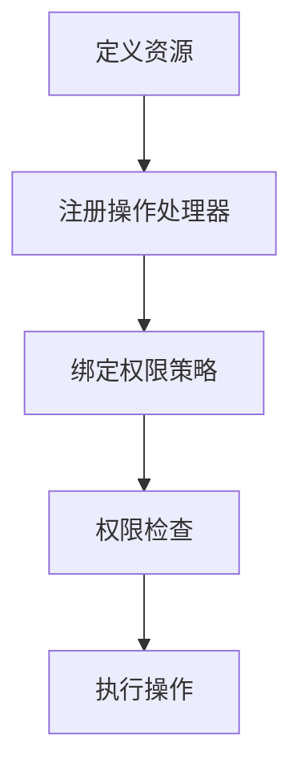
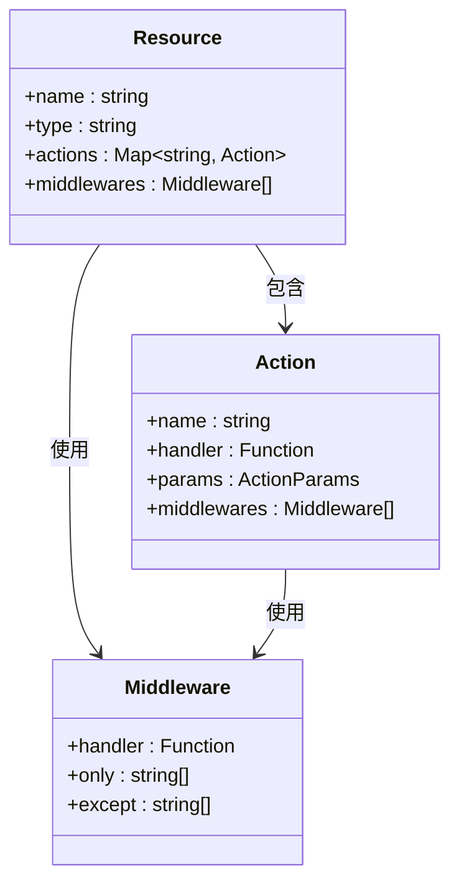
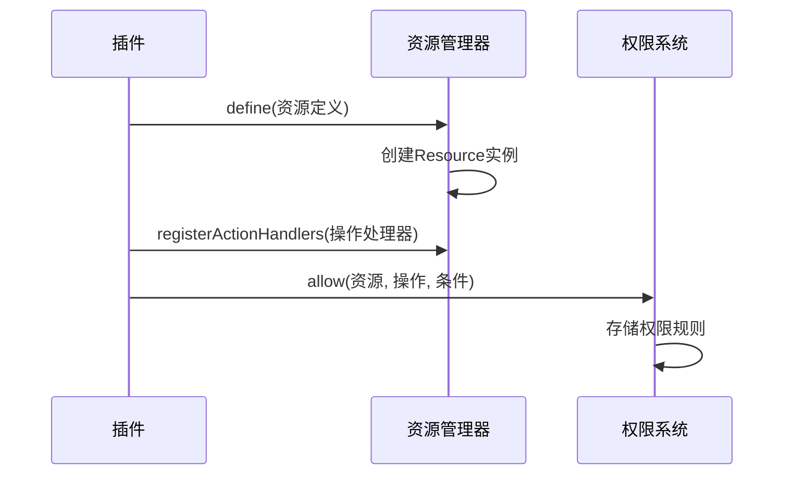
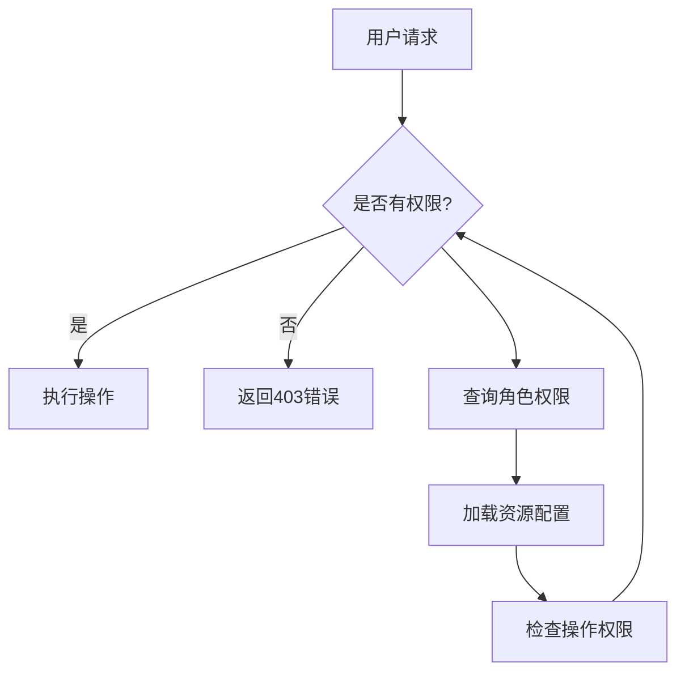

# 资源管理

<cite>
**本文档中引用的文件**  
- [plugin-acl\src\server\server.ts](file://packages/plugins/@nocobase/plugin-acl/src/server/server.ts)
- [acl\src\acl.ts](file://packages/core/acl/src/acl.ts)
- [acl\src\acl-role.ts](file://packages/core/acl/src/acl-role.ts)
- [acl\src\acl-resource.ts](file://packages/core/acl/src/acl-resource.ts)
- [resourcer\src\resourcer.ts](file://packages/core/resourcer/src/resourcer.ts)
- [resourcer\src\resource.ts](file://packages/core/resourcer/src/resource.ts)
- [resourcer\src\action.ts](file://packages/core/resourcer/src/action.ts)
- [server\src\plugin-manager\plugin-manager.ts](file://packages/core/server/src/plugin-manager/plugin-manager.ts)
</cite>

## 目录
1. [引言](#引言)
2. [资源在ACL系统中的定义与作用](#资源在acl系统中的定义与作用)
3. [资源的注册与权限控制](#资源的注册与权限控制)
4. [资源的命名规范与层级结构](#资源的命名规范与层级结构)
5. [资源与插件系统的集成](#资源与插件系统的集成)
6. [资源元数据的存储与权限检查](#资源元数据的存储与权限检查)
7. [结论](#结论)

## 引言
NocoBase 是一个低代码开发平台，其核心功能之一是灵活的权限控制系统（ACL）。在该系统中，资源（Resource）是权限管理的基本单位，用于控制用户对数据库模型、API端点及其他系统组件的访问权限。本文档详细阐述了资源在ACL系统中的定义、作用、注册方式、命名规范、层级结构、命名空间管理以及与插件系统的集成机制。

## 资源在ACL系统中的定义与作用
在NocoBase的ACL系统中，资源是权限控制的核心概念。每个资源代表一个可被权限管理的实体，如数据库表、API端点或系统功能。资源与角色（Role）关联，通过定义角色对特定资源的操作权限（如读、写、删除），实现细粒度的访问控制。

资源在ACL系统中的主要作用包括：
- **权限粒度控制**：通过将系统功能分解为多个资源，可以对每个资源独立设置访问权限。
- **动态权限管理**：资源可以动态注册和注销，支持插件化扩展。
- **策略资源管理**：某些资源被标记为“策略资源”，用于定义默认权限策略。

**Section sources**
- [acl\src\acl.ts](file://packages/core/acl/src/acl.ts#L140-L149)
- [plugin-acl\src\server\server.ts](file://packages/plugins/@nocobase/plugin-acl/src/server/server.ts#L648-L658)

## 资源的注册与权限控制
资源的注册是通过Resourcer模块完成的。Resourcer是一个资源管理器，负责定义、注册和管理所有可被访问的资源。每个资源包含一组操作（Actions），如`list`、`create`、`get`、`update`等。

### 资源注册流程
1. **定义资源**：通过`resourcer.define()`方法定义资源，指定资源名称、类型和操作。
2. **注册操作处理器**：为资源的操作注册处理器（Handler），处理具体的业务逻辑。
3. **权限绑定**：在ACL系统中，通过`acl.allow()`方法允许特定角色对资源执行特定操作。

**Diagram sources**
- [resourcer\src\resourcer.ts](file://packages/core/resourcer/src/resourcer.ts#L211-L216)
- [acl\src\acl.ts](file://packages/core/acl/src/acl.ts#L339-L354)

### 权限检查机制
当用户发起请求时，系统会通过中间件进行权限检查：
1. 解析请求中的资源名称和操作类型。
2. 根据当前用户的角色，查询其对目标资源的操作权限。
3. 如果权限允许，则继续执行请求；否则返回403错误。

**Section sources**
- [resourcer\src\resourcer.ts](file://packages/core/resourcer/src/resourcer.ts#L311-L391)
- [acl\src\acl.ts](file://packages/core/acl/src/acl.ts#L495-L567)

## 资源的命名规范与层级结构
### 命名规范
资源名称应遵循以下规范：
- 使用小写字母和连字符（kebab-case）命名，如`users`、`posts-comments`。
- 避免使用保留字和特殊字符。
- 名称应具有描述性，清晰表达资源的用途。

### 层级结构
资源支持层级结构，通过点号（`.`）分隔。例如：
- `users.profile` 表示用户的个人资料资源。
- `posts.comments` 表示文章的评论资源。

层级结构允许更精细的权限控制，例如可以单独控制对`users.profile`的访问权限，而不影响对`users`主资源的权限。

**Diagram sources**
- [resourcer\src\resource.ts](file://packages/core/resourcer/src/resource.ts#L61-L126)
- [resourcer\src\action.ts](file://packages/core/resourcer/src/action.ts#L212-L410)

## 资源与插件系统的集成
NocoBase的插件系统与资源管理紧密集成。每个插件可以在其`load`方法中定义和注册自己的资源。

### 插件中定义资源
插件通过以下步骤定义资源：
1. 在插件的`beforeLoad`或`load`方法中，调用`app.resourcer.define()`注册资源。
2. 为资源的操作注册处理器。
3. 在ACL系统中声明该资源的权限规则。

**Diagram sources**
- [server\src\plugin-manager\plugin-manager.ts](file://packages/core/server/src/plugin-manager/plugin-manager.ts#L98-L110)
- [plugin-acl\src\server\server.ts](file://packages/plugins/@nocobase/plugin-acl/src/server/server.ts#L100-L113)

### 动态资源管理
系统支持动态添加和移除资源。当数据库模型发生变化时（如创建新表），系统会自动触发事件，将新模型注册为可被权限控制的资源。

**Section sources**
- [plugin-acl\src\server\server.ts](file://packages/plugins/@nocobase/plugin-acl/src/server/server.ts#L648-L662)

## 资源元数据的存储与权限检查
### 元数据存储
资源的权限配置存储在数据库中，主要涉及以下模型：
- `roles`：角色表，存储角色基本信息。
- `roles_resources`：角色资源关联表，存储角色对资源的权限配置。
- `roles_resources_actions`：角色资源操作表，存储具体的操作权限参数。

### 权限检查流程
1. **获取角色权限**：根据用户角色，从数据库加载其资源权限配置。
2. **构建ACL对象**：将权限配置加载到内存中的ACL对象。
3. **执行权限检查**：在请求处理过程中，调用`ctx.can()`方法进行实时权限验证。

**Diagram sources**
- [acl\src\acl-role.ts](file://packages/core/acl/src/acl-role.ts#L51-L98)
- [acl\src\acl-resource.ts](file://packages/core/acl/src/acl-resource.ts#L47-L57)

## 结论
NocoBase的资源管理系统提供了一套完整且灵活的权限控制机制。通过将系统功能抽象为资源，并结合ACL系统，实现了细粒度的访问控制。资源的命名规范、层级结构和动态注册机制，使得系统具有良好的可扩展性和维护性。插件系统与资源管理的深度集成，进一步增强了平台的灵活性和定制能力。