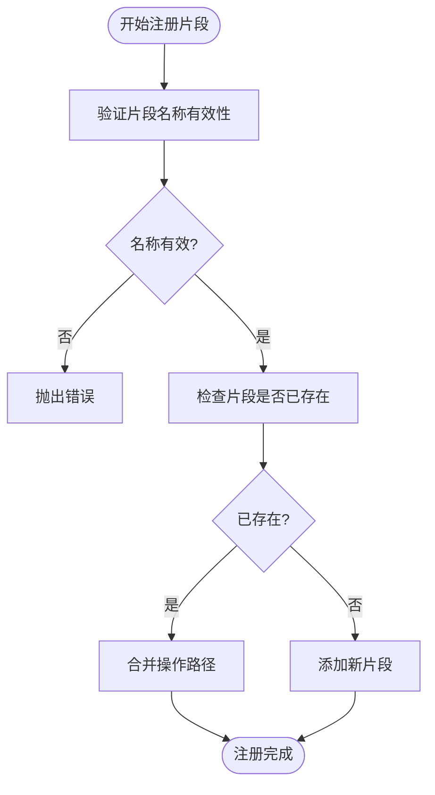

# 代码片段管理

<cite>
**本文档中引用的文件**  
- [snippet-manager.ts](file://packages/core/acl/src/snippet-manager.ts)
- [acl.ts](file://packages/core/acl/src/acl.ts)
- [acl-role.ts](file://packages/core/acl/src/acl-role.ts)
- [server.ts](file://packages/plugins/@nocobase/plugin-acl/src/server/server.ts)
- [plugin.ts](file://packages/plugins/@nocobase/plugin-auth/src/server/plugin.ts)
</cite>

## 目录
1. [简介](#简介)
2. [核心设计与实现](#核心设计与实现)
3. [代码片段的注册与管理](#代码片段的注册与管理)
4. [权限逻辑中的作用机制](#权限逻辑中的作用机制)
5. [安全执行机制](#安全执行机制)
6. [使用示例与最佳实践](#使用示例与最佳实践)
7. [总结](#总结)

## 简介

NocoBase 的代码片段管理器（SnippetManager）是其权限控制系统（ACL）的核心组件之一，负责管理基于命名空间的权限片段。这些代码片段用于定义角色对特定资源和操作的访问权限，通过灵活的匹配规则实现细粒度的权限控制。SnippetManager 的设计旨在提供一种可扩展、可复用且安全的权限管理机制，支持动态权限逻辑的实现。

**Section sources**
- [snippet-manager.ts](file://packages/core/acl/src/snippet-manager.ts#L1-L68)

## 核心设计与实现

SnippetManager 类采用简洁而高效的设计，通过 `Map` 数据结构存储和管理代码片段。每个代码片段由名称（name）和关联的操作路径（actions）数组组成。核心功能包括片段注册、权限判断和通配符匹配。

**Diagram sources**
- [snippet-manager.ts](file://packages/core/acl/src/snippet-manager.ts#L28-L67)

**Section sources**
- [snippet-manager.ts](file://packages/core/acl/src/snippet-manager.ts#L1-L68)

## 代码片段的注册与管理

代码片段的注册通过 `register` 方法完成。在注册过程中，系统会自动处理片段名称中的 `.*` 后缀，并对名称的有效性进行校验（不允许包含 `*` 或以 `.` 结尾）。如果注册的片段名称已存在，系统会将新的操作路径与现有路径合并，确保权限规则的累积性。

**Diagram sources**
- [snippet-manager.ts](file://packages/core/acl/src/snippet-manager.ts#L32-L46)

**Section sources**
- [snippet-manager.ts](file://packages/core/acl/src/snippet-manager.ts#L32-L46)
- [acl.ts](file://packages/core/acl/src/acl.ts#L460-L462)

## 权限逻辑中的作用机制

SnippetManager 在 NocoBase 的权限决策流程中扮演关键角色。当进行权限检查时，系统会调用 `allow` 方法，传入操作路径和片段名称。该方法支持通过在片段名称前加 `!` 来表示否定规则。权限判断的逻辑是：如果操作路径与片段中定义的任一操作模式匹配，则返回 `true`；如果匹配的是否定规则，则返回 `false`；若无任何匹配，则返回 `null`。

**Diagram sources**
- [snippet-manager.ts](file://packages/core/acl/src/snippet-manager.ts#L48-L65)
- [acl-role.ts](file://packages/core/acl/src/acl-role.ts#L149-L176)

**Section sources**
- [snippet-manager.ts](file://packages/core/acl/src/snippet-manager.ts#L48-L65)
- [acl-role.ts](file://packages/core/acl/src/acl-role.ts#L108-L147)

## 安全执行机制

虽然 SnippetManager 本身不直接提供沙箱环境或超时控制，但它通过严格的输入验证和模式匹配机制确保了安全性。片段名称的验证规则防止了潜在的注入攻击。权限判断基于预定义的操作路径模式，避免了动态代码执行的风险。实际的权限执行由上层的 ACL 系统和中间件完成，确保了权限检查的可靠性和一致性。

**Section sources**
- [snippet-manager.ts](file://packages/core/acl/src/snippet-manager.ts#L35-L38)
- [acl.ts](file://packages/core/acl/src/acl.ts#L495-L573)

## 使用示例与最佳实践

在 NocoBase 插件中，代码片段被广泛用于定义插件级别的权限。例如，`plugin-acl` 插件注册了 `pm.plugin-acl.roles` 片段，授予对角色管理相关操作的权限。最佳实践包括使用清晰的命名空间（如 `pm.plugin-name.resource`），合理利用通配符（`*`）来简化权限配置，并通过否定规则（`!`）实现精确的权限排除。

**Diagram sources**
- [server.ts](file://packages/plugins/@nocobase/plugin-acl/src/server/server.ts#L115-L134)
- [plugin.ts](file://packages/plugins/@nocobase/plugin-auth/src/server/plugin.ts#L126-L129)

**Section sources**
- [server.ts](file://packages/plugins/@nocobase/plugin-acl/src/server/server.ts#L115-L134)
- [plugin.ts](file://packages/plugins/@nocobase/plugin-auth/src/server/plugin.ts#L126-L129)

## 总结

NocoBase 的代码片段管理器提供了一套强大而灵活的权限管理机制。通过将复杂的权限逻辑分解为可复用的代码片段，系统实现了高度的模块化和可维护性。其设计注重安全性和性能，为构建复杂的动态权限系统奠定了坚实的基础。