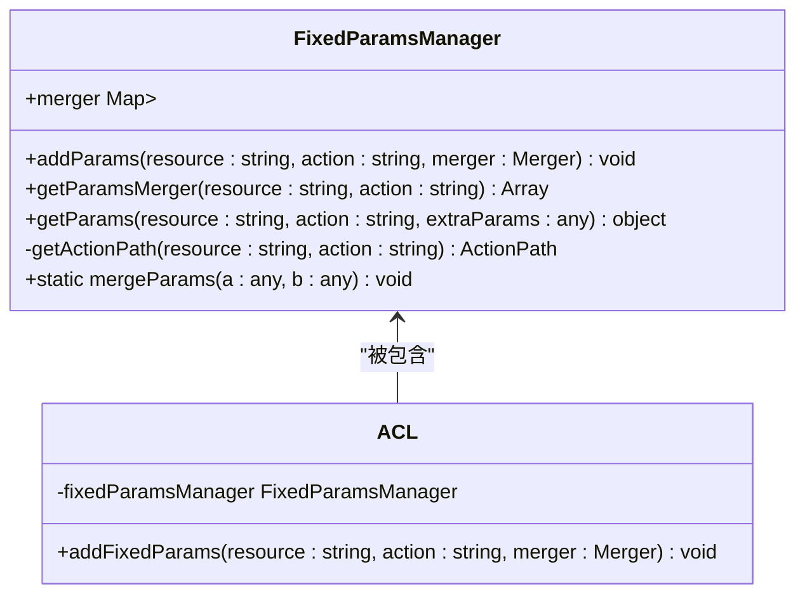
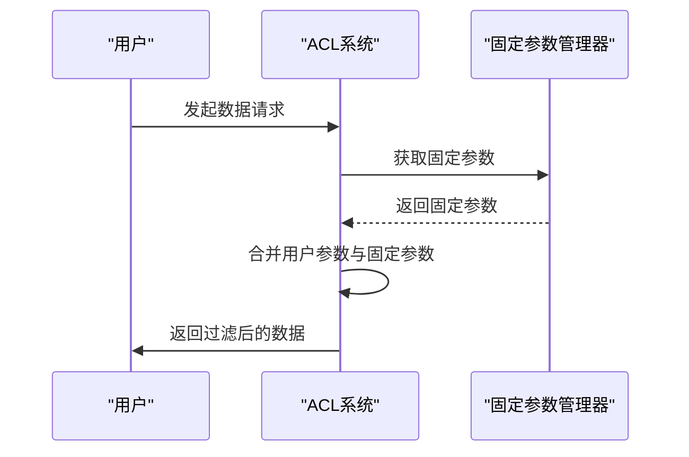
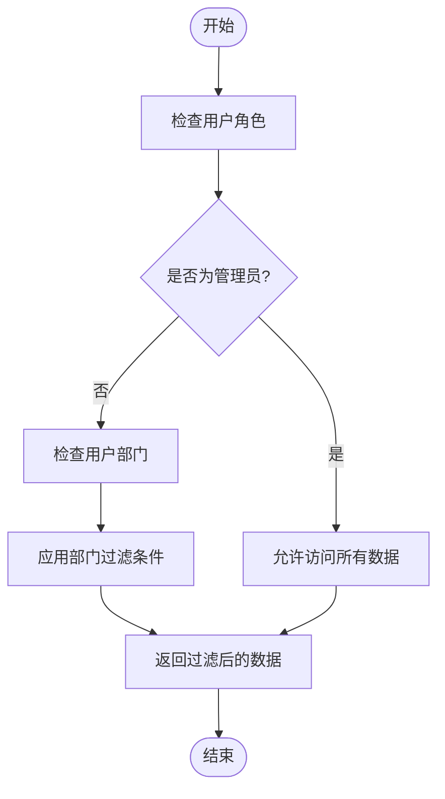
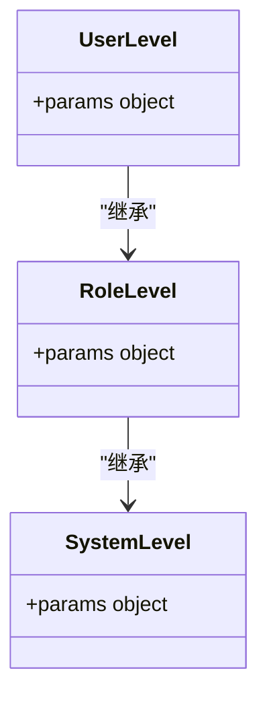
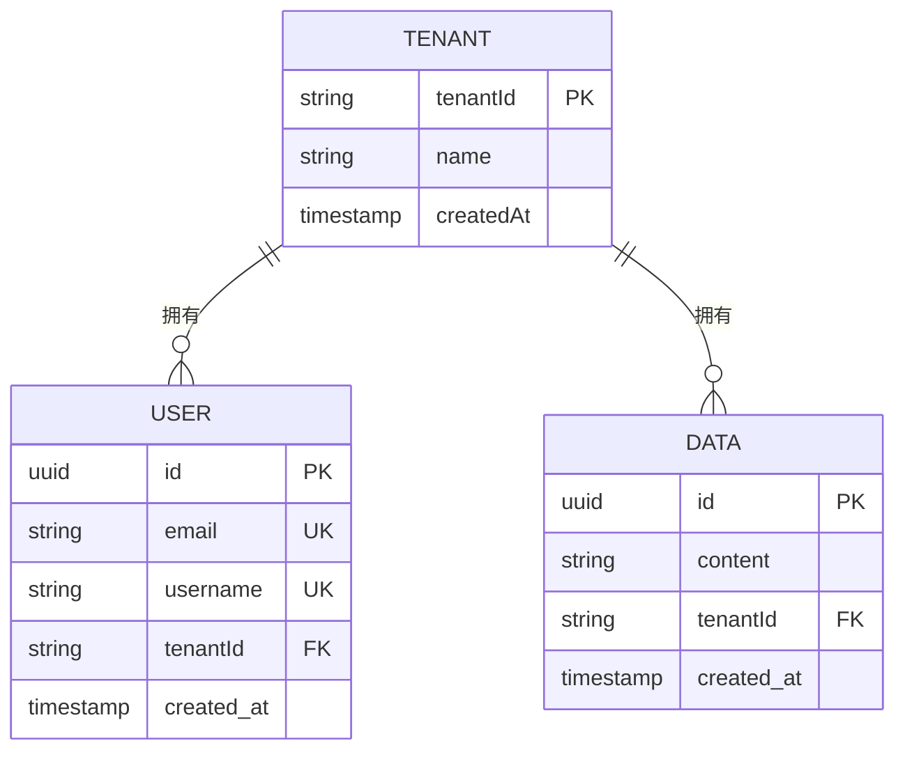

# 固定参数管理

<cite>
**本文档中引用的文件**   
- [fixed-params-manager.ts](file://packages/core/acl/src/fixed-params-manager.ts)
- [acl.ts](file://packages/core/acl/src/acl.ts)
- [acl-role.ts](file://packages/core/acl/src/acl-role.ts)
- [plugin-acl\server.ts](file://packages/plugins/@nocobase/plugin-acl/src/server/server.ts)
- [plugin-departments\plugin.ts](file://packages/plugins/@nocobase/plugin-departments/src/server/plugin.ts)
- [plugin-file-manager\server.ts](file://packages/plugins/@nocobase/plugin-file-manager/src/server/server.ts)
</cite>

## 目录
1. [简介](#简介)
2. [固定参数管理器设计](#固定参数管理器设计)
3. [权限策略中的固定查询参数](#权限策略中的固定查询参数)
4. [数据访问范围配置](#数据访问范围配置)
5. [继承机制与优先级规则](#继承机制与优先级规则)
6. [多层级参数设置](#多层级参数设置)
7. [多租户环境下的数据安全隔离](#多租户环境下的数据安全隔离)
8. [实际应用示例](#实际应用示例)
9. [总结](#总结)

## 简介
固定参数管理器（FixedParamsManager）是NocoBase权限系统中的核心组件，负责管理在权限策略中定义的固定查询参数。这些参数用于限制用户对数据的访问范围，实现基于组织、部门或项目的数据隔离。通过固定参数，系统可以在不同层级（系统、角色、用户）上设置访问控制规则，确保数据安全。

**Section sources**
- [acl.ts](file://packages/core/acl/src/acl.ts#L93-L94)
- [fixed-params-manager.ts](file://packages/core/acl/src/fixed-params-manager.ts#L19-L20)

## 固定参数管理器设计
固定参数管理器（FixedParamsManager）是一个专门用于管理固定查询参数的类，其主要职责是存储、合并和检索与特定资源和操作相关的固定参数。该类通过映射（Map）结构来组织参数，其中键是由资源名称和操作名称通过冒号（:）连接而成的路径。

**Diagram sources**
- [fixed-params-manager.ts](file://packages/core/acl/src/fixed-params-manager.ts#L19-L60)
- [acl.ts](file://packages/core/acl/src/acl.ts#L94-L458)

**Section sources**
- [fixed-params-manager.ts](file://packages/core/acl/src/fixed-params-manager.ts#L19-L60)
- [acl.ts](file://packages/core/acl/src/acl.ts#L94-L458)

## 权限策略中的固定查询参数
在NocoBase的权限系统中，固定查询参数被用于定义用户在执行特定操作时必须遵守的查询条件。这些参数通过`addParams`方法添加到固定参数管理器中，并在用户请求时自动合并到查询参数中。固定参数的合并遵循特定的策略，如`andMerge`、`intersect`、`union`等，以确保不同来源的参数能够正确地组合在一起。

**Diagram sources**
- [fixed-params-manager.ts](file://packages/core/acl/src/fixed-params-manager.ts#L36-L47)
- [acl.ts](file://packages/core/acl/src/acl.ts#L511-L512)

**Section sources**
- [fixed-params-manager.ts](file://packages/core/acl/src/fixed-params-manager.ts#L36-L47)
- [acl.ts](file://packages/core/acl/src/acl.ts#L511-L512)

## 数据访问范围配置
通过固定参数管理器，可以配置用户对数据的访问范围，实现基于组织、部门或项目的数据隔离。例如，可以设置某个角色只能访问其所在部门的数据，或者某个用户只能查看自己创建的记录。这种配置通过在固定参数中定义相应的过滤条件来实现。

**Diagram sources**
- [plugin-departments\plugin.ts](file://packages/plugins/@nocobase/plugin-departments/src/server/plugin.ts#L43-L44)
- [plugin-file-manager\server.ts](file://packages/plugins/@nocobase/plugin-file-manager/src/server/server.ts#L291-L293)

**Section sources**
- [plugin-departments\plugin.ts](file://packages/plugins/@nocobase/plugin-departments/src/server/plugin.ts#L43-L44)
- [plugin-file-manager\server.ts](file://packages/plugins/@nocobase/plugin-file-manager/src/server/server.ts#L291-L293)

## 继承机制与优先级规则
固定参数管理器支持参数的继承机制，允许在不同层级上定义的参数进行合并。当多个层级定义了相同的参数时，系统会根据预定义的优先级规则来决定最终使用的参数值。通常，用户级别的参数优先级最高，其次是角色级别，最后是系统级别。

**Diagram sources**
- [acl.ts](file://packages/core/acl/src/acl.ts#L262-L268)
- [fixed-params-manager.ts](file://packages/core/acl/src/fixed-params-manager.ts#L49-L58)

**Section sources**
- [acl.ts](file://packages/core/acl/src/acl.ts#L262-L268)
- [fixed-params-manager.ts](file://packages/core/acl/src/fixed-params-manager.ts#L49-L58)

## 多层级参数设置
在NocoBase中，固定参数可以在系统、角色和用户三个层级上进行设置。系统级别的参数适用于所有用户和角色，角色级别的参数适用于该角色下的所有用户，而用户级别的参数则仅适用于特定用户。这种多层级的设置方式提供了灵活的访问控制能力。

**Section sources**
- [acl.ts](file://packages/core/acl/src/acl.ts#L151-L167)
- [acl-role.ts](file://packages/core/acl/src/acl-role.ts#L82-L95)

## 多租户环境下的数据安全隔离
在多租户环境中，固定参数管理器可以用来实现数据的安全隔离。通过为每个租户设置独立的固定参数，可以确保不同租户之间的数据互不干扰。例如，可以为每个租户的数据表添加一个租户ID的过滤条件，从而保证用户只能访问属于自己租户的数据。

**Diagram sources**
- [plugin-acl\server.ts](file://packages/plugins/@nocobase/plugin-acl/src/server/server.ts#L472-L479)
- [plugin-data-source-manager\plugin.ts](file://packages/plugins/@nocobase/plugin-data-source-manager/src/server/plugin.ts#L801-L807)

**Section sources**
- [plugin-acl\server.ts](file://packages/plugins/@nocobase/plugin-acl/src/server/server.ts#L472-L479)
- [plugin-data-source-manager\plugin.ts](file://packages/plugins/@nocobase/plugin-data-source-manager/src/server/plugin.ts#L801-L807)

## 实际应用示例
以下是一些固定参数管理器的实际应用示例：

1. **限制角色删除操作**：通过设置固定参数，可以限制某些角色不能删除特定的系统资源，如角色、用户等。
2. **部门数据隔离**：为不同部门的用户设置不同的数据访问范围，确保他们只能查看和操作自己部门的数据。
3. **个人数据保护**：确保用户只能查看和修改自己创建的记录，防止未经授权的数据访问。

**Section sources**
- [plugin-acl\server.ts](file://packages/plugins/@nocobase/plugin-acl/src/server/server.ts#L472-L503)
- [plugin-departments\plugin.ts](file://packages/plugins/@nocobase/plugin-departments/src/server/plugin.ts#L43-L44)
- [plugin-file-manager\server.ts](file://packages/plugins/@nocobase/plugin-file-manager/src/server/server.ts#L291-L293)

## 总结
固定参数管理器是NocoBase权限系统中实现数据访问控制的关键组件。通过合理配置和使用固定参数，可以有效地实现基于组织、部门或项目的数据隔离，保障多租户环境下的数据安全。该管理器的设计灵活且强大，支持多层级的参数设置和继承机制，为开发者提供了丰富的访问控制选项。

**Section sources**
- [fixed-params-manager.ts](file://packages/core/acl/src/fixed-params-manager.ts)
- [acl.ts](file://packages/core/acl/src/acl.ts)