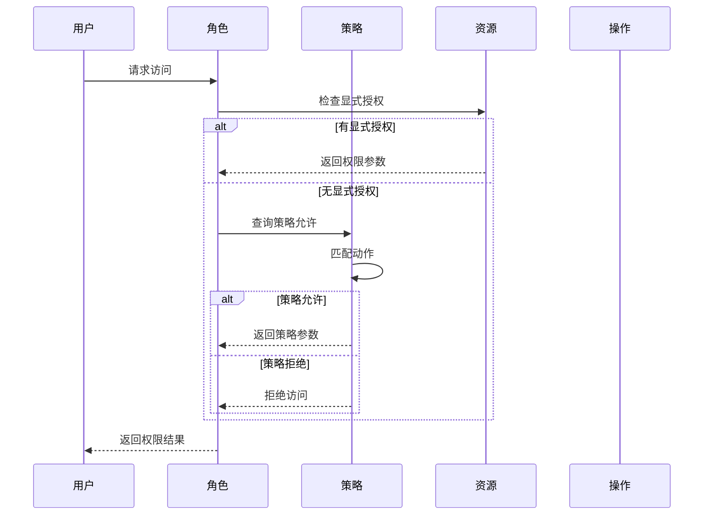
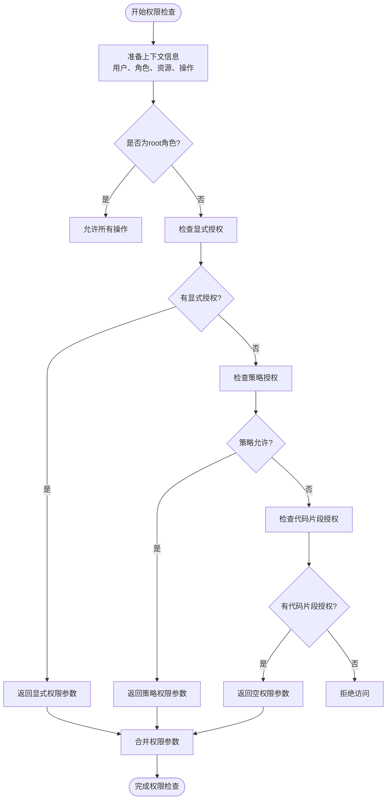

# 策略定义

<cite>
**本文档中引用的文件**   
- [acl-available-strategy.ts](file://packages/core/acl/src/acl-available-strategy.ts)
- [acl-role.ts](file://packages/core/acl/src/acl-role.ts)
- [acl.ts](file://packages/core/acl/src/acl.ts)
- [globalOperators.js](file://packages/core/client/src/application/globalOperators.js)
- [check-association-operate.ts](file://packages/plugins/@nocobase/plugin-acl/src/server/middlewares/check-association-operate.ts)
- [acl-available-action.ts](file://packages/core/acl/src/acl-available-action.ts)
- [acl-resource.ts](file://packages/core/acl/src/acl-resource.ts)
</cite>

## 目录
1. [引言](#引言)
2. [策略概念与作用](#策略概念与作用)
3. [AclAvailableStrategy类设计](#aclavailablestrategy类设计)
4. [自定义策略定义与注册](#自定义策略定义与注册)
5. [策略表达式语法](#策略表达式语法)
6. [策略与资源操作关联](#策略与资源操作关联)
7. [权限检查执行流程](#权限检查执行流程)
8. [复杂策略示例](#复杂策略示例)
9. [策略验证与错误处理](#策略验证与错误处理)
10. [总结](#总结)

## 引言

NocoBase的策略定义系统是其权限控制（ACL）的核心组成部分，用于定义和管理用户角色对系统资源的访问权限。该系统通过策略（Strategy）机制实现了灵活的权限控制，允许基于用户角色、数据属性、时间条件等多种因素进行细粒度的访问控制。本文档将深入解析NocoBase的策略定义系统，重点介绍AclAvailableStrategy类的设计与功能，以及如何创建和注册自定义策略。

**Section sources**
- [acl.ts](file://packages/core/acl/src/acl.ts#L1-L603)

## 策略概念与作用

在NocoBase中，策略（Strategy）是一种权限控制机制，用于定义角色对特定资源和操作的访问权限。策略系统的主要作用包括：

1. **权限抽象**：将复杂的权限规则抽象为可配置的策略，简化权限管理。
2. **灵活控制**：支持基于条件的动态权限控制，如基于用户角色、数据属性或时间条件的访问控制。
3. **可扩展性**：允许开发者定义和注册自定义策略，满足特定业务需求。
4. **性能优化**：通过策略缓存和预计算机制，提高权限检查的效率。

策略系统与角色（Role）和资源（Resource）紧密关联。每个角色可以关联一个或多个策略，这些策略定义了该角色对各种资源的操作权限。当用户尝试访问某个资源时，系统会根据其角色关联的策略进行权限检查，决定是否允许该操作。

**Section sources**
- [acl.ts](file://packages/core/acl/src/acl.ts#L151-L168)
- [acl-role.ts](file://packages/core/acl/src/acl-role.ts#L33-L45)

## AclAvailableStrategy类设计

AclAvailableStrategy类是NocoBase策略系统的核心实现，负责定义和管理可用的策略。该类的设计体现了策略系统的灵活性和可扩展性。

### 类结构与属性

AclAvailableStrategy类的主要属性包括：
- `acl`: 引用ACL实例，用于访问全局权限管理功能
- `options`: 策略配置选项，包含displayName、actions等属性
- `actionsAsObject`: 将策略动作转换为对象形式，便于快速查找
- `allowConfigure`: 是否允许配置的标志

### 核心方法

#### 构造函数
```typescript
constructor(acl: ACL, options: AvailableStrategyOptions)
```
构造函数初始化策略实例，处理动作配置，将字符串或数组形式的动作转换为对象形式，便于后续匹配。

#### matchAction方法
```typescript
matchAction(actionName: string)
```
该方法用于检查指定动作是否被当前策略允许。它支持通配符`*`匹配所有动作，也支持基于动作名称的精确匹配。如果动作关联了谓词（predicate），则返回相应的过滤条件。

#### allow方法
```typescript
allow(resourceName: string, actionName: string)
```
这是策略的核心检查方法，确定指定资源和动作是否被允许。该方法首先解析动作别名，然后调用matchAction进行匹配检查。

AclAvailableStrategy类的设计体现了策略系统的模块化和可复用性，通过将策略逻辑封装在独立的类中，实现了策略的灵活定义和管理。

**Section sources**
- [acl-available-strategy.ts](file://packages/core/acl/src/acl-available-strategy.ts#L1-L81)
- [acl.ts](file://packages/core/acl/src/acl.ts#L202-L204)

```mermaid
classDiagram
class ACLAvailableStrategy {
+acl : ACL
+options : AvailableStrategyOptions
+actionsAsObject : { [key : string] : string }
+allowConfigure : boolean
+constructor(acl : ACL, options : AvailableStrategyOptions)
+matchAction(actionName : string) : any
+allow(resourceName : string, actionName : string) : any
}
class ACL {
+availableStrategy : Map<string, ACLAvailableStrategy>
+setAvailableStrategy(name : string, options : AvailableStrategyOptions) : void
}
ACL --> ACLAvailableStrategy : "包含"
ACL o-- ACLAvailableStrategy : "管理"
```

**Diagram sources**
- [acl-available-strategy.ts](file://packages/core/acl/src/acl-available-strategy.ts#L34-L80)
- [acl.ts](file://packages/core/acl/src/acl.ts#L70-L71)

## 自定义策略定义与注册

NocoBase提供了灵活的机制来定义和注册自定义策略，满足不同场景下的权限控制需求。

### 策略定义

自定义策略通过`AvailableStrategyOptions`接口进行定义，主要配置项包括：

- `displayName`: 策略的显示名称，用于用户界面展示
- `actions`: 允许的动作列表，支持字符串、字符串数组或通配符`*`
- `allowConfigure`: 是否允许配置的标志
- `resource`: 关联的资源（内部使用）

策略可以定义为简单的动作列表，也可以包含复杂的条件逻辑。例如，一个"own"策略可以定义为只允许用户访问自己创建的记录。

### 策略注册

通过ACL实例的`setAvailableStrategy`方法注册自定义策略：

```typescript
acl.setAvailableStrategy('custom-strategy', {
  displayName: '自定义策略',
  actions: ['view', 'edit'],
  allowConfigure: true
});
```

注册后的策略可以在角色定义中引用，实现权限的灵活分配。策略注册机制基于Map数据结构，确保了策略查找的高效性。

**Section sources**
- [acl-available-strategy.ts](file://packages/core/acl/src/acl-available-strategy.ts#L15-L23)
- [acl.ts](file://packages/core/acl/src/acl.ts#L202-L204)

## 策略表达式语法

NocoBase的策略表达式基于JSON Logic语法，支持丰富的操作符和函数，用于构建复杂的条件判断。

### 支持的操作符

策略表达式支持以下主要操作符：

- **比较操作符**：`$eq`（等于）、`$ne`（不等于）、`$gt`（大于）、`$gte`（大于等于）、`$lt`（小于）、`$lte`（小于等于）
- **逻辑操作符**：`$and`（与）、`or`（或）、`not`（非）
- **集合操作符**：`in`（包含）、`notIn`（不包含）、`all`（全部包含）
- **字符串操作符**：`startsWith`（以...开始）、`endsWith`（以...结束）、`includes`（包含）

### 内置函数

系统提供了多种内置函数支持策略表达式：

- **日期函数**：`now()`、`today()`等，用于时间条件判断
- **用户函数**：`$user`，引用当前用户信息
- **角色函数**：`$nRole()`，引用当前角色
- **数学函数**：`add`、`subtract`、`multiply`、`divide`等

### 变量引用

策略表达式支持变量引用，语法为`{{ variable.path }}`。常用变量包括：
- `{{ ctx.state.currentUser.id }}`：当前用户ID
- `{{ ctx.state.currentRole }}`：当前角色
- `{{ now }}`：当前时间

这些语法元素组合使用，可以构建出复杂的条件表达式，实现精细化的权限控制。

**Section sources**
- [globalOperators.js](file://packages/core/client/src/application/globalOperators.js#L48-L647)
- [acl-available-strategy.ts](file://packages/core/acl/src/acl-available-strategy.ts#L25-L32)

## 策略与资源操作关联

在NocoBase中，策略通过角色与具体的资源和操作关联，形成完整的权限控制体系。

### 角色-策略关联

每个角色可以关联一个策略，通过角色定义中的`strategy`属性指定：

```typescript
const role = acl.define({
  role: 'editor',
  strategy: 'content-editor',
  actions: {
    'posts:view': {},
    'posts:edit': { fields: ['title', 'content'] }
  }
});
```

这里的`strategy`可以是策略名称（字符串）或内联的策略配置对象。当使用策略名称时，系统会从`availableStrategy`映射中查找对应的策略定义。

### 资源操作映射

策略通过动作名称与具体资源操作关联。系统支持以下关联方式：

1. **精确匹配**：直接匹配资源:操作的完整路径，如`posts:view`
2. **通配符匹配**：使用`*`匹配所有操作，如`posts:*`
3. **动作别名**：通过动作别名实现灵活匹配

当权限检查时，系统会按照以下顺序查找权限：
1. 检查角色是否对特定资源操作有显式授权
2. 如果没有显式授权，检查角色关联的策略是否允许该操作
3. 检查是否有代码片段（snippet）授权

这种分层的权限查找机制确保了权限控制的灵活性和安全性。

**Section sources**
- [acl.ts](file://packages/core/acl/src/acl.ts#L155-L157)
- [acl-role.ts](file://packages/core/acl/src/acl-role.ts#L55-L67)



**Diagram sources**
- [acl.ts](file://packages/core/acl/src/acl.ts#L243-L322)
- [acl-role.ts](file://packages/core/acl/src/acl-role.ts#L59-L67)

## 权限检查执行流程

NocoBase的权限检查流程是一个多层次的决策过程，确保了权限控制的准确性和效率。

### 流程概述

权限检查的主要流程如下：

1. **上下文准备**：收集当前用户、角色、请求资源和操作等信息
2. **角色获取**：根据当前会话获取用户的角色列表
3. **权限计算**：对每个角色计算其对目标资源操作的权限
4. **结果合并**：合并多个角色的权限结果
5. **参数处理**：应用固定参数和策略参数
6. **最终决策**：根据合并结果决定是否允许访问

### 详细步骤

#### 1. 上下文准备
系统首先从请求上下文中提取必要的信息，包括：
- 当前用户身份（currentUser）
- 当前角色（currentRole）
- 请求的资源名称（resourceName）
- 请求的操作类型（actionName）

#### 2. 角色权限计算
对于每个相关角色，系统执行以下检查：

```typescript
private getCanByRole(options: CanArgs) {
  // 检查角色是否存在
  const aclRole = this.roles.get(role);
  if (!aclRole) return null;
  
  // root角色拥有所有权限
  if (role === 'root') return { resource, action, role };
  
  // 检查显式授权
  const aclResource = aclRole.getResource(resource);
  if (aclResource) {
    const actionParams = aclResource.getAction(action);
    if (actionParams) return mergeParams({ role, resource, action, params: actionParams });
  }
  
  // 检查策略授权
  const roleStrategy = aclRole.getStrategy();
  if (roleStrategy) {
    const roleStrategyParams = roleStrategy.allow(resource, action);
    if (roleStrategyParams) return mergeParams({ role, resource, action, params: roleStrategyParams });
  }
  
  return null;
}
```

#### 3. 结果合并
当用户拥有多个角色时，系统会合并各角色的权限结果。合并规则如下：
- 如果任一角色明确拒绝访问，则拒绝
- 如果多个角色都有权限参数，则合并这些参数
- 更具体的权限设置优先于更通用的设置

#### 4. 参数处理
系统会将策略参数与固定参数合并，形成最终的访问参数。这些参数可能包括：
- 字段白名单（fields）
- 数据过滤条件（filter）
- 关联资源限制（whitelist）

整个权限检查流程通过中间件机制集成到请求处理管道中，确保每个请求都经过严格的权限验证。

**Section sources**
- [acl.ts](file://packages/core/acl/src/acl.ts#L210-L322)
- [check-association-operate.ts](file://packages/plugins/@nocobase/plugin-acl/src/server/middlewares/check-association-operate.ts#L13-L64)



**Diagram sources**
- [acl.ts](file://packages/core/acl/src/acl.ts#L243-L322)
- [check-association-operate.ts](file://packages/plugins/@nocobase/plugin-acl/src/server/middlewares/check-association-operate.ts#L13-L64)

## 复杂策略示例

以下是一些基于NocoBase策略系统的复杂策略示例，展示了如何实现基于不同条件的访问控制。

### 基于用户角色的策略

```typescript
// 定义一个编辑者角色策略
acl.setAvailableStrategy('content-editor', {
  displayName: '内容编辑者',
  actions: ['view', 'edit:own', 'create'],
  allowConfigure: true
});

// 在角色中使用该策略
acl.define({
  role: 'editor',
  strategy: 'content-editor',
  actions: {
    'posts:delete': { filter: { status: 'draft' } }
  }
});
```

这个策略允许编辑者查看所有内容、编辑自己创建的内容、创建新内容，并且只能删除草稿状态的文章。

### 基于数据属性的策略

```typescript
// 定义基于数据属性的策略
acl.setAvailableStrategy('department-access', {
  displayName: '部门访问',
  actions: ['view', 'edit'],
  allowConfigure: true
});

// 使用JSON Logic表达式实现部门数据隔离
const departmentStrategy = {
  filter: {
    departmentId: '{{ $user.departmentId }}'
  }
};
```

这个策略确保用户只能访问和编辑属于自己部门的数据，通过将`departmentId`与当前用户的部门ID进行匹配来实现数据隔离。

### 基于时间条件的策略

```typescript
// 定义基于时间的策略
acl.setAvailableStrategy('time-limited-access', {
  displayName: '限时访问',
  actions: ['view', 'export'],
  allowConfigure: true
});

// 策略表达式包含时间条件
const timeStrategy = {
  condition: {
    and: [
      { '>=': ['{{ now }}', '{{ record.createdAt }}'] },
      { '<=': ['{{ now }}', { '+': ['{{ record.createdAt }}', 86400000] }] }
    ]
  }
};
```

这个策略实现了24小时内的限时访问控制，用户只能在记录创建后的24小时内查看和导出数据。

### 组合策略

```typescript
// 定义组合策略，支持多种条件
acl.setAvailableStrategy('advanced-content-control', {
  displayName: '高级内容控制',
  actions: ['view', 'edit:own', 'approve', 'publish'],
  allowConfigure: true
});

// 复杂的策略表达式
const advancedStrategy = {
  view: {
    or: [
      { '==': ['{{ ctx.state.currentRole }}', 'admin'] },
      { 
        and: [
          { '==': ['{{ ctx.state.currentRole }}', 'editor'] },
          { '==': ['{{ record.status }}', 'published'] }
        ]
      }
    ]
  },
  edit: {
    '==': ['{{ record.createdById }}', '{{ ctx.state.currentUser.id }}']
  },
  approve: {
    'in': ['{{ ctx.state.currentUser.id }}', '{{ record.reviewers }}']
  }
};
```

这个组合策略实现了复杂的业务规则：管理员可以查看所有内容，编辑者只能查看已发布的内容，编辑操作仅限于自己创建的内容，审批操作仅限于被指定为审核人的用户。

这些示例展示了NocoBase策略系统的强大功能，通过灵活的表达式语法和多层次的权限控制机制，可以满足各种复杂的业务需求。

**Section sources**
- [acl-available-strategy.ts](file://packages/core/acl/src/acl-available-strategy.ts#L15-L23)
- [globalOperators.js](file://packages/core/client/src/application/globalOperators.js#L48-L647)

## 策略验证与错误处理

NocoBase的策略系统包含完善的验证机制和错误处理流程，确保权限控制的可靠性和安全性。

### 策略验证机制

系统在多个层面实施策略验证：

1. **结构验证**：检查策略定义的JSON结构是否符合预期格式
2. **语法验证**：验证策略表达式中的操作符和函数是否有效
3. **语义验证**：确保策略引用的资源和操作确实存在
4. **权限验证**：检查策略是否试图授予超出其权限范围的操作

验证过程主要在策略注册和权限检查时执行。例如，在`setAvailableStrategy`方法中，系统会验证策略配置的完整性：

```typescript
setAvailableStrategy(name: string, options: AvailableStrategyOptions) {
  // 验证必填字段
  if (!name || !options) {
    throw new Error('策略名称和配置不能为空');
  }
  
  // 验证动作配置
  if (options.actions && !Array.isArray(options.actions) && typeof options.actions !== 'string') {
    throw new Error('动作配置必须是字符串或字符串数组');
  }
  
  this.availableStrategy.set(name, new ACLAvailableStrategy(this, options));
}
```

### 错误处理方式

系统采用分层的错误处理机制：

#### 1. 验证错误
当策略定义存在语法或结构错误时，系统会抛出详细的验证错误，帮助开发者快速定位问题：

```typescript
try {
  acl.setAvailableStrategy('invalid-strategy', { actions: 123 });
} catch (error) {
  // 错误信息会明确指出问题所在
  console.error('策略配置错误:', error.message);
}
```

#### 2. 运行时错误
在权限检查过程中可能出现的运行时错误，如数据访问错误、表达式计算错误等，系统会捕获并适当处理：

```typescript
protected filterParams(ctx, resourceName, params) {
  if (params?.filter?.createdById) {
    const collection = ctx.db.getCollection(resourceName);
    if (!collection || !collection.getField('createdById')) {
      throw new NoPermissionError('createdById字段不存在');
    }
  }
  return params;
}
```

#### 3. 权限拒绝
当权限检查失败时，系统会抛出`NoPermissionError`异常，该异常会被上层中间件捕获并转换为适当的HTTP响应：

```typescript
if (!permission.can && !permission.skip) {
  ctx.throw(403, '无权限');
  return;
}
```

#### 4. 错误日志
系统会记录详细的权限检查日志，包括：
- 请求的资源和操作
- 参与检查的角色
- 权限计算结果
- 错误详情（如果有）

这些日志有助于审计和故障排查。

通过这种全面的验证和错误处理机制，NocoBase确保了策略系统的稳定性和安全性，即使在配置错误的情况下也能提供有意义的反馈，帮助开发者快速解决问题。

**Section sources**
- [acl.ts](file://packages/core/acl/src/acl.ts#L467-L493)
- [check-association-operate.ts](file://packages/plugins/@nocobase/plugin-acl/src/server/middlewares/check-association-operate.ts#L39-L56)

## 总结

NocoBase的策略定义系统是一个强大而灵活的权限控制框架，通过AclAvailableStrategy类为核心，实现了细粒度的访问控制。该系统的主要特点包括：

1. **模块化设计**：策略、角色、资源和操作被清晰地分离，便于管理和扩展。
2. **灵活的表达式**：基于JSON Logic的策略表达式支持复杂的条件判断，满足各种业务需求。
3. **分层权限检查**：通过显式授权、策略授权和代码片段授权的多层次检查，确保权限控制的准确性和灵活性。
4. **完善的验证机制**：在策略定义和执行过程中实施严格的验证，保证系统的稳定性和安全性。
5. **可扩展性**：支持自定义策略的定义和注册，便于适应特定的业务场景。

通过深入理解策略系统的各个组件和工作流程，开发者可以充分利用NocoBase的权限控制功能，构建安全可靠的应用程序。无论是简单的基于角色的访问控制，还是复杂的基于数据属性和时间条件的动态权限管理，NocoBase的策略系统都能提供强大的支持。

**Section sources**
- [acl-available-strategy.ts](file://packages/core/acl/src/acl-available-strategy.ts#L1-L81)
- [acl.ts](file://packages/core/acl/src/acl.ts#L1-L603)