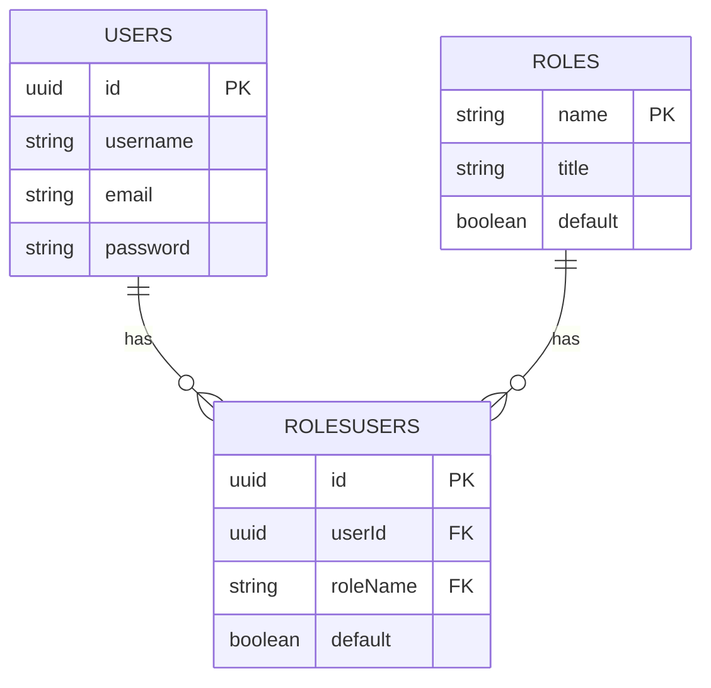
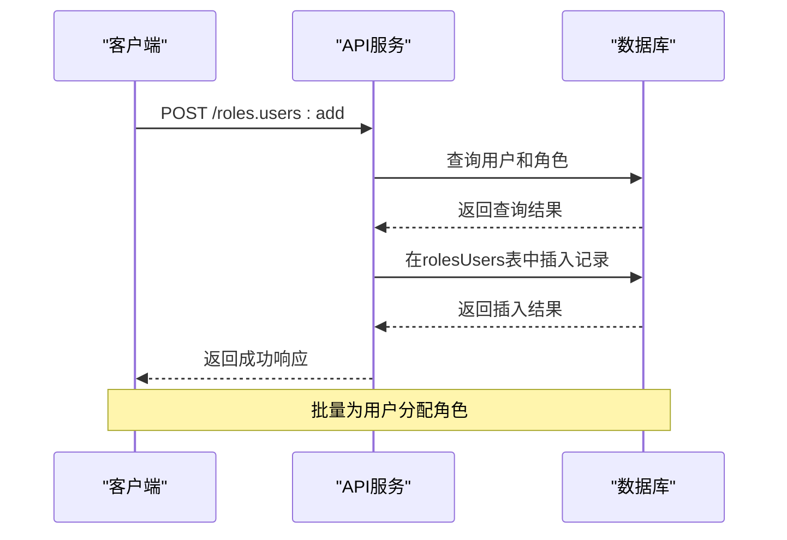
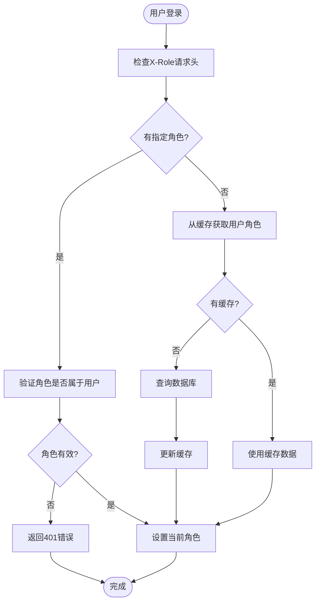
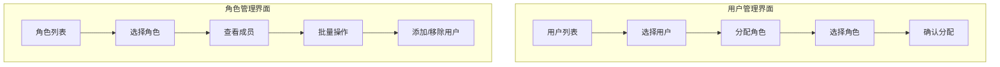
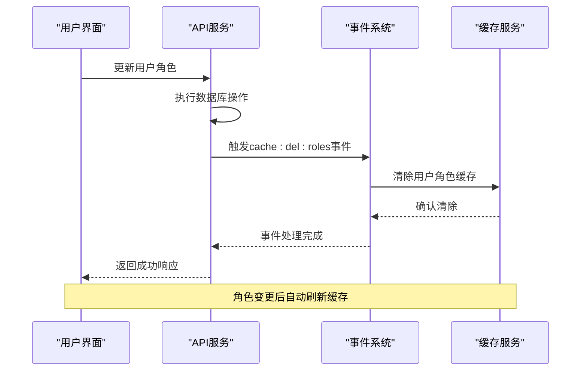
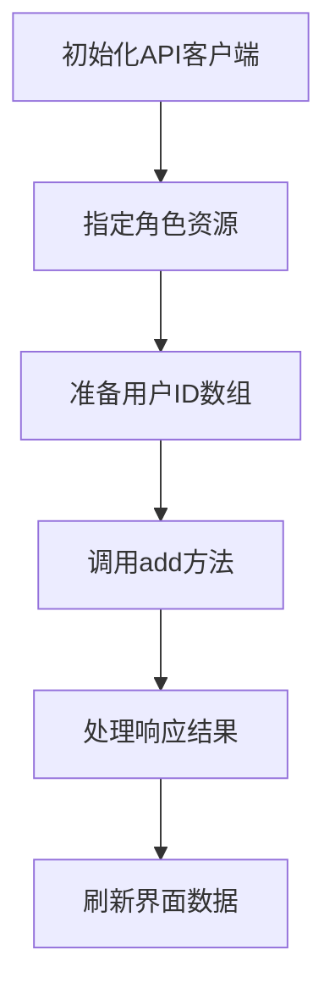

# 用户角色分配

<cite>
**本文档引用的文件**
- [users.ts](file://packages\plugins\@nocobase\plugin-users\src\server\actions\users.ts)
- [server.ts](file://packages\plugins\@nocobase\plugin-acl\src\server\server.ts)
- [users.ts](file://packages\plugins\@nocobase\plugin-acl\src\server\collections\users.ts)
- [roles-users.ts](file://packages\plugins\@nocobase\plugin-acl\src\server\collections\roles-users.ts)
- [UsersManagement.tsx](file://packages\plugins\@nocobase\plugin-users\src\client\UsersManagement.tsx)
- [RoleUsersManager.tsx](file://packages\plugins\@nocobase\plugin-users\src\client\RoleUsersManager.tsx)
- [setCurrentRole.ts](file://packages\plugins\@nocobase\plugin-acl\src\server\middlewares\setCurrentRole.ts)
- [acl-role.ts](file://packages\core\acl\src\acl-role.ts)
- [collections.json](file://packages\core\client\docs\zh-CN\core\data-source\demos\collections.json)
</cite>

## 目录
1. [简介](#简介)
2. [用户与角色的多对多关系实现](#用户与角色的多对多关系实现)
3. [用户角色分配API接口](#用户角色分配api接口)
4. [用户登录时角色信息的加载与缓存](#用户登录时角色信息的加载与缓存)
5. [用户角色分配界面操作](#用户角色分配界面操作)
6. [角色分配变更后的权限刷新机制](#角色分配变更后的权限刷新机制)
7. [代码示例：通过API为用户分配多个角色](#代码示例通过api为用户分配多个角色)

## 简介
NocoBase系统提供了完善的用户角色分配功能，通过多对多关系实现用户与角色的灵活关联。本系统支持批量分配和移除角色，提供详细的API接口，并在用户登录时高效加载和缓存角色信息。用户可以通过管理界面直观地进行角色分配操作，系统会在角色变更后自动刷新相关权限。

## 用户与角色的多对多关系实现
NocoBase通过数据库中间表实现了用户与角色之间的多对多关系。系统使用`rolesUsers`中间表来存储用户与角色的关联关系，其中包含`userId`和`roleName`两个外键字段。

**Diagram sources**
- [users.ts](file://packages\plugins\@nocobase\plugin-acl\src\server\collections\users.ts)
- [roles-users.ts](file://packages\plugins\@nocobase\plugin-acl\src\server\collections\roles-users.ts)

**Section sources**
- [users.ts](file://packages\plugins\@nocobase\plugin-acl\src\server\collections\users.ts)
- [roles-users.ts](file://packages\plugins\@nocobase\plugin-acl\src\server\collections\roles-users.ts)

## 用户角色分配API接口
NocoBase提供了丰富的API接口来管理用户角色分配，支持批量分配和移除角色操作。

### 角色分配API
系统提供了以下API端点来管理用户角色：

- `POST /roles.users:add` - 为用户批量添加角色
- `POST /roles.users:remove` - 从用户批量移除角色
- `POST /roles.users:set` - 设置用户的全部角色

这些API支持通过`resourceOf`参数指定角色名称，通过`values`参数传递用户ID数组。

**Diagram sources**
- [server.ts](file://packages\plugins\@nocobase\plugin-acl\src\server\server.ts)
- [users.ts](file://packages\plugins\@nocobase\plugin-users\src\server\actions\users.ts)

**Section sources**
- [server.ts](file://packages\plugins\@nocobase\plugin-acl\src\server\server.ts)
- [users.ts](file://packages\plugins\@nocobase\plugin-users\src\server\actions\users.ts)

## 用户登录时角色信息的加载与缓存
当用户登录时，系统会加载其角色信息并进行缓存，以提高后续请求的性能。

### 角色加载流程
用户登录后，系统通过中间件`setCurrentRole`来加载和设置当前角色：

1. 从请求头`X-Role`获取指定角色
2. 如果未指定，则从缓存中获取用户的所有角色
3. 根据系统角色模式确定当前有效角色
4. 将角色信息存储在请求上下文`ctx.state`中

系统使用Redis缓存存储用户角色信息，缓存键格式为`roles:{userId}`，有效角色缓存键格式为`roles:{userId}:defaultRole`。

**Diagram sources**
- [setCurrentRole.ts](file://packages\plugins\@nocobase\plugin-acl\src\server\middlewares\setCurrentRole.ts)
- [server.ts](file://packages\plugins\@nocobase\plugin-acl\src\server\server.ts)

**Section sources**
- [setCurrentRole.ts](file://packages\plugins\@nocobase\plugin-acl\src\server\middlewares\setCurrentRole.ts)
- [server.ts](file://packages\plugins\@nocobase\plugin-acl\src\server\server.ts)

## 用户角色分配界面操作
NocoBase提供了直观的用户界面来管理用户角色分配。

### 用户管理界面
在用户管理界面中，管理员可以：

1. 在用户列表中选择一个或多个用户
2. 点击"分配角色"按钮打开角色分配对话框
3. 从可用角色列表中选择要分配的角色
4. 确认分配操作

### 角色管理界面
在角色管理界面中，管理员可以：

1. 选择一个角色
2. 查看该角色的所有成员用户
3. 批量移除用户的角色
4. 添加新用户到该角色

**Diagram sources**
- [UsersManagement.tsx](file://packages\plugins\@nocobase\plugin-users\src\client\UsersManagement.tsx)
- [RoleUsersManager.tsx](file://packages\plugins\@nocobase\plugin-users\src\client\RoleUsersManager.tsx)

**Section sources**
- [UsersManagement.tsx](file://packages\plugins\@nocobase\plugin-users\src\client\UsersManagement.tsx)
- [RoleUsersManager.tsx](file://packages\plugins\@nocobase\plugin-users\src\client\RoleUsersManager.tsx)

## 角色分配变更后的权限刷新机制
当用户角色发生变更时，系统会自动触发权限刷新机制，确保权限变更立即生效。

### 权限刷新流程
系统通过事件监听器实现权限刷新：

1. 当用户角色关系发生变化时（添加、移除、设置）
2. 系统触发`cache:del:roles`事件
3. 清除该用户的角色缓存
4. 下次请求时重新加载最新角色信息

**Diagram sources**
- [server.ts](file://packages\plugins\@nocobase\plugin-users\src\server\server.ts)
- [setCurrentRole.ts](file://packages\plugins\@nocobase\plugin-acl\src\server\middlewares\setCurrentRole.ts)

**Section sources**
- [server.ts](file://packages\plugins\@nocobase\plugin-users\src\server\server.ts)
- [setCurrentRole.ts](file://packages\plugins\@nocobase\plugin-acl\src\server\middlewares\setCurrentRole.ts)

## 代码示例：通过API为用户分配多个角色
以下是通过API为用户分配多个角色的代码示例：

**Diagram sources**
- [RoleUsersManager.tsx](file://packages\plugins\@nocobase\plugin-users\src\client\RoleUsersManager.tsx)
- [server.ts](file://packages\plugins\@nocobase\plugin-acl\src\server\server.ts)

**Section sources**
- [RoleUsersManager.tsx](file://packages\plugins\@nocobase\plugin-users\src\client\RoleUsersManager.tsx)
- [server.ts](file://packages\plugins\@nocobase\plugin-acl\src\server\server.ts)