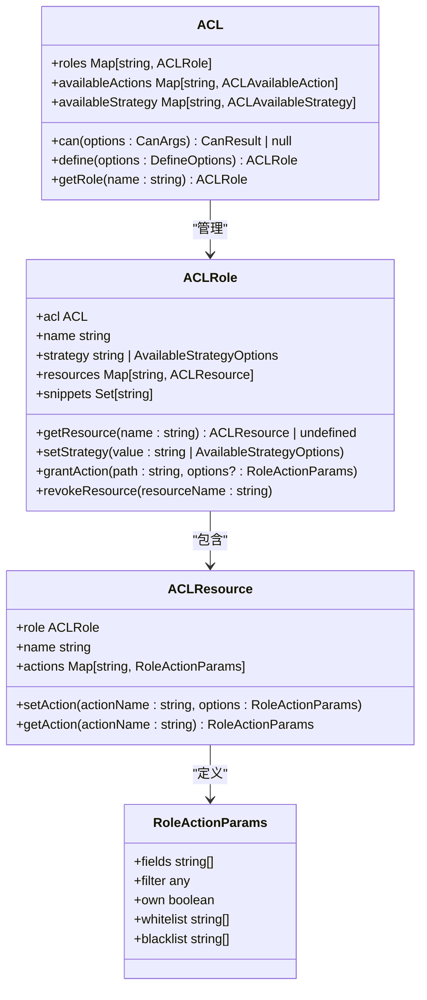
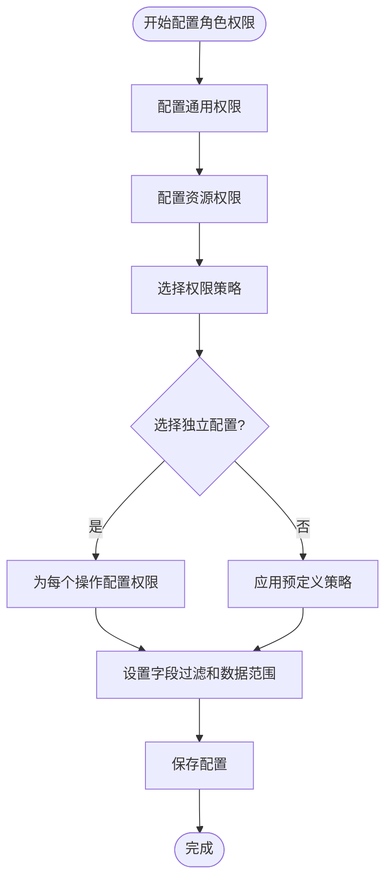
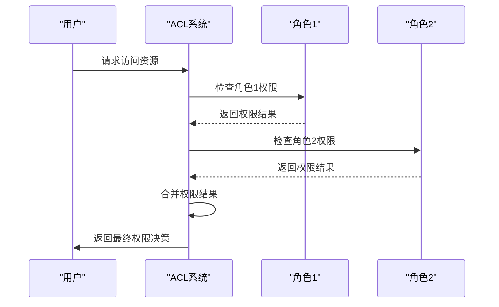
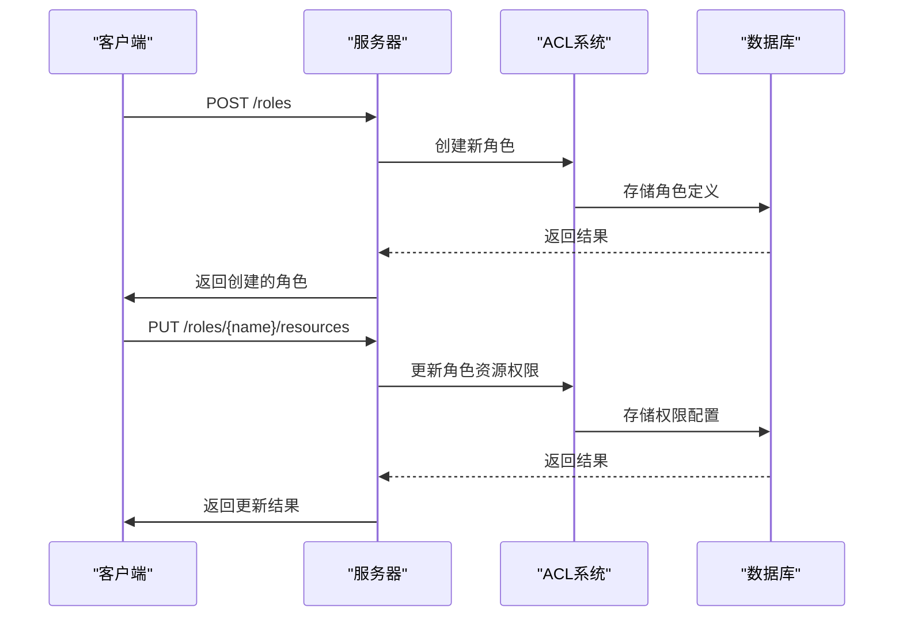
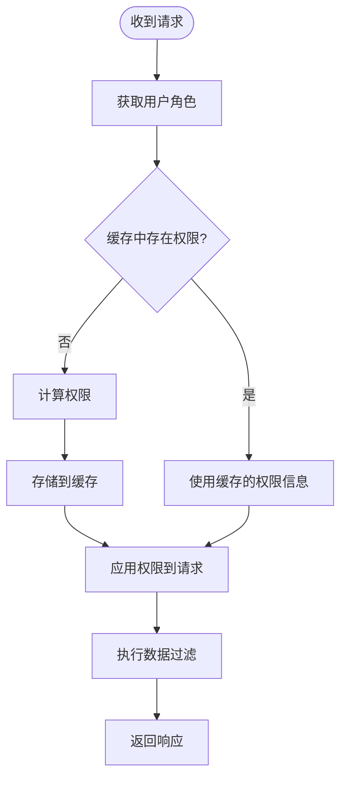
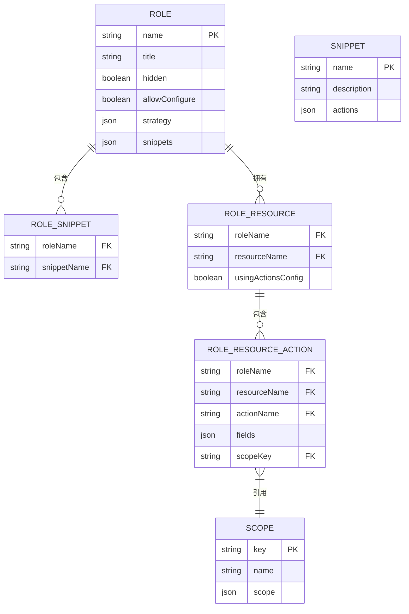

# 角色权限配置

<cite>
**本文档引用的文件**   
- [acl.ts](file://packages/core/acl/src/acl.ts)
- [acl-role.ts](file://packages/core/acl/src/acl-role.ts)
- [server.ts](file://packages/plugins/@nocobase/plugin-acl/src/server/server.ts)
- [RoleModel.ts](file://packages/plugins/@nocobase/plugin-acl/src/server/model/RoleModel.ts)
- [RoleResourceModel.ts](file://packages/plugins/@nocobase/plugin-acl/src/server/model/RoleResourceModel.ts)
- [RoleResourceActionModel.ts](file://packages/plugins/@nocobase/plugin-acl/src/server/model/RoleResourceActionModel.ts)
- [with-acl-meta.ts](file://packages/plugins/@nocobase/plugin-acl/src/server/middlewares/with-acl-meta.ts)
- [role-check.ts](file://packages/plugins/@nocobase/plugin-acl/src/server/actions/role-check.ts)
- [GeneralPermissions.tsx](file://packages/plugins/@nocobase/plugin-acl/src/client/permissions/GeneralPermissions.tsx)
- [RoleConfigure.tsx](file://packages/core/client/src/acl/Configuration/RoleConfigure.tsx)
</cite>

## 目录
1. [简介](#简介)
2. [基于资源的权限控制模型](#基于资源的权限控制模型)
3. [角色权限配置界面与操作流程](#角色权限配置界面与操作流程)
4. [权限继承与覆盖规则](#权限继承与覆盖规则)
5. [通过API配置细粒度权限](#通过api配置细粒度权限)
6. [权限缓存更新策略与验证流程](#权限缓存更新策略与验证流程)
7. [预定义权限模板](#预定义权限模板)
8. [总结](#总结)

## 简介
NocoBase的角色权限配置功能提供了一套完整的基于资源的访问控制（RBAC）系统，允许管理员为不同角色分配精细的权限。该系统通过资源、操作和策略的概念来定义权限，并提供了可视化界面和API接口进行配置。本文档将深入解析NocoBase的权限系统，包括其核心模型、配置流程、继承规则、API使用方法以及缓存机制。

**Section sources**
- [acl.ts](file://packages/core/acl/src/acl.ts#L1-L603)
- [server.ts](file://packages/plugins/@nocobase/plugin-acl/src/server/server.ts#L1-L685)

## 基于资源的权限控制模型
NocoBase的权限系统基于资源、操作和策略三个核心概念构建。资源（Resource）代表系统中的数据实体，如用户、集合等；操作（Action）定义了对资源可以执行的动作，如创建、查看、更新和删除；策略（Strategy）则是一组预定义的权限规则，可以快速应用于角色。

权限系统通过`ACL`类实现，该类管理所有角色的权限定义。每个角色由`ACLRole`类表示，包含资源、操作参数和策略等属性。权限检查通过`can`方法执行，该方法根据角色、资源和操作来判断是否允许访问。

**Diagram sources **
- [acl.ts](file://packages/core/acl/src/acl.ts#L66-L603)
- [acl-role.ts](file://packages/core/acl/src/acl-role.ts#L33-L215)

## 角色权限配置界面与操作流程
NocoBase提供了直观的可视化权限分配器，允许管理员通过图形界面配置角色权限。配置界面主要分为两个部分：通用权限配置和资源权限配置。

通用权限配置允许管理员设置角色的基本权限，如是否允许配置界面、安装插件等。这些权限通过"snippets"机制实现，每个snippet代表一组相关的权限操作。

**Diagram sources **
- [GeneralPermissions.tsx](file://packages/plugins/@nocobase/plugin-acl/src/client/permissions/GeneralPermissions.tsx#L68-L118)
- [RoleConfigure.tsx](file://packages/core/client/src/acl/Configuration/RoleConfigure.tsx#L64-L77)

当管理员选择"独立配置"时，可以为每个资源的每个操作单独设置权限参数，包括可访问的字段列表和数据过滤条件。数据过滤条件支持模板语法，可以引用当前用户、角色等上下文信息。

**Section sources**
- [server.ts](file://packages/plugins/@nocobase/plugin-acl/src/server/server.ts#L475-L523)
- [RoleConfigure.tsx](file://packages/core/client/src/acl/Configuration/RoleConfigure.tsx#L35-L62)

## 权限继承与覆盖规则
NocoBase的权限系统支持复杂的继承和覆盖机制。当用户拥有多个角色时，系统会合并这些角色的权限。权限合并遵循特定的规则：如果一个角色允许某项操作而另一个角色拒绝，则拒绝优先；如果多个角色都允许同一操作，则权限参数会被合并。

权限继承通过`getCanByRoles`方法实现，该方法遍历用户的所有角色，逐个检查权限并合并结果。合并过程中使用`mergeAclActionParams`函数来处理权限参数的合并逻辑。

**Diagram sources **
- [acl.ts](file://packages/core/acl/src/acl.ts#L224-L241)
- [acl-role.ts](file://packages/core/acl/src/acl-role.ts#L148-L147)

此外，系统还支持权限覆盖。通过在角色配置中使用否定规则（以"!"开头），可以显式地拒绝某些权限，即使其他角色或策略允许这些权限。

**Section sources**
- [acl.ts](file://packages/core/acl/src/acl.ts#L224-L241)
- [acl-role.ts](file://packages/core/acl/src/acl-role.ts#L108-L147)

## 通过API配置细粒度权限
除了图形界面，NocoBase还提供了丰富的API接口，允许通过编程方式配置角色权限。这为自动化配置和集成到其他系统提供了便利。

配置角色权限的API主要通过`roles`资源的CRUD操作实现。创建或更新角色时，可以指定策略、操作权限和snippets等参数。以下是一个通过API配置角色权限的示例：

**Diagram sources **
- [server.ts](file://packages/plugins/@nocobase/plugin-acl/src/server/server.ts#L391-L438)
- [RoleModel.ts](file://packages/plugins/@nocobase/plugin-acl/src/server/model/RoleModel.ts#L13-L35)

API接口还支持批量操作，可以一次性为多个资源配置权限。此外，系统提供了`roles:check`接口，允许客户端查询当前用户的权限信息，包括允许的操作列表和界面元素可见性。

**Section sources**
- [server.ts](file://packages/plugins/@nocobase/plugin-acl/src/server/server.ts#L391-L438)
- [role-check.ts](file://packages/plugins/@nocobase/plugin-acl/src/server/actions/role-check.ts#L20-L88)

## 权限缓存更新策略与验证流程
为了提高性能，NocoBase实现了权限缓存机制。当角色或用户权限发生变化时，系统会自动清除相关缓存，确保权限检查的实时性。

权限验证流程在请求处理的中间件阶段执行。系统首先根据当前用户的角色获取权限信息，然后检查请求的资源和操作是否被允许。如果权限检查通过，系统会将权限参数合并到请求中，用于后续的数据过滤。

**Diagram sources **
- [with-acl-meta.ts](file://packages/plugins/@nocobase/plugin-acl/src/server/middlewares/with-acl-meta.ts#L1-L313)
- [acl.ts](file://packages/core/acl/src/acl.ts#L495-L573)

系统还实现了细粒度的缓存失效策略。当角色、用户或权限配置发生变化时，相关的缓存条目会被立即清除。例如，当用户的角色发生变化时，系统会清除该用户的权限缓存。

**Section sources**
- [with-acl-meta.ts](file://packages/plugins/@nocobase/plugin-acl/src/server/middlewares/with-acl-meta.ts#L1-L313)
- [server.ts](file://packages/plugins/@nocobase/plugin-acl/src/server/server.ts#L341-L355)

## 预定义权限模板
NocoBase内置了多个预定义的权限模板，用于快速配置常见角色的权限。这些模板通过"snippets"机制实现，每个模板定义了一组相关的权限操作。

系统预定义了三个基础角色：root、admin和member。root角色拥有所有权限；admin角色可以管理大部分系统功能；member角色只能查看和编辑自己的数据。这些模板在系统安装时自动创建，并可以通过界面或API进行修改。

**Diagram sources **
- [server.ts](file://packages/plugins/@nocobase/plugin-acl/src/server/server.ts#L410-L427)
- [RoleModel.ts](file://packages/plugins/@nocobase/plugin-acl/src/server/model/RoleModel.ts#L13-L35)

管理员可以根据需要创建自定义的权限模板，并将其应用于多个角色，从而简化权限管理。模板机制大大提高了权限配置的效率和一致性。

**Section sources**
- [server.ts](file://packages/plugins/@nocobase/plugin-acl/src/server/server.ts#L410-L427)
- [GeneralPermissions.tsx](file://packages/plugins/@nocobase/plugin-acl/src/client/permissions/GeneralPermissions.tsx#L52-L64)

## 总结
NocoBase的角色权限配置功能提供了一套强大而灵活的权限管理系统。通过基于资源的权限控制模型，系统能够实现细粒度的访问控制。可视化配置界面和API接口为管理员提供了多种配置方式，满足不同场景的需求。权限继承和覆盖规则确保了复杂权限场景的正确处理，而缓存机制则保证了系统的高性能。预定义的权限模板进一步简化了常见角色的配置工作。这套权限系统为NocoBase的应用安全提供了坚实的基础。