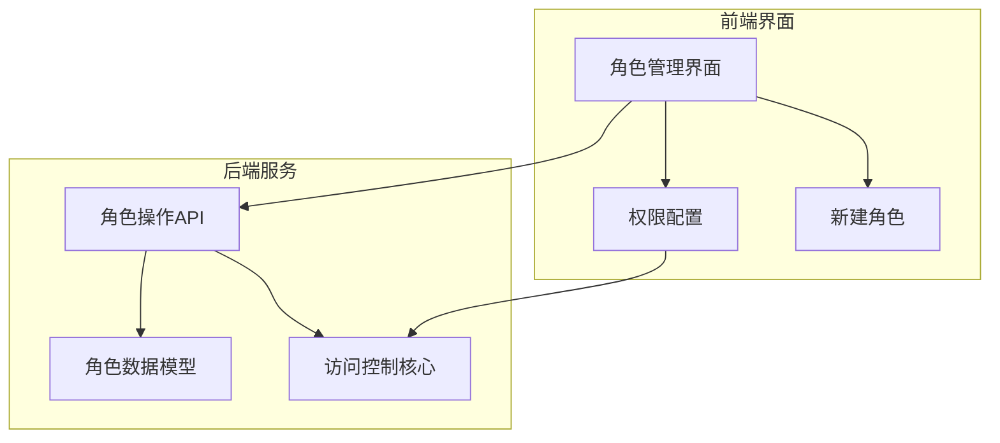
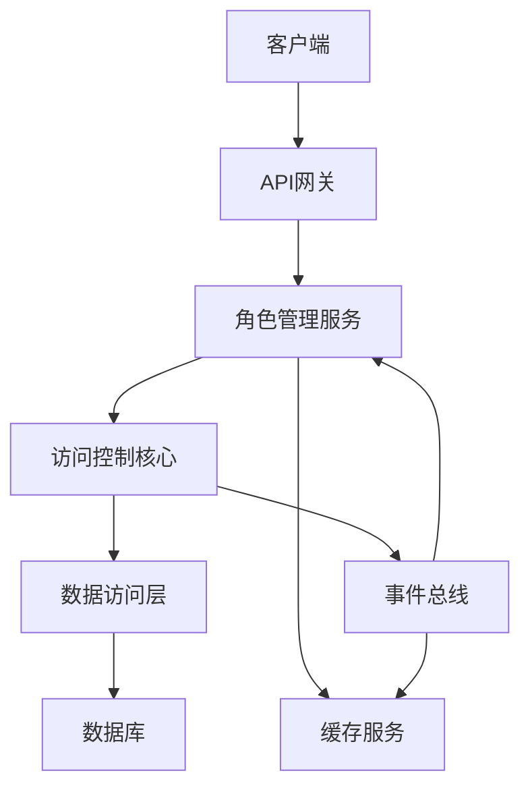
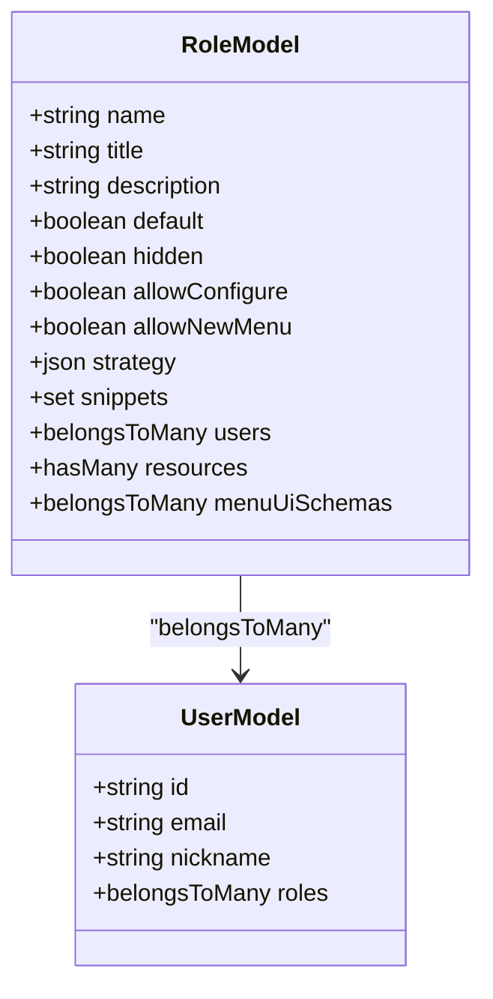
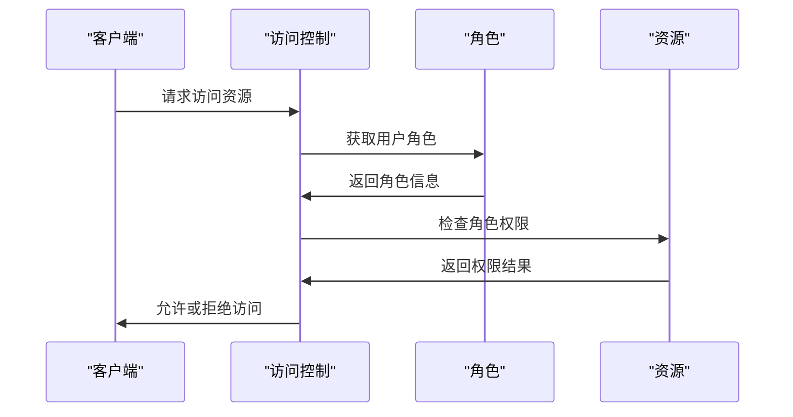
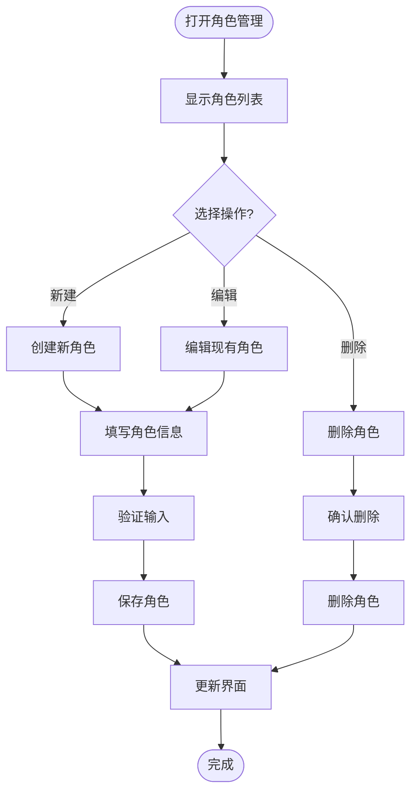

# 角色管理

<cite>
**本文档引用的文件**   
- [roles.ts](file://packages/plugins/@nocobase/plugin-acl/src/server/collections/roles.ts)
- [acl-role.ts](file://packages/core/acl/src/acl-role.ts)
- [acl.ts](file://packages/core/acl/src/acl.ts)
- [RolesManagement.tsx](file://packages/plugins/@nocobase/plugin-acl/src/client/RolesManagement.tsx)
- [Permissions.tsx](file://packages/plugins/@nocobase/plugin-acl/src/client/permissions/Permissions.tsx)
- [union-role.ts](file://packages/plugins/@nocobase/plugin-acl/src/server/actions/union-role.ts)
- [enum.ts](file://packages/plugins/@nocobase/plugin-acl/src/server/enum.ts)
- [NewRole.tsx](file://packages/plugins/@nocobase/plugin-acl/src/client/NewRole.tsx)
- [roles-manager.ts](file://packages/plugins/@nocobase/plugin-acl/src/client/roles-manager.ts)
- [roles.ts](file://packages/core/client/src/demo-utils/dataSourceMainCollections.json)
- [roles.ts](file://packages/core/test/src/web/dataSourceMainCollections.json)
</cite>

## 目录
1. [简介](#简介)
2. [项目结构](#项目结构)
3. [核心组件](#核心组件)
4. [架构概述](#架构概述)
5. [详细组件分析](#详细组件分析)
6. [依赖分析](#依赖分析)
7. [性能考虑](#性能考虑)
8. [故障排除指南](#故障排除指南)
9. [结论](#结论)

## 简介
NocoBase角色管理系统实现了基于角色的访问控制（RBAC），提供了一套完整的权限管理解决方案。系统通过角色来组织和管理用户权限，支持角色的创建、编辑、删除等操作，并实现了角色与用户、权限的关联机制。角色管理系统包含角色继承、角色层级结构、权限批量分配等高级功能，同时提供了直观的可视化配置界面。系统还实现了角色缓存策略以提升性能，并支持通过API进行自定义角色的创建和权限分配。

## 项目结构
NocoBase的角色管理系统主要分布在`packages/plugins/@nocobase/plugin-acl`和`packages/core/acl`两个核心模块中。`plugin-acl`插件负责角色管理的前端界面和后端API实现，而`core/acl`模块提供了底层的访问控制逻辑。角色数据模型定义在`collections/roles.ts`文件中，包含角色的基本属性和关联关系。前端界面组件位于`client`目录下，包括角色管理、权限配置等UI组件。后端服务逻辑在`server`目录中实现，处理角色相关的API请求和业务逻辑。



**图表来源**
- [RolesManagement.tsx](file://packages/plugins/@nocobase/plugin-acl/src/client/RolesManagement.tsx)
- [Permissions.tsx](file://packages/plugins/@nocobase/plugin-acl/src/client/permissions/Permissions.tsx)
- [NewRole.tsx](file://packages/plugins/@nocobase/plugin-acl/src/client/NewRole.tsx)
- [roles.ts](file://packages/plugins/@nocobase/plugin-acl/src/server/collections/roles.ts)
- [acl.ts](file://packages/core/acl/src/acl.ts)
- [union-role.ts](file://packages/plugins/@nocobase/plugin-acl/src/server/actions/union-role.ts)

**章节来源**
- [roles.ts](file://packages/plugins/@nocobase/plugin-acl/src/server/collections/roles.ts)
- [RolesManagement.tsx](file://packages/plugins/@nocobase/plugin-acl/src/client/RolesManagement.tsx)

## 核心组件
NocoBase角色管理系统的核心组件包括角色数据模型、访问控制逻辑、权限配置界面和API服务。角色数据模型定义了角色的基本属性，如名称、标题、描述、默认角色标识等。访问控制逻辑实现了基于角色的权限检查和策略应用。权限配置界面提供了直观的可视化操作，允许管理员通过图形界面配置角色权限。API服务提供了创建、编辑、删除角色以及管理角色权限的标准接口。

**章节来源**
- [roles.ts](file://packages/plugins/@nocobase/plugin-acl/src/server/collections/roles.ts)
- [acl-role.ts](file://packages/core/acl/src/acl-role.ts)
- [acl.ts](file://packages/core/acl/src/acl.ts)

## 架构概述
NocoBase角色管理系统的架构采用分层设计，分为数据层、服务层和表现层。数据层由Sequelize ORM管理，定义了角色、用户、权限等实体及其关系。服务层实现了访问控制逻辑，包括权限检查、策略应用和角色继承。表现层提供了RESTful API和图形用户界面，支持角色的创建、编辑、删除和权限配置。系统通过事件驱动机制实现组件间的松耦合，如角色变更时自动更新权限缓存。



**图表来源**
- [acl.ts](file://packages/core/acl/src/acl.ts)
- [roles.ts](file://packages/plugins/@nocobase/plugin-acl/src/server/collections/roles.ts)
- [union-role.ts](file://packages/plugins/@nocobase/plugin-acl/src/server/actions/union-role.ts)

## 详细组件分析

### 角色数据模型分析
角色数据模型是NocoBase角色管理系统的基础，定义了角色的结构和属性。模型包含角色名称、标题、描述、默认角色标识等基本字段，以及与用户、权限的关联关系。角色名称作为主键，采用UID格式以确保唯一性。系统预定义了root、admin、member等内置角色，这些角色具有特殊的权限和限制。



**图表来源**
- [roles.ts](file://packages/plugins/@nocobase/plugin-acl/src/server/collections/roles.ts)
- [roles.ts](file://packages/core/client/src/demo-utils/dataSourceMainCollections.json)

**章节来源**
- [roles.ts](file://packages/plugins/@nocobase/plugin-acl/src/server/collections/roles.ts)

### 访问控制逻辑分析
访问控制逻辑是角色管理系统的核心，实现了基于角色的权限检查和策略应用。系统通过ACL（Access Control List）机制管理权限，每个角色关联一组权限规则。权限检查采用策略模式，支持灵活的权限配置。系统还实现了权限继承机制，允许角色继承其他角色的权限。



**图表来源**
- [acl.ts](file://packages/core/acl/src/acl.ts)
- [acl-role.ts](file://packages/core/acl/src/acl-role.ts)

**章节来源**
- [acl.ts](file://packages/core/acl/src/acl.ts)
- [acl-role.ts](file://packages/core/acl/src/acl-role.ts)

### 角色管理界面分析
角色管理界面提供了直观的可视化操作，允许管理员通过图形界面管理角色和权限。界面采用React组件化设计，支持角色的创建、编辑、删除操作。权限配置采用标签页形式，将不同类型的权限分组管理。系统还提供了权限预览功能，允许管理员在保存前查看权限配置效果。



**图表来源**
- [RolesManagement.tsx](file://packages/plugins/@nocobase/plugin-acl/src/client/RolesManagement.tsx)
- [Permissions.tsx](file://packages/plugins/@nocobase/plugin-acl/src/client/permissions/Permissions.tsx)
- [NewRole.tsx](file://packages/plugins/@nocobase/plugin-acl/src/client/NewRole.tsx)

**章节来源**
- [RolesManagement.tsx](file://packages/plugins/@nocobase/plugin-acl/src/client/RolesManagement.tsx)
- [Permissions.tsx](file://packages/plugins/@nocobase/plugin-acl/src/client/permissions/Permissions.tsx)

## 依赖分析
NocoBase角色管理系统依赖于多个核心模块和第三方库。系统依赖`@nocobase/database`模块进行数据持久化，依赖`@nocobase/resourcer`模块提供RESTful API服务。访问控制逻辑依赖`lodash`库进行数据处理，依赖`minimatch`库进行模式匹配。前端界面依赖`antd`组件库构建UI，依赖`@formily/react`库实现表单管理。

```mermaid
graph LR
A[角色管理系统] --> B[@nocobase/database]
A --> C[@nocobase/resourcer]
A --> D[@nocobase/utils]
A --> E[lodash]
A --> F[minimatch]
A --> G[antd]
A --> H[@formily/react]
B --> I[Sequelize]
C --> J[Koa]
D --> K[Toposort]
```

**图表来源**
- [package.json](file://packages/plugins/@nocobase/plugin-acl/package.json)
- [package.json](file://packages/core/acl/package.json)

**章节来源**
- [roles.ts](file://packages/plugins/@nocobase/plugin-acl/src/server/collections/roles.ts)
- [acl.ts](file://packages/core/acl/src/acl.ts)

## 性能考虑
NocoBase角色管理系统通过多种机制优化性能。系统实现了角色权限缓存，避免重复的权限计算。权限检查采用懒加载策略，仅在需要时加载权限数据。系统还实现了批量操作优化，支持一次性更新多个角色的权限。对于大型系统，建议配置Redis作为缓存后端，以提升并发性能。

**章节来源**
- [acl.ts](file://packages/core/acl/src/acl.ts)
- [roles.ts](file://packages/plugins/@nocobase/plugin-acl/src/server/collections/roles.ts)

## 故障排除指南
在使用NocoBase角色管理系统时，可能遇到权限不生效、角色无法删除等问题。对于权限不生效问题，应检查角色权限配置是否正确，确认用户是否已分配相应角色。对于角色无法删除问题，应检查是否有用户关联该角色，确认角色是否为系统内置角色。系统日志可以帮助诊断问题，建议开启调试日志以获取详细信息。

**章节来源**
- [acl.ts](file://packages/core/acl/src/acl.ts)
- [roles.ts](file://packages/plugins/@nocobase/plugin-acl/src/server/collections/roles.ts)

## 结论
NocoBase角色管理系统提供了一套完整、灵活的基于角色的访问控制解决方案。系统通过清晰的架构设计和模块化实现，支持复杂的权限管理需求。角色继承、权限批量分配等高级功能使得系统能够适应各种业务场景。直观的可视化界面降低了管理复杂度，而强大的API支持则满足了自动化集成需求。系统的性能优化和可扩展性设计确保了在大型应用中的稳定运行。