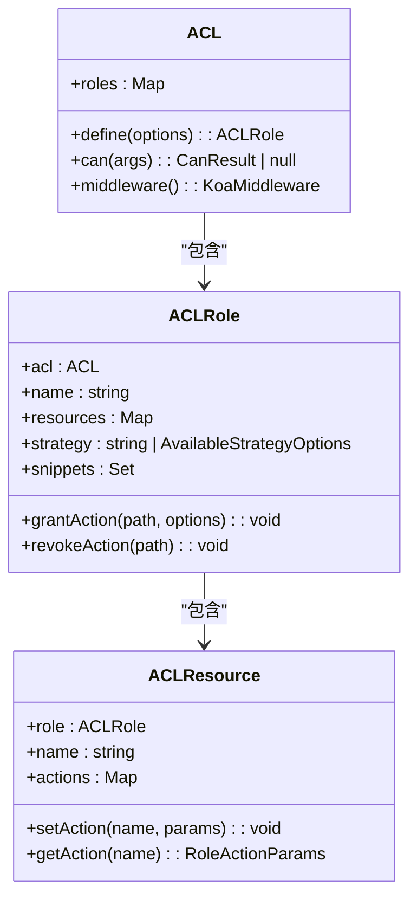
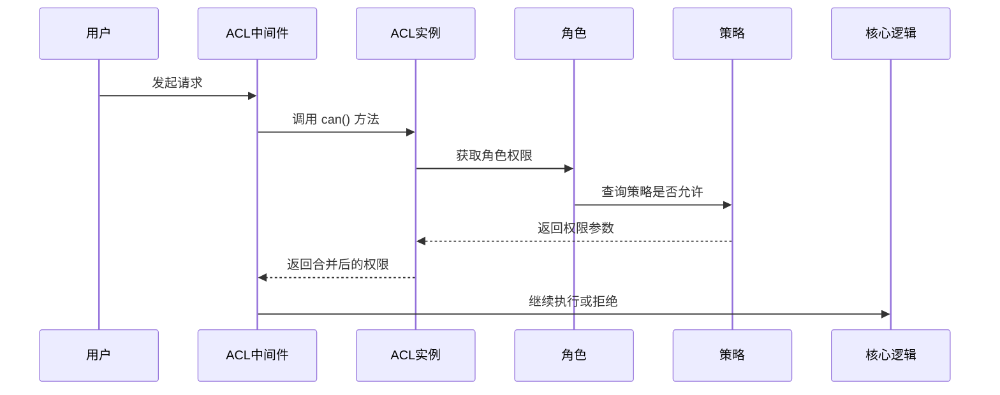
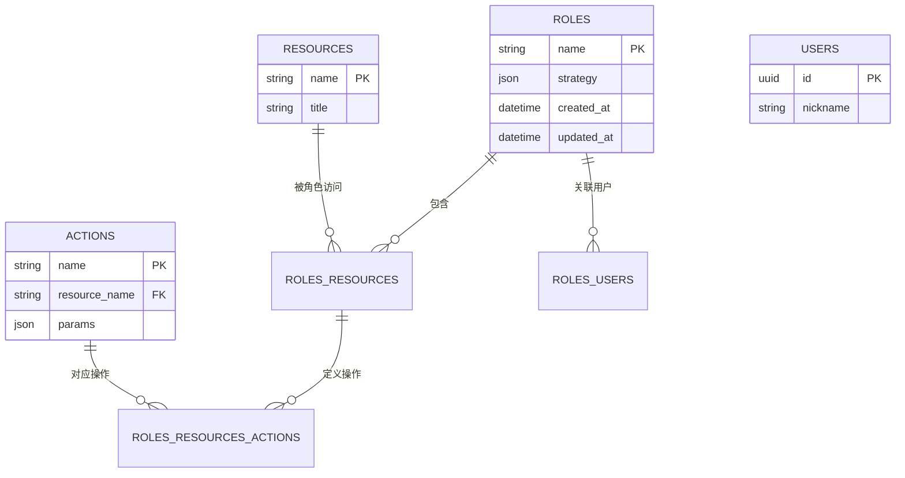

# 访问控制

<cite>
**本文档中引用的文件**  
- [acl.ts](file://packages/core/acl/src/acl.ts)
- [acl-role.ts](file://packages/core/acl/src/acl-role.ts)
- [acl-resource.ts](file://packages/core/acl/src/acl-resource.ts)
- [acl-available-strategy.ts](file://packages/core/acl/src/acl-available-strategy.ts)
- [allow-manager.ts](file://packages/core/acl/src/allow-manager.ts)
- [snippet-manager.ts](file://packages/core/acl/src/snippet-manager.ts)
- [roles.ts](file://packages/plugins/@nocobase/plugin-acl/src/client/schemas/roles.ts)
- [roles-users.ts](file://packages/plugins/@nocobase/plugin-acl/src/server/collections/roles-users.ts)
- [rolesResourcesActions.ts](file://packages/plugins/@nocobase/plugin-acl/src/server/collections/rolesResourcesActions.ts)
</cite>

## 目录
1. [引言](#引言)
2. [权限模型概述](#权限模型概述)
3. [基于角色的访问控制（RBAC）](#基于角色的访问控制rbac)
4. [策略（Strategy）机制](#策略strategy机制)
5. [权限检查执行流程](#权限检查执行流程)
6. [自定义权限规则与策略](#自定义权限规则与策略)
7. [权限管理界面与API配置](#权限管理界面与api配置)
8. [结论](#结论)

## 引言
NocoBase 提供了一套灵活且强大的访问控制系统，支持基于角色的权限管理（RBAC）、细粒度的资源访问控制以及可扩展的策略机制。该系统允许开发者通过角色分配权限、定义复杂的访问策略，并通过中间件拦截请求进行权限验证。本文档将深入解析其权限模型的设计原理与实现机制。

## 权限模型概述

NocoBase 的访问控制模型由以下几个核心组件构成：
- **角色（Role）**：代表一组权限集合，用户通过被赋予角色来获得相应权限。
- **资源（Resource）**：系统中的数据或功能模块，如“用户”、“文章”等。
- **操作（Action）**：对资源执行的具体行为，如“创建”、“读取”、“更新”、“删除”。
- **策略（Strategy）**：预定义的权限规则模板，用于快速赋予角色特定权限模式。
- **片段（Snippet）**：用于控制前端界面元素的显示/隐藏，实现UI级别的权限控制。

整个权限系统通过 `ACL` 类统一管理，所有权限判断均基于当前用户的角色和请求上下文进行。

**Section sources**
- [acl.ts](file://packages/core/acl/src/acl.ts#L66-L603)
- [acl-role.ts](file://packages/core/acl/src/acl-role.ts#L33-L215)

## 基于角色的访问控制（RBAC）

### 角色与权限分配

在 NocoBase 中，每个角色（`ACLRole`）维护一个资源-操作映射表，记录该角色对各个资源的操作权限参数。权限通过 `grantAction` 方法授予：

```typescript
role.grantAction('users:create', {
  fields: ['id', 'name', 'email'],
  filter: { status: 'active' }
});
```

上述代码表示该角色在创建用户时，只能设置指定字段，并且查询时自动附加状态过滤条件。

角色的权限信息存储在内存中，通过 `resources` 映射维护，每个资源对应一个 `ACLResource` 实例，而每个资源又包含多个操作及其参数。

### 角色继承与合并

当用户拥有多个角色时，系统会依次检查每个角色的权限，并将结果合并。例如，一个用户同时拥有“编辑”和“审核”角色，则其权限为两者的并集。特别地，若角色列表中包含 `root`，则直接赋予最高权限。



**Diagram sources**
- [acl.ts](file://packages/core/acl/src/acl.ts#L66-L603)
- [acl-role.ts](file://packages/core/acl/src/acl-role.ts#L33-L215)
- [acl-resource.ts](file://packages/core/acl/src/acl-resource.ts#L22-L84)

**Section sources**
- [acl.ts](file://packages/core/acl/src/acl.ts#L151-L180)
- [acl-role.ts](file://packages/core/acl/src/acl-role.ts#L82-L96)

## 策略（Strategy）机制

### 策略概念

策略（`ACLAvailableStrategy`）是一种预设的权限模板，用于简化常见权限场景的配置。例如，“仅本人可编辑”、“所有人可读”等模式可以通过策略一键应用。

系统内置了两种默认谓词（predicate）：
- `own`: 限制为当前用户创建的数据
- `all`: 允许访问所有数据

### 策略定义与使用

策略通过 `setAvailableStrategy` 方法注册：

```typescript
acl.setAvailableStrategy('self-write', {
  actions: ['create', 'update:own', 'view:all', 'destroy:own']
});
```

当角色设置 `strategy: 'self-write'` 时，系统会自动为其生成相应的权限规则。策略的匹配逻辑在 `matchAction` 方法中实现，支持通配符 `*` 和具体动作绑定。



**Diagram sources**
- [acl-available-strategy.ts](file://packages/core/acl/src/acl-available-strategy.ts#L34-L81)
- [acl.ts](file://packages/core/acl/src/acl.ts#L202-L204)

**Section sources**
- [acl-available-strategy.ts](file://packages/core/acl/src/acl-available-strategy.ts#L15-L81)
- [acl.ts](file://packages/core/acl/src/acl.ts#L155-L157)

## 权限检查执行流程

### 请求拦截与权限验证

权限检查通过 Koa 中间件链完成，主要流程如下：

1. **中间件初始化**：`ACL.middleware()` 注入到请求流程中。
2. **角色提取**：从 `ctx.state.currentRole` 或 `currentRoles` 获取当前用户角色。
3. **权限计算**：调用 `can()` 方法计算当前请求的权限参数。
4. **参数合并**：将权限参数与请求参数合并，应用于数据库查询。
5. **访问控制**：若无权限，抛出 403 错误。

关键代码位于 `addCoreMiddleware` 方法中，它在中间件链中插入核心权限逻辑，确保在业务逻辑执行前完成权限验证。

### 固定参数与片段控制

系统还支持“固定参数”（Fixed Params）和“片段”（Snippet）机制：
- **FixedParamsManager**：为特定资源操作添加不可变的过滤条件。
- **SnippetManager**：控制前端功能模块的可见性，如按钮、菜单项等。

```mermaid
flowchart TD
A[请求进入] --> B{是否有权限中间件}
B --> |是| C[提取当前角色]
C --> D[调用 ACL.can()]
D --> E{权限是否存在}
E --> |否| F[返回403 Forbidden]
E --> |是| G[合并权限参数]
G --> H[执行业务逻辑]
H --> I[返回响应]
```

**Diagram sources**
- [acl.ts](file://packages/core/acl/src/acl.ts#L418-L574)
- [allow-manager.ts](file://packages/core/acl/src/allow-manager.ts#L96-L111)

**Section sources**
- [acl.ts](file://packages/core/acl/src/acl.ts#L381-L574)
- [allow-manager.ts](file://packages/core/acl/src/allow-manager.ts#L14-L111)

## 自定义权限规则与策略

### 定义自定义策略

开发者可通过 `setAvailableStrategy` 扩展系统策略：

```typescript
acl.setAvailableStrategy('department-manager', {
  actions: ['create', 'update:ownDepartment', 'view:all'],
  allowConfigure: true
});
```

其中 `allowConfigure: true` 表示该角色可以配置系统设置。

### 自定义条件判断

通过 `allowManager.registerAllowCondition` 可注册自定义跳过条件：

```typescript
acl.allowManager.registerAllowCondition('isAdmin', (ctx) => {
  return ctx.state.currentUser.roles.includes('admin');
});
```

然后可通过 `acl.allow('users', 'list', 'isAdmin')` 应用该条件。

### 权限片段（Snippet）

片段用于控制前端界面元素的显示，例如：

```typescript
acl.registerSnippet({
  name: 'pm.features',
  actions: ['pm.projects:list', 'pm.tasks:*']
});
```

角色若被授予 `pm.features` 片段，则前端会显示项目管理相关功能。

**Section sources**
- [acl.ts](file://packages/core/acl/src/acl.ts#L339-L354)
- [allow-manager.ts](file://packages/core/acl/src/allow-manager.ts#L70-L72)
- [snippet-manager.ts](file://packages/core/acl/src/snippet-manager.ts)

## 权限管理界面与API配置

### 内置权限管理界面

NocoBase 提供了图形化的权限管理界面，位于后台的“系统设置”->“权限”模块。通过该界面可以：
- 创建和编辑角色
- 为角色分配资源权限
- 配置策略和片段
- 管理用户与角色的关联

前端 Schema 定义在 `roles.ts` 文件中，使用 JSON Schema 描述表单结构。

### API 进行权限配置

所有权限配置均可通过 REST API 完成。核心接口包括：
- `POST /roles`：创建角色
- `PATCH /roles/:name`：更新角色权限
- `POST /roles/:name/resources`：添加资源权限
- `POST /roles/:name/snippets`：分配权限片段

权限数据持久化存储在数据库的以下表中：
- `roles`：角色基本信息
- `rolesResources`：角色与资源关系
- `rolesResourcesActions`：角色对资源的操作权限
- `rolesUsers`：用户与角色关联



**Diagram sources**
- [roles.ts](file://packages/plugins/@nocobase/plugin-acl/src/client/schemas/roles.ts)
- [roles-users.ts](file://packages/plugins/@nocobase/plugin-acl/src/server/collections/roles-users.ts)
- [rolesResourcesActions.ts](file://packages/plugins/@nocobase/plugin-acl/src/server/collections/rolesResourcesActions.ts)

**Section sources**
- [roles.ts](file://packages/plugins/@nocobase/plugin-acl/src/client/schemas/roles.ts)
- [roles-users.ts](file://packages/plugins/@nocobase/plugin-acl/src/server/collections/roles-users.ts)

## 结论

NocoBase 的访问控制系统采用模块化设计，结合 RBAC 模型与策略机制，实现了灵活、可扩展的权限管理。系统通过中间件拦截请求，在运行时动态计算权限并合并参数，确保数据安全。同时提供完善的 API 和管理界面，便于开发者和管理员进行权限配置。该设计既满足了复杂业务场景的需求，又保持了良好的性能和可维护性。