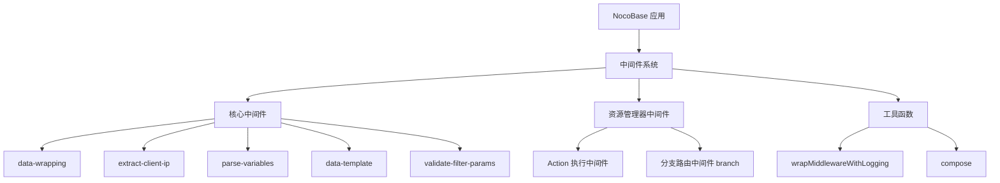
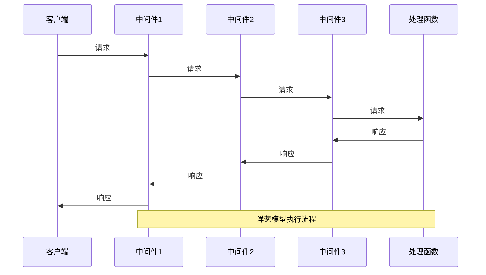
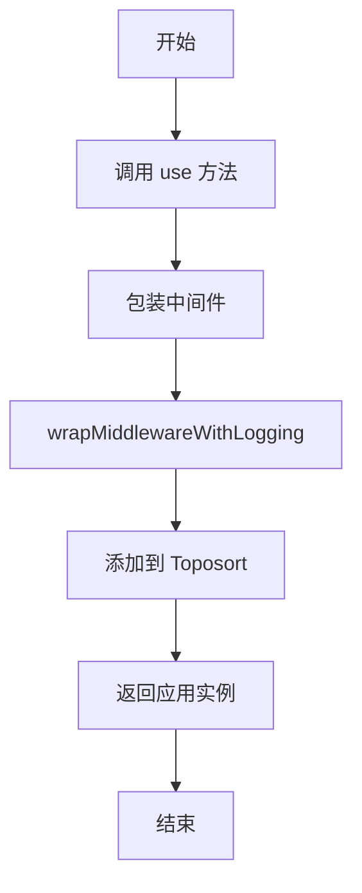
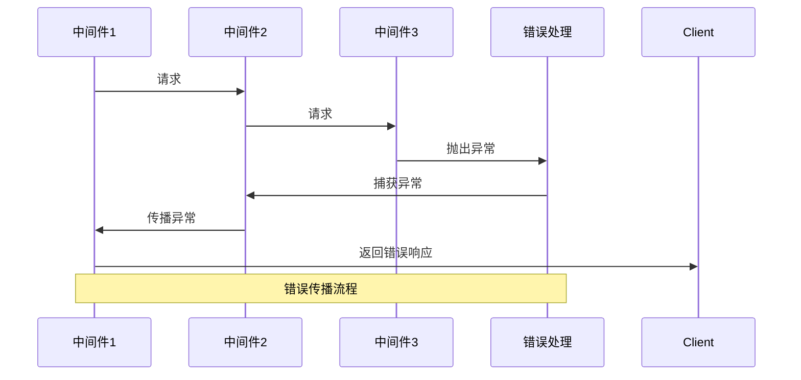
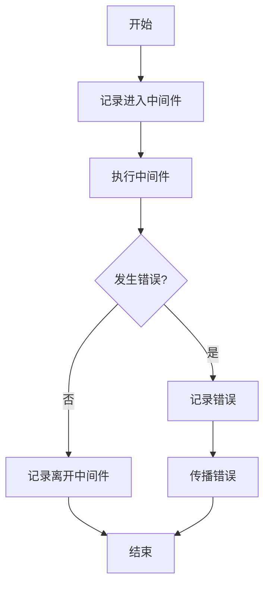
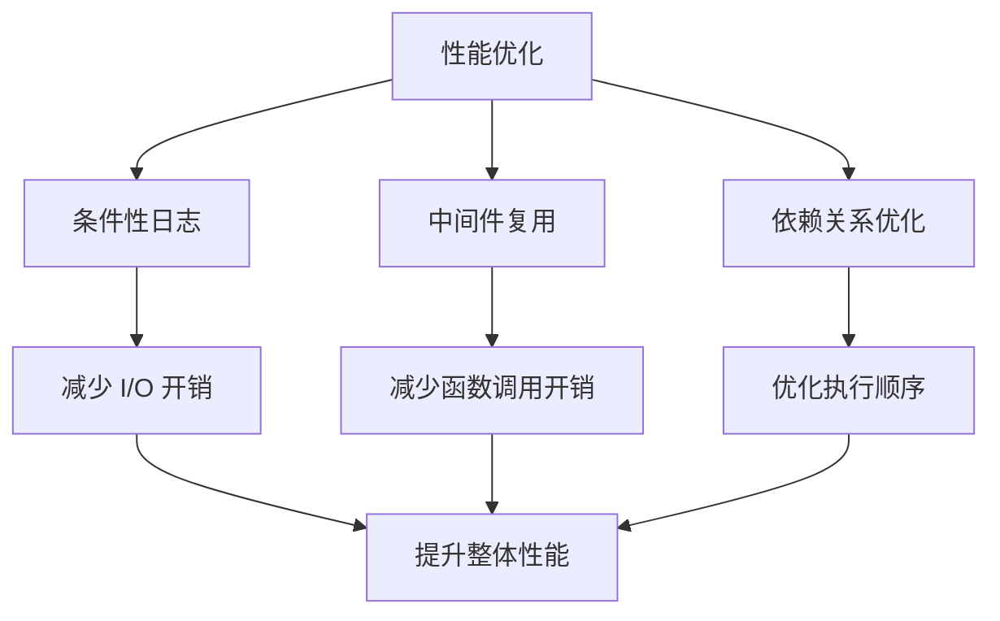

# 中间件执行流程

<cite>
**本文档引用的文件**
- [application.ts](file://packages/core/server/src/application.ts)
- [middleware.ts](file://packages/core/resourcer/src/middleware.ts)
- [wrap-middleware.ts](file://packages/core/utils/src/wrap-middleware.ts)
- [index.ts](file://packages/core/server/src/middlewares/index.ts)
- [data-wrapping.ts](file://packages/core/server/src/middlewares/data-wrapping.ts)
- [parse-variables.ts](file://packages/core/server/src/middlewares/parse-variables.ts)
- [data-template.ts](file://packages/core/server/src/middlewares/data-template.ts)
- [validate-filter-params.ts](file://packages/core/server/src/middlewares/validate-filter-params.ts)
</cite>

## 目录
1. [项目结构](#项目结构)
2. [核心组件](#核心组件)
3. [中间件洋葱模型执行机制](#中间件洋葱模型执行机制)
4. [中间件链的构建与执行](#中间件链的构建与执行)
5. [错误处理与异常捕获](#错误处理与异常捕获)
6. [性能考虑与优化策略](#性能考虑与优化策略)

## 项目结构

NocoBase 的中间件系统主要分布在 `packages/core/server/src/middlewares` 和 `packages/core/resourcer/src` 目录中。中间件的执行依赖于 Koa 框架的洋葱模型，通过 `koa-compose` 库实现中间件链的组合和执行。



**Diagram sources**
- [application.ts](file://packages/core/server/src/application.ts)
- [middleware.ts](file://packages/core/resourcer/src/middleware.ts)
- [wrap-middleware.ts](file://packages/core/utils/src/wrap-middleware.ts)

**Section sources**
- [application.ts](file://packages/core/server/src/application.ts)
- [middleware.ts](file://packages/core/resourcer/src/middleware.ts)

## 核心组件

NocoBase 的中间件系统由多个核心组件构成，包括应用级别的中间件、资源管理器中间件和工具函数。这些组件共同协作，实现了请求处理的洋葱模型。

**Section sources**
- [application.ts](file://packages/core/server/src/application.ts)
- [middleware.ts](file://packages/core/resourcer/src/middleware.ts)

## 中间件洋葱模型执行机制

NocoBase 采用 Koa 框架的洋葱模型来处理中间件的执行。当一个请求进入系统时，它会依次通过所有注册的中间件，直到到达最内层的处理函数。然后，响应会按照相反的顺序返回，经过每个中间件的后处理逻辑。



**Diagram sources**
- [application.ts](file://packages/core/server/src/application.ts)
- [middleware.ts](file://packages/core/resourcer/src/middleware.ts)

**Section sources**
- [application.ts](file://packages/core/server/src/application.ts#L569-L578)
- [middleware.ts](file://packages/core/resourcer/src/middleware.ts#L51-L52)

## 中间件链的构建与执行

中间件链的构建和执行是 NocoBase 中间件系统的核心。系统使用 `koa-compose` 库来组合多个中间件函数，形成一个可执行的中间件链。

### 中间件链的构建

中间件链的构建主要通过 `Application` 类的 `use` 方法完成。该方法将中间件添加到 `middleware` 属性中，该属性是一个 `Toposort` 实例，用于管理中间件的依赖关系。



**Diagram sources**
- [application.ts](file://packages/core/server/src/application.ts#L560-L563)
- [wrap-middleware.ts](file://packages/core/utils/src/wrap-middleware.ts)

### 中间件链的执行

中间件链的执行通过 `callback` 方法完成。该方法使用 `compose` 函数将所有中间件组合成一个单一的函数，然后在请求到达时执行。

```mermaid
flowchart TD
A[请求到达] --> B[创建上下文]
B --> C[调用 handleRequest]
C --> D[执行中间件链]
D --> E[compose(this.middleware.nodes)]
E --> F[逐个执行中间件]
F --> G[到达处理函数]
G --> H[生成响应]
H --> I[返回响应]
I --> J[结束]
```

**Diagram sources**
- [application.ts](file://packages/core/server/src/application.ts#L569-L578)
- [middleware.ts](file://packages/core/resourcer/src/middleware.ts#L51-L52)

**Section sources**
- [application.ts](file://packages/core/server/src/application.ts#L569-L578)
- [middleware.ts](file://packages/core/resourcer/src/middleware.ts#L51-L52)

## 错误处理与异常捕获

NocoBase 的中间件系统提供了完善的错误处理机制。当某个中间件抛出异常时，错误会沿着中间件链向上传播，直到被适当的错误处理中间件捕获。

### 错误传播机制

错误传播遵循洋葱模型的反向路径。当一个中间件抛出异常时，控制权会立即返回到上一个中间件，直到错误被处理或到达最外层。



**Diagram sources**
- [application.ts](file://packages/core/server/src/application.ts#L571-L572)
- [middleware.ts](file://packages/core/resourcer/src/middleware.ts#L23-L31)

### 异常捕获与处理

NocoBase 提供了 `wrapMiddlewareWithLogging` 函数来增强中间件的错误处理能力。该函数在中间件执行前后添加日志记录，并确保错误能够被正确捕获和处理。



**Diagram sources**
- [wrap-middleware.ts](file://packages/core/utils/src/wrap-middleware.ts)

**Section sources**
- [wrap-middleware.ts](file://packages/core/utils/src/wrap-middleware.ts)

## 性能考虑与优化策略

NocoBase 的中间件系统在设计时充分考虑了性能因素，通过多种策略来优化中间件的执行效率。

### 执行开销分析

中间件的执行开销主要来自以下几个方面：
- 中间件函数的调用开销
- 日志记录的 I/O 开销
- 异步操作的等待时间

### 优化策略

NocoBase 采用了以下优化策略来减少中间件的执行开销：

1. **条件性日志记录**：只有在 `LOGGER_LEVEL` 为 `trace` 时才启用详细的中间件日志记录。
2. **中间件复用**：通过 `wrapMiddlewareWithLogging` 函数缓存包装后的中间件，避免重复包装。
3. **依赖关系优化**：使用 `Toposort` 来管理中间件的依赖关系，确保中间件按最优顺序执行。



**Diagram sources**
- [wrap-middleware.ts](file://packages/core/utils/src/wrap-middleware.ts)
- [application.ts](file://packages/core/server/src/application.ts#L1256)

**Section sources**
- [wrap-middleware.ts](file://packages/core/utils/src/wrap-middleware.ts)
- [application.ts](file://packages/core/server/src/application.ts#L1256)