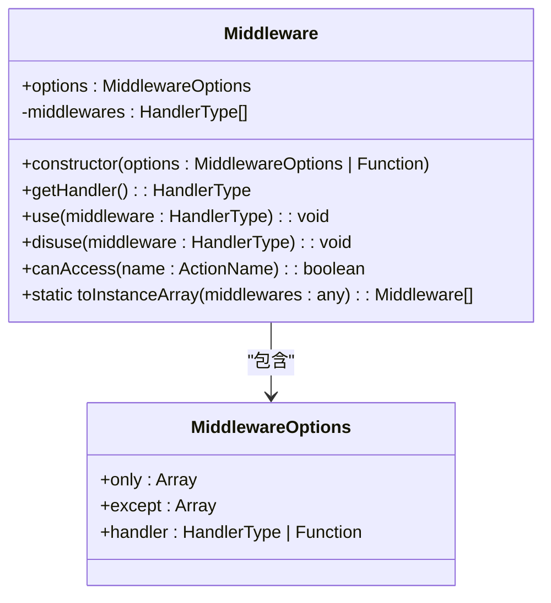
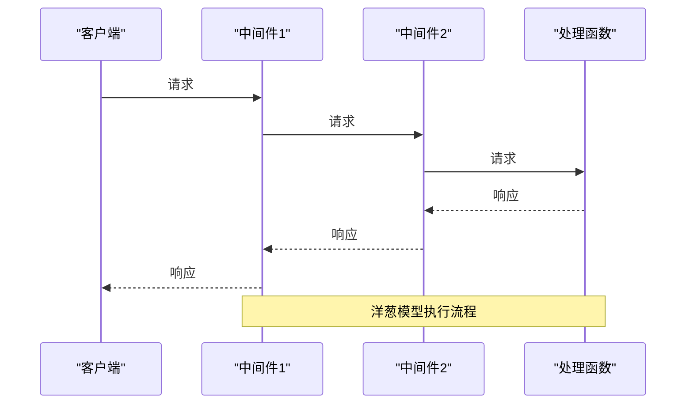
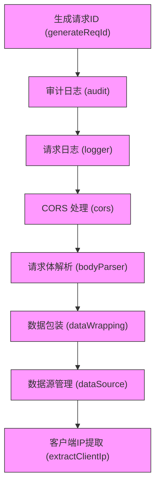
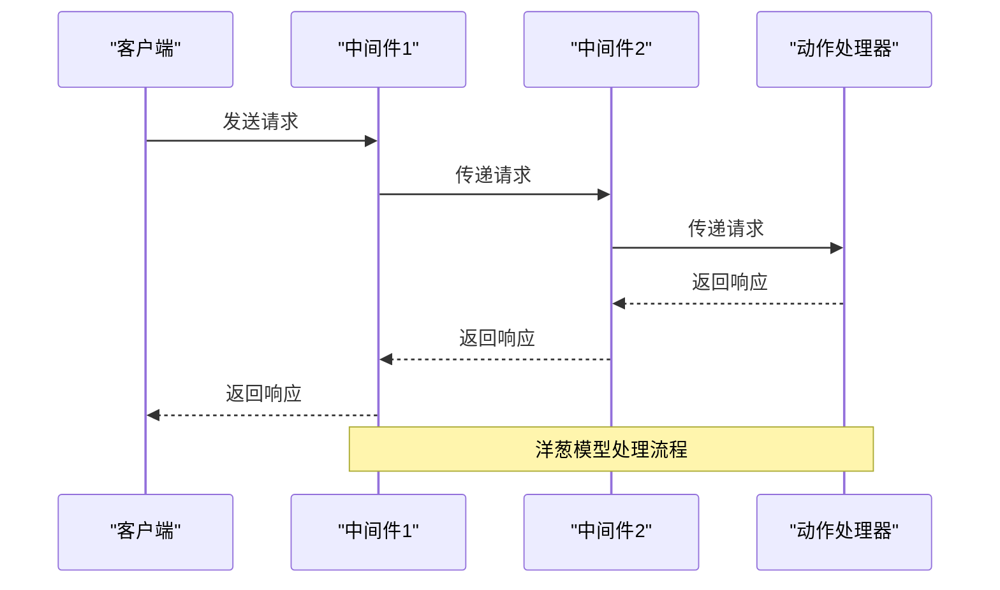
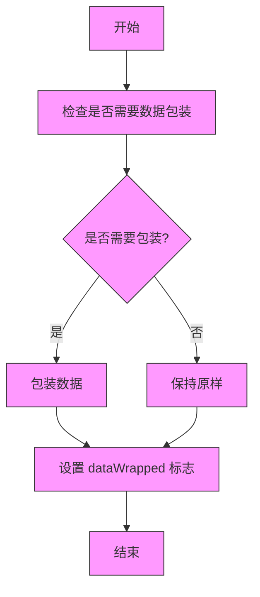

# 中间件机制

<cite>
**本文档引用的文件**  
- [middleware.ts](file://packages/core/resourcer/src/middleware.ts)
- [resourcer.ts](file://packages/core/resourcer/src/resourcer.ts)
- [action.ts](file://packages/core/resourcer/src/action.ts)
- [resource.ts](file://packages/core/resourcer/src/resource.ts)
- [data-wrapping.ts](file://packages/core/server/src/middlewares/data-wrapping.ts)
- [parse-variables.ts](file://packages/core/server/src/middlewares/parse-variables.ts)
- [validate-filter-params.ts](file://packages/core/server/src/middlewares/validate-filter-params.ts)
- [extract-client-ip.ts](file://packages/core/server/src/middlewares/extract-client-ip.ts)
- [i18n.ts](file://packages/core/server/src/middlewares/i18n.ts)
- [data-template.ts](file://packages/core/server/src/middlewares/data-template.ts)
- [helper.ts](file://packages/core/server/src/helper.ts)
- [app.ts](file://examples/app/middleware/app.ts)
- [resourcer.ts](file://examples/app/middleware/resourcer.ts)
- [acl.ts](file://examples/app/middleware/acl.ts)
- [wrap-middleware.ts](file://packages/core/utils/src/wrap-middleware.ts)
</cite>

## 目录
1. [引言](#引言)
2. [中间件设计原理](#中间件设计原理)
3. [中间件注册与执行顺序](#中间件注册与执行顺序)
4. [洋葱模型处理机制](#洋葱模型处理机制)
5. [内置中间件功能](#内置中间件功能)
6. [自定义中间件实现](#自定义中间件实现)
7. [中间件与资源和动作的集成](#中间件与资源和动作的集成)
8. [跨切面功能增强](#跨切面功能增强)
9. [总结](#总结)

## 引言

NocoBase 是一个基于 Node.js 的低代码开发平台，其核心架构采用了中间件机制来实现请求处理的拦截和增强。中间件机制是 NocoBase 实现灵活、可扩展功能的关键设计之一。通过中间件，开发者可以在请求处理的各个阶段插入自定义逻辑，实现诸如身份验证、数据包装、变量解析、过滤参数验证等功能。

本文档将深入探讨 NocoBase 的中间件机制，详细解释其设计理念、实现方式以及如何通过中间件实现请求处理的拦截和增强。我们将阐述中间件的注册和执行顺序，以及如何通过洋葱模型处理请求和响应。此外，我们还将描述内置中间件的功能，包括数据包装、变量解析和过滤参数验证，并提供代码示例，展示如何定义和注册自定义中间件。最后，我们将说明中间件与资源和动作的集成方式，以及如何实现跨切面的功能增强。

**本文档引用的文件**  
- [middleware.ts](file://packages/core/resourcer/src/middleware.ts)
- [resourcer.ts](file://packages/core/resourcer/src/resourcer.ts)
- [action.ts](file://packages/core/resourcer/src/action.ts)
- [resource.ts](file://packages/core/resourcer/src/resource.ts)

## 中间件设计原理

NocoBase 的中间件机制基于 Koa 框架的中间件模式，采用洋葱模型（Onion Model）来处理请求和响应。这种设计模式允许中间件在请求处理的各个阶段进行拦截和增强，从而实现灵活的功能扩展。

### 中间件类设计

在 NocoBase 中，中间件的核心实现位于 `packages/core/resourcer/src/middleware.ts` 文件中。`Middleware` 类是中间件机制的基础，它封装了中间件的配置和处理逻辑。



**图源**  
- [middleware.ts](file://packages/core/resourcer/src/middleware.ts#L33-L92)

`Middleware` 类的主要特性包括：

1. **配置选项**：通过 `MiddlewareOptions` 接口定义中间件的配置，支持 `only`（白名单）和 `except`（黑名单）来控制中间件对特定动作的访问权限。
2. **处理函数**：`getHandler()` 方法返回一个 Koa 风格的中间件函数，该函数使用 `koa-compose` 库将中间件链组合起来。
3. **动态注册**：`use()` 和 `disuse()` 方法允许在运行时动态添加或移除中间件。
4. **访问控制**：`canAccess()` 方法根据配置的白名单和黑名单判断中间件是否可以访问特定动作。

### 中间件执行流程

中间件的执行流程遵循洋葱模型，请求从外层中间件进入，逐层向内传递，到达最内层的处理函数后，再逐层向外返回响应。这种设计模式允许中间件在请求处理的各个阶段进行拦截和增强。



**图源**  
- [middleware.ts](file://packages/core/resourcer/src/middleware.ts#L46-L52)
- [resourcer.ts](file://packages/core/resourcer/src/resourcer.ts#L386)

**本节源**  
- [middleware.ts](file://packages/core/resourcer/src/middleware.ts#L1-L120)
- [resourcer.ts](file://packages/core/resourcer/src/resourcer.ts#L304-L310)

## 中间件注册与执行顺序

NocoBase 的中间件注册和执行顺序是通过 `Toposort` 库实现的，确保中间件按照正确的依赖关系执行。这种设计允许开发者灵活地控制中间件的执行顺序，而不需要关心中间件的注册顺序。

### 中间件注册

中间件的注册主要通过 `ResourceManager` 类的 `use()` 方法实现。该方法接受中间件函数或配置对象，并将其添加到中间件拓扑排序图中。

```typescript
use(middlewares: HandlerType | HandlerType[], options: ToposortOptions = {}) {
  if (!options.tag && !options.group && !options.before && !options.after) {
    options.tag = 'default';
  }
  this.middlewares.add(middlewares, options);
}
```

**本节源**  
- [resourcer.ts](file://packages/core/resourcer/src/resourcer.ts#L304-L309)

### 执行顺序控制

NocoBase 提供了多种方式来控制中间件的执行顺序：

1. **标签（tag）**：为中间件指定标签，便于识别和管理。
2. **分组（group）**：将中间件分组，确保同一组内的中间件按特定顺序执行。
3. **前置（before）和后置（after）**：明确指定中间件在其他中间件之前或之后执行。



**图源**  
- [helper.ts](file://packages/core/server/src/helper.ts#L42-L102)

**本节源**  
- [resourcer.ts](file://packages/core/resourcer/src/resourcer.ts#L304-L309)
- [helper.ts](file://packages/core/server/src/helper.ts#L42-L102)

## 洋葱模型处理机制

NocoBase 的洋葱模型处理机制是其核心设计之一，它允许中间件在请求处理的各个阶段进行拦截和增强。这种设计模式不仅提高了代码的可维护性，还增强了系统的灵活性和可扩展性。

### 请求处理流程

当一个请求到达 NocoBase 时，它会经过一系列中间件的处理。每个中间件都有机会在请求到达最终处理函数之前和之后执行特定的逻辑。



**图源**  
- [resourcer.ts](file://packages/core/resourcer/src/resourcer.ts#L314-L391)

### 中间件链的构建

中间件链的构建是通过 `koa-compose` 库实现的。`compose()` 函数将多个中间件函数组合成一个单一的中间件函数，确保它们按照正确的顺序执行。

```typescript
return compose(ctx.action.getHandlers())(ctx, next);
```

**本节源**  
- [resourcer.ts](file://packages/core/resourcer/src/resourcer.ts#L386)
- [action.ts](file://packages/core/resourcer/src/action.ts#L378)

## 内置中间件功能

NocoBase 提供了一系列内置中间件，用于处理常见的请求处理任务。这些中间件涵盖了从数据包装到变量解析的各个方面，为开发者提供了强大的功能支持。

### 数据包装中间件

数据包装中间件负责将响应数据包装成统一的格式，便于前端处理。



**图源**  
- [data-wrapping.ts](file://packages/core/server/src/middlewares/data-wrapping.ts#L13-L70)

### 变量解析中间件

变量解析中间件负责解析请求中的变量，支持动态数据绑定。

```typescript
export async function parseVariables(ctx, next) {
  const filter = ctx.action.params.filter;
  if (!filter) {
    return next();
  }
  ctx.action.params.filter = await parseFilter(filter, createContextVariablesScope(ctx));
  await next();
}
```

**本节源**  
- [parse-variables.ts](file://packages/core/server/src/middlewares/parse-variables.ts#L13-L20)

### 过滤参数验证中间件

过滤参数验证中间件确保请求中的过滤参数是有效的，防止恶意请求。

```typescript
export default async function validateFilterParams(ctx, next) {
  const { params } = ctx.action;
  const guardedActions = ['update', 'destroy'];

  const { actionName } = params;

  if (skipValidate(params)) {
    return await next();
  }

  if (emptyFilter(params) && emptyFilterByTk(params)) {
    throw new Error(`to do ${actionName} action, filter or filterByTk is required`);
  }

  if (params.filter && !isValidFilter(params.filter) && guardedActions.includes(params.actionName)) {
    throw new Error(`Invalid filter: ${JSON.stringify(params.filter)}`);
  }

  await next();
}
```

**本节源**  
- [validate-filter-params.ts](file://packages/core/server/src/middlewares/validate-filter-params.ts#L12-L30)

### 客户端IP提取中间件

客户端IP提取中间件从请求头中提取客户端IP地址，用于日志记录和安全审计。

```typescript
export function extractClientIp() {
  return async function extractClientIp(ctx: Context, next: Next) {
    const forwardedFor = ctx.get('X-Forwarded-For');
    const ipArray = forwardedFor ? forwardedFor.split(',') : [];
    const clientIp = ipArray.length > 0 ? ipArray[0].trim() : ctx.request.ip;
    ctx.state.clientIp = clientIp;

    await next();
  };
}
```

**本节源**  
- [extract-client-ip.ts](file://packages/core/server/src/middlewares/extract-client-ip.ts#L12-L20)

### 国际化中间件

国际化中间件负责处理多语言支持，根据请求头中的语言设置返回相应的语言内容。

```typescript
export function i18n() {
  return async function i18n(ctx: Context, next: Next) {
    const lang = ctx.get('Accept-Language') || 'en-US';
    ctx.i18n.changeLanguage(lang);
    await next();
  };
}
```

**本节源**  
- [i18n.ts](file://packages/core/server/src/middlewares/i18n.ts)

### 数据模板中间件

数据模板中间件用于处理数据模板，支持动态数据生成。

```typescript
export async function dataTemplate(ctx: Context, next) {
  const { resourceName, actionName } = ctx.action;
  const { isTemplate, fields, appends } = ctx.action.params;

  await next();

  if (isTemplate && actionName === 'get') {
    ctx.body = traverseJSON(JSON.parse(JSON.stringify(ctx.body)), {
      collection: ctx.getCurrentRepository().collection,
      include: [...(fields || []), ...(appends || [])],
    });
  }
}
```

**本节源**  
- [data-template.ts](file://packages/core/server/src/middlewares/data-template.ts#L13-L24)

## 自定义中间件实现

NocoBase 提供了灵活的机制来定义和注册自定义中间件，允许开发者根据具体需求扩展系统功能。

### 定义自定义中间件

自定义中间件可以通过函数或类的形式定义。以下是一个简单的自定义中间件示例：

```typescript
async function customMiddleware(ctx, next) {
  // 在请求处理前执行的逻辑
  console.log('Before request processing');
  
  // 调用下一个中间件
  await next();
  
  // 在响应处理后执行的逻辑
  console.log('After response processing');
}
```

**本节源**  
- [app.ts](file://examples/app/middleware/app.ts)

### 注册自定义中间件

自定义中间件可以通过 `app.use()` 方法注册到应用中。

```typescript
app.use(customMiddleware, { tag: 'custom', after: 'logger' });
```

**本节源**  
- [app.ts](file://examples/app/middleware/app.ts)

### 条件中间件

条件中间件可以根据特定条件决定是否执行。例如，只有在特定资源或动作上才执行的中间件。

```typescript
app.resourcer.use(async (ctx, next) => {
  if (ctx.action.resourceName === 'test' && ctx.action.actionName === 'list') {
    ctx.body = ctx.body || [];
    ctx.body.push('test list');
  }
  await next();
});
```

**本节源**  
- [resourcer.ts](file://examples/app/middleware/resourcer.ts)

### ACL中间件

ACL（访问控制列表）中间件用于实现细粒度的权限控制。

```typescript
app.acl.use(async (ctx, next) => {
  ctx.permission = {
    skip: !!ctx.request.query.skip,
    can: {
      params: {
        fields: ['a1', 'b1', 'b3'],
      },
    },
  };
  await next();
});
```

**本节源**  
- [acl.ts](file://examples/app/middleware/acl.ts)

## 中间件与资源和动作的集成

NocoBase 的中间件机制与资源和动作紧密集成，允许开发者在特定资源或动作上应用中间件。

### 资源级中间件

资源级中间件应用于特定资源的所有动作。

```typescript
app.resource({
  name: 'test',
  middlewares: [customMiddleware],
  actions: {
    list: async (ctx, next) => {
      // 处理逻辑
    },
  },
});
```

**本节源**  
- [resource.ts](file://packages/core/resourcer/src/resource.ts#L100-L112)

### 动作级中间件

动作级中间件应用于特定动作。

```typescript
app.resource({
  name: 'test',
  actions: {
    list: {
      middlewares: [customMiddleware],
      handler: async (ctx, next) => {
        // 处理逻辑
      },
    },
  },
});
```

**本节源**  
- [action.ts](file://packages/core/resourcer/src/action.ts#L248-L253)

### 全局中间件

全局中间件应用于所有请求。

```typescript
app.use(globalMiddleware);
```

**本节源**  
- [helper.ts](file://packages/core/server/src/helper.ts#L42-L102)

## 跨切面功能增强

NocoBase 的中间件机制支持跨切面功能增强，允许开发者在不修改核心代码的情况下添加新功能。

### 日志记录

通过中间件实现统一的日志记录功能。

```typescript
app.use(async (ctx, next) => {
  const start = Date.now();
  await next();
  const ms = Date.now() - start;
  console.log(`${ctx.method} ${ctx.url} - ${ms}ms`);
});
```

**本节源**  
- [helper.ts](file://packages/core/server/src/helper.ts#L53)

### 性能监控

通过中间件实现性能监控，记录请求处理时间。

```typescript
app.use(async (ctx, next) => {
  const start = Date.now();
  await next();
  const ms = Date.now() - start;
  ctx.app.context.getPerfHistogram('request').recordDelta(ms);
});
```

**本节源**  
- [helper.ts](file://packages/core/server/src/helper.ts#L139-L144)

### 错误处理

通过中间件实现统一的错误处理机制。

```typescript
app.use(async (ctx, next) => {
  try {
    await next();
  } catch (err) {
    ctx.status = err.status || 500;
    ctx.body = {
      message: err.message,
    };
  }
});
```

**本节源**  
- [helper.ts](file://packages/core/server/src/helper.ts)

## 总结

NocoBase 的中间件机制是其核心架构的重要组成部分，通过洋葱模型实现了灵活、可扩展的请求处理机制。中间件不仅能够拦截和增强请求处理，还能通过内置中间件和自定义中间件实现各种功能。通过合理的中间件设计和集成，开发者可以轻松地扩展系统功能，提高代码的可维护性和可重用性。

本文档详细介绍了 NocoBase 中间件的设计原理、注册与执行顺序、洋葱模型处理机制、内置中间件功能、自定义中间件实现、与资源和动作的集成以及跨切面功能增强。希望这些内容能够帮助开发者更好地理解和使用 NocoBase 的中间件机制，构建更加灵活和强大的应用。

**本文档引用的文件**  
- [middleware.ts](file://packages/core/resourcer/src/middleware.ts)
- [resourcer.ts](file://packages/core/resourcer/src/resourcer.ts)
- [action.ts](file://packages/core/resourcer/src/action.ts)
- [resource.ts](file://packages/core/resourcer/src/resource.ts)
- [data-wrapping.ts](file://packages/core/server/src/middlewares/data-wrapping.ts)
- [parse-variables.ts](file://packages/core/server/src/middlewares/parse-variables.ts)
- [validate-filter-params.ts](file://packages/core/server/src/middlewares/validate-filter-params.ts)
- [extract-client-ip.ts](file://packages/core/server/src/middlewares/extract-client-ip.ts)
- [i18n.ts](file://packages/core/server/src/middlewares/i18n.ts)
- [data-template.ts](file://packages/core/server/src/middlewares/data-template.ts)
- [helper.ts](file://packages/core/server/src/helper.ts)
- [app.ts](file://examples/app/middleware/app.ts)
- [resourcer.ts](file://examples/app/middleware/resourcer.ts)
- [acl.ts](file://examples/app/middleware/acl.ts)
- [wrap-middleware.ts](file://packages/core/utils/src/wrap-middleware.ts)