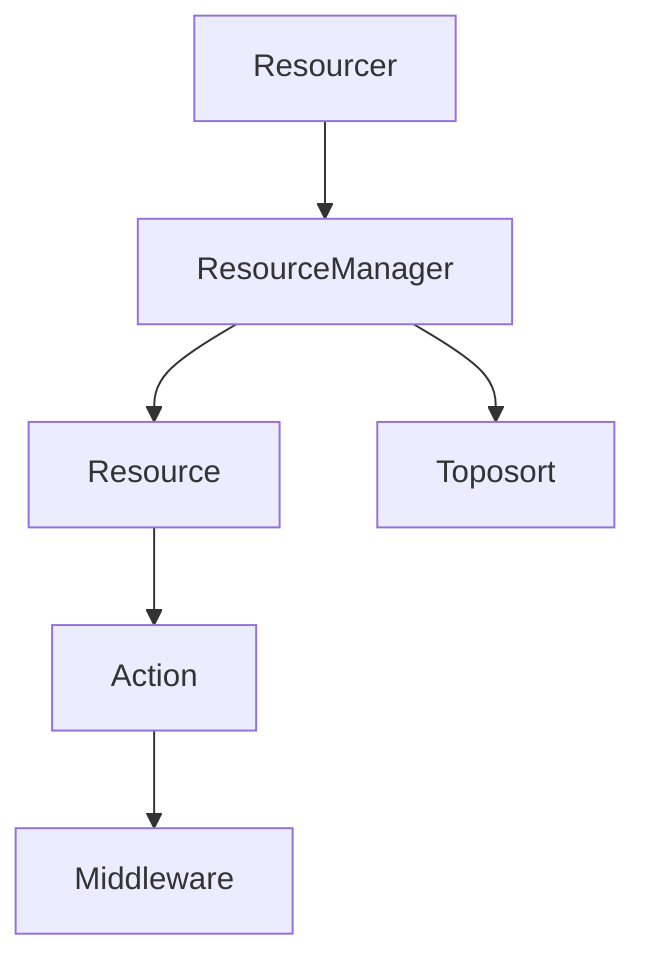
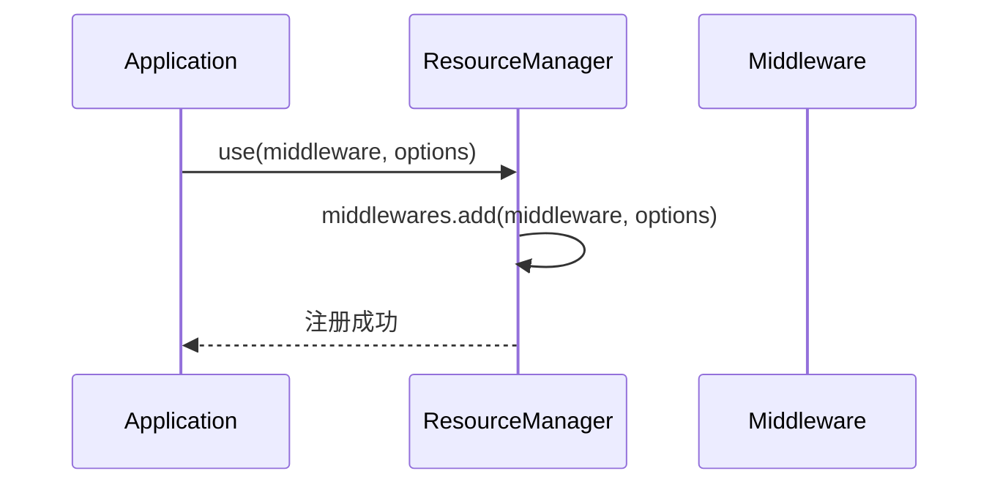
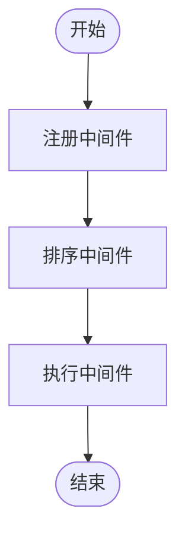
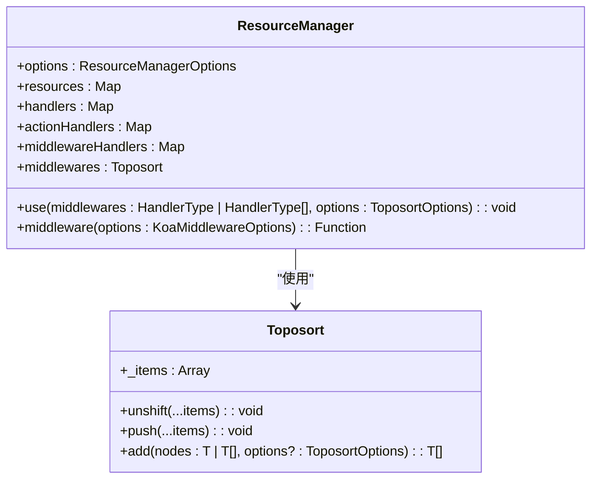

# 中间件注册

<cite>
**本文档中引用的文件**   
- [resourcer.ts](file://packages/core/resourcer/src/resourcer.ts)
- [action.ts](file://packages/core/resourcer/src/action.ts)
- [resource.ts](file://packages/core/resourcer/src/resource.ts)
- [middleware.ts](file://packages/core/resourcer/src/middleware.ts)
- [resourcer.ts](file://examples/app/middleware/resourcer.ts)
</cite>

## 目录
1. [项目结构](#项目结构)
2. [核心组件](#核心组件)
3. [中间件注册机制](#中间件注册机制)
4. [中间件生命周期与执行流程](#中间件生命周期与执行流程)
5. [中间件注册表与管理机制](#中间件注册表与管理机制)
6. [查询已注册中间件](#查询已注册中间件)

## 项目结构

NocoBase 的中间件注册机制主要位于 `packages/core/resourcer` 模块中，其核心文件包括 `resourcer.ts`、`action.ts`、`resource.ts` 和 `middleware.ts`。这些文件共同构成了中间件的注册、管理和执行体系。

**图示来源**
- [resourcer.ts](file://packages/core/resourcer/src/resourcer.ts)
- [resource.ts](file://packages/core/resourcer/src/resource.ts)
- [action.ts](file://packages/core/resourcer/src/action.ts)
- [middleware.ts](file://packages/core/resourcer/src/middleware.ts)

**章节来源**
- [resourcer.ts](file://packages/core/resourcer/src/resourcer.ts#L1-L430)
- [resource.ts](file://packages/core/resourcer/src/resource.ts#L1-L126)

## 核心组件

中间件注册机制的核心组件包括 `ResourceManager`、`Resource`、`Action` 和 `Middleware` 类。`ResourceManager` 负责全局中间件的注册和管理，`Resource` 表示一个资源，`Action` 表示资源上的操作，`Middleware` 表示中间件。

**章节来源**
- [resourcer.ts](file://packages/core/resourcer/src/resourcer.ts#L161-L429)
- [resource.ts](file://packages/core/resourcer/src/resource.ts#L61-L125)
- [action.ts](file://packages/core/resourcer/src/action.ts#L212-L409)
- [middleware.ts](file://packages/core/resourcer/src/middleware.ts#L33-L120)

## 中间件注册机制

中间件通过 `Resourcer` 类的 `use` 方法进行注册。该方法允许注册全局中间件，并支持命名、优先级和作用域配置。中间件可以针对特定资源或动作进行注册。

**图示来源**
- [resourcer.ts](file://packages/core/resourcer/src/resourcer.ts#L304-L309)
- [toposort.ts](file://packages/core/utils/src/toposort.ts#L16-L51)

**章节来源**
- [resourcer.ts](file://packages/core/resourcer/src/resourcer.ts#L304-L309)
- [examples/app/middleware/resourcer.ts](file://examples/app/middleware/resourcer.ts#L44-L48)

## 中间件生命周期与执行流程

中间件的生命周期包括注册、排序和执行。注册时通过 `Toposort` 类进行依赖排序，确保中间件按正确的顺序执行。执行时，中间件会按照注册顺序依次调用。

**图示来源**
- [resourcer.ts](file://packages/core/resourcer/src/resourcer.ts#L373-L386)
- [action.ts](file://packages/core/resourcer/src/action.ts#L371-L379)

**章节来源**
- [resourcer.ts](file://packages/core/resourcer/src/resourcer.ts#L373-L386)
- [action.ts](file://packages/core/resourcer/src/action.ts#L371-L379)

## 中间件注册表与管理机制

中间件注册表由 `ResourceManager` 类中的 `middlewares` 属性管理，该属性是一个 `Toposort` 实例。`Toposort` 类提供了 `add`、`unshift` 和 `push` 方法来管理中间件的顺序。

**图示来源**
- [resourcer.ts](file://packages/core/resourcer/src/resourcer.ts#L161-L429)
- [toposort.ts](file://packages/core/utils/src/toposort.ts#L16-L51)

**章节来源**
- [resourcer.ts](file://packages/core/resourcer/src/resourcer.ts#L161-L429)
- [toposort.ts](file://packages/core/utils/src/toposort.ts#L16-L51)

## 查询已注册中间件

可以通过 `ResourceManager` 类的 `getMiddlewares` 方法查询已注册的中间件。该方法返回一个包含所有已注册中间件的数组。

**章节来源**
- [resourcer.ts](file://packages/core/resourcer/src/resourcer.ts#L300-L302)