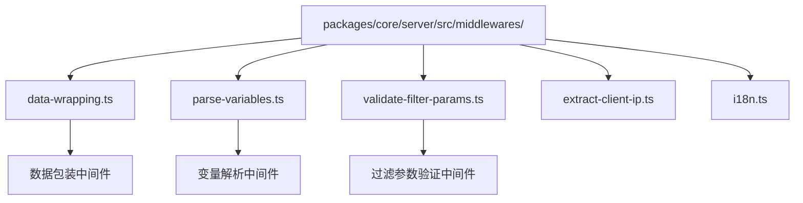
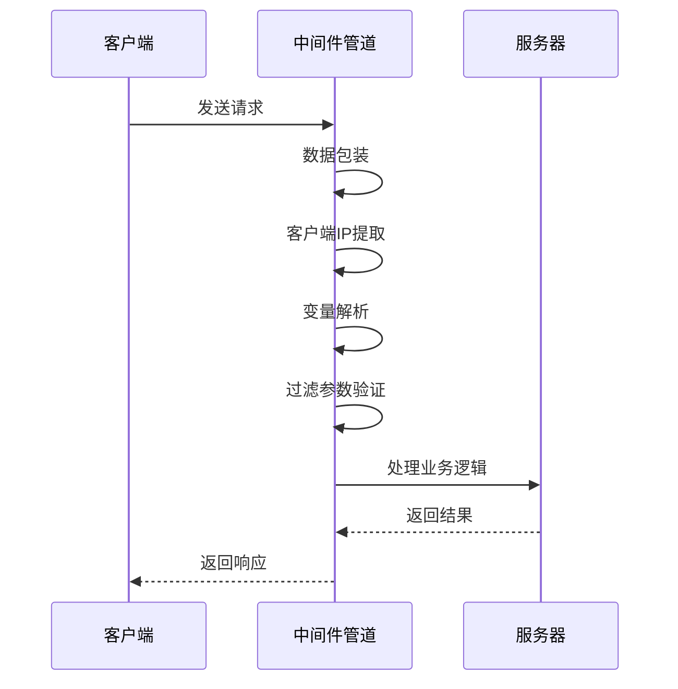
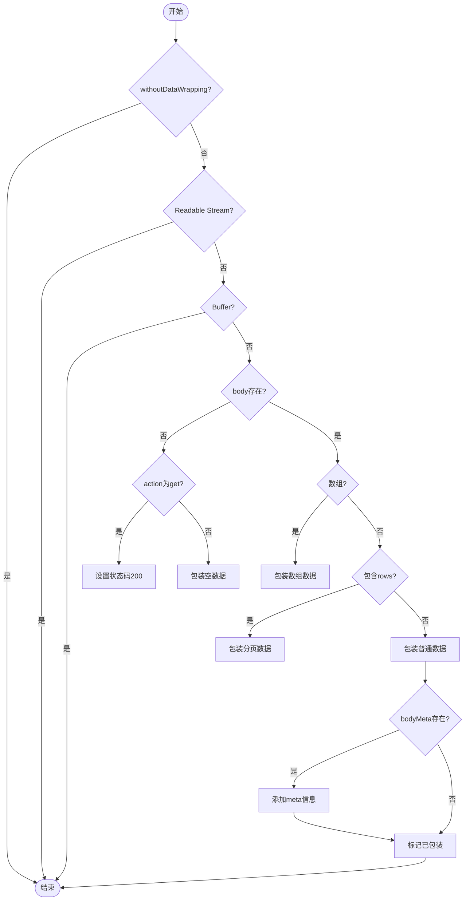
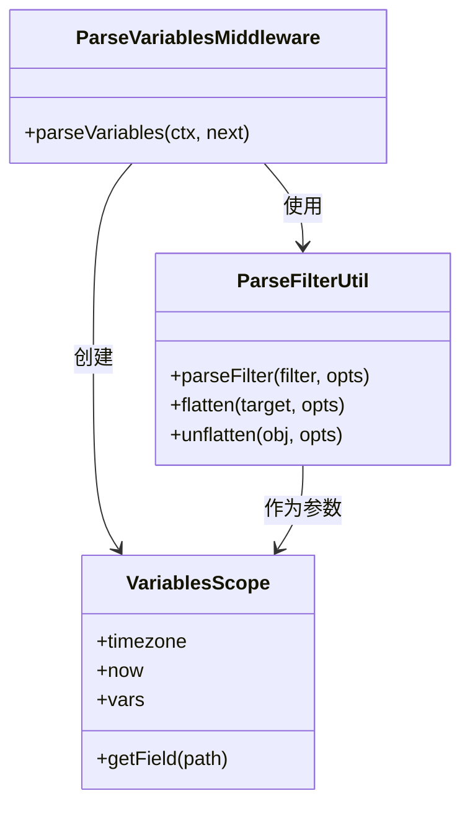
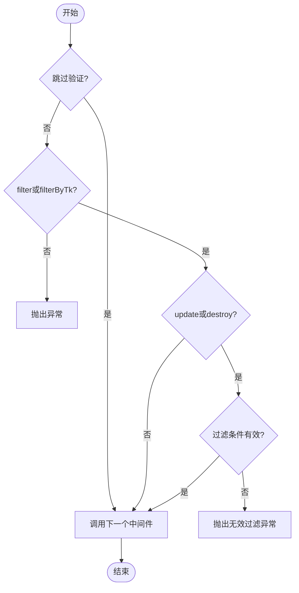
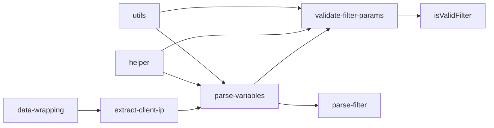

# 内置中间件

<cite>
**本文档引用的文件**  
- [data-wrapping.ts](file://packages/core/server/src/middlewares/data-wrapping.ts)
- [parse-variables.ts](file://packages/core/server/src/middlewares/parse-variables.ts)
- [validate-filter-params.ts](file://packages/core/server/src/middlewares/validate-filter-params.ts)
- [helper.ts](file://packages/core/server/src/helper.ts)
- [index.ts](file://packages/core/server/src/middlewares/index.ts)
- [parse-filter.ts](file://packages/core/utils/src/parse-filter.ts)
- [isValidFilter.ts](file://packages/core/utils/src/isValidFilter.ts)
</cite>

## 目录
1. [介绍](#介绍)
2. [项目结构](#项目结构)
3. [核心组件](#核心组件)
4. [架构概述](#架构概述)
5. [详细组件分析](#详细组件分析)
6. [依赖分析](#依赖分析)
7. [性能考虑](#性能考虑)
8. [故障排除指南](#故障排除指南)
9. [结论](#结论)

## 介绍

NocoBase 是一个低代码开发平台，其核心功能依赖于一系列内置中间件来处理请求、解析数据和验证参数。本文档将详细介绍三个核心中间件：数据包装、变量解析和过滤参数验证。这些中间件在请求处理管道中扮演着关键角色，确保数据的一致性、安全性和可扩展性。

## 项目结构

NocoBase 的项目结构遵循模块化设计原则，核心中间件位于 `packages/core/server/src/middlewares/` 目录下。该目录包含多个中间件实现文件，每个文件负责特定的功能处理。

**Diagram sources**
- [data-wrapping.ts](file://packages/core/server/src/middlewares/data-wrapping.ts)
- [parse-variables.ts](file://packages/core/server/src/middlewares/parse-variables.ts)
- [validate-filter-params.ts](file://packages/core/server/src/middlewares/validate-filter-params.ts)

**Section sources**
- [data-wrapping.ts](file://packages/core/server/src/middlewares/data-wrapping.ts)
- [parse-variables.ts](file://packages/core/server/src/middlewares/parse-variables.ts)
- [validate-filter-params.ts](file://packages/core/server/src/middlewares/validate-filter-params.ts)

## 核心组件

NocoBase 的内置中间件系统由三个核心组件构成：数据包装、变量解析和过滤参数验证。这些组件协同工作，确保请求处理的完整性和安全性。

**Section sources**
- [data-wrapping.ts](file://packages/core/server/src/middlewares/data-wrapping.ts)
- [parse-variables.ts](file://packages/core/server/src/middlewares/parse-variables.ts)
- [validate-filter-params.ts](file://packages/core/server/src/middlewares/validate-filter-params.ts)

## 架构概述

NocoBase 的中间件架构基于 Koa 框架的洋葱模型，请求在经过一系列中间件处理后返回响应。内置中间件按照特定顺序注册，确保功能的正确执行。

**Diagram sources**
- [index.ts](file://packages/core/server/src/middlewares/index.ts)
- [helper.ts](file://packages/core/server/src/helper.ts)

## 详细组件分析

### 数据包装中间件分析

数据包装中间件负责统一响应数据格式，确保API返回的数据结构一致性。

**Diagram sources**
- [data-wrapping.ts](file://packages/core/server/src/middlewares/data-wrapping.ts)

**Section sources**
- [data-wrapping.ts](file://packages/core/server/src/middlewares/data-wrapping.ts)

### 变量解析中间件分析

变量解析中间件负责处理请求中的变量替换，支持动态数据注入。

**Diagram sources**
- [parse-variables.ts](file://packages/core/server/src/middlewares/parse-variables.ts)
- [parse-filter.ts](file://packages/core/utils/src/parse-filter.ts)
- [helper.ts](file://packages/core/server/src/helper.ts)

**Section sources**
- [parse-variables.ts](file://packages/core/server/src/middlewares/parse-variables.ts)
- [parse-filter.ts](file://packages/core/utils/src/parse-filter.ts)
- [helper.ts](file://packages/core/server/src/helper.ts)

### 过滤参数验证中间件分析

过滤参数验证中间件确保请求中的过滤条件安全有效，防止无效或恶意查询。

**Diagram sources**
- [validate-filter-params.ts](file://packages/core/server/src/middlewares/validate-filter-params.ts)
- [isValidFilter.ts](file://packages/core/utils/src/isValidFilter.ts)

**Section sources**
- [validate-filter-params.ts](file://packages/core/server/src/middlewares/validate-filter-params.ts)
- [isValidFilter.ts](file://packages/core/utils/src/isValidFilter.ts)

## 依赖分析

内置中间件之间存在明确的依赖关系，这些关系通过中间件注册顺序和功能调用来体现。

**Diagram sources**
- [index.ts](file://packages/core/server/src/middlewares/index.ts)
- [helper.ts](file://packages/core/server/src/helper.ts)

**Section sources**
- [index.ts](file://packages/core/server/src/middlewares/index.ts)
- [helper.ts](file://packages/core/server/src/helper.ts)

## 性能考虑

内置中间件的设计考虑了性能因素，通过条件检查和早期返回来优化执行效率。

- **数据包装中间件**：通过检查 `withoutDataWrapping` 标志避免不必要的处理
- **变量解析中间件**：仅在存在过滤条件时执行解析操作
- **过滤参数验证中间件**：使用快速失败策略，尽早验证参数有效性

这些优化措施确保中间件在高并发场景下仍能保持良好的性能表现。

## 故障排除指南

### 常见问题及解决方案

| 问题现象 | 可能原因 | 解决方案 |
|---------|--------|--------|
| 响应数据未包装 | `withoutDataWrapping` 标志被设置 | 检查请求上下文中的标志设置 |
| 变量未被解析 | 过滤条件格式不正确 | 确保变量使用 `{{variable}}` 格式 |
| 过滤验证失败 | 过滤条件包含无效操作符 | 检查过滤条件的语法正确性 |
| 客户端IP获取失败 | 请求头缺失 | 确保请求包含 `X-Forwarded-For` 头 |

**Section sources**
- [data-wrapping.ts](file://packages/core/server/src/middlewares/data-wrapping.ts)
- [parse-variables.ts](file://packages/core/server/src/middlewares/parse-variables.ts)
- [validate-filter-params.ts](file://packages/core/server/src/middlewares/validate-filter-params.ts)

## 结论

NocoBase 的内置中间件系统通过数据包装、变量解析和过滤参数验证三个核心组件，构建了一个安全、可靠和可扩展的请求处理管道。这些中间件不仅确保了数据的一致性和安全性，还提供了灵活的配置选项和扩展机制，满足了不同应用场景的需求。