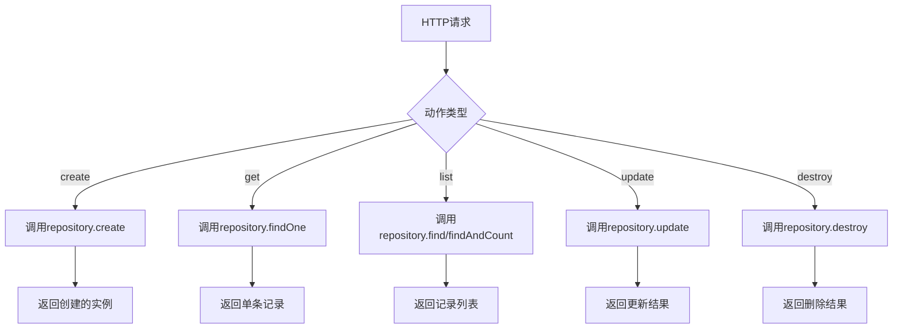
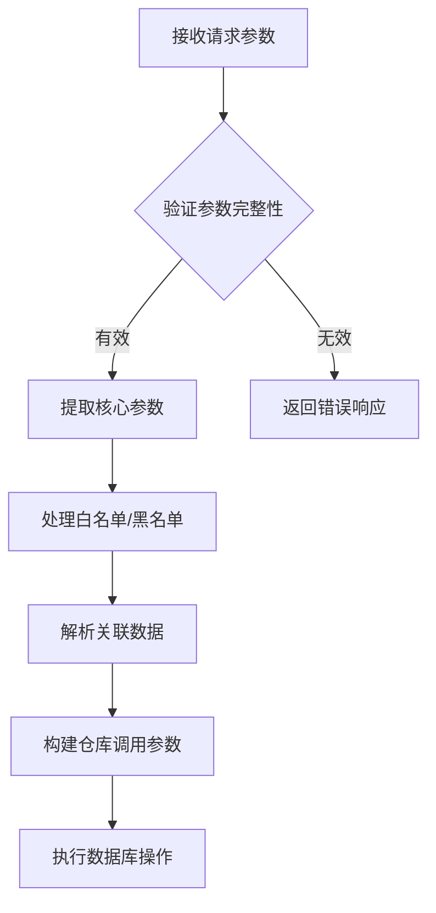
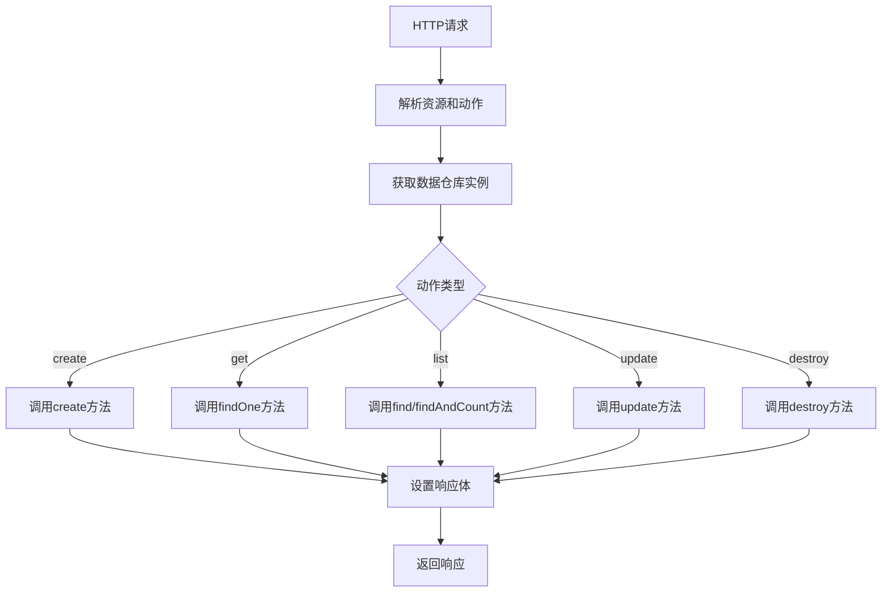
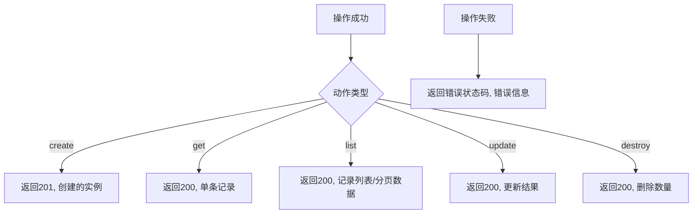
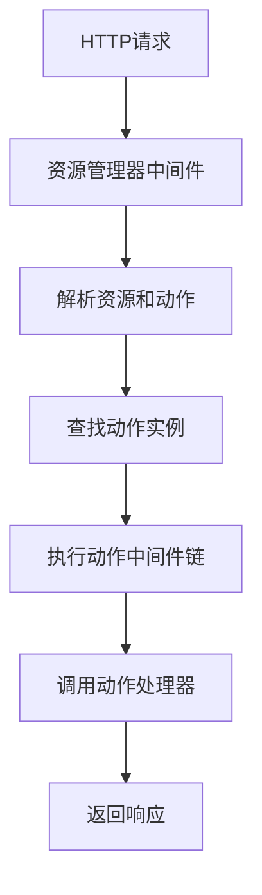

# 内置动作

<cite>
**本文档中引用的文件**  
- [create.ts](file://packages/core/actions/src/actions/create.ts)
- [get.ts](file://packages/core/actions/src/actions/get.ts)
- [list.ts](file://packages/core/actions/src/actions/list.ts)
- [update.ts](file://packages/core/actions/src/actions/update.ts)
- [destroy.ts](file://packages/core/actions/src/actions/destroy.ts)
- [proxy-to-repository.ts](file://packages/core/actions/src/actions/proxy-to-repository.ts)
- [utils.ts](file://packages/core/actions/src/utils.ts)
- [index.ts](file://packages/core/actions/src/index.ts)
- [load-default-actions.ts](file://packages/core/data-source-manager/src/load-default-actions.ts)
- [list.ts](file://packages/core/data-source-manager/src/default-actions/list.ts)
- [create-action.test.ts](file://packages/core/actions/src/__tests__/create-action.test.ts)
- [get-action.test.ts](file://packages/core/actions/src/__tests__/get-action.test.ts)
- [list-action.test.ts](file://packages/core/actions/src/__tests__/list-action.test.ts)
- [update-action.test.ts](file://packages/core/actions/src/__tests__/update-action.test.ts)
- [destroy-action.test.ts](file://packages/core/actions/src/__tests__/destroy-action.test.ts)
</cite>

## 目录
1. [简介](#简介)
2. [核心CRUD动作实现机制](#核心crud动作实现机制)
3. [参数处理与数据验证](#参数处理与数据验证)
4. [数据库操作流程](#数据库操作流程)
5. [响应格式规范](#响应格式规范)
6. [资源管理器集成](#资源管理器集成)
7. [RESTful API映射](#restful-api映射)
8. [可配置选项与扩展点](#可配置选项与扩展点)
9. [实际业务场景使用示例](#实际业务场景使用示例)
10. [总结](#总结)

## 简介

NocoBase提供了一套完整的内置动作系统，用于处理标准的CRUD（创建、读取、更新、删除）操作。这些内置动作通过资源管理器（ResourceManager）进行注册和管理，为开发者提供了高效、一致的数据操作接口。内置动作不仅支持基本的单表操作，还支持复杂的关联关系处理，包括一对一、一对多和多对多关系。

这些动作通过统一的API接口暴露，使得前端应用可以以一致的方式与后端进行交互。每个动作都遵循特定的执行流程，包括参数解析、权限验证、数据验证、数据库操作和响应生成等阶段。通过这种模块化的设计，NocoBase实现了高度的可扩展性和灵活性。

**Section sources**
- [index.ts](file://packages/core/actions/src/index.ts#L36-L52)

## 核心CRUD动作实现机制

NocoBase的内置CRUD动作包括`create`、`get`、`list`、`update`和`destroy`等标准操作。这些动作的实现基于统一的架构模式，通过代理模式将请求转发到相应的数据仓库（Repository）方法。

`create`动作用于创建新记录，它接收`values`参数作为要创建的数据，并通过`repository.create()`方法执行插入操作。`get`动作用于获取单条记录，通过`filterByTk`参数指定主键值，调用`repository.findOne()`方法查询数据。`list`动作用于获取记录列表，支持分页、排序和过滤等功能，根据`paginate`参数决定是否启用分页。`update`动作用于更新现有记录，通过`filterByTk`或`filter`参数定位目标记录，并使用`repository.update()`方法执行更新。`destroy`动作用于删除记录，同样通过`filterByTk`或`filter`参数确定要删除的记录。

这些动作的注册是通过`registerActions`函数完成的，该函数将所有标准动作批量注册到API系统中。每个动作都是一个异步函数，接收Koa上下文对象作为参数，并在执行完成后调用`next()`函数继续中间件链。



**Diagram sources**
- [create.ts](file://packages/core/actions/src/actions/create.ts#L13-L27)
- [get.ts](file://packages/core/actions/src/actions/get.ts#L12-L15)
- [list.ts](file://packages/core/actions/src/actions/list.ts#L99-L111)
- [update.ts](file://packages/core/actions/src/actions/update.ts#L12-L24)
- [destroy.ts](file://packages/core/actions/src/actions/destroy.ts#L13-L25)

**Section sources**
- [index.ts](file://packages/core/actions/src/index.ts#L36-L52)
- [load-default-actions.ts](file://packages/core/data-source-manager/src/load-default-actions.ts#L15-L73)

## 参数处理与数据验证

内置动作的参数处理是通过上下文对象中的`action.params`属性完成的。每个动作都有特定的参数集合，用于控制其行为。例如，`create`动作接受`values`、`whitelist`、`blacklist`和`updateAssociationValues`等参数，其中`values`是必需的，表示要创建的数据内容。

参数验证主要在数据仓库层进行，但动作层也会进行基本的参数检查。`whitelist`和`blacklist`参数用于控制哪些字段可以被操作，提供了一种简单的数据安全机制。`filterByTk`参数用于指定主键值，在`get`、`update`和`destroy`动作中特别重要，它确保了操作的精确性。

对于关联关系的处理，系统提供了专门的参数来管理。例如，在创建记录时，可以通过嵌套的`values`对象同时创建关联记录。在更新操作中，`updateAssociationValues`参数控制是否更新关联数据。这种设计使得复杂的关联操作变得简单而直观。



**Diagram sources**
- [create.ts](file://packages/core/actions/src/actions/create.ts#L15-L23)
- [update.ts](file://packages/core/actions/src/actions/update.ts#L12-L24)
- [utils.ts](file://packages/core/actions/src/utils.ts#L26-L39)

**Section sources**
- [create.ts](file://packages/core/actions/src/actions/create.ts#L15-L23)
- [update.ts](file://packages/core/actions/src/actions/update.ts#L12-L24)
- [utils.ts](file://packages/core/actions/src/utils.ts#L26-L39)

## 数据库操作流程

内置动作的数据库操作流程遵循一个清晰的模式：首先获取对应的数据仓库实例，然后调用仓库的相应方法执行操作，最后将结果设置到响应体中。这个流程通过`getRepositoryFromParams`工具函数实现，该函数根据动作参数确定要操作的资源和数据源。

对于`create`动作，系统调用`repository.create()`方法，该方法不仅处理主表的插入，还负责处理所有关联数据的创建。`get`和`list`动作分别调用`findOne`和`find`方法，这些方法支持丰富的查询选项，包括字段选择、过滤条件、排序规则和关联数据加载。

`update`动作的实现更为复杂，因为它需要处理部分更新和关联数据更新。系统通过`repository.update()`方法执行更新操作，该方法支持基于条件的批量更新。`destroy`动作则调用`repository.destroy()`方法，该方法同样支持基于条件的批量删除。



**Diagram sources**
- [create.ts](file://packages/core/actions/src/actions/create.ts#L14-L23)
- [get.ts](file://packages/core/actions/src/actions/get.ts#L12-L15)
- [list.ts](file://packages/core/actions/src/actions/list.ts#L35-L43)
- [update.ts](file://packages/core/actions/src/actions/update.ts#L12-L24)
- [destroy.ts](file://packages/core/actions/src/actions/destroy.ts#L14-L21)

**Section sources**
- [create.ts](file://packages/core/actions/src/actions/create.ts#L14-L23)
- [get.ts](file://packages/core/actions/src/actions/get.ts#L12-L15)
- [list.ts](file://packages/core/actions/src/actions/list.ts#L35-L43)
- [update.ts](file://packages/core/actions/src/actions/update.ts#L12-L24)
- [destroy.ts](file://packages/core/actions/src/actions/destroy.ts#L14-L21)

## 响应格式规范

NocoBase内置动作的响应格式遵循统一的规范，确保了API的一致性和可预测性。对于`create`、`get`和`update`动作，响应体直接包含操作结果的数据对象。`destroy`动作的响应体包含被删除记录的数量。

`list`动作的响应格式最为复杂，根据分页设置的不同而有所区别。当启用分页时，响应体包含`rows`、`count`、`page`、`pageSize`和`totalPage`等属性；当禁用分页时，响应体直接是一个数组，包含所有查询结果。此外，系统还支持"简单分页"模式，这种模式下响应体包含`hasNext`属性，用于指示是否存在下一页数据。

所有动作的响应状态码遵循HTTP标准：成功操作返回200，创建操作通常返回201。错误情况下，系统会返回相应的错误状态码和错误信息，帮助客户端正确处理异常情况。



**Diagram sources**
- [create.ts](file://packages/core/actions/src/actions/create.ts#L25-L26)
- [list.ts](file://packages/core/actions/src/actions/list.ts#L72-L87)
- [update.ts](file://packages/core/actions/src/actions/update.ts#L23-L24)
- [destroy.ts](file://packages/core/actions/src/actions/destroy.ts#L23-L24)

**Section sources**
- [create.ts](file://packages/core/actions/src/actions/create.ts#L25-L26)
- [list.ts](file://packages/core/actions/src/actions/list.ts#L72-L87)
- [update.ts](file://packages/core/actions/src/actions/update.ts#L23-L24)
- [destroy.ts](file://packages/core/actions/src/actions/destroy.ts#L23-L24)

## 资源管理器集成

内置动作与资源管理器（ResourceManager）深度集成，通过`resourcer.define()`方法注册到系统中。资源管理器负责管理所有资源和动作的生命周期，包括注册、查找和执行。每个资源可以定义自己的动作集合，这些动作可以是内置的CRUD动作，也可以是自定义的业务动作。

动作的执行是通过中间件链完成的，资源管理器提供了`middleware()`方法来创建处理请求的中间件。当请求到达时，系统根据URL路径解析出资源名称和动作名称，然后查找对应的动作实例并执行。这种设计使得动作的调用与HTTP路由解耦，提高了系统的灵活性和可维护性。

资源管理器还支持动作的继承和覆盖。开发者可以继承内置动作并添加自定义逻辑，或者完全替换内置动作的实现。这种机制为系统扩展提供了强大的支持，使得开发者可以在不修改核心代码的情况下定制系统行为。



**Diagram sources**
- [resourcer.ts](file://packages/core/resourcer/src/resourcer.ts#L362-L386)
- [resource.ts](file://packages/core/resourcer/src/resource.ts#L100-L112)
- [action.ts](file://packages/core/resourcer/src/action.ts#L384-L385)

**Section sources**
- [resourcer.ts](file://packages/core/resourcer/src/resourcer.ts#L362-L386)
- [resource.ts](file://packages/core/resourcer/src/resource.ts#L100-L112)
- [action.ts](file://packages/core/resourcer/src/action.ts#L384-L385)

## RESTful API映射

内置动作与RESTful API有着直接的映射关系，这种映射通过约定优于配置的原则实现。每个动作对应一个特定的HTTP方法和URL模式，使得API设计既直观又一致。

`create`动作映射到POST方法，URL模式为`/{resource}:create`；`get`动作映射到GET方法，URL模式为`/{resource}:get`；`list`动作也映射到GET方法，URL模式为`/{resource}:list`；`update`动作映射到PUT方法，URL模式为`/{resource}:update`；`destroy`动作映射到DELETE方法，URL模式为`/{resource}:destroy`。

这种映射关系不仅简化了API的使用，还使得系统能够自动生成API文档。通过分析动作定义，系统可以推断出每个API端点的请求方法、参数和响应格式，从而生成完整的OpenAPI/Swagger文档。

```mermaid
flowchart LR
A[create] --> B[POST /{resource}:create]
C[get] --> D[GET /{resource}:get]
E[list] --> F[GET /{resource}:list]
G[update] --> H[PUT /{resource}:update]
I[destroy] --> J[DELETE /{resource}:destroy]
```

**Diagram sources**
- [helpers.ts](file://packages/plugins/@nocobase/plugin-api-doc/src/server/swagger/helpers.ts#L36-L52)
- [collection.ts](file://packages/plugins/@nocobase/plugin-api-doc/src/server/swagger/collections/paths/collection.ts#L337-L346)

**Section sources**
- [helpers.ts](file://packages/plugins/@nocobase/plugin-api-doc/src/server/swagger/helpers.ts#L36-L52)
- [collection.ts](file://packages/plugins/@nocobase/plugin-api-doc/src/server/swagger/collections/paths/collection.ts#L337-L346)

## 可配置选项与扩展点

NocoBase的内置动作系统提供了丰富的可配置选项和扩展点，使得开发者可以根据具体需求定制系统行为。最常用的配置选项包括`whitelist`和`blacklist`，用于控制字段级别的访问权限。

对于`list`动作，系统提供了`paginate`选项来控制是否启用分页，以及`simplePaginate`选项来选择分页模式。`tree`选项用于处理树形结构数据的查询，自动添加必要的过滤条件。

扩展点主要体现在动作的中间件机制上。开发者可以为特定资源或全局添加中间件，在动作执行前后插入自定义逻辑。例如，可以在`create`动作前添加数据验证中间件，或在`get`动作后添加数据转换中间件。

此外，系统还支持通过`proxyToRepository`函数创建自定义的代理动作，这种机制使得开发者可以轻松地将新的仓库方法暴露为API端点，而无需重复编写样板代码。

**Section sources**
- [list.ts](file://packages/core/data-source-manager/src/default-actions/list.ts#L23-L33)
- [proxy-to-repository.ts](file://packages/core/actions/src/actions/proxy-to-repository.ts#L14-L26)
- [load-default-actions.ts](file://packages/core/data-source-manager/src/load-default-actions.ts#L15-L73)

## 实际业务场景使用示例

在实际业务场景中，内置动作的使用非常直观。以下是一些典型的使用示例：

创建记录时，客户端发送POST请求到`/api/posts:create`端点，请求体包含要创建的数据。系统会自动处理数据验证和关联关系，并返回创建的记录。

查询记录列表时，客户端发送GET请求到`/api/posts:list`端点，可以附加`page`、`pageSize`、`sort`和`filter`等查询参数来控制返回结果。对于大型数据集，系统会自动切换到简单分页模式以提高性能。

更新记录时，客户端发送PUT请求到`/api/posts:update`端点，通过`filterByTk`参数指定要更新的记录ID，并在请求体中提供要更新的字段值。系统会执行部分更新，只修改指定的字段。

删除记录时，客户端发送DELETE请求到`/api/posts:destroy`端点，通过`filterByTk`参数指定要删除的记录ID。系统会执行软删除或硬删除，具体行为取决于数据模型的配置。

这些示例展示了内置动作如何简化常见的数据操作，使得开发者可以专注于业务逻辑而不是底层的数据访问细节。

**Section sources**
- [create-action.test.ts](file://packages/core/actions/src/__tests__/create-action.test.ts#L56-L71)
- [get-action.test.ts](file://packages/core/actions/src/__tests__/get-action.test.ts#L72-L95)
- [list-action.test.ts](file://packages/core/actions/src/__tests__/list-action.test.ts#L93-L108)
- [update-action.test.ts](file://packages/core/actions/src/__tests__/update-action.test.ts#L72-L91)
- [destroy-action.test.ts](file://packages/core/actions/src/__tests__/destroy-action.test.ts#L74-L90)

## 总结

NocoBase的内置动作系统提供了一套完整、一致且可扩展的CRUD操作解决方案。通过标准化的动作接口和灵活的配置选项，系统既满足了常见业务需求，又为复杂场景提供了足够的扩展能力。

核心的CRUD动作通过统一的架构模式实现，确保了代码的一致性和可维护性。参数处理、数据验证和响应格式都遵循明确的规范，使得API使用简单直观。与资源管理器的深度集成和RESTful API的自动映射，进一步提升了开发效率。

系统的可配置选项和扩展点为定制化需求提供了强大支持，使得开发者可以在不修改核心代码的情况下满足特定业务要求。通过中间件机制和代理模式，系统实现了高度的灵活性和可扩展性。

总的来说，NocoBase的内置动作系统是其核心优势之一，它不仅简化了常见的数据操作，还为构建复杂的企业级应用提供了坚实的基础。