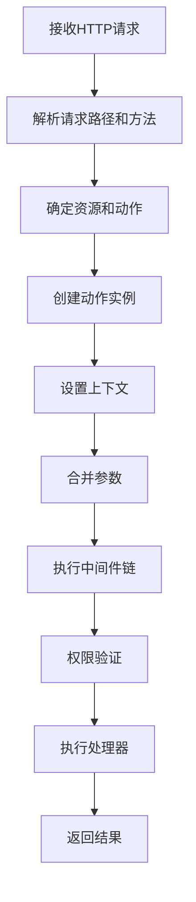
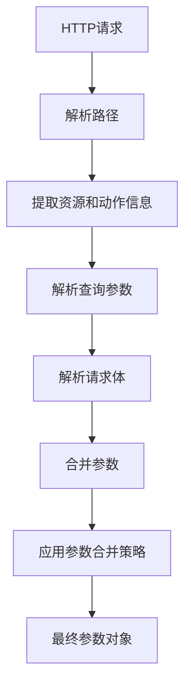
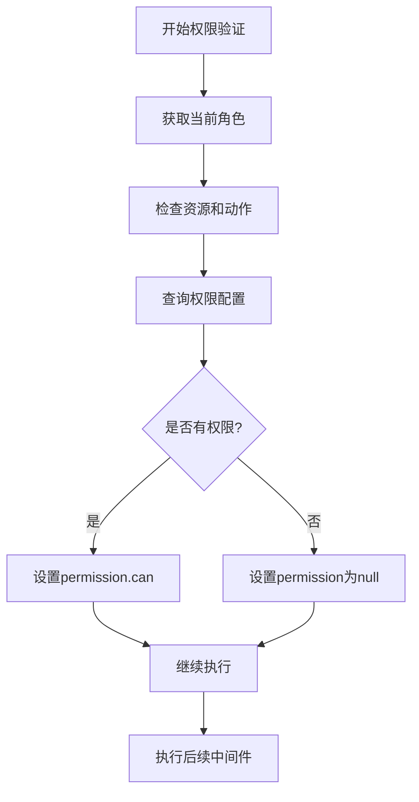
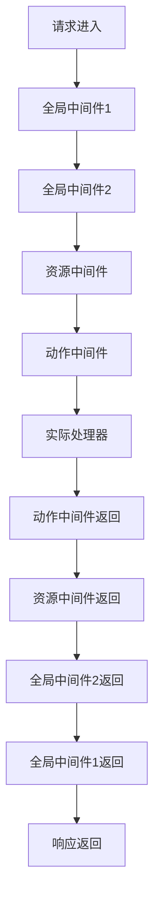
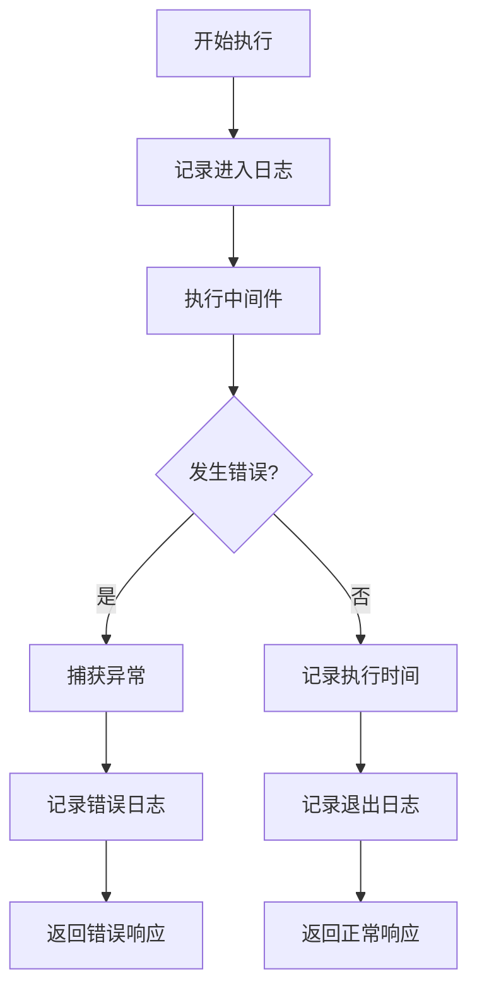
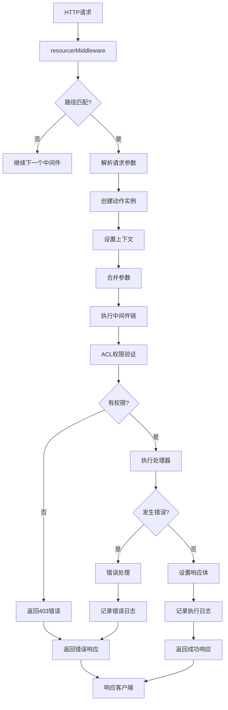

# 动作执行流程

<cite>
**本文档引用的文件**   
- [action.ts](file://packages/core/resourcer/src/action.ts)
- [resourcer.ts](file://packages/core/resourcer/src/resourcer.ts)
- [middleware.ts](file://packages/core/resourcer/src/middleware.ts)
- [resource.ts](file://packages/core/resourcer/src/resource.ts)
- [utils.ts](file://packages/core/resourcer/src/utils.ts)
- [acl.ts](file://packages/core/acl/src/acl.ts)
- [ctx.action.mergeParams.ts](file://examples/app/context/ctx.action.mergeParams.ts)
- [simple.ts](file://examples/app/resource-actions/simple.ts)
</cite>

## 目录
1. [简介](#简介)
2. [动作执行流程概述](#动作执行流程概述)
3. [参数解析](#参数解析)
4. [权限验证](#权限验证)
5. [中间件处理](#中间件处理)
6. [结果返回](#结果返回)
7. [可扩展点](#可扩展点)
8. [错误处理与日志记录](#错误处理与日志记录)
9. [流程图](#流程图)

## 简介
NocoBase的动作执行流程是一个完整的请求处理生命周期，从接收到HTTP请求开始，经过参数解析、权限验证、中间件处理，最终执行相应的业务逻辑并返回结果。该流程设计灵活，支持通过中间件进行功能扩展，同时具备完善的错误处理和日志记录机制。

**Section sources**
- [resourcer.ts](file://packages/core/resourcer/src/resourcer.ts#L311-L392)
- [action.ts](file://packages/core/resourcer/src/action.ts#L384-L386)

## 动作执行流程概述
NocoBase的动作执行流程始于HTTP请求的接收，系统首先通过`resourcerMiddleware`解析请求路径和方法，确定对应的动作和资源。然后创建动作实例，设置上下文环境，并依次执行全局中间件、资源中间件、动作中间件，最后调用实际的处理器函数。整个流程采用Koa的中间件组合模式，确保了处理流程的灵活性和可扩展性。

**Diagram sources **
- [resourcer.ts](file://packages/core/resourcer/src/resourcer.ts#L311-L392)
- [action.ts](file://packages/core/resourcer/src/action.ts#L384-L386)

**Section sources**
- [resourcer.ts](file://packages/core/resourcer/src/resourcer.ts#L311-L392)
- [action.ts](file://packages/core/resourcer/src/action.ts#L384-L386)

## 参数解析
动作执行流程中的参数解析阶段负责从HTTP请求中提取和合并各种参数。系统通过`parseRequest`函数解析请求路径，确定资源名称、动作名称和相关索引。同时，通过`parseQuery`函数解析查询字符串，支持JSON格式的过滤条件。参数合并采用特定的策略，如过滤条件使用AND合并，字段使用交集，追加字段使用并集等。

**Diagram sources **
- [utils.ts](file://packages/core/resourcer/src/utils.ts#L55-L214)
- [action.ts](file://packages/core/resourcer/src/action.ts#L289-L308)

**Section sources**
- [utils.ts](file://packages/core/resourcer/src/utils.ts#L55-L214)
- [action.ts](file://packages/core/resourcer/src/action.ts#L289-L308)

## 权限验证
权限验证是动作执行流程中的关键安全环节。系统通过ACL（访问控制列表）中间件实现权限控制。在请求处理过程中，系统会检查当前用户的角色和权限，确定是否允许执行特定动作。权限验证结果存储在`ctx.permission`中，包含`can`对象表示权限判断结果。系统支持通过`skip`标志跳过权限验证，为特殊场景提供灵活性。

**Diagram sources **
- [acl.ts](file://packages/core/acl/src/acl.ts#L384-L417)
- [skip-middleware.ts](file://packages/core/acl/src/skip-middleware.ts#L11-L18)

**Section sources**
- [acl.ts](file://packages/core/acl/src/acl.ts#L384-L417)
- [skip-middleware.ts](file://packages/core/acl/src/skip-middleware.ts#L11-L18)

## 中间件处理
中间件处理是NocoBase动作执行流程的核心机制。系统采用Koa的中间件组合模式，将多个中间件函数组合成一个执行链。中间件执行顺序为：全局中间件 → 资源中间件 → 动作中间件 → 实际处理器。每个中间件都有机会修改请求上下文或终止请求处理。通过`compose`函数实现中间件的洋葱模型执行，确保请求和响应都能经过所有中间件。

**Diagram sources **
- [action.ts](file://packages/core/resourcer/src/action.ts#L371-L379)
- [resourcer.ts](file://packages/core/resourcer/src/resourcer.ts#L386)

**Section sources**
- [action.ts](file://packages/core/resourcer/src/action.ts#L371-L379)
- [resourcer.ts](file://packages/core/resourcer/src/resourcer.ts#L386)

## 结果返回
结果返回阶段负责将处理器的执行结果以适当的格式返回给客户端。系统通过设置`ctx.body`属性来定义响应内容，支持JSON、文本等多种格式。在中间件链的最后，Koa框架会自动将`ctx.body`序列化为HTTP响应。系统还支持通过`ctx.attachment`设置文件下载，以及通过`ctx.throw`抛出错误来返回特定的HTTP状态码。

**Section sources**
- [simple.ts](file://examples/app/resource-actions/simple.ts#L37)
- [data-sources-resources.ts](file://packages/plugins/@nocobase/plugin-data-source-manager/src/server/resourcers/data-sources-resources.ts#L54)

## 可扩展点
NocoBase的动作执行流程提供了多个可扩展点，允许开发者根据需要定制功能。主要扩展点包括：全局中间件、资源中间件、动作中间件、参数合并策略、权限验证逻辑等。通过`resourcer.use()`方法可以注册全局中间件，通过`resource`配置可以添加资源级中间件，通过`action`配置可以添加动作级中间件。这些扩展点使得系统具有高度的灵活性和可定制性。

**Section sources**
- [resourcer.ts](file://packages/core/resourcer/src/resourcer.ts#L304-L309)
- [resource.ts](file://packages/core/resourcer/src/resource.ts#L76)
- [action.ts](file://packages/core/resourcer/src/action.ts#L249)

## 错误处理与日志记录
错误处理与日志记录机制确保了系统的稳定性和可维护性。系统通过`try-catch`捕获执行过程中的异常，并通过`ctx.throw`方法统一处理错误，返回适当的HTTP状态码和错误信息。日志记录采用Winston库实现，支持不同级别的日志输出。中间件执行过程中的关键步骤都会记录日志，便于问题排查和系统监控。系统还支持将错误信息收集并打包下载，方便开发人员分析问题。

**Diagram sources **
- [wrap-middleware.ts](file://packages/core/utils/src/wrap-middleware.ts#L8-L35)
- [errors.ts](file://packages/core/server/src/gateway/errors.ts#L134-L165)

**Section sources**
- [wrap-middleware.ts](file://packages/core/utils/src/wrap-middleware.ts#L8-L35)
- [errors.ts](file://packages/core/server/src/gateway/errors.ts#L134-L165)

## 流程图
以下是NocoBase动作执行流程的完整生命周期图：

**Diagram sources **
- [resourcer.ts](file://packages/core/resourcer/src/resourcer.ts#L311-L392)
- [action.ts](file://packages/core/resourcer/src/action.ts#L384-L386)
- [acl.ts](file://packages/core/acl/src/acl.ts#L384-L417)

**Section sources**
- [resourcer.ts](file://packages/core/resourcer/src/resourcer.ts#L311-L392)
- [action.ts](file://packages/core/resourcer/src/action.ts#L384-L386)
- [acl.ts](file://packages/core/acl/src/acl.ts#L384-L417)