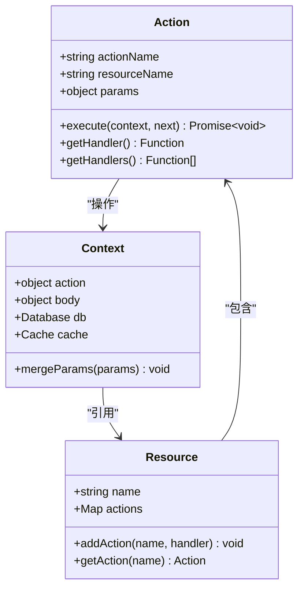
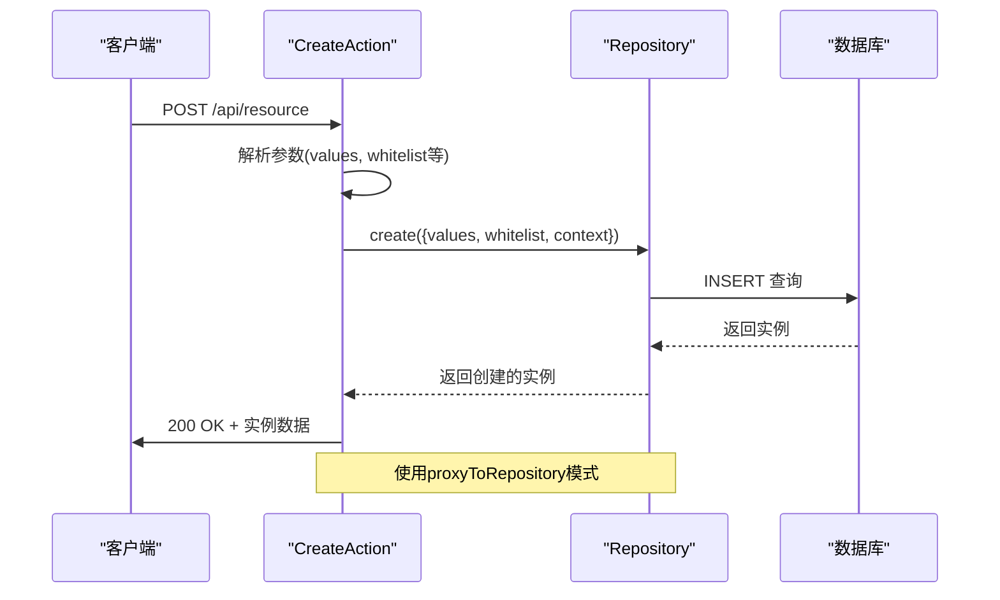
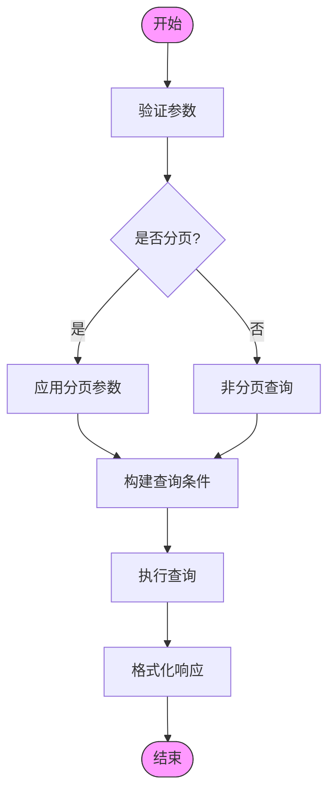
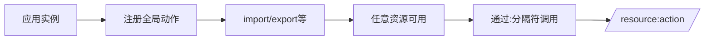
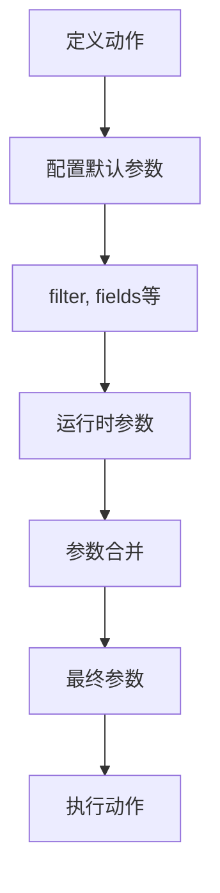
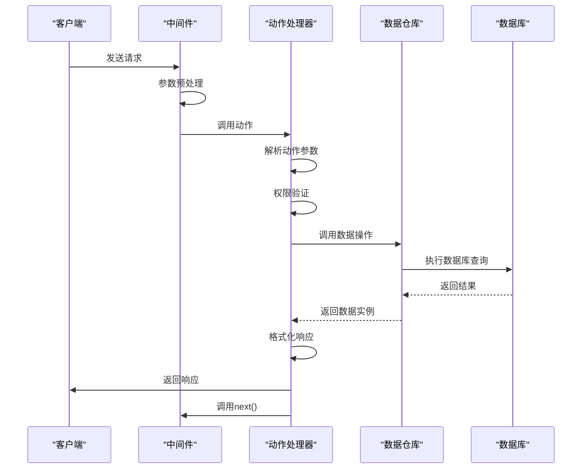
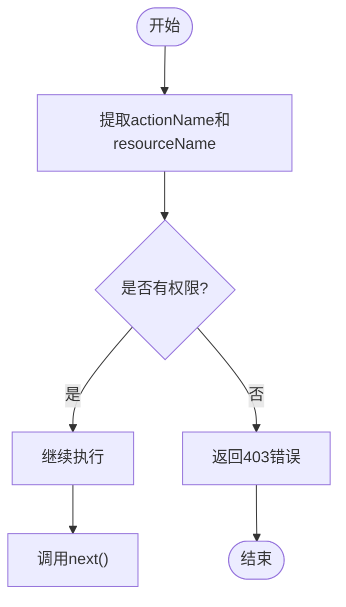

# 动作系统

<cite>
**本文档中引用的文件**  
- [create.ts](file://packages/core/actions/src/actions/create.ts)
- [update.ts](file://packages/core/actions/src/actions/update.ts)
- [destroy.ts](file://packages/core/actions/src/actions/destroy.ts)
- [get.ts](file://packages/core/actions/src/actions/get.ts)
- [list.ts](file://packages/core/actions/src/actions/list.ts)
- [proxy-to-repository.ts](file://packages/core/actions/src/actions/proxy-to-repository.ts)
- [utils.ts](file://packages/core/actions/src/utils.ts)
- [constants.ts](file://packages/core/actions/src/constants.ts)
- [index.ts](file://packages/core/actions/src/index.ts)
- [action.ts](file://packages/core/resourcer/src/action.ts)
- [resource.ts](file://packages/core/resourcer/src/resource.ts)
- [resourcer.ts](file://packages/core/resourcer/src/resourcer.ts)
- [simple.ts](file://examples/app/resource-actions/simple.ts)
- [action-with-default-options.ts](file://examples/app/resource-actions/action-with-default-options.ts)
- [global-action.ts](file://examples/app/resource-actions/global-action.ts)
- [ctx.action.mergeParams.ts](file://examples/app/context/ctx.action.mergeParams.ts)
</cite>

## 目录
1. [简介](#简介)
2. [动作类设计与实现](#动作类设计与实现)
3. 内置CRUD动作机制
4. 自定义动作定义方式
5. 动作执行流程
6. 示例与最佳实践
7. 总结

## 简介

NocoBase的动作系统是其核心功能之一，提供了一套灵活且强大的机制来封装和执行业务操作。该系统基于Koa中间件架构，通过Action类将HTTP请求映射到具体的数据操作，实现了RESTful API的标准化处理。动作系统不仅支持标准的CRUD操作，还允许开发者通过装饰器和配置对象扩展动作行为，满足复杂业务场景的需求。

**Section sources**
- [simple.ts](file://examples/app/resource-actions/simple.ts#L1-L47)

## 动作类设计与实现

NocoBase的动作系统基于`@nocobase/resourcer`包中的Action类构建。每个动作本质上是一个中间件函数，接收Koa上下文对象(ctx)和下一个中间件(next)作为参数。动作类的设计遵循单一职责原则，每个动作只负责一种特定类型的业务操作。

动作的核心实现位于`packages/core/actions`包中，通过`registerActions`函数注册所有内置动作。这些动作被组织在独立的文件中，如`create.ts`、`update.ts`等，每个文件导出一个异步函数，该函数实现了具体的业务逻辑。



**Diagram sources**
- [action.ts](file://packages/core/resourcer/src/action.ts#L353-L409)
- [resource.ts](file://packages/core/resourcer/src/resource.ts#L100-L125)
- [index.ts](file://packages/core/actions/src/index.ts#L36-L53)

**Section sources**
- [index.ts](file://packages/core/actions/src/index.ts#L1-L55)
- [action.ts](file://packages/core/resourcer/src/action.ts#L353-L409)

## 内置CRUD动作机制

NocoBase提供了完整的CRUD（创建、读取、更新、删除）动作实现，这些动作通过代理模式与数据库Repository层进行交互。每个内置动作都遵循一致的设计模式：从上下文获取参数，调用相应的Repository方法，然后将结果写入响应体。

### 创建动作 (create)

创建动作负责处理资源的新增操作。它从`ctx.action.params`中提取`values`参数，并调用Repository的`create`方法。支持白名单(whitelist)和黑名单(blacklist)机制来控制可写字段。



**Diagram sources**
- [create.ts](file://packages/core/actions/src/actions/create.ts#L13-L27)
- [proxy-to-repository.ts](file://packages/core/actions/src/actions/proxy-to-repository.ts#L14-L27)

### 读取动作 (get/list)

读取动作分为单条记录获取(get)和列表查询(list)。get动作使用`findOne`方法，支持通过`filterByTk`按主键过滤；list动作则提供分页支持，包含简单分页和完整分页两种模式。



**Diagram sources**
- [list.ts](file://packages/core/actions/src/actions/list.ts#L99-L112)
- [get.ts](file://packages/core/actions/src/actions/get.ts#L12-L15)

### 更新动作 (update)

更新动作通过`proxyToRepository`函数实现，将动作参数映射到Repository的`update`方法。支持通过`filterByTk`或`filter`指定更新条件，并可选择性地更新关联数据。

**Section sources**
- [update.ts](file://packages/core/actions/src/actions/update.ts#L12-L25)
- [proxy-to-repository.ts](file://packages/core/actions/src/actions/proxy-to-repository.ts#L14-L27)

### 删除动作 (destroy)

删除动作的实现与其他动作类似，通过`getRepositoryFromParams`获取Repository实例，然后调用`destroy`方法执行删除操作。删除结果会写入`ctx.body`返回给客户端。

**Section sources**
- [destroy.ts](file://packages/core/actions/src/actions/destroy.ts#L13-L26)

## 自定义动作定义方式

NocoBase支持多种方式定义自定义动作，包括内联定义、全局注册和带默认参数的配置。

### 内联定义

在资源定义时直接提供动作处理函数：

```mermaid
graph TD
A[定义资源] --> B[配置actions]
B --> C[内联函数]
C --> D["async (ctx, next) => {...}"]
D --> E[执行业务逻辑]
E --> F[设置ctx.body]
F --> G[调用next()]
```

**Section sources**
- [simple.ts](file://examples/app/resource-actions/simple.ts#L36-L40)

### 全局动作注册

通过`resourcer.registerActionHandlers`注册可在所有资源中使用的全局动作：



**Section sources**
- [global-action.ts](file://examples/app/resource-actions/global-action.ts#L38-L51)

### 带默认参数的动作

可以为动作配置默认参数，这些参数会在每次调用时自动合并：



**Section sources**
- [action-with-default-options.ts](file://examples/app/resource-actions/action-with-default-options.ts#L36-L46)

## 动作执行流程

NocoBase的动作执行流程是一个典型的中间件链式调用过程，包含参数解析、权限验证和结果返回等关键步骤。

### 执行流程概述



**Diagram sources**
- [resourcer.ts](file://packages/core/resourcer/src/resourcer.ts#L406-L411)
- [action.ts](file://packages/core/resourcer/src/action.ts#L384-L386)

### 参数解析机制

动作系统通过`ctx.action.params`访问请求参数，支持多种参数来源：

- URL路径参数
- 查询字符串
- 请求体(JSON)
- 中间件注入的参数

参数合并通过`ctx.action.mergeParams`方法实现，允许在中间件中动态修改动作参数。

**Section sources**
- [ctx.action.mergeParams.ts](file://examples/app/context/ctx.action.mergeParams.ts#L56-L62)

### 权限验证流程

权限验证通常在专用中间件中完成，通过检查`ctx.action`中的资源名称和动作名称来确定访问权限：



**Section sources**
- [with-acl-meta.ts](file://packages/plugins/@nocobase/plugin-acl/src/server/middlewares/with-acl-meta.ts#L72-L100)

## 示例与最佳实践

### 基本CRUD示例

```typescript
app.resource({
  name: 'posts',
  actions: {
    // 自定义列表查询
    async list(ctx, next) {
      const repository = ctx.db.getRepository('posts');
      ctx.body = await repository.find({
        filter: ctx.action.params.filter,
        appends: ['user', 'comments']
      });
      await next();
    },
    // 自定义创建逻辑
    async create(ctx, next) {
      const { values } = ctx.action.params;
      // 添加创建者信息
      values.createdById = ctx.state.currentUser.id;
      const repository = ctx.db.getRepository('posts');
      ctx.body = await repository.create({ values });
      await next();
    }
  }
});
```

### 复杂业务动作

```typescript
// 批量导入动作
app.resourcer.registerActionHandlers({
  async import(ctx, next) {
    const { file, mapping } = ctx.action.params;
    const result = await importService.process(file, mapping);
    ctx.body = result;
    await next();
  }
});
```

**Section sources**
- [simple.ts](file://examples/app/resource-actions/simple.ts#L33-L41)
- [global-action.ts](file://examples/app/resource-actions/global-action.ts#L38-L51)

## 总结

NocoBase的动作系统通过清晰的分层设计和灵活的扩展机制，为开发者提供了强大的业务操作封装能力。系统基于Koa中间件模式，将HTTP请求处理与数据操作解耦，通过Action类统一管理各种业务动作。内置的CRUD动作提供了开箱即用的标准操作，而自定义动作机制则支持复杂业务场景的实现。参数解析、权限验证和结果返回的标准化流程确保了系统的安全性和一致性。通过合理利用动作系统的各种特性，开发者可以快速构建功能丰富且易于维护的应用程序。