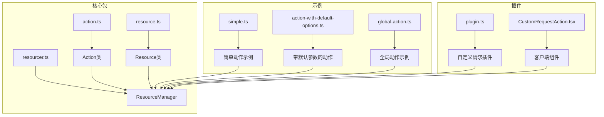
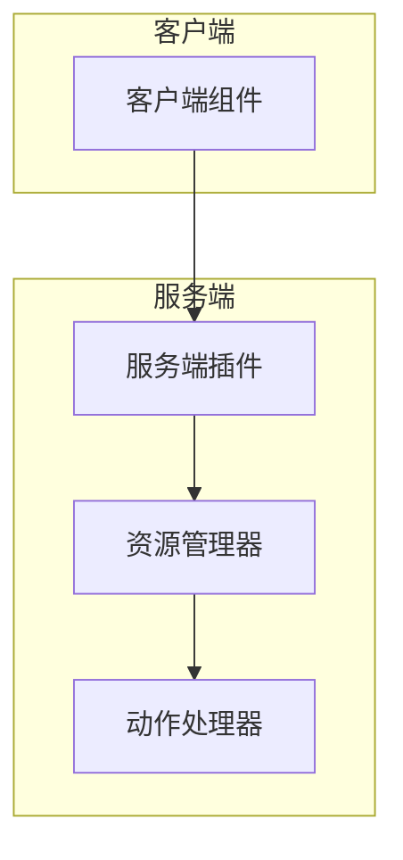
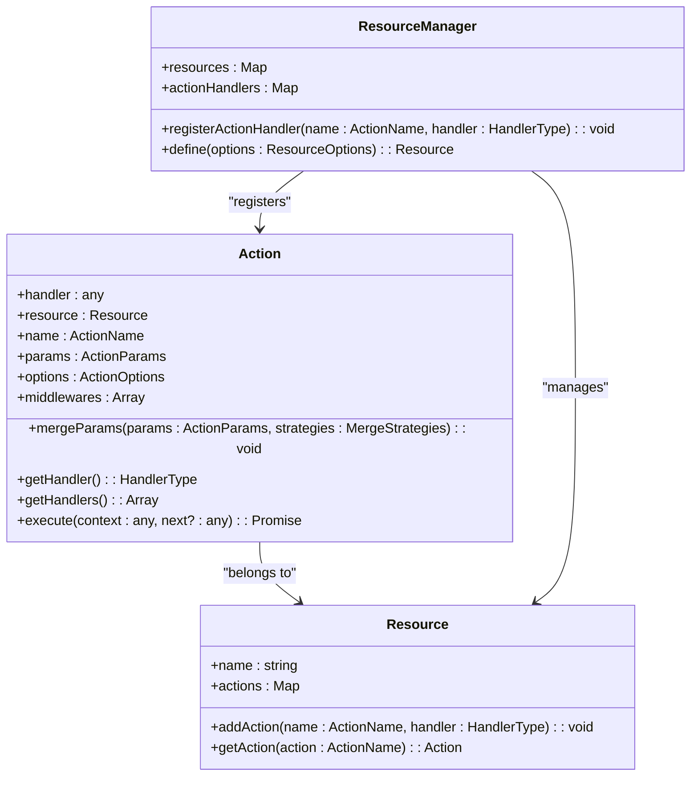
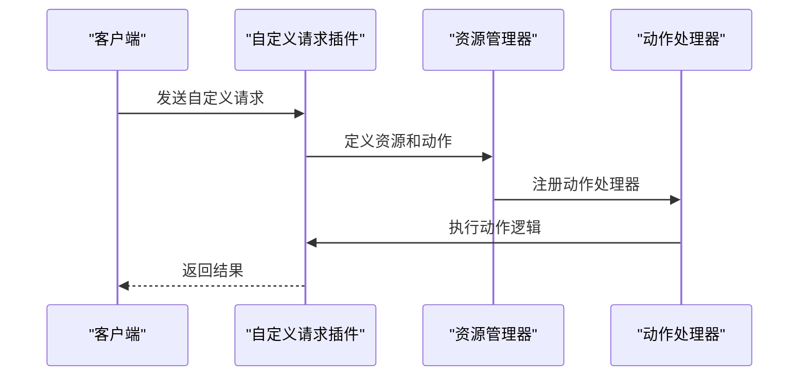
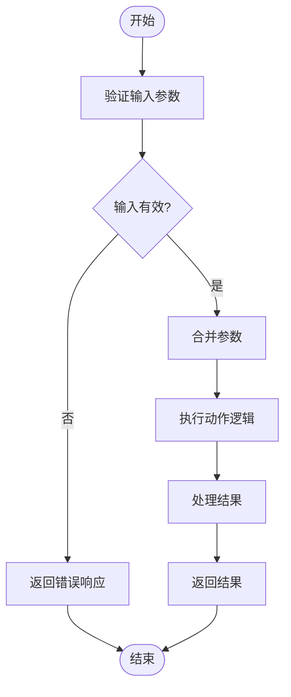
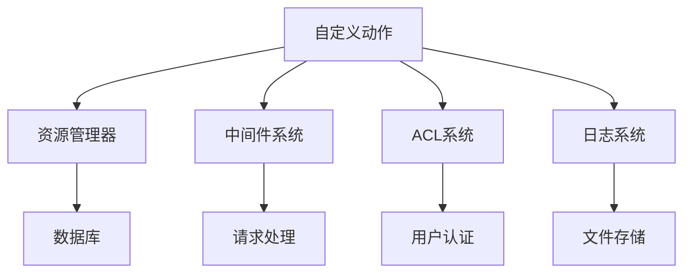

# 自定义动作

<cite>
**本文档中引用的文件**   
- [action.ts](file://packages/core/resourcer/src/action.ts)
- [resourcer.ts](file://packages/core/resourcer/src/resourcer.ts)
- [resource.ts](file://packages/core/resourcer/src/resource.ts)
- [plugin.ts](file://packages/plugins/@nocobase/plugin-action-custom-request/src/server/plugin.ts)
- [CustomRequestAction.tsx](file://packages/plugins/@nocobase/plugin-action-custom-request/src/client/components/CustomRequestAction.tsx)
- [simple.ts](file://examples/app/resource-actions/simple.ts)
- [action-with-default-options.ts](file://examples/app/resource-actions/action-with-default-options.ts)
- [global-action.ts](file://examples/app/resource-actions/global-action.ts)
- [ctx.action.ts](file://examples/app/context/ctx.action.ts)
- [ctx.action.mergeParams.ts](file://examples/app/context/ctx.action.mergeParams.ts)
</cite>

## 目录
1. [简介](#简介)
2. [项目结构](#项目结构)
3. [核心组件](#核心组件)
4. [架构概述](#架构概述)
5. [详细组件分析](#详细组件分析)
6. [依赖分析](#依赖分析)
7. [性能考虑](#性能考虑)
8. [故障排除指南](#故障排除指南)
9. [结论](#结论)
10. [附录](#附录)（如有必要）

## 简介
本文档深入探讨了NocoBase中的自定义动作功能。自定义动作是NocoBase平台中实现业务逻辑扩展的核心机制，允许开发者通过Action类定义和注册自定义业务操作。文档将详细阐述如何使用装饰器和配置对象来扩展动作行为，提供代码示例展示如何定义参数、处理业务逻辑和返回结果。同时，还将说明自定义动作与内置动作的集成方式，以及如何通过API暴露自定义动作。最后，文档将描述自定义动作的最佳实践和常见使用模式。

## 项目结构
NocoBase的自定义动作功能主要分布在核心包和插件中。核心功能位于`packages/core/resourcer`目录下，其中`action.ts`、`resourcer.ts`和`resource.ts`文件定义了动作系统的基础架构。自定义动作的实现示例可以在`examples/app/resource-actions`目录中找到，而具体的插件实现则位于`packages/plugins/@nocobase/plugin-action-custom-request`目录下。



**图表来源**
- [action.ts](file://packages/core/resourcer/src/action.ts)
- [resourcer.ts](file://packages/core/resourcer/src/resourcer.ts)
- [resource.ts](file://packages/core/resourcer/src/resource.ts)
- [simple.ts](file://examples/app/resource-actions/simple.ts)
- [action-with-default-options.ts](file://examples/app/resource-actions/action-with-default-options.ts)
- [global-action.ts](file://examples/app/resource-actions/global-action.ts)
- [plugin.ts](file://packages/plugins/@nocobase/plugin-action-custom-request/src/server/plugin.ts)
- [CustomRequestAction.tsx](file://packages/plugins/@nocobase/plugin-action-custom-request/src/client/components/CustomRequestAction.tsx)

**章节来源**
- [action.ts](file://packages/core/resourcer/src/action.ts)
- [resourcer.ts](file://packages/core/resourcer/src/resourcer.ts)
- [resource.ts](file://packages/core/resourcer/src/resource.ts)

## 核心组件
NocoBase的自定义动作系统由几个核心组件构成：Action类、ResourceManager和Resource类。Action类是自定义动作的基础，它封装了动作的处理逻辑、参数和中间件。ResourceManager负责管理所有资源和动作，提供注册和执行动作的接口。Resource类代表一个数据资源，可以定义多个动作。

**章节来源**
- [action.ts](file://packages/core/resourcer/src/action.ts)
- [resourcer.ts](file://packages/core/resourcer/src/resourcer.ts)
- [resource.ts](file://packages/core/resourcer/src/resource.ts)

## 架构概述
NocoBase的自定义动作系统采用分层架构，从上到下分别是客户端组件、服务端插件、资源管理器和动作处理器。客户端组件负责用户界面的渲染和交互，服务端插件负责业务逻辑的实现，资源管理器负责动作的注册和调度，动作处理器负责具体的业务逻辑执行。



**图表来源**
- [CustomRequestAction.tsx](file://packages/plugins/@nocobase/plugin-action-custom-request/src/client/components/CustomRequestAction.tsx)
- [plugin.ts](file://packages/plugins/@nocobase/plugin-action-custom-request/src/server/plugin.ts)
- [resourcer.ts](file://packages/core/resourcer/src/resourcer.ts)
- [action.ts](file://packages/core/resourcer/src/action.ts)

## 详细组件分析

### Action类分析
Action类是NocoBase自定义动作系统的核心，它定义了动作的基本结构和行为。Action类的主要属性包括handler（处理函数）、resource（关联资源）、name（动作名称）和params（动作参数）。Action类还提供了mergeParams方法，用于合并配置参数和运行时参数。



**图表来源**
- [action.ts](file://packages/core/resourcer/src/action.ts)
- [resource.ts](file://packages/core/resourcer/src/resource.ts)
- [resourcer.ts](file://packages/core/resourcer/src/resourcer.ts)

### 自定义请求插件分析
自定义请求插件展示了如何在NocoBase中实现一个完整的自定义动作。该插件包含服务端和客户端两部分，服务端定义了动作的处理逻辑，客户端定义了用户界面组件。



**图表来源**
- [plugin.ts](file://packages/plugins/@nocobase/plugin-action-custom-request/src/server/plugin.ts)
- [resourcer.ts](file://packages/core/resourcer/src/resourcer.ts)
- [action.ts](file://packages/core/resourcer/src/action.ts)
- [CustomRequestAction.tsx](file://packages/plugins/@nocobase/plugin-action-custom-request/src/client/components/CustomRequestAction.tsx)

### 动作参数处理分析
动作参数处理是自定义动作中的重要环节，NocoBase提供了灵活的参数合并策略。通过mergeParams方法，可以将配置参数和运行时参数进行智能合并，支持andMerge、intersect、union和overwrite等策略。



**图表来源**
- [action.ts](file://packages/core/resourcer/src/action.ts)
- [ctx.action.mergeParams.ts](file://examples/app/context/ctx.action.mergeParams.ts)

**章节来源**
- [action.ts](file://packages/core/resourcer/src/action.ts)
- [ctx.action.mergeParams.ts](file://examples/app/context/ctx.action.mergeParams.ts)

## 依赖分析
NocoBase的自定义动作系统依赖于多个核心模块，包括资源管理器、中间件系统和ACL（访问控制列表）系统。这些模块共同协作，实现了灵活的自定义动作功能。



**图表来源**
- [resourcer.ts](file://packages/core/resourcer/src/resourcer.ts)
- [middleware.ts](file://packages/core/resourcer/src/middleware.ts)
- [acl.ts](file://packages/core/acl/src/acl.ts)
- [logger.ts](file://packages/core/logger/src/index.ts)

**章节来源**
- [resourcer.ts](file://packages/core/resourcer/src/resourcer.ts)
- [middleware.ts](file://packages/core/resourcer/src/middleware.ts)
- [acl.ts](file://packages/core/acl/src/acl.ts)
- [logger.ts](file://packages/core/logger/src/index.ts)

## 性能考虑
在实现自定义动作时，需要考虑性能因素。建议使用缓存机制来减少重复计算，合理使用数据库索引以提高查询效率，并避免在动作处理逻辑中执行耗时操作。此外，可以通过异步处理来提高系统的响应速度。

## 故障排除指南
在开发和使用自定义动作时，可能会遇到一些常见问题。例如，动作无法注册、参数合并错误、权限不足等。建议检查动作名称是否冲突、参数配置是否正确、ACL权限是否设置恰当。使用日志系统可以帮助定位问题。

**章节来源**
- [action.ts](file://packages/core/resourcer/src/action.ts)
- [resourcer.ts](file://packages/core/resourcer/src/resourcer.ts)
- [acl.ts](file://packages/core/acl/src/acl.ts)
- [logger.ts](file://packages/core/logger/src/index.ts)

## 结论
NocoBase的自定义动作系统提供了一套强大而灵活的机制，使开发者能够轻松扩展平台功能。通过Action类、ResourceManager和Resource类的组合，可以实现复杂的业务逻辑。结合客户端组件和服务端插件，可以创建完整的自定义解决方案。遵循最佳实践和注意性能考虑，可以确保自定义动作的高效和稳定运行。

## 附录
### 示例代码
以下是一些自定义动作的示例代码：

```typescript
// 简单动作示例
app.resource({
  name: 'test',
  actions: {
    async list(ctx, next) {
      ctx.body = 'test list';
      await next();
    },
  },
});

// 带默认参数的动作
app.resource({
  name: 'test',
  actions: {
    find: {
      filter: {
        field1: 'value1',
      },
      handler: async (ctx, next) => {
        ctx.body = {
          'ctx.action.params': ctx.action.params,
        };
        await next();
      },
    },
  },
});

// 全局动作示例
app.resourcer.registerActionHandlers({
  async import(ctx, next) {
    ctx.body = {
      'ctx.action.params': ctx.action.params,
    };
    await next();
  },
});
```

**章节来源**
- [simple.ts](file://examples/app/resource-actions/simple.ts)
- [action-with-default-options.ts](file://examples/app/resource-actions/action-with-default-options.ts)
- [global-action.ts](file://examples/app/resource-actions/global-action.ts)