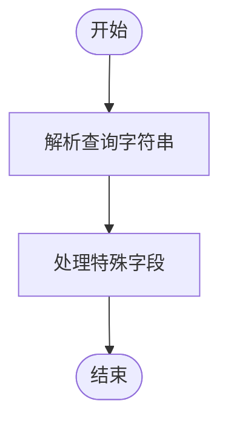
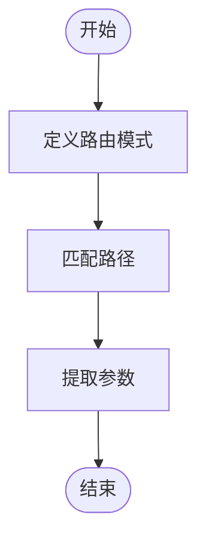
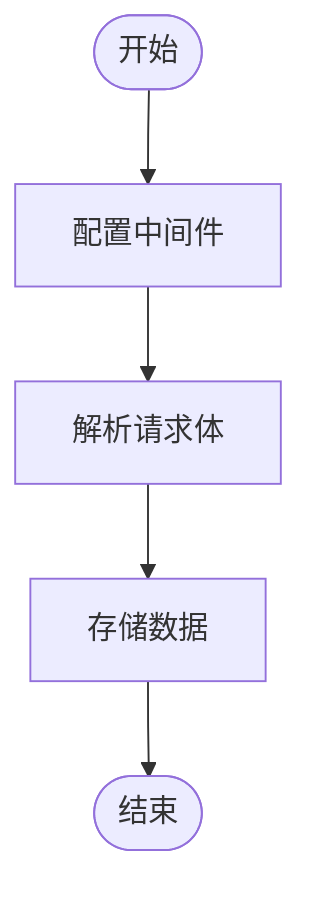
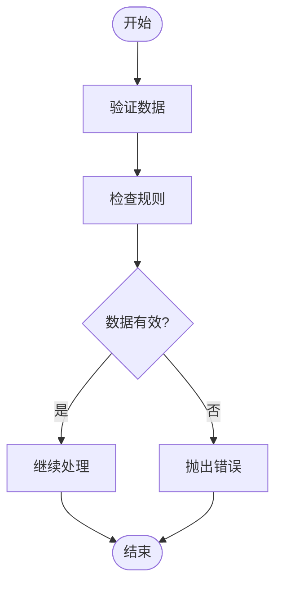

# 参数解析与验证

<cite>
**本文档中引用的文件**  
- [field-validation.ts](file://packages/core/database/src/utils/field-validation.ts)
- [utils.ts](file://packages/core/resourcer/src/utils.ts)
- [helper.ts](file://packages/core/server/src/helper.ts)
- [server.ts](file://packages/plugins/@nocobase/plugin-error-handler/src/server/server.ts)
- [fields.ts](file://packages/plugins/@nocobase/plugin-data-source-main/src/server/collections/fields.ts)
- [json-value-parser.ts](file://packages/core/database/src/value-parsers/json-value-parser.ts)
</cite>

## 目录
1. [简介](#简介)
2. [参数解析流程](#参数解析流程)
3. [验证机制](#验证机制)
4. [数据格式处理](#数据格式处理)
5. [自定义验证器](#自定义验证器)
6. [错误响应与本地化](#错误响应与本地化)
7. [性能优化建议](#性能优化建议)

## 简介
NocoBase 是一个低代码开发平台，提供了强大的参数解析与验证功能。本文档详细说明了查询参数、路径参数和请求体数据的解析流程，描述了验证规则的定义和执行机制，解释了如何处理不同类型的数据格式（如JSON、表单数据），并提供了自定义验证器的实现方法和最佳实践。此外，文档还涵盖了错误响应格式和验证消息本地化的处理方式，以及性能优化建议。

## 参数解析流程

### 查询参数解析
NocoBase 使用 `qs` 库来解析查询参数，支持复杂的查询字符串，包括数组和嵌套对象。查询参数解析的主要步骤如下：

1. **解析查询字符串**：使用 `qs.parse` 方法将查询字符串转换为 JavaScript 对象。
2. **处理特殊字段**：对于 `filter` 字段，如果其值为字符串，则尝试将其解析为 JSON 对象。



**Diagram sources**
- [utils.ts](file://packages/core/resourcer/src/utils.ts#L216-L230)

### 路径参数解析
路径参数解析通过 `path-to-regexp` 库实现，支持动态路由匹配。路径参数解析的主要步骤如下：

1. **定义路由模式**：在路由配置中定义路径模式，例如 `/users/:id`。
2. **匹配路径**：使用 `path-to-regexp` 将路径模式转换为正则表达式，并匹配实际请求路径。
3. **提取参数**：从匹配结果中提取路径参数。



**Diagram sources**
- [utils.ts](file://packages/core/resourcer/src/utils.ts#L180-L193)

### 请求体数据解析
请求体数据解析通过 `koa-bodyparser` 中间件实现，支持多种数据格式，包括 JSON、表单数据和文本。请求体数据解析的主要步骤如下：

1. **配置中间件**：在应用配置中启用 `koa-bodyparser` 中间件，并设置相应的限制。
2. **解析请求体**：中间件自动解析请求体数据，并将其存储在 `ctx.request.body` 中。



**Diagram sources**
- [helper.ts](file://packages/core/server/src/helper.ts#L70-L77)

## 验证机制

### 验证规则定义
NocoBase 使用 `Joi` 库来定义和执行验证规则。验证规则可以在字段定义中指定，支持多种验证类型，如 `required`、`min`、`max` 等。

```typescript
import Joi from 'joi';

const schema = Joi.object({
  name: Joi.string().required(),
  age: Joi.number().min(18).max(100),
  email: Joi.string().email(),
});
```

### 验证规则执行
验证规则在数据处理过程中自动执行。如果数据不符合验证规则，将抛出相应的错误。



**Diagram sources**
- [field-validation.ts](file://packages/core/database/src/utils/field-validation.ts#L14-L56)

## 数据格式处理

### JSON 数据处理
NocoBase 支持 JSON 数据的解析和验证。JSON 数据可以通过 `ctx.request.body` 获取，并使用 `Joi` 进行验证。

```typescript
const data = ctx.request.body;
const { error, value } = schema.validate(data);
if (error) {
  ctx.throw(400, error.message);
}
```

### 表单数据处理
表单数据通过 `koa-bodyparser` 中间件解析，支持 `application/x-www-form-urlencoded` 和 `multipart/form-data` 格式。表单数据同样可以使用 `Joi` 进行验证。

```typescript
const data = ctx.request.body;
const { error, value } = schema.validate(data);
if (error) {
  ctx.throw(400, error.message);
}
```

## 自定义验证器

### 实现自定义验证器
用户可以实现自定义验证器，以满足特定的业务需求。自定义验证器可以通过扩展 `Joi` 的验证规则来实现。

```typescript
Joi.extend((joi) => ({
  type: 'custom',
  base: joi.string(),
  messages: {
    'custom.special': '{{#label}} must be a special string',
  },
  rules: {
    special: {
      validate(value, helpers) {
        if (!value.includes('special')) {
          return helpers.error('custom.special');
        }
        return value;
      },
    },
  },
}));

const schema = Joi.object({
  name: Joi.string().custom().special(),
});
```

### 最佳实践
- **复用验证规则**：尽量复用已有的验证规则，避免重复定义。
- **清晰的错误消息**：提供清晰的错误消息，帮助用户理解问题所在。
- **性能考虑**：避免在验证规则中进行耗时的操作，确保验证过程高效。

## 错误响应与本地化

### 错误响应格式
NocoBase 的错误响应格式统一，包含错误消息和状态码。错误响应示例如下：

```json
{
  "errors": [
    {
      "message": "Name is required"
    }
  ]
}
```

### 验证消息本地化
NocoBase 支持多语言，验证消息可以通过 `i18next` 进行本地化。本地化文件位于 `locales` 目录下，支持多种语言。

```json
{
  "Validation error": "{{field}} validation error",
  "notNull Violation": "{{field}} cannot be null",
  "unique violation": "{{field}} already exists"
}
```

**Section sources**
- [server.ts](file://packages/plugins/@nocobase/plugin-error-handler/src/server/server.ts#L47-L64)
- [en-US.json](file://packages/plugins/@nocobase/plugin-error-handler/src/locale/en-US.json)

## 性能优化建议

### 预编译验证模式
预编译验证模式可以提高验证性能。在应用启动时，可以预先编译常用的验证模式，避免在每次请求时重新编译。

```typescript
const compiledSchema = schema.compile();
```

### 缓存验证结果
对于频繁使用的验证结果，可以使用缓存来减少重复计算。NocoBase 提供了 `cache-manager` 模块，支持内存和 Redis 缓存。

```typescript
const cache = app.cacheManager.getCache('validation');
const result = await cache.get(key);
if (result) {
  return result;
}
const validationResult = await validate(data);
await cache.set(key, validationResult);
return validationResult;
```

**Section sources**
- [cache-manager.ts](file://packages/core/cache/src/cache-manager.ts#L115-L139)