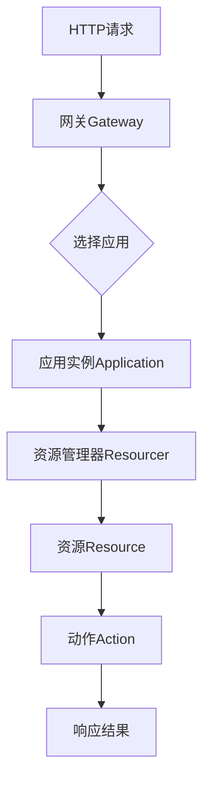
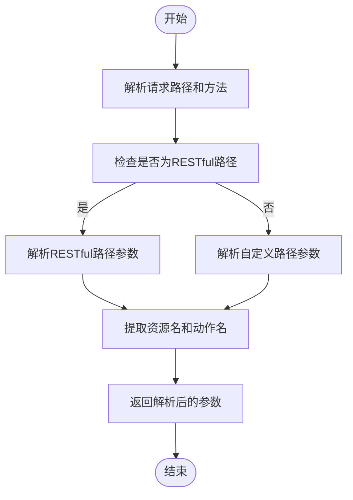
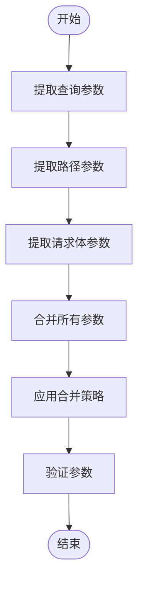
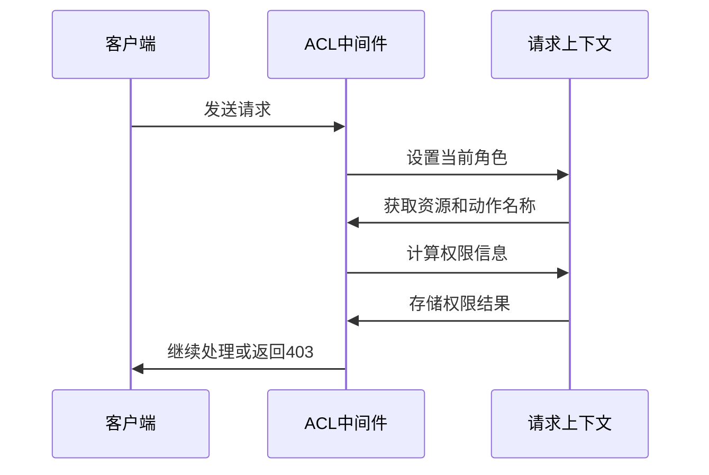
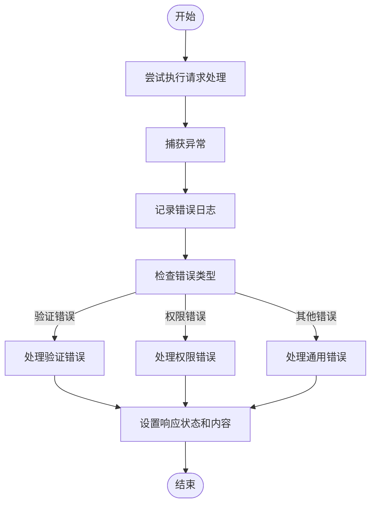
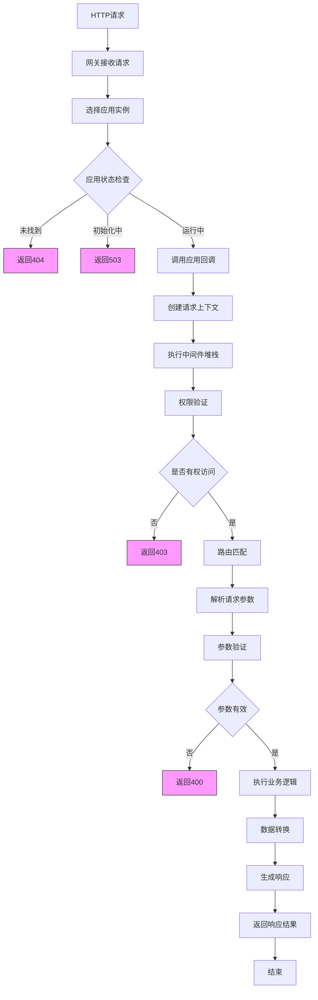

# 请求处理流程

<cite>
**本文档引用的文件**
- [application.ts](file://packages/core/server/src/application.ts)
- [gateway/index.ts](file://packages/core/server/src/gateway/index.ts)
- [resourcer.ts](file://packages/core/resourcer/src/resourcer.ts)
- [action.ts](file://packages/core/resourcer/src/action.ts)
- [utils.ts](file://packages/core/resourcer/src/utils.ts)
- [validate-filter-params.ts](file://packages/core/server/src/middlewares/validate-filter-params.ts)
- [middleware.ts](file://packages/core/resourcer/src/middleware.ts)
- [error-handler.ts](file://packages/plugins/@nocobase/plugin-error-handler/src/server/error-handler.ts)
- [acl.ts](file://packages/core/acl/src/acl.ts)
- [skip-middleware.ts](file://packages/core/acl/src/skip-middleware.ts)
</cite>

## 目录
1. [简介](#简介)
2. [请求处理架构](#请求处理架构)
3. [核心组件分析](#核心组件分析)
4. [路由匹配机制](#路由匹配机制)
5. [请求参数解析与验证](#请求参数解析与验证)
6. [权限验证流程](#权限验证流程)
7. [数据转换与错误处理](#数据转换与错误处理)
8. [请求处理流程图](#请求处理流程图)
9. [性能优化建议](#性能优化建议)
10. [总结](#总结)

## 简介
NocoBase的请求处理流程是一个基于Koa框架构建的复杂系统，它通过多层中间件和资源管理器来处理HTTP请求。该流程从接收HTTP请求开始，经过应用选择、路由匹配、参数解析、权限验证、数据处理等多个阶段，最终返回响应结果。本文档将深入分析这一完整流程，阐述各个阶段的执行顺序和相互关系。

## 请求处理架构

NocoBase的请求处理架构采用分层设计，主要由网关(Gateway)、应用(Application)、资源管理器(Resourcer)和动作(Action)四个核心组件构成。网关作为入口点接收所有HTTP请求，根据请求信息选择合适的应用实例进行处理。应用实例包含完整的业务逻辑和数据访问能力，通过资源管理器来组织和管理各种资源及其操作。

**Diagram sources**
- [gateway/index.ts](file://packages/core/server/src/gateway/index.ts#L70-L533)
- [application.ts](file://packages/core/server/src/application.ts#L217-L1423)
- [resourcer.ts](file://packages/core/resourcer/src/resourcer.ts#L161-L430)

## 核心组件分析

NocoBase的请求处理流程依赖于多个核心组件的协同工作。网关组件负责接收和分发请求，应用组件管理整个应用的生命周期和配置，资源管理器负责路由匹配和资源调度，而动作组件则执行具体的业务逻辑。

### 网关组件
网关是NocoBase系统的入口点，负责监听HTTP请求并将其分发到相应的应用实例。它通过`requestHandler`方法处理每个传入的请求，首先确定要处理请求的应用名称，然后调用该应用的回调函数进行进一步处理。

**Section sources**
- [gateway/index.ts](file://packages/core/server/src/gateway/index.ts#L241-L339)

### 应用组件
应用组件是NocoBase的核心，它继承自Koa框架并扩展了大量功能。每个应用实例都包含数据库连接、缓存管理、插件系统等组件。应用的`callback`方法返回一个函数，该函数会创建上下文并调用中间件堆栈来处理请求。

**Section sources**
- [application.ts](file://packages/core/server/src/application.ts#L568-L579)

### 资源管理器组件
资源管理器是连接HTTP请求和业务逻辑的桥梁。它通过`middleware`方法创建一个中间件函数，该函数负责解析请求路径和方法，匹配相应的资源和动作，并执行相关的处理逻辑。

**Section sources**
- [resourcer.ts](file://packages/core/resourcer/src/resourcer.ts#L311-L392)

## 路由匹配机制

NocoBase的路由匹配机制基于资源管理器实现，它通过解析请求路径和方法来定位对应的资源和动作。这一过程主要在`resourcer.middleware`中完成，涉及路径解析、资源查找和动作匹配三个关键步骤。

### 路径解析
路径解析是路由匹配的第一步，它将HTTP请求的路径和方法转换为结构化的参数对象。`parseRequest`函数负责这一转换，它支持多种URL模式，包括RESTful风格的路径和自定义的资源路径。

**Diagram sources**
- [utils.ts](file://packages/core/resourcer/src/utils.ts#L55-L214)

### 资源查找
在完成路径解析后，系统需要根据解析出的资源名称查找对应的资源实例。`ResourceManager.getResource`方法负责这一查找过程，它从内部的资源映射中获取指定名称的资源对象。

**Section sources**
- [resourcer.ts](file://packages/core/resourcer/src/resourcer.ts#L279-L284)

### 动作匹配
找到资源实例后，系统需要匹配具体的动作。`ResourceManager.getAction`方法根据资源名称和动作名称获取对应的动作实例。这个过程支持局部动作和全局动作的优先级匹配。

**Section sources**
- [resourcer.ts](file://packages/core/resourcer/src/resourcer.ts#L289-L295)

## 请求参数解析与验证

NocoBase对请求参数的处理包括查询参数、路径参数和请求体的解析与验证。这一过程确保了传入数据的完整性和安全性，为后续的业务逻辑处理提供了可靠的数据基础。

### 参数解析
参数解析主要在`Action.mergeParams`方法中完成，它将来自不同来源的参数（查询参数、路径参数、请求体）合并到一个统一的参数对象中。系统使用`assign`函数进行深度合并，并根据不同的参数类型应用相应的合并策略。

**Diagram sources**
- [action.ts](file://packages/core/resourcer/src/action.ts#L289-L308)

### 参数验证
参数验证是确保数据安全的重要环节。NocoBase提供了`validateFilterParams`中间件来验证过滤参数，防止恶意查询。该中间件检查`filter`和`filterByTk`参数的存在性和有效性，对于更新和删除操作尤其严格。

**Section sources**
- [validate-filter-params.ts](file://packages/core/server/src/middlewares/validate-filter-params.ts#L12-L31)

## 权限验证流程

NocoBase的权限验证流程集成在请求处理的早期阶段，确保只有经过授权的用户才能访问特定资源。权限系统基于角色访问控制(RBAC)模型，通过一系列中间件来实现细粒度的权限管理。

### 权限中间件
权限验证主要通过`acl.middleware`实现，该中间件在请求上下文中设置权限相关信息，包括当前角色、可执行的操作等。系统通过`ctx.can`方法检查用户是否有权执行特定操作。

**Diagram sources**
- [acl.ts](file://packages/core/acl/src/acl.ts#L381-L418)

### 权限跳过机制
在某些情况下，系统需要跳过权限检查，例如系统内部调用或特定的公开接口。`skip`函数提供了这一机制，它通过在上下文中设置`skip: true`来绕过权限验证。

**Section sources**
- [skip-middleware.ts](file://packages/core/acl/src/skip-middleware.ts#L10-L20)

## 数据转换与错误处理

NocoBase在请求处理过程中实现了完善的数据转换和错误处理机制，确保数据的一致性和系统的稳定性。

### 数据转换
数据转换主要通过`data-wrapping`中间件实现，它将响应数据包装在统一的结构中，便于前端处理。系统还支持基于模板的数据转换，允许在响应前对数据进行动态处理。

**Section sources**
- [application.ts](file://packages/core/server/src/application.ts#L1338-L1339)

### 错误处理
错误处理是NocoBase健壮性的关键。系统通过`error-handler`插件捕获和处理各种异常情况，提供统一的错误响应格式。错误处理器会记录错误日志，并根据错误类型返回适当的HTTP状态码和错误信息。

**Diagram sources**
- [error-handler.ts](file://packages/plugins/@nocobase/plugin-error-handler/src/server/error-handler.ts#L52-L67)

## 请求处理流程图

以下是NocoBase请求处理的完整流程图，展示了从HTTP请求接收到响应返回的各个阶段和状态转换。

**Diagram sources**
- [gateway/index.ts](file://packages/core/server/src/gateway/index.ts#L241-L339)
- [application.ts](file://packages/core/server/src/application.ts#L568-L579)
- [resourcer.ts](file://packages/core/resourcer/src/resourcer.ts#L311-L392)
- [error-handler.ts](file://packages/plugins/@nocobase/plugin-error-handler/src/server/error-handler.ts#L52-L67)

## 性能优化建议

为了提高NocoBase系统的性能，可以采取以下优化措施：

### 缓存策略
实施多层次的缓存策略可以显著提升系统性能。建议在以下几个层面实现缓存：

1. **HTTP缓存**：对静态资源和API响应启用HTTP缓存头
2. **应用级缓存**：使用Redis等内存数据库缓存频繁访问的数据
3. **查询缓存**：对复杂的数据库查询结果进行缓存
4. **模板缓存**：缓存渲染后的页面模板

**Section sources**
- [application.ts](file://packages/core/server/src/application.ts#L374-L385)

### 异步处理
对于耗时较长的操作，建议采用异步处理模式：

1. **消息队列**：将非关键操作放入消息队列异步执行
2. **批处理**：对批量操作进行优化，减少数据库交互次数
3. **预加载**：在系统空闲时预加载常用数据
4. **懒加载**：延迟加载非必要数据，减少初始响应时间

**Section sources**
- [application.ts](file://packages/core/server/src/application.ts#L82-L83)

### 数据库优化
数据库是性能瓶颈的常见来源，建议采取以下优化措施：

1. **索引优化**：为常用查询字段创建适当的索引
2. **查询优化**：避免N+1查询问题，使用批量查询
3. **连接池**：合理配置数据库连接池大小
4. **读写分离**：对读密集型操作实现读写分离

## 总结
NocoBase的请求处理流程是一个精心设计的系统，它通过分层架构和模块化设计实现了高内聚、低耦合的特性。从网关的请求分发到应用的业务逻辑执行，再到资源管理器的路由匹配和动作执行，每个环节都经过精心设计和优化。完善的权限验证、参数处理和错误处理机制确保了系统的安全性和稳定性。通过合理的缓存策略和异步处理，系统能够应对高并发场景，提供良好的用户体验。