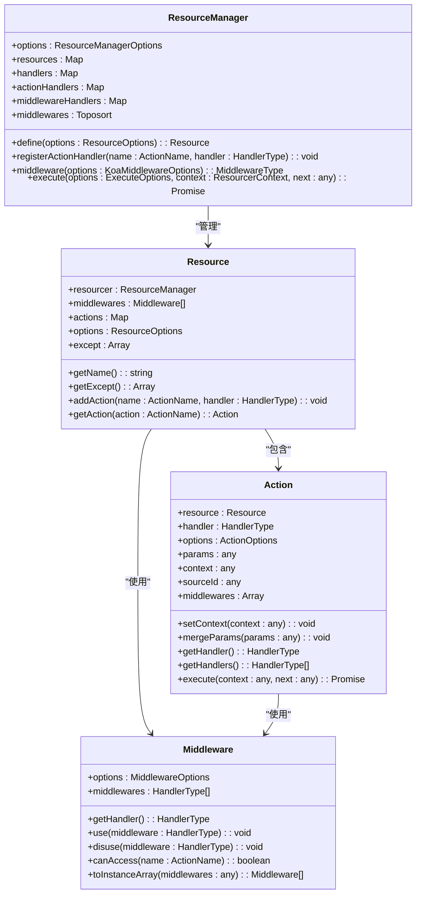
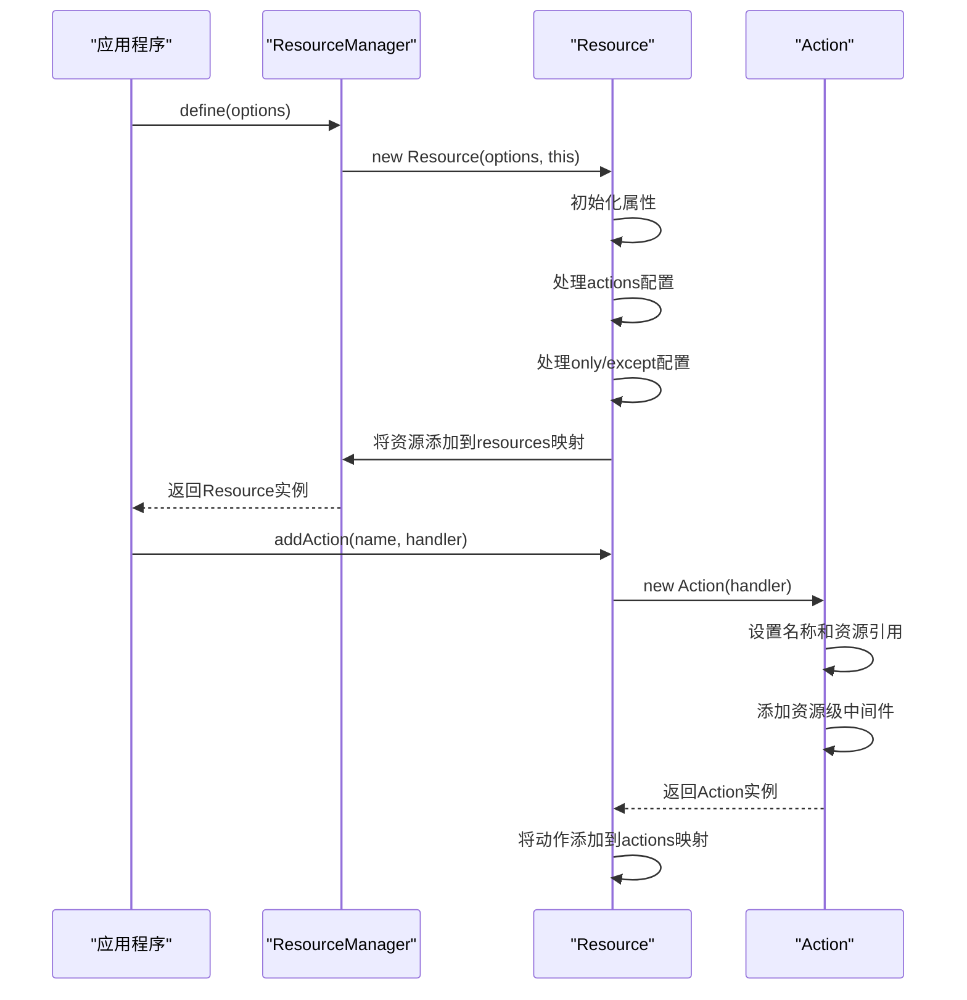
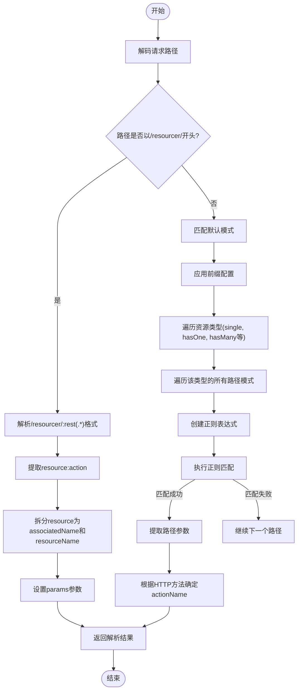
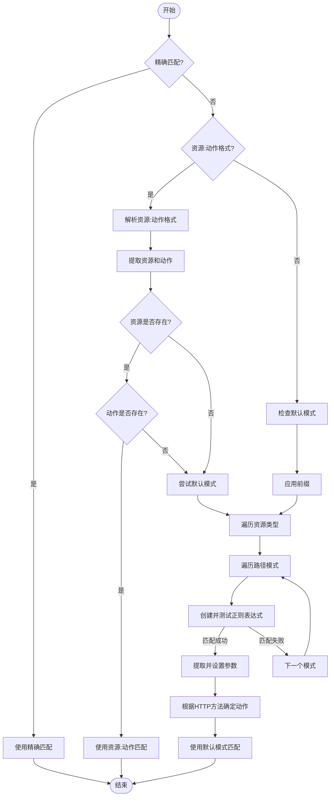
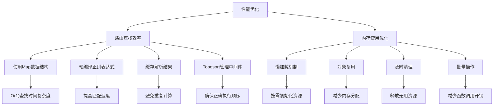

# 路由匹配机制

<cite>
**本文档中引用的文件**   
- [resource.ts](file://packages/core/resourcer/src/resource.ts)
- [action.ts](file://packages/core/resourcer/src/action.ts)
- [resourcer.ts](file://packages/core/resourcer/src/resourcer.ts)
- [utils.ts](file://packages/core/resourcer/src/utils.ts)
- [middleware.ts](file://packages/core/resourcer/src/middleware.ts)
- [resourcer.test.ts](file://packages/core/resourcer/src/__tests__/resourcer.test.ts)
- [utils.test.ts](file://packages/core/resourcer/src/__tests__/utils.test.ts)
- [resourcer.md](file://packages/core/resourcer/README.md)
- [resourcer.ts](file://packages/core/app/src/config/resourcer.ts)
- [resourcer.ts](file://packages/core/resourcer/src/index.ts)
</cite>

## 目录
1. [介绍](#介绍)
2. [核心组件](#核心组件)
3. [路由注册过程](#路由注册过程)
4. [HTTP请求路径映射](#http请求路径映射)
5. [路由优先级与冲突解决](#路由优先级与冲突解决)
6. [命名约定与URL模式](#命名约定与url模式)
7. [性能考虑因素](#性能考虑因素)
8. [最佳实践](#最佳实践)
9. [结论](#结论)

## 介绍

NocoBase的路由匹配机制是基于资源和动作的系统，它提供了一种结构化的方式来处理HTTP请求。该系统通过将请求路径映射到相应的资源处理器和动作处理器来实现功能。路由系统支持多种资源类型（如单个资源、一对一、一对多等）以及丰富的动作类型（如列表、创建、获取、更新、删除等）。本文档将深入探讨这一机制的工作原理、实现细节以及最佳实践。

**Section sources**
- [resourcer.md](file://packages/core/resourcer/README.md)

## 核心组件

NocoBase的路由系统由几个核心组件构成：ResourceManager、Resource、Action和Middleware。这些组件共同协作以实现灵活且强大的路由功能。

**Diagram sources **
- [resourcer.ts](file://packages/core/resourcer/src/resourcer.ts#L161-L429)
- [resource.ts](file://packages/core/resourcer/src/resource.ts#L61-L125)
- [action.ts](file://packages/core/resourcer/src/action.ts#L233-L409)
- [middleware.ts](file://packages/core/resourcer/src/middleware.ts#L33-L92)

## 路由注册过程

路由注册是NocoBase路由系统的基础。通过ResourceManager的define方法，可以定义新的资源及其相关动作。每个资源可以配置多个动作处理器，并且支持全局和局部中间件。

**Diagram sources **
- [resourcer.ts](file://packages/core/resourcer/src/resourcer.ts#L211-L216)
- [resource.ts](file://packages/core/resourcer/src/resource.ts#L72-L90)
- [action.ts](file://packages/core/resourcer/src/action.ts#L243-L253)

## HTTP请求路径映射

NocoBase的路由系统通过parseRequest函数将HTTP请求路径映射到相应的资源和动作。该过程涉及解析请求路径、提取资源名称、关联名称、资源索引以及动作名称。

**Diagram sources **
- [utils.ts](file://packages/core/resourcer/src/utils.ts#L55-L214)
- [resourcer.ts](file://packages/core/resourcer/src/resourcer.ts#L324-L339)

## 路由优先级与冲突解决

NocoBase的路由系统通过一系列规则来处理路由优先级和冲突。系统首先尝试精确匹配，然后按照特定顺序检查不同类型的路由模式。当存在多个可能的匹配时，系统会根据预定义的优先级规则选择最合适的路由。

**Diagram sources **
- [utils.ts](file://packages/core/resourcer/src/utils.ts#L55-L214)
- [resourcer.ts](file://packages/core/resourcer/src/resourcer.ts#L324-L360)

## 命名约定与URL模式

NocoBase遵循一套清晰的命名约定和URL模式，以确保路由的一致性和可预测性。这些约定涵盖了资源命名、动作命名、路径结构等方面。

### 资源命名约定
- 使用小写字母和连字符(-)分隔单词
- 避免使用特殊字符和空格
- 推荐使用复数形式表示集合资源
- 关联资源使用点号(.)连接，如`posts.comments`

### 动作命名约定
- 标准CRUD动作：list, create, get, update, delete
- 关联操作动作：add, set, remove
- 自定义动作：使用描述性名称，如export, import, duplicate

### URL模式
| 资源类型 | URL模式 | HTTP方法 | 对应动作 |
|---------|--------|--------|--------|
| 单个资源 | /:resourceName | GET | list |
| 单个资源 | /:resourceName | POST | create |
| 单个资源 | /:resourceName/:resourceIndex | GET | get |
| 单个资源 | /:resourceName/:resourceIndex | PUT/PATCH | update |
| 单个资源 | /:resourceName/:resourceIndex | DELETE | delete |
| 一对多 | /:associatedName/:associatedIndex/:resourceName | GET | list |
| 一对多 | /:associatedName/:associatedIndex/:resourceName | POST | create |
| 一对多 | /:associatedName/:associatedIndex/:resourceName/:resourceIndex | GET | get |
| 一对多 | /:associatedName/:associatedIndex/:resourceName/:resourceIndex | PUT/PATCH | update |
| 一对多 | /:associatedName/:associatedIndex/:resourceName/:resourceIndex | DELETE | delete |
| 多对多 | /:associatedName/:associatedIndex/:resourceName | GET | list |
| 多对多 | /:associatedName/:associatedIndex/:resourceName | POST | set |
| 多对多 | /:associatedName/:associatedIndex/:resourceName/:resourceIndex | GET | get |
| 多对多 | /:associatedName/:associatedIndex/:resourceName/:resourceIndex | POST | add |
| 多对多 | /:associatedName/:associatedIndex/:resourceName/:resourceIndex | PUT/PATCH | update |
| 多对多 | /:associatedName/:associatedIndex/:resourceName/:resourceIndex | DELETE | remove |

**Section sources**
- [utils.ts](file://packages/core/resourcer/src/utils.ts#L55-L214)
- [resourcer.test.ts](file://packages/core/resourcer/src/__tests__/utils.test.ts#L107-L378)

## 性能考虑因素

NocoBase的路由系统在设计时充分考虑了性能优化，包括路由查找效率和内存使用优化。

### 路由查找效率
- 使用Map数据结构存储资源和动作，提供O(1)的查找时间复杂度
- 预编译正则表达式以提高匹配速度
- 缓存解析结果以避免重复计算
- 使用Toposort管理中间件依赖关系，确保正确的执行顺序

### 内存使用优化
- 懒加载机制：只有在需要时才初始化资源
- 对象复用：通过clone方法复用Action实例
- 及时清理：移除不再使用的资源和中间件
- 批量操作：支持批量导入和注册，减少函数调用开销

**Diagram sources **
- [resourcer.ts](file://packages/core/resourcer/src/resourcer.ts#L166-L173)
- [utils.ts](file://packages/core/resourcer/src/utils.ts#L71-L85)
- [action.ts](file://packages/core/resourcer/src/action.ts#L271-L280)

## 最佳实践

为了充分利用NocoBase的路由系统，建议遵循以下最佳实践：

### 路由组织
- 按功能模块组织路由，保持清晰的结构
- 使用一致的命名约定，提高可读性
- 合理划分资源边界，避免过度耦合
- 利用前缀配置隔离不同版本的API

### 中间件使用
- 全局中间件用于跨切面关注点（如日志、认证）
- 资源级中间件用于特定资源的通用逻辑
- 动作级中间件用于特定动作的特殊处理
- 合理使用only和except选项控制中间件应用范围

### 错误处理
- 统一的错误响应格式
- 详细的错误信息（仅在开发环境）
- 适当的HTTP状态码
- 记录错误日志以便调试

### 安全考虑
- 输入验证和清理
- 权限控制
- 防止常见Web攻击（如XSS、CSRF）
- 敏感信息保护

**Section sources**
- [resourcer.ts](file://packages/core/resourcer/src/resourcer.ts)
- [middleware.ts](file://packages/core/resourcer/src/middleware.ts)
- [action.ts](file://packages/core/resourcer/src/action.ts)

## 结论

NocoBase的路由匹配机制提供了一个强大而灵活的系统，用于处理基于资源和动作的HTTP请求。通过深入理解其核心组件、注册过程、路径映射机制、优先级规则以及性能优化策略，开发者可以更有效地利用这一系统构建高效、可维护的应用程序。遵循最佳实践不仅可以提高开发效率，还能确保系统的稳定性和安全性。