# 错误处理流程

<cite>
**本文档引用的文件**
- [error-handler.ts](file://packages/plugins/@nocobase/plugin-error-handler/src/server/error-handler.ts)
- [server.ts](file://packages/plugins/@nocobase/plugin-error-handler/src/server/server.ts)
- [APIClient.ts](file://packages/core/client/src/api-client/APIClient.ts)
- [system-logger.ts](file://packages/core/logger/src/system-logger.ts)
- [no-permission-error.ts](file://packages/core/acl/src/errors/no-permission-error.ts)
- [application-not-install.ts](file://packages/core/server/src/errors/application-not-install.ts)
- [plugin-command-error.ts](file://packages/core/server/src/errors/plugin-command-error.ts)
- [handler.ts](file://packages/core/server/src/errors/handler.ts)
- [index.ts](file://packages/plugins/@nocobase/plugin-error-handler/src/index.ts)
- [error.ts](file://packages/plugins/@nocobase/plugin-user-data-sync/src/server/error.ts)
- [errors.ts](file://packages/core/gateway/errors.ts)
</cite>

## 目录
1. [简介](#简介)
2. [错误处理架构](#错误处理架构)
3. [核心组件分析](#核心组件分析)
4. [错误分类与处理策略](#错误分类与处理策略)
5. [错误日志记录与监控集成](#错误日志记录与监控集成)
6. [自定义错误处理器实现](#自定义错误处理器实现)
7. [错误响应格式规范](#错误响应格式规范)
8. [安全考虑](#安全考虑)
9. [性能影响分析与优化建议](#性能影响分析与优化建议)
10. [结论](#结论)

## 简介
NocoBase的错误处理机制是一个全面的系统，负责从异常捕获到响应生成的完整流程。该机制通过插件化架构实现了灵活的错误处理策略，支持多种错误类型（如验证错误、权限错误、系统错误）的分类和处理。系统集成了日志记录和监控功能，并提供了自定义错误处理器的实现方法。本文档详细阐述了NocoBase的错误处理流程，包括其架构设计、核心组件、处理策略、日志记录、安全考虑以及性能优化建议。

## 错误处理架构

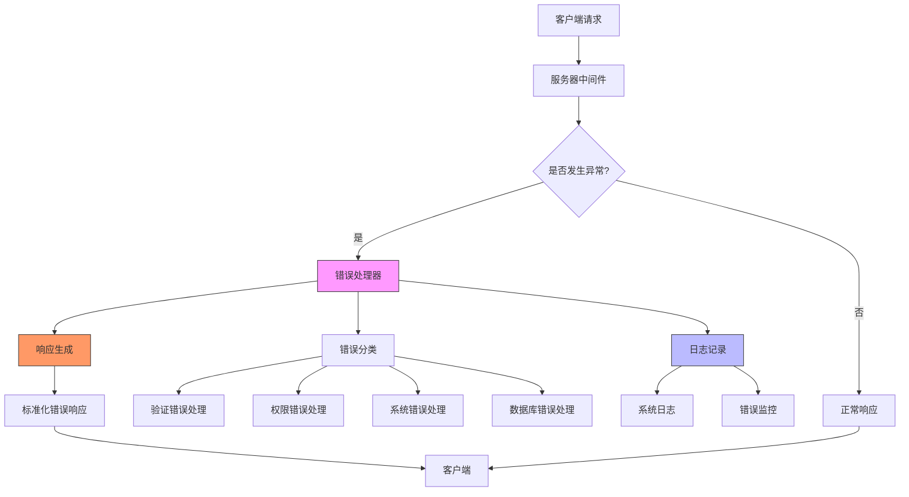

**图表来源**
- [error-handler.ts](file://packages/plugins/@nocobase/plugin-error-handler/src/server/error-handler.ts#L10-L68)
- [server.ts](file://packages/plugins/@nocobase/plugin-error-handler/src/server/server.ts#L16-L102)

**本节来源**
- [error-handler.ts](file://packages/plugins/@nocobase/plugin-error-handler/src/server/error-handler.ts#L1-L68)
- [server.ts](file://packages/plugins/@nocobase/plugin-error-handler/src/server/server.ts#L1-L102)

## 核心组件分析

### 错误处理器组件

NocoBase的错误处理核心是`ErrorHandler`类，它实现了可扩展的错误处理机制。该处理器通过注册机制支持多种错误处理策略，能够根据错误类型选择合适的处理方式。

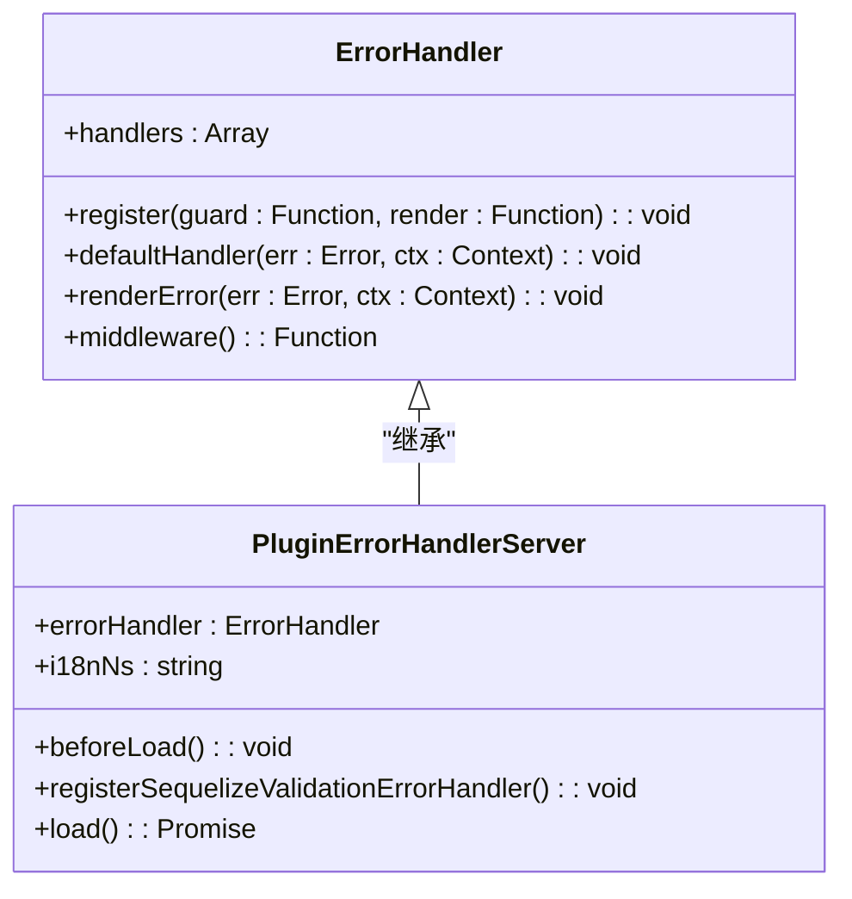

**图表来源**
- [error-handler.ts](file://packages/plugins/@nocobase/plugin-error-handler/src/server/error-handler.ts#L10-L68)
- [server.ts](file://packages/plugins/@nocobase/plugin-error-handler/src/server/server.ts#L16-L102)

### 错误处理中间件流程

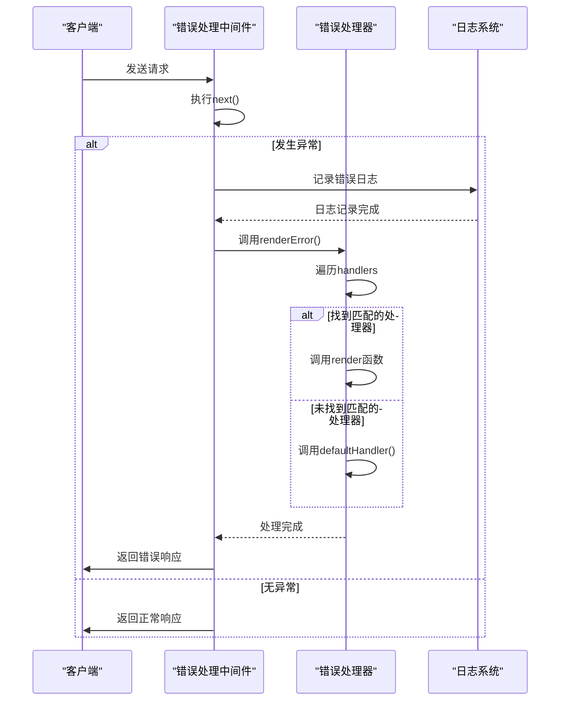

**图表来源**
- [error-handler.ts](file://packages/plugins/@nocobase/plugin-error-handler/src/server/error-handler.ts#L52-L67)
- [server.ts](file://packages/plugins/@nocobase/plugin-error-handler/src/server/server.ts#L98-L101)

**本节来源**
- [error-handler.ts](file://packages/plugins/@nocobase/plugin-error-handler/src/server/error-handler.ts#L1-L68)
- [server.ts](file://packages/plugins/@nocobase/plugin-error-handler/src/server/server.ts#L1-L102)

## 错误分类与处理策略

### 错误类型分类

NocoBase系统中的错误主要分为以下几类：

| 错误类型 | 描述 | 示例文件 | HTTP状态码 |
|---------|------|---------|----------|
| 验证错误 | 数据验证失败 | sequelize-validation-error | 400 |
| 权限错误 | 用户权限不足 | no-permission-error | 403 |
| 系统错误 | 服务器内部错误 | application-not-install | 500 |
| 数据库错误 | 数据库操作错误 | identifier-error | 500 |
| 插件错误 | 插件相关错误 | plugin-command-error | 400-500 |

**本节来源**
- [no-permission-error.ts](file://packages/core/acl/src/errors/no-permission-error.ts#L1-L11)
- [application-not-install.ts](file://packages/core/server/src/errors/application-not-install.ts#L1-L19)
- [plugin-command-error.ts](file://packages/core/server/src/errors/plugin-command-error.ts#L1-L11)
- [error-handler.ts](file://packages/plugins/@nocobase/plugin-error-handler/src/server/error-handler.ts#L20-L40)

### 验证错误处理

验证错误主要由Sequelize验证机制触发，包括数据格式验证、唯一性约束等。NocoBase通过专门的处理器来处理这些错误，能够提取具体的字段验证信息并返回给客户端。

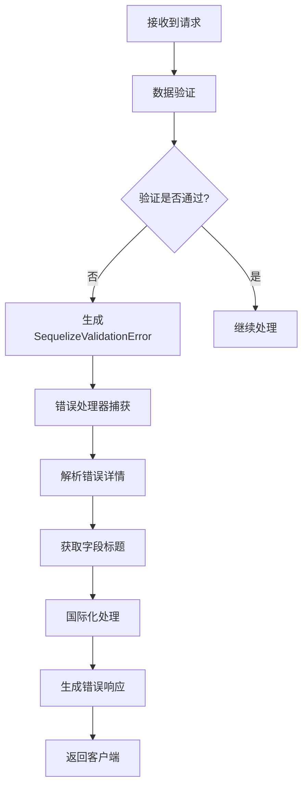

**图表来源**
- [server.ts](file://packages/plugins/@nocobase/plugin-error-handler/src/server/server.ts#L47-L66)
- [error-handler.ts](file://packages/plugins/@nocobase/plugin-error-handler/src/server/error-handler.ts#L42-L50)

### 权限错误处理

权限错误处理是NocoBase安全机制的重要组成部分，当用户尝试访问其没有权限的资源时会触发此类错误。

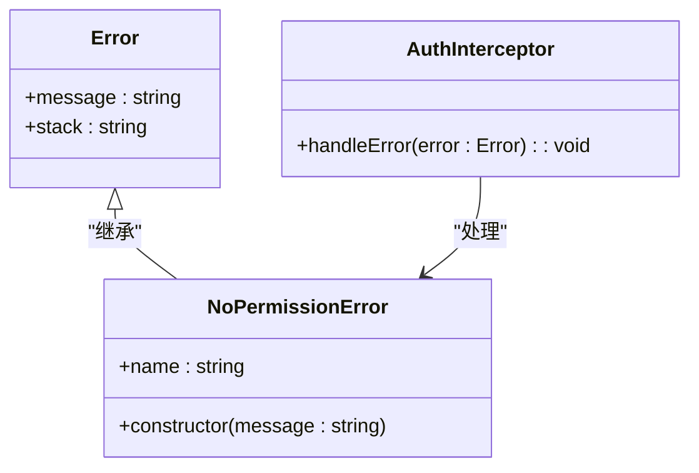

**图表来源**
- [no-permission-error.ts](file://packages/core/acl/src/errors/no-permission-error.ts#L1-L11)
- [plugin-auth\src\client\interceptors.ts](file://packages/plugins/@nocobase/plugin-auth/src/client/interceptors.ts#L68-L100)

**本节来源**
- [no-permission-error.ts](file://packages/core/acl/src/errors/no-permission-error.ts#L1-L11)
- [plugin-auth\src\client\interceptors.ts](file://packages/plugins/@nocobase/plugin-auth/src/client/interceptors.ts#L68-L100)

## 错误日志记录与监控集成

### 日志系统架构

NocoBase的错误日志记录系统基于Winston库构建，提供了结构化的日志输出和灵活的配置选项。

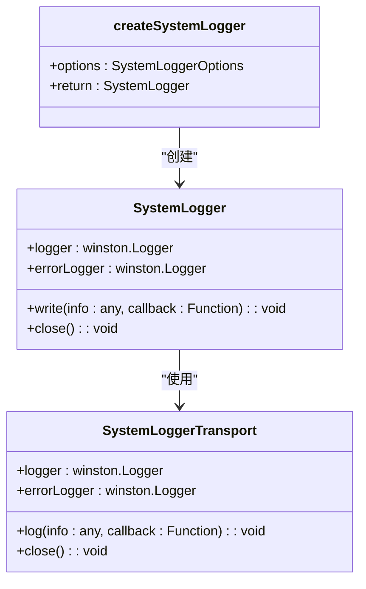

**图表来源**
- [system-logger.ts](file://packages/core/logger/src/system-logger.ts#L39-L98)
- [system-logger.ts](file://packages/core/logger/src/system-logger.ts#L119-L141)

### 错误监控集成

NocoBase集成了OpenTelemetry进行错误监控，支持指标和追踪功能。

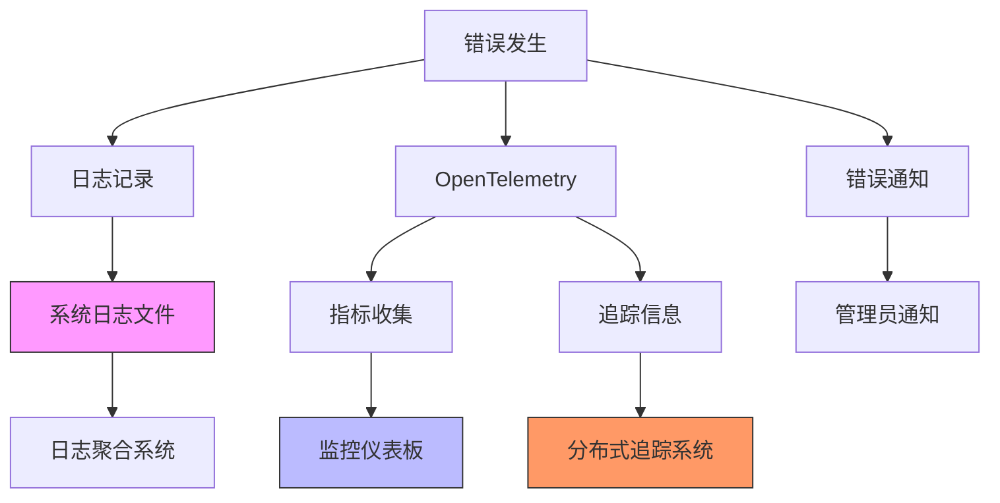

**本节来源**
- [system-logger.ts](file://packages/core/logger/src/system-logger.ts#L1-L151)
- [telemetry\src\telemetry.ts](file://packages/core/telemetry/src/telemetry.ts#L1-L40)
- [telemetry\src\metric.ts](file://packages/core/telemetry/src/metric.ts#L44-L86)
- [telemetry\src\trace.ts](file://packages/core/telemetry/src/trace.ts#L36-L71)

## 自定义错误处理器实现

### 注册自定义错误处理器

开发者可以通过`register`方法注册自定义的错误处理器，该方法接受两个参数：守卫函数和渲染函数。

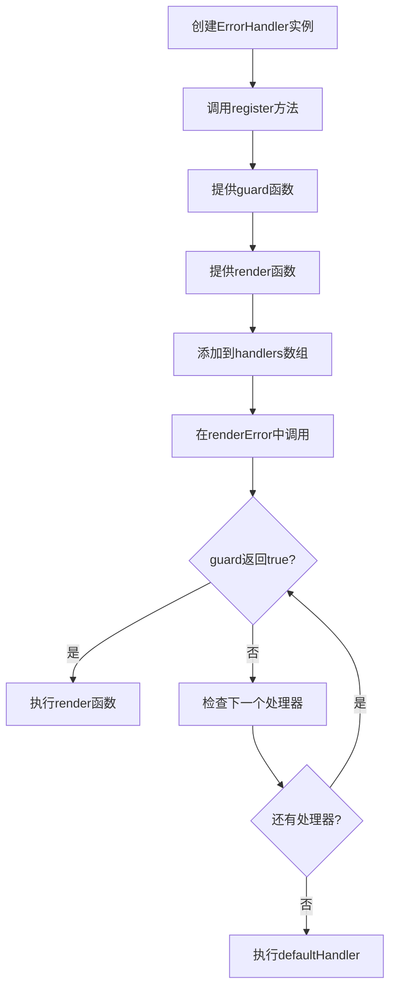

**图表来源**
- [error-handler.ts](file://packages/plugins/@nocobase/plugin-error-handler/src/server/error-handler.ts#L13-L18)
- [error-handler.ts](file://packages/plugins/@nocobase/plugin-error-handler/src/server/error-handler.ts#L42-L49)

### 自定义处理器示例

```typescript
// 示例：自定义数据库错误处理器
errorHandler.register(
  (err) => err.original?.errno === 1064, // MySQL语法错误
  (err, ctx) => {
    ctx.body = {
      errors: [{
        message: 'SQL语法错误，请检查查询语句',
        code: 'SQL_SYNTAX_ERROR'
      }]
    };
    ctx.status = 400;
  }
);
```

**本节来源**
- [error-handler.ts](file://packages/plugins/@nocobase/plugin-error-handler/src/server/error-handler.ts#L13-L18)
- [server.ts](file://packages/plugins/@nocobase/plugin-error-handler/src/server/server.ts#L68-L95)

## 错误响应格式规范

### 响应结构定义

NocoBase的错误响应遵循统一的JSON格式，确保客户端能够一致地处理错误信息。

```json
{
  "errors": [
    {
      "message": "错误描述信息",
      "code": "错误代码",
      "title": "字段标题（可选）"
    }
  ]
}
```

### 客户端错误处理

客户端通过APIClient类处理服务器返回的错误响应，提供了灵活的错误处理机制。

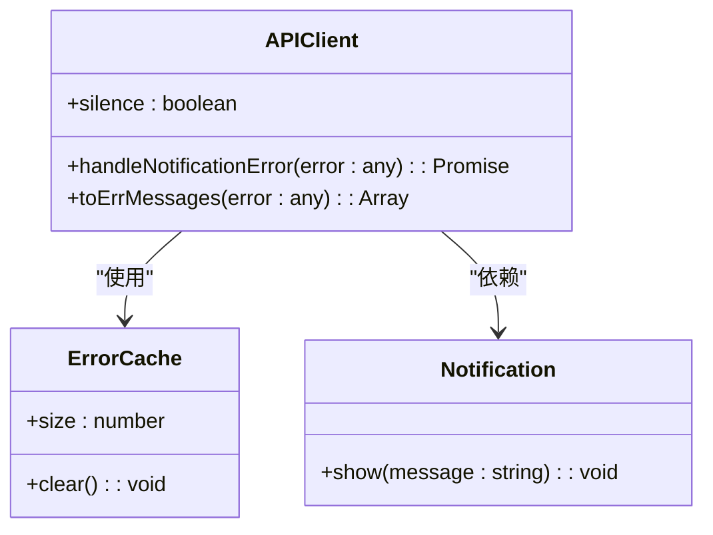

**图表来源**
- [APIClient.ts](file://packages/core/client/src/api-client/APIClient.ts#L163-L194)
- [plugin-auth\src\client\interceptors.ts](file://packages/plugins/@nocobase/plugin-auth/src/client/interceptors.ts#L68-L100)

**本节来源**
- [APIClient.ts](file://packages/core/client/src/api-client/APIClient.ts#L154-L194)
- [error-handler.ts](file://packages/plugins/@nocobase/plugin-error-handler/src/server/error-handler.ts#L29-L39)

## 安全考虑

### 信息泄露防护

NocoBase的错误处理机制特别注重安全，避免敏感信息泄露。

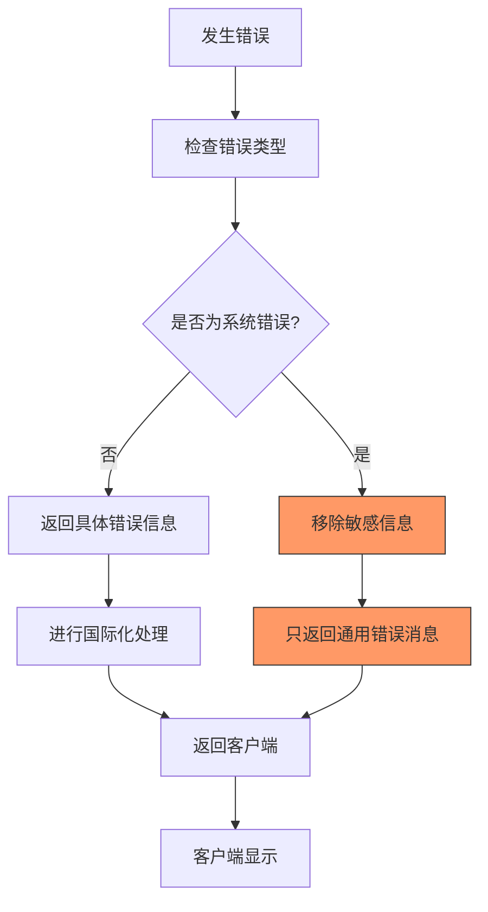

### 错误代码管理

系统使用预定义的错误代码，避免暴露内部实现细节。

```typescript
// 示例：外部API错误代码
class ErrorCodes {
  static SUCCESS = 0;
  static UNAUTHORIZED = 401;
  static EXTERNAL_API_ERROR = 510;
  
  static messages = {
    [ErrorCodes.SUCCESS]: 'Success',
    [ErrorCodes.UNAUTHORIZED]: 'Unauthorized',
    [ErrorCodes.EXTERNAL_API_ERROR]: 'External API Error',
  };
}
```

**本节来源**
- [error-handler.ts](file://packages/plugins/@nocobase/plugin-error-handler/src/server/error-handler.ts#L23-L27)
- [plugin-user-data-sync\src\server\error.ts](file://packages/plugins/@nocobase/plugin-user-data-sync/src/server/error.ts#L20-L34)
- [gateway\errors.ts](file://packages/core/gateway/errors.ts#L104-L165)

## 性能影响分析与优化建议

### 性能影响因素

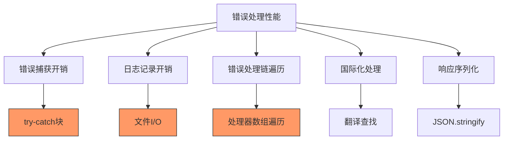

### 优化建议

1. **减少处理器数量**：保持错误处理器的数量在合理范围内，避免过多的遍历开销
2. **异步日志记录**：使用异步方式记录日志，避免阻塞主请求流程
3. **缓存错误消息**：对频繁出现的错误消息进行缓存，减少重复的国际化处理
4. **批量处理**：在可能的情况下，批量处理多个错误而不是逐个处理
5. **性能监控**：定期监控错误处理的性能指标，及时发现性能瓶颈

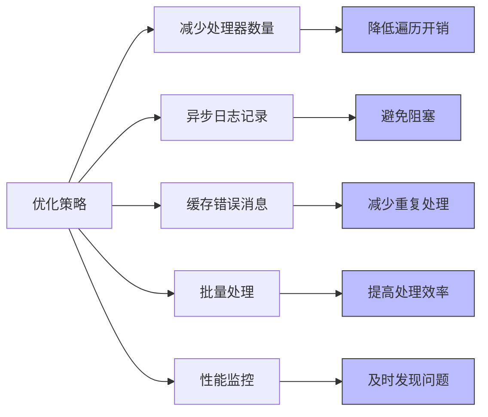

**本节来源**
- [error-handler.ts](file://packages/plugins/@nocobase/plugin-error-handler/src/server/error-handler.ts#L42-L49)
- [system-logger.ts](file://packages/core/logger/src/system-logger.ts#L62-L90)
- [error-handler.ts](file://packages/plugins/@nocobase/plugin-error-handler/src/server/error-handler.ts#L58-L64)

## 结论
NocoBase的错误处理机制是一个全面、灵活且安全的系统。通过插件化的架构设计，系统能够处理各种类型的错误，并提供一致的错误响应格式。错误处理器的注册机制使得开发者可以轻松扩展错误处理功能，而日志记录和监控集成则确保了系统的可观测性。在安全方面，系统通过信息过滤和错误代码管理避免了敏感信息泄露。性能优化建议为大规模应用提供了指导，确保错误处理不会成为系统性能的瓶颈。总体而言，NocoBase的错误处理机制为构建可靠的应用程序提供了坚实的基础。