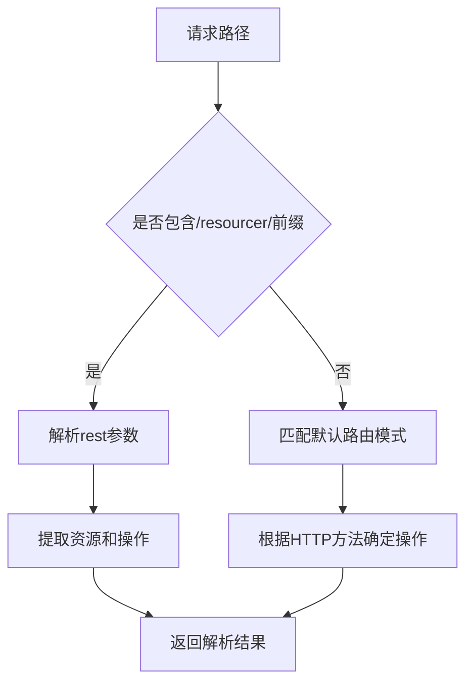
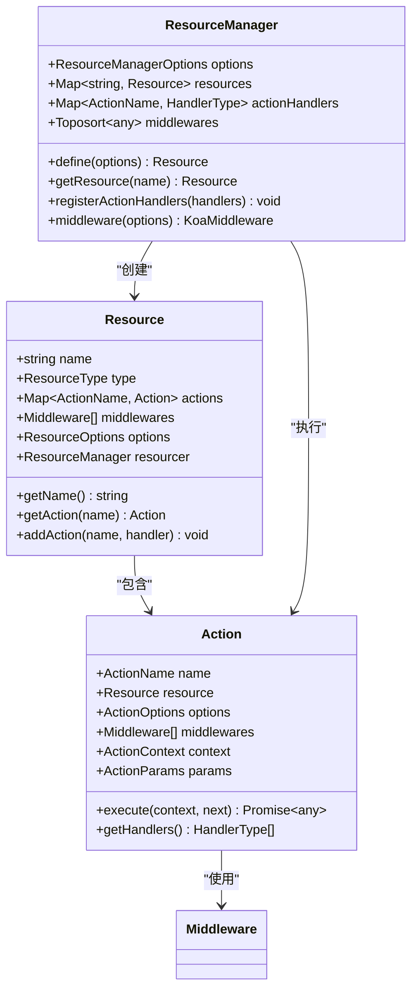
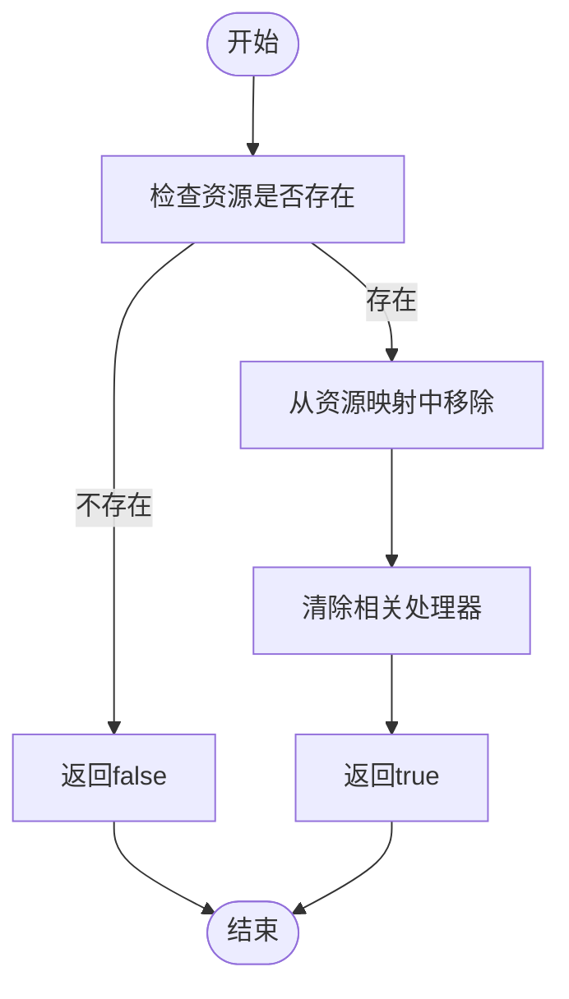

# 资源定义

<cite>
**本文档中引用的文件**  
- [resource.ts](file://packages/core/resourcer/src/resource.ts)
- [resourcer.ts](file://packages/core/resourcer/src/resourcer.ts)
- [action.ts](file://packages/core/resourcer/src/action.ts)
- [middleware.ts](file://packages/core/resourcer/src/middleware.ts)
- [utils.ts](file://packages/core/resourcer/src/utils.ts)
- [simple.ts](file://examples/app/resource-actions/simple.ts)
- [action-with-default-options.ts](file://examples/app/resource-actions/action-with-default-options.ts)
- [global-action.ts](file://examples/app/resource-actions/global-action.ts)
</cite>

## 目录
1. [引言](#引言)
2. [Resource类的设计与实现](#resource类的设计与实现)
3. [资源注册机制](#资源注册机制)
4. [资源命名规范与层级结构](#资源命名规范与层级结构)
5. [资源与数据库模型的映射](#资源与数据库模型的映射)
6. [资源的动态创建与销毁](#资源的动态创建与销毁)
7. [代码示例](#代码示例)
8. [总结](#总结)

## 引言
NocoBase中的资源定义系统提供了一套完整的机制来封装数据实体和操作。通过Resource类和Resourcer实例，开发者可以灵活地定义、注册和管理各种资源。本文档将深入探讨资源定义的核心设计，包括Resource类的实现、资源注册机制、命名规范、层级结构以及与数据库模型的映射关系。

## Resource类的设计与实现
Resource类是NocoBase资源系统的核心组成部分，负责封装数据实体和操作。该类的设计遵循面向对象原则，提供了丰富的配置选项和扩展能力。

Resource类的主要特性包括：
- **资源名称**：通过`name`属性定义资源的唯一标识
- **资源类型**：支持`single`、`hasOne`、`hasMany`、`belongsTo`、`belongsToMany`等类型
- **操作定义**：通过`actions`属性定义资源支持的操作
- **访问控制**：通过`only`和`except`属性实现操作的白名单和黑名单控制
- **中间件支持**：允许为资源配置中间件，实现请求处理的扩展

Resource类的构造函数接收`ResourceOptions`接口定义的配置对象，并初始化相关的属性和方法。每个Resource实例都与一个Resourcer实例关联，通过`resourcer`属性进行访问。

**Section sources**
- [resource.ts](file://packages/core/resourcer/src/resource.ts#L61-L125)

## 资源注册机制
资源注册机制通过Resourcer实例实现，提供了灵活的资源管理能力。Resourcer类作为资源管理器，负责注册、查找和管理所有资源实例。

资源注册的核心方法是`define`，它接收`ResourceOptions`配置对象并创建Resource实例。注册过程包括：
1. 解析资源配置
2. 创建Resource实例
3. 将实例存储在内部的Map结构中
4. 返回创建的Resource实例

Resourcer还提供了`registerActionHandlers`方法，用于注册全局的操作处理器。这些处理器可以被所有资源共享，实现了操作的复用。

资源查找通过`getResource`方法实现，根据资源名称从内部存储中获取对应的Resource实例。如果资源不存在，将抛出异常。

**Section sources**
- [resourcer.ts](file://packages/core/resourcer/src/resourcer.ts#L211-L215)
- [resourcer.ts](file://packages/core/resourcer/src/resourcer.ts#L279-L284)

## 资源命名规范与层级结构
NocoBase采用点号分隔的路径表示法来定义资源的嵌套关系，这种设计使得资源的组织更加清晰和灵活。

### 命名规范
资源名称遵循以下规范：
- 使用小写字母和数字
- 可以包含连字符和下划线
- 推荐使用复数形式表示集合资源
- 避免使用保留关键字

### 层级结构
资源的层级结构通过点号分隔的路径表示，例如`users.posts`表示用户资源下的帖子资源。这种设计支持以下特性：
- **嵌套资源**：通过点号分隔的路径表示父子资源关系
- **关系映射**：自动映射数据库中的关联关系
- **路径解析**：通过`parseRequest`函数解析请求路径，提取资源信息

路径解析过程包括：
1. 解码请求路径
2. 匹配预定义的路由模式
3. 提取资源名称和操作名称
4. 处理嵌套资源的特殊逻辑



**Diagram sources**
- [utils.ts](file://packages/core/resourcer/src/utils.ts#L55-L214)

**Section sources**
- [utils.ts](file://packages/core/resourcer/src/utils.ts#L50-L53)
- [utils.ts](file://packages/core/resourcer/src/utils.ts#L55-L214)

## 资源与数据库模型的映射
资源系统与数据库模型之间存在紧密的映射关系。每个资源通常对应一个数据库表或集合，通过配置实现数据的CRUD操作。

映射关系的主要特点包括：
- **表名映射**：资源名称通常对应数据库表名
- **字段映射**：资源字段对应数据库列
- **关系映射**：支持各种数据库关系类型
- **查询参数**：支持丰富的查询选项

资源操作中的`fields`、`filter`、`sort`等参数直接映射到数据库查询条件，实现了灵活的数据访问控制。



**Diagram sources**
- [resource.ts](file://packages/core/resourcer/src/resource.ts#L61-L125)
- [resourcer.ts](file://packages/core/resourcer/src/resourcer.ts#L161-L429)
- [action.ts](file://packages/core/resourcer/src/action.ts#L212-L409)

## 资源的动态创建与销毁
NocoBase支持资源的动态创建和销毁，这为系统的灵活性和可扩展性提供了重要支持。

### 动态创建
资源可以通过`define`方法动态创建，支持以下方式：
- 直接传入配置对象
- 传入函数返回配置对象
- 从文件系统批量导入配置

批量导入功能通过`import`方法实现，可以扫描指定目录下的配置文件并自动注册资源。

### 动态销毁
资源可以通过`removeResource`方法动态销毁。该方法从内部存储中移除指定名称的资源实例，释放相关资源。

动态管理的优势包括：
- **热更新**：无需重启应用即可修改资源定义
- **插件化**：支持按需加载和卸载功能模块
- **多租户**：支持不同租户拥有独立的资源定义



**Diagram sources**
- [resourcer.ts](file://packages/core/resourcer/src/resourcer.ts#L225-L227)

**Section sources**
- [resourcer.ts](file://packages/core/resourcer/src/resourcer.ts#L190-L203)
- [resourcer.ts](file://packages/core/resourcer/src/resourcer.ts#L225-L227)

## 代码示例
以下示例展示了如何在NocoBase中定义和使用资源。

### 基础资源定义
```typescript
app.resource({
  name: 'test',
  actions: {
    async list(ctx, next) {
      ctx.body = 'test list';
      await next();
    },
  },
});
```

### 带默认参数的操作
```typescript
app.resource({
  name: 'test',
  actions: {
    find: {
      filter: {
        field1: 'value1',
      },
      handler: async (ctx, next) => {
        ctx.body = {
          'ctx.action.params': ctx.action.params,
        };
        await next();
      },
    },
  },
});
```

### 全局操作的使用
```typescript
app.resourcer.registerActionHandlers({
  async import(ctx, next) {
    ctx.body = {
      'ctx.action.params': ctx.action.params,
    };
    await next();
  },
  async export(ctx, next) {
    ctx.body = {
      'ctx.action.params': ctx.action.params,
    };
    await next();
  },
});

app.resource({
  name: 'test',
  actions: {
    export: {
      fields: ['field1', 'field2'],
    },
  },
});
```

**Section sources**
- [simple.ts](file://examples/app/resource-actions/simple.ts#L33-L41)
- [action-with-default-options.ts](file://examples/app/resource-actions/action-with-default-options.ts#L33-L48)
- [global-action.ts](file://examples/app/resource-actions/global-action.ts#L38-L62)

## 总结
NocoBase的资源定义系统通过Resource类和Resourcer实例提供了一套完整而灵活的机制来封装数据实体和操作。系统支持资源的注册、管理、动态创建和销毁，通过点号分隔的路径表示法实现了清晰的层级结构。资源与数据库模型之间的映射关系使得数据访问更加直观和高效。这套设计为构建复杂的应用系统提供了坚实的基础。