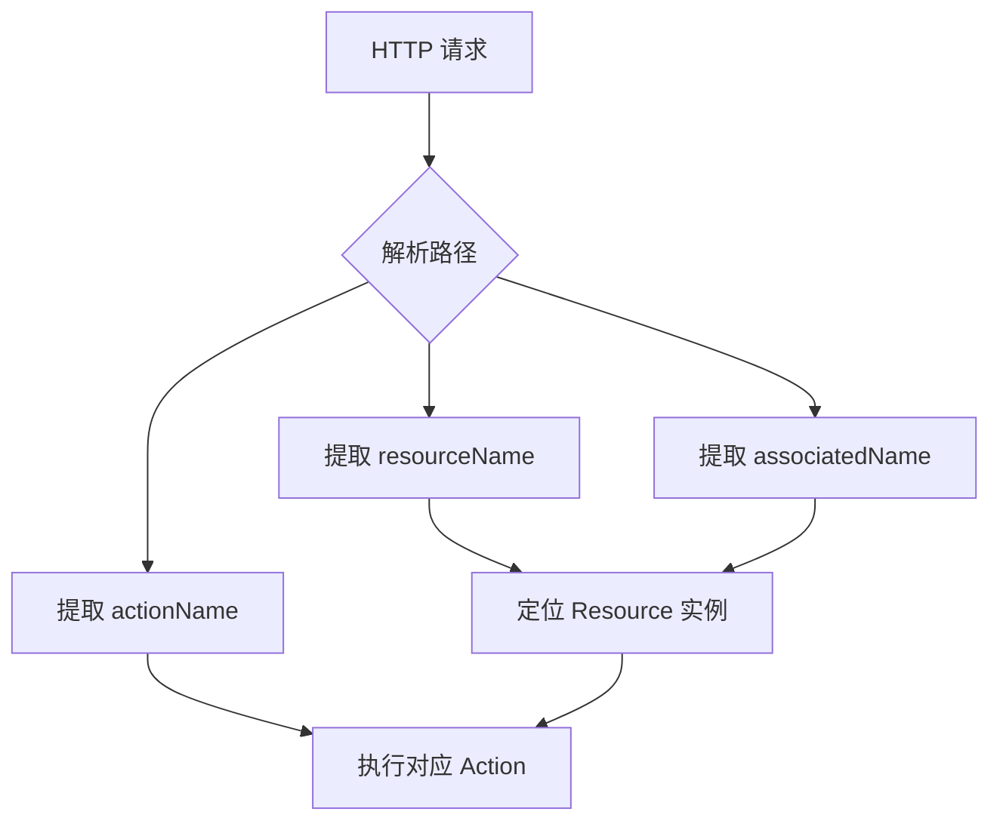
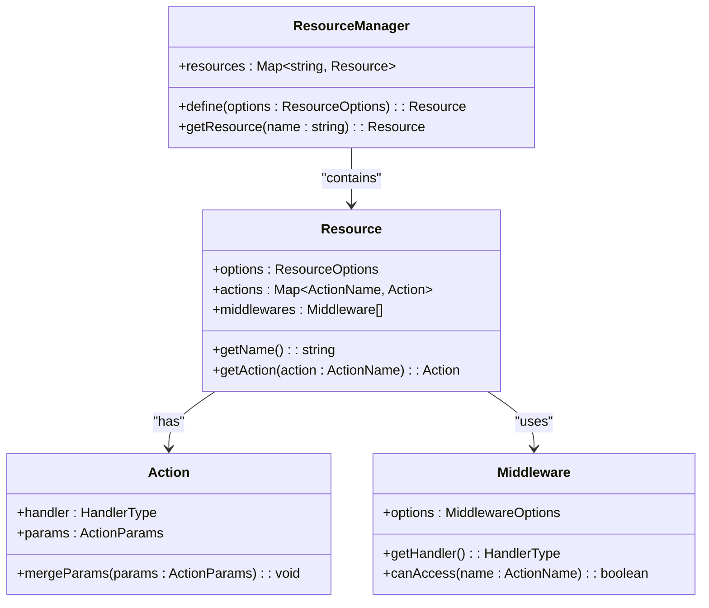
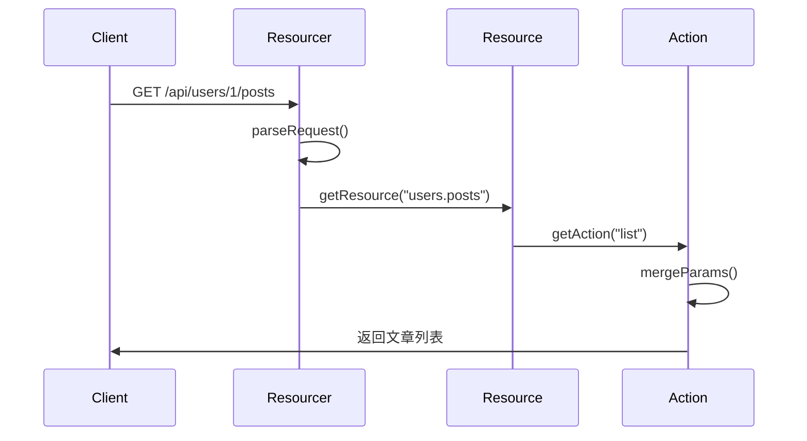

# 资源层级

<cite>
**本文档中引用的文件**  
- [resourcer.ts](file://packages/core/resourcer/src/resourcer.ts)
- [resource.ts](file://packages/core/resourcer/src/resource.ts)
- [action.ts](file://packages/core/resourcer/src/action.ts)
- [middleware.ts](file://packages/core/resourcer/src/middleware.ts)
- [utils.ts](file://packages/core/resourcer/src/utils.ts)
- [simple.ts](file://examples/app/resource-actions/simple.ts)
- [action-with-default-options.ts](file://examples/app/resource-actions/action-with-default-options.ts)
- [global-action.ts](file://examples/app/resource-actions/global-action.ts)
</cite>

## 目录
1. [引言](#引言)
2. [资源路径解析机制](#资源路径解析机制)
3. [资源层级的构建](#资源层级的构建)
4. [父资源与子资源的继承关系](#父资源与子资源的继承关系)
5. [动作与中间件的继承规则](#动作与中间件的继承规则)
6. [嵌套资源的定义与使用](#嵌套资源的定义与使用)
7. [权限控制与路由匹配的影响](#权限控制与路由匹配的影响)
8. [代码示例](#代码示例)
9. [总结](#总结)

## 引言

NocoBase 是一个低代码开发平台，其核心功能之一是通过资源层级结构来组织和管理 API。资源层级允许开发者以树状结构定义数据模型之间的关系，并通过点号分隔的字符串表示嵌套路径。这种设计不仅简化了复杂业务逻辑的实现，还为权限控制、路由匹配和数据访问提供了灵活的机制。

本文档将深入探讨 NocoBase 的资源层级结构，重点解析资源路径的解析机制、父子资源间的继承规则、动作与中间件的传播方式，以及如何通过 `addResource` 方法构建资源层级。同时，文档还将说明资源层级对权限控制和路由匹配的具体影响，并提供实际代码示例以展示其应用。

## 资源路径解析机制

在 NocoBase 中，资源路径采用点号（`.`）分隔的字符串形式来表示资源的嵌套关系。例如，`posts.comments` 表示“文章”的“评论”子资源。系统通过 `parseRequest` 函数解析 HTTP 请求路径，提取出资源名称、关联资源名称及操作类型。

路径解析的核心逻辑位于 `utils.ts` 文件中的 `parseRequest` 函数。该函数结合正则表达式与预定义的路由模板，根据请求方法（GET、POST 等）和路径结构自动映射到对应的动作（如 `list`、`create`、`get` 等）。支持的资源类型包括 `single`、`hasOne`、`hasMany`、`belongsTo` 和 `belongsToMany`，每种类型对应不同的 URL 模式和动作映射规则。

例如：
- `/api/posts` → `posts:list`
- `/api/posts/1` → `posts:get`（ID 为 1）
- `/api/users/1/posts` → `users.posts:list`（用户 ID 为 1 的所有文章）

这种解析机制使得前端可以通过简洁的路径语法访问深层嵌套的数据结构，而无需手动拼接复杂的查询参数。



**图示来源**  
- [utils.ts](file://packages/core/resourcer/src/utils.ts#L55-L214)
- [resourcer.ts](file://packages/core/resourcer/src/resourcer.ts#L324-L359)

## 资源层级的构建

资源层级的构建依赖于 `ResourceManager` 类提供的 `define` 方法。每个资源通过 `ResourceOptions` 配置其名称、类型、动作和中间件。通过点号命名约定，系统自动识别父子关系。

`ResourceManager` 维护一个 `Map<string, Resource>` 来存储所有已定义的资源实例。当调用 `define(options)` 时，系统会创建一个新的 `Resource` 实例并将其注册到映射表中。若资源名称包含点号（如 `parent.child`），则表明这是一个子资源，其父资源为 `parent`。

虽然当前代码中未直接暴露 `addResource` 方法，但资源的父子关系是通过命名约定和运行时解析隐式建立的。例如，定义名为 `users.posts` 的资源时，系统会查找是否存在名为 `users` 的资源作为其父级，并据此构建层级结构。

资源的类型（`type`）决定了其在层级中的语义角色，如 `hasMany` 表示一对多关系，`belongsTo` 表示属于某父资源等。这些类型直接影响路由模式和默认动作的映射。

**图示来源**  
- [resourcer.ts](file://packages/core/resourcer/src/resourcer.ts#L211-L216)
- [resource.ts](file://packages/core/resourcer/src/resource.ts#L72-L90)

## 父资源与子资源的继承关系

在 NocoBase 的资源层级中，子资源可以继承父资源的配置，包括动作（actions）和中间件（middlewares）。这种继承机制基于资源名称的层级结构，通过运行时查找和合并配置实现。

继承关系的实现依赖于 `ResourceManager` 和 `Resource` 类的协同工作。当一个请求到达时，系统首先解析出目标资源名称（如 `users.posts`），然后通过 `getResource` 方法获取对应的 `Resource` 实例。如果该资源未显式定义某些动作或中间件，则系统会尝试从其父资源（如 `users`）继承。

继承的深度是可配置的，默认情况下支持多级继承（deep inheritance）。例如，`a.b.c` 可以继承 `a.b` 的配置，而 `a.b` 又可以继承 `a` 的配置。这种链式继承机制使得基础配置可以在多个层级间复用，减少重复代码。

此外，系统还支持通过 `only` 和 `except` 选项精细控制继承行为。`only` 指定仅允许继承的特定动作，而 `except` 则排除某些动作的继承。



**图示来源**  
- [resourcer.ts](file://packages/core/resourcer/src/resourcer.ts#L161-L430)
- [resource.ts](file://packages/core/resourcer/src/resource.ts#L61-L126)
- [action.ts](file://packages/core/resourcer/src/action.ts#L212-L410)
- [middleware.ts](file://packages/core/resourcer/src/middleware.ts#L33-L121)

## 动作与中间件的继承规则

动作和中间件的继承遵循明确的优先级规则：**本地配置 > 父级继承 > 全局默认**。

### 动作继承规则

1. **本地定义优先**：资源自身定义的动作始终优先于继承的动作。
2. **全局动作注册**：通过 `registerActionHandlers` 注册的全局动作可被所有资源使用，除非被显式排除。
3. **继承链查找**：若资源未定义某动作，系统会沿层级向上查找父资源，直到找到匹配的动作或到达根层级。
4. **默认动作集**：系统内置了 `list`、`create`、`get`、`update`、`delete` 等默认动作，可通过配置覆盖或禁用。

例如，在 `global-action.ts` 示例中，`import` 和 `export` 被注册为全局动作，任何资源均可直接调用，如 `test:import`。

### 中间件继承规则

1. **自动注入**：子资源在构造时会自动继承父资源的中间件，并将其插入到自身中间件队列的前端。
2. **作用域控制**：中间件可通过 `only` 和 `except` 选项限定其适用的动作范围。
3. **执行顺序**：中间件按注册顺序执行，父级中间件先于子级中间件执行，确保安全检查等逻辑前置。

在 `Resource` 构造函数中，父资源的中间件通过 `unshift` 方法添加到子资源中间件数组的开头，保证其优先执行。

**图示来源**  
- [action.ts](file://packages/core/resourcer/src/action.ts#L243-L386)
- [middleware.ts](file://packages/core/resourcer/src/middleware.ts#L33-L71)
- [resource.ts](file://packages/core/resourcer/src/resource.ts#L76-L90)

## 嵌套资源的定义与使用

嵌套资源通过点号分隔的名称定义，反映数据模型间的关联关系。常见的使用场景包括：

- **一对多关系**：`users.posts` 表示某个用户的所有文章。
- **多对多关系**：`posts.tags` 表示文章与标签的关联。
- **深层嵌套**：`orgs.departments.employees` 表示组织结构中的部门员工。

定义嵌套资源时，需确保父资源已存在。系统通过 `getNameByParams` 函数从请求参数中提取完整资源路径，并调用 `getResource` 获取实例。

使用上，客户端可通过 RESTful 风格的 URL 直接访问嵌套资源，如：
- `GET /api/users/1/posts` 获取用户 1 的所有文章
- `POST /api/posts/1/comments` 为文章 1 创建评论

服务端通过 `parseRequest` 自动解析路径，定位到正确的资源和动作，并执行相应的处理器。



**图示来源**  
- [utils.ts](file://packages/core/resourcer/src/utils.ts#L50-L53)
- [resourcer.ts](file://packages/core/resourcer/src/resourcer.ts#L340-L386)
- [resource.ts](file://packages/core/resourcer/src/resource.ts#L114-L122)

## 权限控制与路由匹配的影响

资源层级对权限控制和路由匹配具有深远影响。

### 权限控制

权限系统可基于资源路径进行细粒度控制。例如：
- 允许用户访问自己的 `users.posts`，但禁止访问他人。
- 管理员可访问所有 `posts.comments`，普通用户仅能访问自己发表的评论。

通过继承机制，父资源的权限策略可自动传递给子资源，简化权限配置。同时，也可在子资源上覆盖特定权限，实现差异化控制。

### 路由匹配

路由匹配依赖于 `pathToRegexp` 库，根据资源类型动态生成正则表达式。不同类型的资源对应不同的 URL 模式：

| 类型 | 路径模式 | 示例 |
|------|--------|------|
| single | `/resource` | `/api/posts` |
| hasOne | `/parent/:parentId/child` | `/api/users/1/profile` |
| hasMany | `/parent/:parentId/children` | `/api/users/1/posts` |
| belongsTo | `/child/:childId/parent` | `/api/posts/1/user` |
| belongsToMany | `/parent/:parentId/children/:childId` | `/api/posts/1/tags/2` |

这种基于类型的路由生成机制确保了 API 的一致性和可预测性。

**图示来源**  
- [utils.ts](file://packages/core/resourcer/src/utils.ts#L91-L169)
- [resourcer.ts](file://packages/core/resourcer/src/resourcer.ts#L324-L359)

## 代码示例

以下示例展示了如何在 NocoBase 中定义和使用资源层级。

### 定义简单资源

```ts
app.resource({
  name: 'test',
  actions: {
    async list(ctx, next) {
      ctx.body = 'test list';
      await next();
    },
  },
});
```

此代码定义了一个名为 `test` 的资源，支持 `list` 动作，可通过 `GET /api/test:list` 访问。

**图示来源**  
- [simple.ts](file://examples/app/resource-actions/simple.ts#L33-L41)

### 定义带默认参数的动作

```ts
app.resource({
  name: 'test',
  actions: {
    find: {
      filter: { field1: 'value1' },
      handler: async (ctx, next) => {
        ctx.body = { 'ctx.action.params': ctx.action.params };
        await next();
      },
    },
  },
});
```

此示例展示了如何为动作设置默认参数，如 `filter`，这些参数会在请求时与客户端参数合并。

**图示来源**  
- [action-with-default-options.ts](file://examples/app/resource-actions/action-with-default-options.ts#L33-L48)

### 使用全局动作

```ts
app.resourcer.registerActionHandlers({
  async import(ctx, next) {
    ctx.body = { 'ctx.action.params': ctx.action.params };
    await next();
  },
});

app.resource({
  name: 'test',
  actions: {
    export: { fields: ['field1', 'field2'] },
  },
});
```

全局动作 `import` 和 `export` 可被任何资源调用，实现了功能的跨资源复用。

**图示来源**  
- [global-action.ts](file://examples/app/resource-actions/global-action.ts#L38-L62)

## 总结

NocoBase 的资源层级结构通过点号分隔的命名约定，实现了清晰的嵌套关系表达。系统通过 `ResourceManager` 和 `Resource` 类构建层级，并支持动作与中间件的继承。这种设计不仅提升了 API 的组织性，还为权限控制和路由匹配提供了强大支持。通过合理利用继承机制和全局动作注册，开发者可以高效地构建复杂的业务系统，同时保持代码的简洁与可维护性。