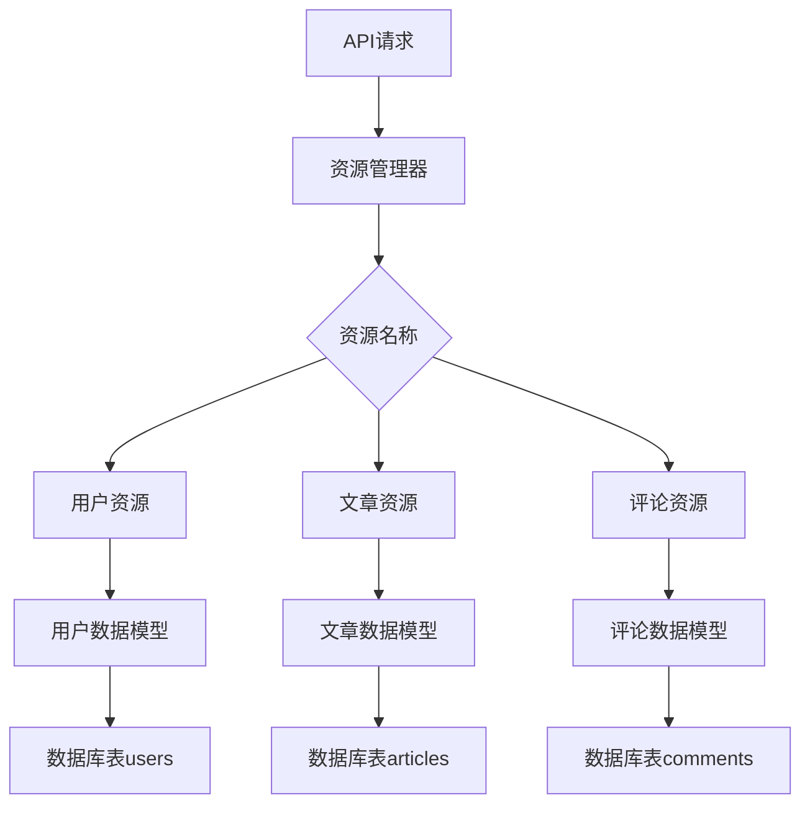
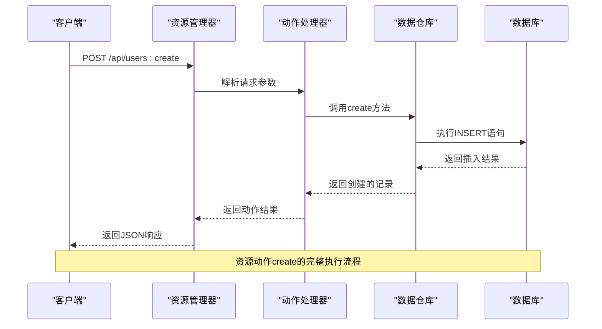
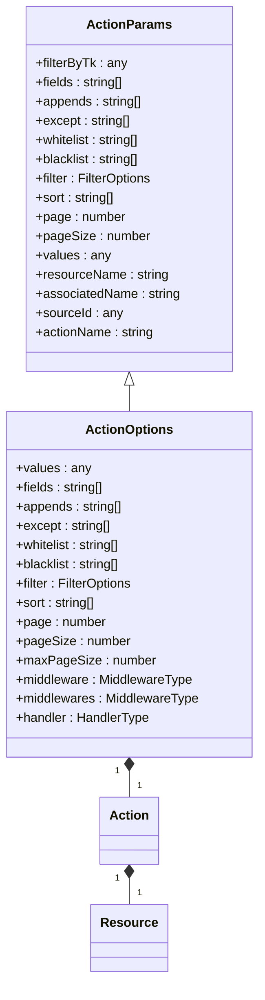
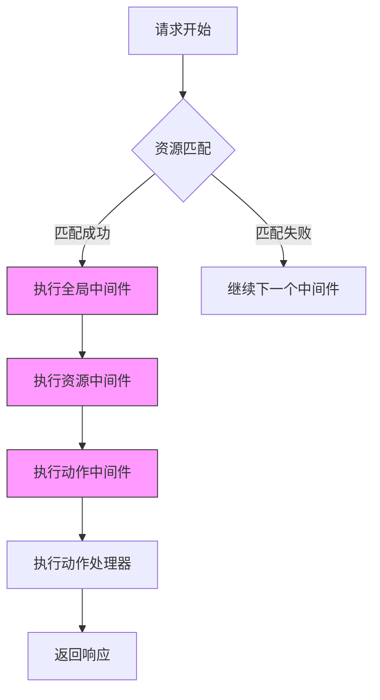
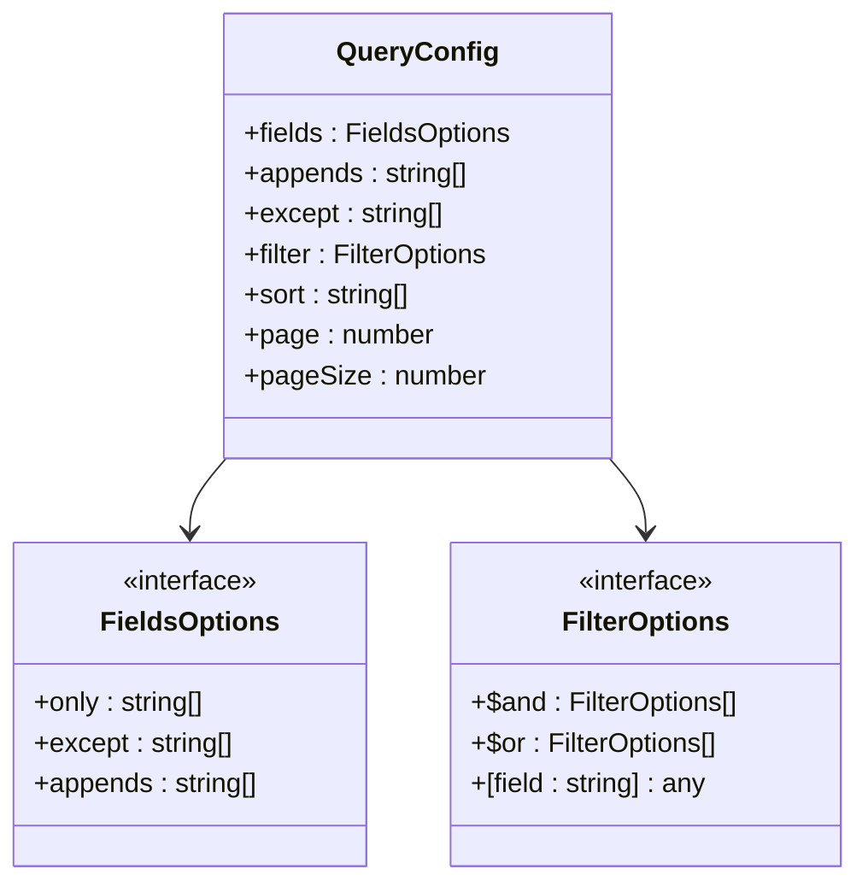
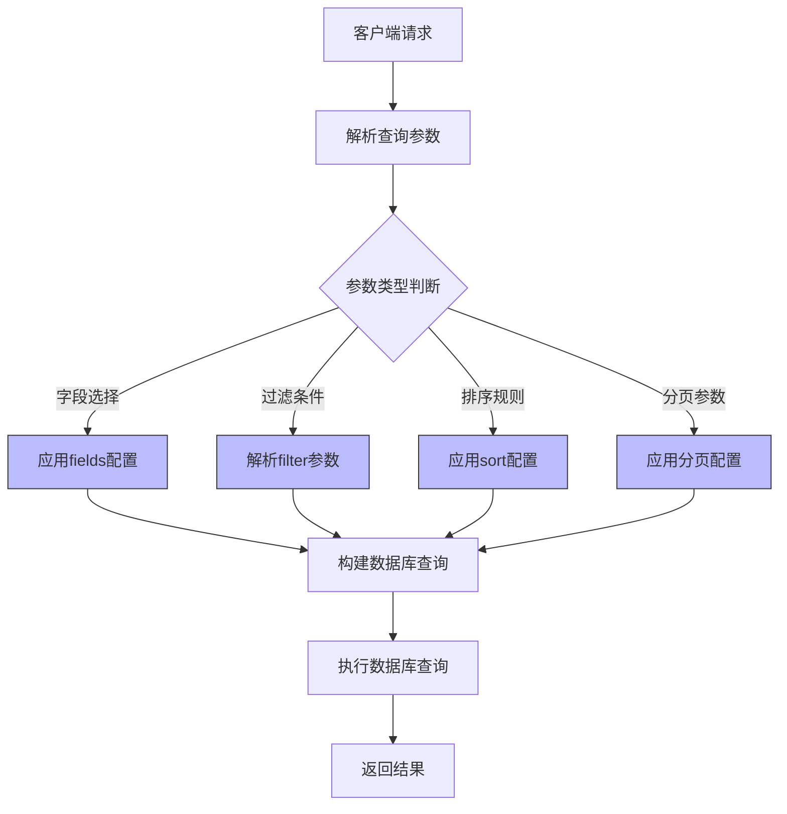
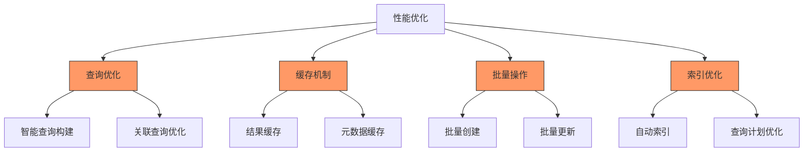
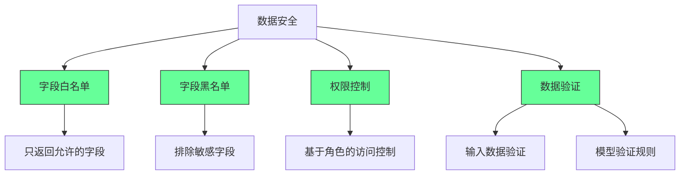

# 资源映射

<cite>
**本文档引用的文件**   
- [Resourcer.ts](file://packages/core/resourcer/src/Resourcer.ts)
- [Resource.ts](file://packages/core/resourcer/src/Resource.ts)
- [action.ts](file://packages/core/resourcer/src/action.ts)
- [utils.ts](file://packages/core/resourcer/src/utils.ts)
- [collection2resource.ts](file://examples/app/collection2resource.ts)
- [association2resource.ts](file://examples/app/association2resource.ts)
- [collection.ts](file://packages/core/database/src/collection.ts)
- [repository.ts](file://packages/core/database/src/repository.ts)
</cite>

## 目录
1. [简介](#简介)
2. [资源与数据库模型映射](#资源与数据库模型映射)
3. [资源动作与数据操作映射](#资源动作与数据操作映射)
4. [资源映射配置选项](#资源映射配置选项)
5. [复杂查询与数据转换配置](#复杂查询与数据转换配置)
6. [性能优化与数据安全](#性能优化与数据安全)
7. [结论](#结论)

## 简介
NocoBase的资源映射机制是其核心功能之一，它实现了API资源与数据库模型之间的无缝连接。该机制通过collection属性将资源关联到特定的数据模型，并将create、list、update等资源动作映射到相应的数据库操作。本文档将深入解析这一机制的工作原理、配置选项以及最佳实践。

**Section sources**
- [Resourcer.ts](file://packages/core/resourcer/src/Resourcer.ts#L1-L430)
- [Resource.ts](file://packages/core/resourcer/src/Resource.ts#L1-L126)

## 资源与数据库模型映射

NocoBase中的资源映射机制通过`collection`属性实现资源与数据库模型的关联。当一个collection被定义时，系统会自动创建同名的resource，从而建立API端点与数据模型之间的桥梁。

资源映射的核心是`ResourceManager`类，它负责管理所有资源的定义和注册。每个资源都与一个特定的数据库集合（collection）相关联，这种关联通过资源的`name`属性实现。在NocoBase中，collection不仅定义了数据库表结构，还包含了字段定义、索引、迁移规则等元数据。



**Diagram sources **
- [Resourcer.ts](file://packages/core/resourcer/src/Resourcer.ts#L161-L429)
- [collection.ts](file://packages/core/database/src/collection.ts#L145-L174)

**Section sources**
- [Resourcer.ts](file://packages/core/resourcer/src/Resourcer.ts#L161-L429)
- [collection.ts](file://packages/core/database/src/collection.ts#L145-L174)

## 资源动作与数据操作映射

资源动作与数据操作的映射是NocoBase资源系统的核心机制。系统将标准的CRUD操作映射到相应的数据库操作，实现了RESTful API的自动化。

### 动作映射机制
资源动作通过`Action`类实现，每个动作都对应一个特定的数据库操作：

- **create**: 映射到数据库的插入操作
- **list**: 映射到数据库的查询操作（带分页）
- **get**: 映射到数据库的单条记录查询
- **update**: 映射到数据库的更新操作
- **delete**: 映射到数据库的删除操作



**Diagram sources **
- [action.ts](file://packages/core/resourcer/src/action.ts#L212-L410)
- [repository.ts](file://packages/core/database/src/repository.ts#L655-L700)

### 动作参数处理
动作参数通过`ActionParams`接口定义，包含了所有必要的查询和操作参数：



**Diagram sources **
- [action.ts](file://packages/core/resourcer/src/action.ts#L132-L210)
- [Resource.ts](file://packages/core/resourcer/src/Resource.ts#L61-L126)

**Section sources**
- [action.ts](file://packages/core/resourcer/src/action.ts#L132-L210)
- [Resource.ts](file://packages/core/resourcer/src/Resource.ts#L61-L126)

## 资源映射配置选项

NocoBase提供了丰富的配置选项来定制资源映射行为，满足不同场景的需求。

### 基础配置
资源的基本配置通过`ResourceOptions`接口定义：

```mermaid
classDiagram
class ResourceOptions {
+name : string
+type : ResourceType
+actions : { [key : string] : ActionType }
+only : Array<ActionName>
+except : Array<ActionName>
+middleware : MiddlewareType
+middlewares : MiddlewareType
}
class ResourceType {
<<enumeration>>
single
hasOne
hasMany
belongsTo
belongsToMany
}
class ActionName {
<<enumeration>>
list
create
get
update
destroy
set
add
remove
}
ResourceOptions --> ResourceType : "使用"
ResourceOptions --> ActionName : "引用"
```

**Diagram sources **
- [Resource.ts](file://packages/core/resourcer/src/Resource.ts#L17-L59)

### 中间件配置
中间件配置允许在资源操作前后执行自定义逻辑：



**Diagram sources **
- [middleware.ts](file://packages/core/resourcer/src/middleware.ts#L1-L121)
- [Resourcer.ts](file://packages/core/resourcer/src/Resourcer.ts#L311-L391)

**Section sources**
- [Resource.ts](file://packages/core/resourcer/src/Resource.ts#L17-L59)
- [middleware.ts](file://packages/core/resourcer/src/middleware.ts#L1-L121)

## 复杂查询与数据转换配置

NocoBase支持复杂的查询配置和数据转换，满足高级应用场景的需求。

### 查询参数配置
系统支持多种查询参数配置方式，包括字段选择、过滤、排序等：



**Diagram sources **
- [action.ts](file://packages/core/resourcer/src/action.ts#L28-L87)
- [utils.ts](file://packages/core/resourcer/src/utils.ts#L233-L308)

### 数据转换示例
以下示例展示了如何配置资源以支持复杂查询：



**Diagram sources **
- [utils.ts](file://packages/core/resourcer/src/utils.ts#L55-L214)
- [repository.ts](file://packages/core/database/src/repository.ts#L518-L567)

**Section sources**
- [action.ts](file://packages/core/resourcer/src/action.ts#L28-L87)
- [utils.ts](file://packages/core/resourcer/src/utils.ts#L233-L308)

## 性能优化与数据安全

资源映射机制在设计时充分考虑了性能优化和数据安全的需求。

### 性能优化策略
系统通过多种机制优化资源操作的性能：



**Diagram sources **
- [repository.ts](file://packages/core/database/src/repository.ts#L269-L307)
- [Resourcer.ts](file://packages/core/resourcer/src/Resourcer.ts#L175-L178)

### 数据安全机制
系统提供了多层次的数据安全保护：



**Diagram sources **
- [action.ts](file://packages/core/resourcer/src/action.ts#L81-L84)
- [repository.ts](file://packages/core/database/src/repository.ts#L645-L673)

**Section sources**
- [repository.ts](file://packages/core/database/src/repository.ts#L269-L307)
- [action.ts](file://packages/core/resourcer/src/action.ts#L81-L84)

## 结论
NocoBase的资源映射机制通过collection属性实现了API资源与数据库模型的无缝连接。该机制将标准的CRUD操作映射到相应的数据库操作，提供了灵活的配置选项来定制映射行为。通过中间件、查询参数、字段控制等特性，系统既满足了复杂业务需求，又保证了性能和数据安全。开发者可以基于这一机制快速构建高效、安全的API服务。