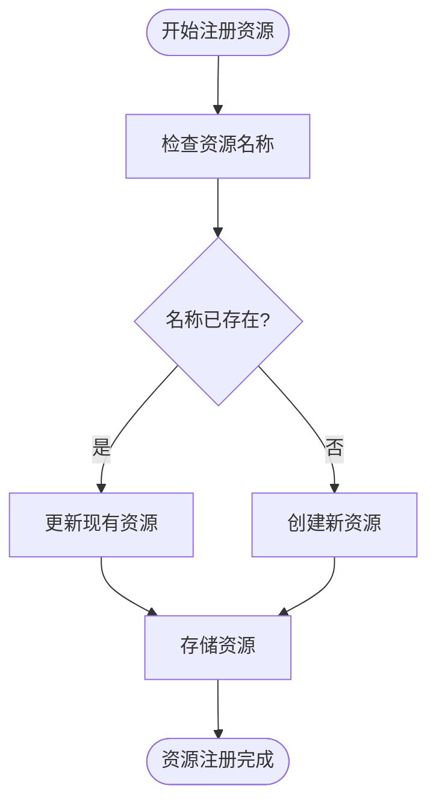

# 资源注册

<cite>
**本文档引用的文件**  
- [resourcer.ts](file://packages/core/resourcer/src/resourcer.ts)
- [resource.ts](file://packages/core/resourcer/src/resource.ts)
- [action.ts](file://packages/core/resourcer/src/action.ts)
- [utils.ts](file://packages/core/resourcer/src/utils.ts)
- [application.ts](file://packages/core/server/src/application.ts)
- [simple.ts](file://examples/app/resource-actions/simple.ts)
- [resourcer.ts](file://examples/app/middleware/resourcer.ts)
- [multi-app.ts](file://examples/app/multi-app.ts)
</cite>

## 目录
1. [简介](#简介)
2. [资源注册机制概述](#资源注册机制概述)
3. [Resourcer类核心实现](#resourcer类核心实现)
4. [资源注册表设计原理](#资源注册表设计原理)
5. [资源注册过程中的依赖关系处理](#资源注册过程中的依赖关系处理)
6. [资源唯一性保证](#资源唯一性保证)
7. [资源注册生命周期管理](#资源注册生命周期管理)
8. [资源注册冲突与覆盖处理](#资源注册冲突与覆盖处理)
9. [代码示例](#代码示例)
10. [总结](#总结)

## 简介
NocoBase的资源注册机制是其核心功能之一，负责管理应用程序中各种资源的注册、查找和调用。该机制通过Resourcer类（实际为ResourceManager类）实现，提供了一套完整的资源管理解决方案。资源注册机制允许开发者通过名称和选项参数注册新资源，并确保资源的唯一性。本文档将深入解析Resourcer类如何管理资源的注册和查找，包括registerResource（实际为define方法）和getResource方法的实现细节。

**Section sources**
- [resourcer.ts](file://packages/core/resourcer/src/resourcer.ts#L1-L430)

## 资源注册机制概述
NocoBase的资源注册机制基于ResourceManager类实现，该类负责管理所有资源的生命周期。资源注册机制的核心功能包括资源定义、资源查找、动作处理和中间件管理。每个资源由名称唯一标识，并可以关联多个动作（如list、create、get、update、delete等）。资源注册机制通过Map数据结构存储资源，确保快速查找和高效管理。

资源注册机制的设计遵循了模块化和可扩展的原则，允许在应用启动时注册核心资源，以及在运行时动态注册插件资源。该机制还支持资源的依赖关系处理，确保资源之间的正确调用顺序。通过资源注册机制，NocoBase实现了灵活的API路由和资源管理，为开发者提供了强大的功能支持。

**Section sources**
- [resourcer.ts](file://packages/core/resourcer/src/resourcer.ts#L161-L429)
- [resource.ts](file://packages/core/resourcer/src/resource.ts#L61-L126)

## Resourcer类核心实现
Resourcer类实际上是ResourceManager类的别名，主要负责资源的注册和管理。其核心实现包括资源定义、资源查找、动作处理和中间件管理等功能。


**Diagram sources**
- [resourcer.ts](file://packages/core/resourcer/src/resourcer.ts#L161-L429)
- [resource.ts](file://packages/core/resourcer/src/resource.ts#L61-L126)
- [action.ts](file://packages/core/resourcer/src/action.ts#L212-L410)

### 资源定义与注册
资源定义通过`define`方法实现，该方法接收资源选项参数并创建新的Resource实例。资源选项包括名称、类型、动作、中间件等配置。`define`方法将新创建的资源存储在`resources` Map中，以资源名称为键。


**Diagram sources**
- [resourcer.ts](file://packages/core/resourcer/src/resourcer.ts#L211-L216)

### 资源查找
资源查找通过`getResource`方法实现，该方法根据资源名称从`resources` Map中查找对应的Resource实例。如果资源不存在，则抛出错误。`getResource`方法是资源注册机制的核心，确保了资源的快速定位和访问。


**Diagram sources**
- [resourcer.ts](file://packages/core/resourcer/src/resourcer.ts#L279-L284)

## 资源注册表设计原理
资源注册表的设计基于Map数据结构，以资源名称为键，Resource实例为值。这种设计确保了资源的唯一性和快速查找。资源注册表的核心组件包括资源存储、动作处理器和中间件处理器。

资源存储使用`Map<string, Resource>`类型，确保每个资源名称对应唯一的Resource实例。动作处理器使用`Map<ActionName, any>`类型，存储全局的动作处理器。中间件处理器使用`Map<string, any>`类型，存储特定的中间件处理器。

资源注册表的设计还考虑了可扩展性，通过`import`方法支持从指定目录加载资源配置。该方法使用glob模式匹配文件，并动态导入配置文件，实现了配置的文件驱动。


**Diagram sources**
- [resourcer.ts](file://packages/core/resourcer/src/resourcer.ts#L166-L173)
- [resource.ts](file://packages/core/resourcer/src/resource.ts#L66-L68)

## 资源注册过程中的依赖关系处理
资源注册机制通过Toposort类处理依赖关系，确保中间件和资源的正确执行顺序。Toposort是一个拓扑排序工具，用于解决有向无环图（DAG）中的依赖关系。

在资源注册过程中，依赖关系主要体现在中间件的执行顺序上。通过`use`方法注册中间件时，可以指定`tag`、`group`、`before`和`after`等选项，这些选项用于定义中间件的执行顺序。Toposort根据这些选项构建依赖图，并计算出正确的执行顺序。


**Diagram sources**
- [resourcer.ts](file://packages/core/resourcer/src/resourcer.ts#L173-L177)
- [resourcer.ts](file://packages/core/resourcer/src/resourcer.ts#L304-L309)

## 资源唯一性保证
资源注册机制通过Map数据结构和名称检查确保资源的唯一性。当调用`define`方法注册新资源时，系统会检查资源名称是否已存在。如果存在，则直接覆盖原有资源；如果不存在，则创建新资源。

这种设计既保证了资源的唯一性，又允许资源的动态更新。通过名称作为唯一标识符，系统可以快速定位和访问资源，避免了重复注册的问题。



**Diagram sources**
- [resourcer.ts](file://packages/core/resourcer/src/resourcer.ts#L211-L216)

## 资源注册生命周期管理
资源注册的生命周期包括注册、查找、执行和销毁等阶段。每个阶段都有相应的处理逻辑，确保资源的正确管理和使用。

在注册阶段，通过`define`方法将资源添加到资源注册表中。在查找阶段，通过`getResource`方法根据名称查找资源。在执行阶段，通过`execute`方法执行资源的动作。在销毁阶段，通过`removeResource`方法从资源注册表中移除资源。


**Diagram sources**
- [resourcer.ts](file://packages/core/resourcer/src/resourcer.ts#L211-L216)
- [resourcer.ts](file://packages/core/resourcer/src/resourcer.ts#L279-L284)
- [resourcer.ts](file://packages/core/resourcer/src/resourcer.ts#L406-L411)
- [resourcer.ts](file://packages/core/resourcer/src/resourcer.ts#L225-L227)

## 资源注册冲突与覆盖处理
资源注册机制通过名称覆盖策略处理注册冲突。当注册同名资源时，新资源会覆盖旧资源。这种设计允许动态更新资源配置，但需要谨慎使用以避免意外覆盖。

系统还提供了`isDefined`方法用于检查资源是否已存在，开发者可以在注册前进行检查，以决定是创建新资源还是更新现有资源。


**Diagram sources**
- [resourcer.ts](file://packages/core/resourcer/src/resourcer.ts#L218-L220)
- [resourcer.ts](file://packages/core/resourcer/src/resourcer.ts#L211-L216)

## 代码示例
以下代码示例展示了如何在应用启动时注册核心资源和插件资源。

### 基本资源注册
```typescript
import { Application } from '@nocobase/server';

const app = new Application({
  database: {
    dialect: process.env.DB_DIALECT as any,
    database: process.env.DB_DATABASE,
  },
  resourcer: {
    prefix: '/api',
  },
  plugins: [],
});

// 注册基本资源
app.resource({
  name: 'test',
  actions: {
    async list(ctx, next) {
      ctx.body = 'test list';
      await next();
    },
  },
});
```

**Section sources**
- [simple.ts](file://examples/app/resource-actions/simple.ts#L1-L47)

### 中间件使用示例
```typescript
// 使用资源中间件
app.resourcer.use(async (ctx, next) => {
  ctx.body = ctx.body || [];
  ctx.body.push('resourcer middleware');
  await next();
});

// 使用应用中间件
app.use(async (ctx, next) => {
  ctx.body = ctx.body || [];
  ctx.body.push('app middleware');
  await next();
});
```

**Section sources**
- [resourcer.ts](file://examples/app/middleware/resourcer.ts#L1-L60)

### 多应用资源注册
```typescript
// 创建子应用
const subApp1 = app.appManager.createApplication('sub1', {
  database: app.db,
  resourcer: {
    prefix: '/sub1/api/',
  },
});

// 在主应用中注册资源
app.resourcer.define({
  name: 'test',
  actions: {
    async list(ctx) {
      ctx.body = 'test list';
    },
  },
});

// 在子应用中注册资源
subApp1.resourcer.define({
  name: 'test',
  actions: {
    async list(ctx) {
      ctx.body = 'sub1 test list';
    },
  },
});
```

**Section sources**
- [multi-app.ts](file://examples/app/multi-app.ts#L1-L70)

## 总结
NocoBase的资源注册机制通过ResourceManager类实现了高效、灵活的资源管理。该机制基于Map数据结构存储资源，确保了资源的唯一性和快速查找。通过`define`方法注册资源，`getResource`方法查找资源，形成了完整的资源管理闭环。

资源注册机制的设计考虑了可扩展性和依赖关系处理，支持从文件系统动态加载资源配置，并通过Toposort类管理中间件的执行顺序。机制还提供了完善的生命周期管理，包括注册、查找、执行和销毁等阶段。

在实际应用中，开发者可以利用资源注册机制快速构建API接口，通过简单的配置实现复杂的业务逻辑。同时，机制的灵活性也支持插件化开发，允许在运行时动态注册和更新资源。

总体而言，NocoBase的资源注册机制是一个设计精良、功能强大的核心组件，为应用程序的开发和维护提供了坚实的基础。

**Section sources**
- [resourcer.ts](file://packages/core/resourcer/src/resourcer.ts#L1-L430)
- [resource.ts](file://packages/core/resourcer/src/resource.ts#L1-L126)
- [action.ts](file://packages/core/resourcer/src/action.ts#L1-L410)