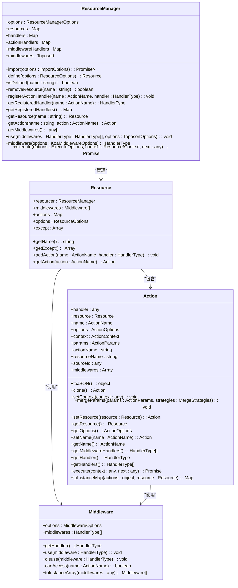
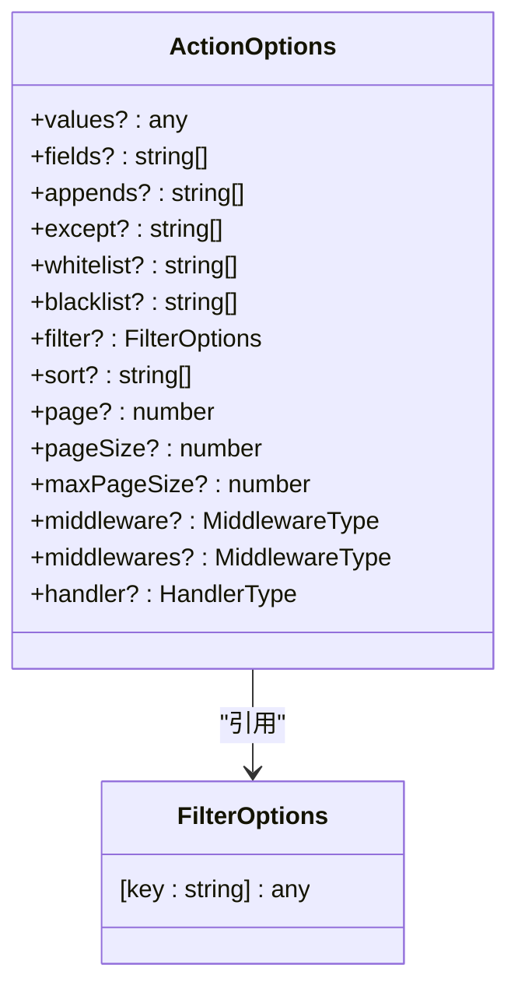
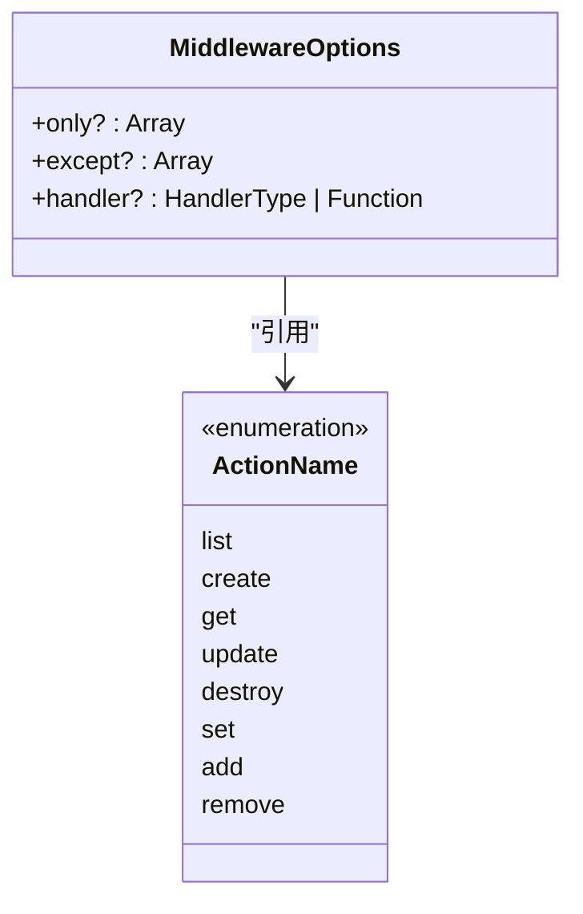
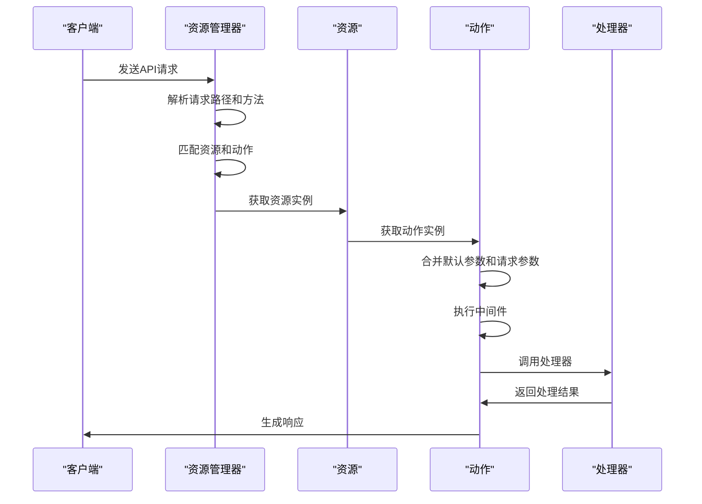
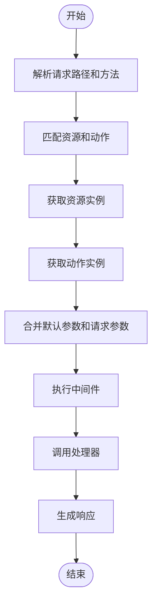
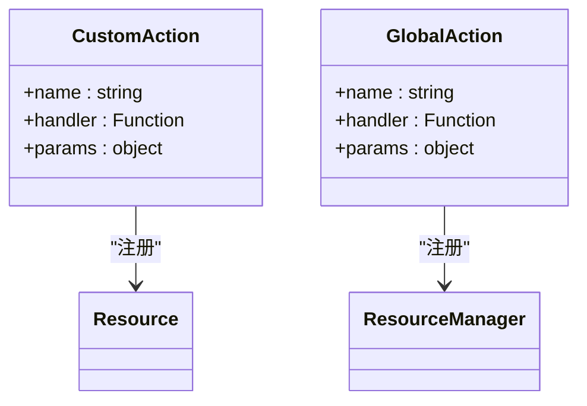
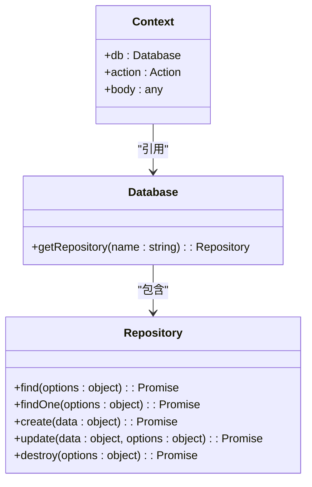

# 资源管理

<cite>
**本文档中引用的文件**  
- [index.ts](file://packages\core\resourcer\src\index.ts)
- [Resourcer.ts](file://packages\core\resourcer\src\Resourcer.ts)
- [Resource.ts](file://packages\core\resourcer\src\Resource.ts)
- [Action.ts](file://packages\core\resourcer\src\Action.ts)
- [Middleware.ts](file://packages\core\resourcer\src\Middleware.ts)
- [utils.ts](file://packages\core\resourcer\src\utils.ts)
- [simple.ts](file://examples\app\resource-actions\simple.ts)
- [global-action.ts](file://examples\app\resource-actions\global-action.ts)
- [action-with-default-options.ts](file://examples\app\resource-actions\action-with-default-options.ts)
- [index.ts](file://packages\core\actions\src\index.ts)
</cite>

## 目录
1. [简介](#简介)
2. [核心架构](#核心架构)
3. [资源、动作与中间件](#资源动作与中间件)
4. [请求处理流程](#请求处理流程)
5. [内置CRUD操作](#内置crud操作)
6. [自定义动作扩展](#自定义动作扩展)
7. [数据库集成](#数据库集成)
8. [代码示例](#代码示例)
9. [总结](#总结)

## 简介

NocoBase资源管理器（Resourcer）是一个强大的API统一处理框架，旨在简化和标准化API请求的处理流程。它通过三层架构——资源（Resource）、动作（Action）和中间件（Middleware）——实现了灵活而高效的API管理。资源管理器不仅提供了内置的CRUD操作，还支持通过自定义动作来扩展API功能，满足各种复杂的业务需求。

**Section sources**
- [index.ts](file://packages\core\resourcer\src\index.ts)

## 核心架构

NocoBase资源管理器的核心架构由三个主要组件构成：ResourceManager、Resource和Action。ResourceManager是资源管理的中心，负责管理所有资源和全局动作处理器。Resource代表一个具体的资源，如用户、文章等，包含该资源的所有动作和中间件。Action则代表对资源的具体操作，如创建、读取、更新和删除。



**Diagram sources**
- [Resourcer.ts](file://packages\core\resourcer\src\Resourcer.ts)
- [Resource.ts](file://packages\core\resourcer\src\Resource.ts)
- [Action.ts](file://packages\core\resourcer\src\Action.ts)
- [Middleware.ts](file://packages\core\resourcer\src\Middleware.ts)

## 资源动作与中间件

### 资源（Resource）

资源是NocoBase资源管理器中的基本单位，代表一个具体的实体，如用户、文章等。每个资源都有一个唯一的名称，并可以定义一系列动作和中间件。资源的定义通过`ResourceOptions`接口进行，包含资源名称、类型、动作、中间件等配置。

```mermaid
classDiagram
class ResourceOptions {
+name : string
+type? : ResourceType
+actions? : { [key : string] : ActionType }
+only? : Array<ActionName>
+except? : Array<ActionName>
+middleware? : MiddlewareType
+middlewares? : MiddlewareType
}
class ResourceType {
<<enumeration>>
single
hasOne
hasMany
belongsTo
belongsToMany
}
ResourceOptions --> ResourceType : "引用"
```

**Diagram sources**
- [Resource.ts](file://packages\core\resourcer\src\Resource.ts)

### 动作（Action）

动作是对资源的具体操作，如创建、读取、更新和删除。每个动作都有一个唯一的名称，并可以定义默认参数、中间件和处理器。动作的定义通过`ActionOptions`接口进行，包含默认数据、字段、过滤、排序、分页等配置。



**Diagram sources**
- [Action.ts](file://packages\core\resourcer\src\Action.ts)

### 中间件（Middleware）

中间件是用于在动作执行前后进行处理的函数，可以用于权限验证、日志记录、数据转换等。中间件可以全局注册，也可以针对特定资源或动作注册。中间件的定义通过`MiddlewareOptions`接口进行，包含白名单、黑名单和处理器等配置。



**Diagram sources**
- [Middleware.ts](file://packages\core\resourcer\src\Middleware.ts)

## 请求处理流程

NocoBase资源管理器的请求处理流程从路由匹配开始，经过资源和动作的解析，最终生成响应。整个流程如下：



**Diagram sources**
- [Resourcer.ts](file://packages\core\resourcer\src\Resourcer.ts)
- [utils.ts](file://packages\core\resourcer\src\utils.ts)

## 内置CRUD操作

NocoBase资源管理器内置了常见的CRUD操作，包括创建（create）、读取（list/get）、更新（update）和删除（destroy）。这些操作可以通过简单的配置启用，并支持自定义默认参数和中间件。



**Diagram sources**
- [Action.ts](file://packages\core\resourcer\src\Action.ts)
- [utils.ts](file://packages\core\resourcer\src\utils.ts)

## 自定义动作扩展

除了内置的CRUD操作，NocoBase资源管理器还支持通过自定义动作来扩展API功能。自定义动作可以通过全局注册或针对特定资源注册，支持自定义处理器和参数。



**Diagram sources**
- [Resourcer.ts](file://packages\core\resourcer\src\Resourcer.ts)
- [Action.ts](file://packages\core\resourcer\src\Action.ts)

## 数据库集成

NocoBase资源管理器与数据库模块紧密集成，通过资源和动作的定义，可以方便地实现高效的数据访问。数据库操作通常在动作的处理器中完成，通过`ctx.db`访问数据库实例。



**Diagram sources**
- [index.ts](file://packages\core\actions\src\index.ts)

## 代码示例

### 简单资源动作

以下是一个简单的资源动作示例，定义了一个名为`test`的资源，并为其`list`动作注册了一个处理器。

```typescript
import { Application } from '@nocobase/server';

const app = new Application({
  database: {
    logging: process.env.DB_LOGGING === 'on' ? console.log : false,
    dialect: process.env.DB_DIALECT as any,
    storage: process.env.DB_STORAGE,
    username: process.env.DB_USER,
    password: process.env.DB_PASSWORD,
    database: process.env.DB_DATABASE,
    host: process.env.DB_HOST,
    port: process.env.DB_PORT as any,
    timezone: process.env.DB_TIMEZONE,
    tablePrefix: process.env.DB_TABLE_PREFIX,
  },
  resourcer: {
    prefix: '/api',
  },
  plugins: [],
});

app.resource({
  name: 'test',
  actions: {
    async list(ctx, next) {
      ctx.body = 'test list';
      await next();
    },
  },
});

if (require.main === module) {
  app.runAsCLI();
}

export default app;
```

**Section sources**
- [simple.ts](file://examples\app\resource-actions\simple.ts)

### 全局动作

以下是一个全局动作示例，注册了`import`和`export`两个全局动作，并在`test`资源中使用。

```typescript
import { Application } from '@nocobase/server';

const app = new Application({
  database: {
    logging: process.env.DB_LOGGING === 'on' ? console.log : false,
    dialect: process.env.DB_DIALECT as any,
    storage: process.env.DB_STORAGE,
    username: process.env.DB_USER,
    password: process.env.DB_PASSWORD,
    database: process.env.DB_DATABASE,
    host: process.env.DB_HOST,
    port: process.env.DB_PORT as any,
    timezone: process.env.DB_TIMEZONE,
    tablePrefix: process.env.DB_TABLE_PREFIX,
  },
  resourcer: {
    prefix: '/api',
  },
  plugins: [],
});

app.resourcer.registerActionHandlers({
  async import(ctx, next) {
    ctx.body = {
      'ctx.action.params': ctx.action.params,
    };
    await next();
  },
  async export(ctx, next) {
    ctx.body = {
      'ctx.action.params': ctx.action.params,
    };
    await next();
  },
});

app.resource({
  name: 'test',
  actions: {
    export: {
      fields: ['field1', 'field2'],
    },
  },
});

if (require.main === module) {
  app.runAsCLI();
}

export default app;
```

**Section sources**
- [global-action.ts](file://examples\app\resource-actions\global-action.ts)

### 带默认参数的动作

以下是一个带默认参数的动作示例，为`find`动作定义了默认的过滤条件。

```typescript
import { Application } from '@nocobase/server';

const app = new Application({
  database: {
    logging: process.env.DB_LOGGING === 'on' ? console.log : false,
    dialect: process.env.DB_DIALECT as any,
    storage: process.env.DB_STORAGE,
    username: process.env.DB_USER,
    password: process.env.DB_PASSWORD,
    database: process.env.DB_DATABASE,
    host: process.env.DB_HOST,
    port: process.env.DB_PORT as any,
    timezone: process.env.DB_TIMEZONE,
    tablePrefix: process.env.DB_TABLE_PREFIX,
  },
  resourcer: {
    prefix: '/api',
  },
  plugins: [],
});

app.resource({
  name: 'test',
  actions: {
    find: {
      filter: {
        field1: 'value1',
      },
      handler: async (ctx, next) => {
        ctx.body = {
          'ctx.action.params': ctx.action.params,
        };
        await next();
      },
    },
  },
});

if (require.main === module) {
  app.runAsCLI();
}

export default app;
```

**Section sources**
- [action-with-default-options.ts](file://examples\app\resource-actions\action-with-default-options.ts)

## 总结

NocoBase资源管理器通过资源、动作和中间件的三层架构，实现了API请求的统一处理。它不仅提供了内置的CRUD操作，还支持通过自定义动作来扩展API功能，满足各种复杂的业务需求。通过与数据库模块的紧密集成，资源管理器能够实现高效的数据访问，为开发者提供了强大的工具来构建灵活、可扩展的应用程序。