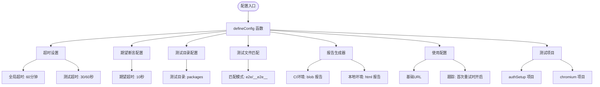
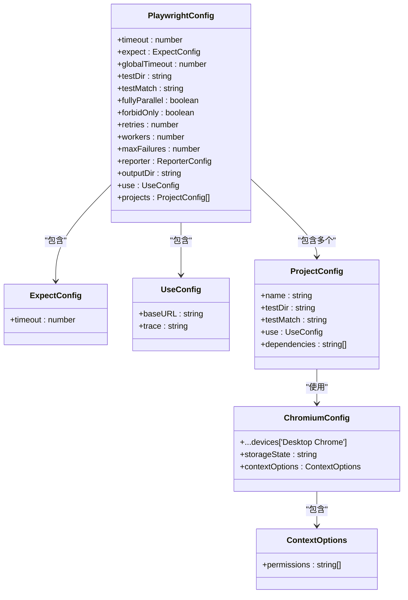
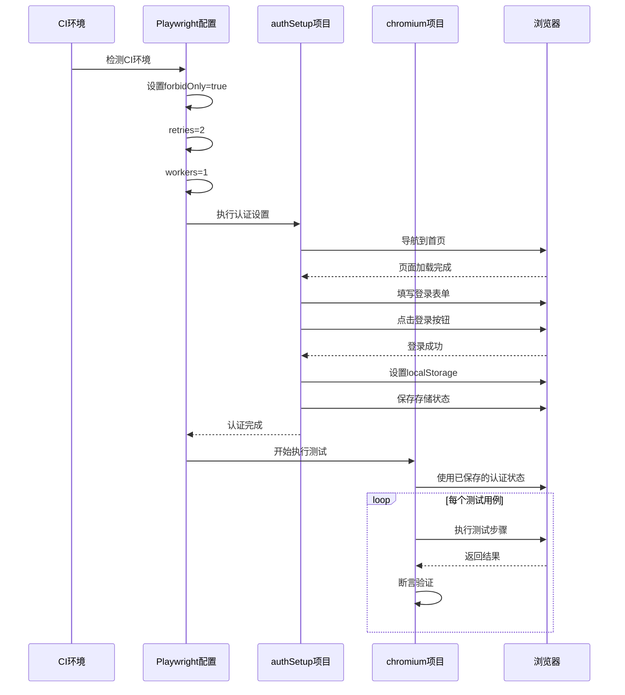
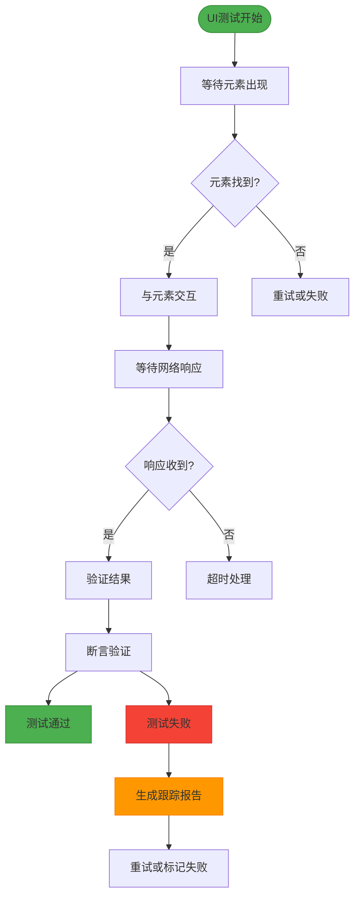
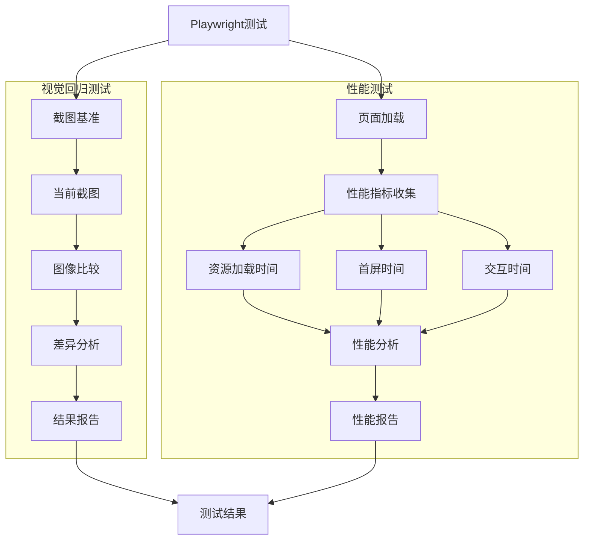
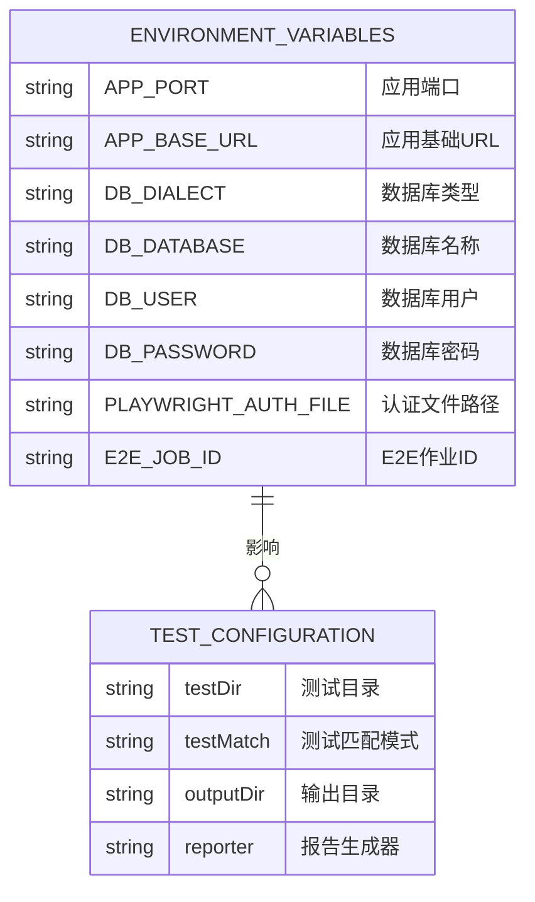

# Playwright 配置

<cite>
**本文档中引用的文件**  
- [playwright.config.ts](file://playwright.config.ts)
- [packages/core/test/src/e2e/defineConfig.ts](file://packages/core/test/src/e2e/defineConfig.ts)
- [packages/core/test/src/e2e/e2eUtils.ts](file://packages/core/test/src/e2e/e2eUtils.ts)
- [packages/core/test/playwright/tests/auth.setup.ts](file://packages/core/test/playwright/tests/auth.setup.ts)
- [packages/core/test/package.json](file://packages/core/test/package.json)
- [.env.e2e.example](file://.env.e2e.example)
</cite>

## 目录
1. [简介](#简介)
2. [核心配置选项](#核心配置选项)
3. [多浏览器测试环境配置](#多浏览器测试环境配置)
4. [测试项目组织与环境配置](#测试项目组织与环境配置)
5. [UI交互测试配置最佳实践](#ui交互测试配置最佳实践)
6. [视觉回归与性能测试集成](#视觉回归与性能测试集成)
7. [环境变量与外部配置](#环境变量与外部配置)

## 简介
Playwright 是 NocoBase 项目中用于端到端测试的核心框架。本配置文档详细介绍了 `playwright.config.ts` 文件中的各项配置选项，包括浏览器类型选择、测试执行模式、视频录制和截图配置等。通过本配置，开发者可以有效地组织多浏览器测试环境，实现跨浏览器兼容性测试，并优化UI交互测试的等待策略、超时设置和网络拦截配置。

## 核心配置选项

Playwright 配置通过 `@nocobase/test/e2e` 模块中的 `defineConfig` 函数进行定义。该配置包含了超时设置、期望断言配置、测试目录匹配规则等关键参数。配置中设置了全局超时时间为60分钟，测试超时时间根据是否在CI环境中运行而动态调整（CI环境为60秒，本地为30秒）。

**图源**  
- [packages/core/test/src/e2e/defineConfig.ts](file://packages/core/test/src/e2e/defineConfig.ts#L12-L76)

**本节来源**  
- [playwright.config.ts](file://playwright.config.ts#L1-L4)
- [packages/core/test/src/e2e/defineConfig.ts](file://packages/core/test/src/e2e/defineConfig.ts#L12-L76)

## 多浏览器测试环境配置

NocoBase 的 Playwright 配置支持多浏览器测试环境，通过 `projects` 配置项实现。当前配置主要针对 Chromium 浏览器，但通过 Playwright 的设备模拟功能，可以轻松扩展到其他浏览器类型。配置中使用了 `devices['Desktop Chrome']` 来模拟桌面版 Chrome 浏览器的环境。

测试项目中的 `chromium` 项目配置了特定的上下文选项，包括剪贴板读写权限，这对于测试涉及剪贴板操作的功能至关重要。同时，通过 `storageState` 配置，实现了登录状态的持久化，避免了每次测试都需要重新登录的开销。

**图源**  
- [packages/core/test/src/e2e/defineConfig.ts](file://packages/core/test/src/e2e/defineConfig.ts#L56-L74)

**本节来源**  
- [packages/core/test/src/e2e/defineConfig.ts](file://packages/core/test/src/e2e/defineConfig.ts#L56-L74)
- [packages/core/test/playwright/tests/auth.setup.ts](file://packages/core/test/playwright/tests/auth.setup.ts#L4-L21)

## 测试项目组织与环境配置

Playwright 配置通过测试项目（test projects）的方式组织测试流程。当前配置定义了两个主要的测试项目：`authSetup` 和 `chromium`。`authSetup` 项目专门用于设置认证状态，而 `chromium` 项目则依赖于 `authSetup` 项目，确保所有测试都在已认证的状态下运行。

这种项目依赖关系的配置方式，实现了测试环境的预设置，大大提高了测试效率。通过 `dependencies` 字段，Playwright 能够确保 `authSetup` 项目在 `chromium` 项目之前执行，从而为后续测试提供必要的认证状态。

**图源**  
- [packages/core/test/src/e2e/defineConfig.ts](file://packages/core/test/src/e2e/defineConfig.ts#L57-L74)
- [packages/core/test/playwright/tests/auth.setup.ts](file://packages/core/test/playwright/tests/auth.setup.ts#L4-L21)

**本节来源**  
- [packages/core/test/src/e2e/defineConfig.ts](file://packages/core/test/src/e2e/defineConfig.ts#L57-L74)
- [packages/core/test/playwright/tests/auth.setup.ts](file://packages/core/test/playwright/tests/auth.setup.ts#L4-L21)

## UI交互测试配置最佳实践

在UI交互测试中，合理的等待策略、超时设置和网络拦截配置是确保测试稳定性的关键。NocoBase 的 Playwright 配置通过 `expect` 配置项设置了10秒的期望超时时间，这为元素查找和状态验证提供了足够的时间。

配置中启用了跟踪功能（`trace: 'on-first-retry'`），这在测试失败时能够提供详细的执行记录，帮助开发者快速定位问题。同时，通过 `process.env.CI` 环境变量的判断，实现了CI环境和本地环境的不同配置策略，如CI环境中禁用 `test.only`、增加重试次数等。

**图源**  
- [packages/core/test/src/e2e/defineConfig.ts](file://packages/core/test/src/e2e/defineConfig.ts#L14-L18)
- [packages/core/test/src/e2e/defineConfig.ts#L53](file://packages/core/test/src/e2e/defineConfig.ts#L53)

**本节来源**  
- [packages/core/test/src/e2e/defineConfig.ts](file://packages/core/test/src/e2e/defineConfig.ts#L14-L18)
- [packages/core/test/src/e2e/defineConfig.ts#L53](file://packages/core/test/src/e2e/defineConfig.ts#L53)

## 视觉回归与性能测试集成

虽然当前配置未直接包含视觉回归测试和性能测试的集成，但通过 Playwright 的扩展能力，可以轻松实现这些功能。例如，可以通过自定义测试扩展来集成视觉回归测试库，或通过性能API来收集和分析页面性能指标。

Playwright 的 `request` 模块可用于模拟API调用，这对于性能测试中的负载测试和压力测试非常有用。同时，通过 `page.evaluate` 方法，可以直接在浏览器上下文中执行JavaScript代码，获取详细的性能数据。

**图源**  
- [packages/core/test/src/e2e/e2eUtils.ts](file://packages/core/test/src/e2e/e2eUtils.ts#L11-L14)
- [packages/core/test/src/e2e/e2eUtils.ts#L502-L508](file://packages/core/test/src/e2e/e2eUtils.ts#L502-L508)

**本节来源**  
- [packages/core/test/src/e2e/e2eUtils.ts](file://packages/core/test/src/e2e/e2eUtils.ts#L11-L14)
- [packages/core/test/src/e2e/e2eUtils.ts#L502-L508)

## 环境变量与外部配置

Playwright 配置与环境变量紧密结合，通过 `.env.e2e.example` 文件定义了测试所需的各项环境变量。这些变量包括应用端口、数据库配置、认证文件路径等，使得测试配置能够适应不同的运行环境。

`APP_BASE_URL` 环境变量用于设置测试的基础URL，`PLAYWRIGHT_AUTH_FILE` 用于指定认证状态的存储文件。这些环境变量的使用，使得测试配置更加灵活，能够在不同环境中无缝切换。

**图源**  
- [.env.e2e.example](file://.env.e2e.example#L13-L42)
- [packages/core/test/src/e2e/defineConfig.ts#L51](file://packages/core/test/src/e2e/defineConfig.ts#L51)

**本节来源**  
- [.env.e2e.example](file://.env.e2e.example#L13-L42)
- [packages/core/test/src/e2e/defineConfig.ts#L51](file://packages/core/test/src/e2e/defineConfig.ts#L51)