# Vitest 配置

<cite>
**本文档中引用的文件**  
- [vitest.config.mts](file://vitest.config.mts)
- [packages/core/test/vitest.mjs](file://packages/core/test/vitest.mjs)
- [packages/core/test/setup/client.ts](file://packages/core/test/setup/client.ts)
- [packages/core/test/setup/server.ts](file://packages/core/test/setup/server.ts)
- [package.json](file://package.json)
- [tsconfig.json](file://tsconfig.json)
</cite>

## 目录
1. [简介](#简介)
2. [项目结构与测试组织](#项目结构与测试组织)
3. [核心配置详解](#核心配置详解)
4. [测试环境配置](#测试环境配置)
5. [模块模拟与别名处理](#模块模拟与别名处理)
6. [覆盖率报告配置](#覆盖率报告配置)
7. [测试匹配模式](#测试匹配模式)
8. [TypeScript 与 ES 模块支持](#typescript-与-es-模块支持)
9. [不同测试类型的配置示例](#不同测试类型的配置示例)
10. [测试钩子与全局设置](#测试钩子与全局设置)
11. [性能优化配置](#性能优化配置)
12. [常见问题与调试技巧](#常见问题与调试技巧)

## 简介
本文档详细介绍了 NocoBase 项目中 Vitest 测试框架的配置方案。通过分析 `vitest.config.mts` 文件及其相关实现，深入解析了测试配置的各个关键部分，包括测试环境设置、模块别名处理、覆盖率报告、测试匹配模式等。文档还提供了针对不同类型测试的配置示例，以及性能优化和问题排查的实用建议。

**Section sources**
- [vitest.config.mts](file://vitest.config.mts#L1-L4)
- [packages/core/test/vitest.mjs](file://packages/core/test/vitest.mjs#L1-L271)

## 项目结构与测试组织
NocoBase 项目采用 Lerna 管理的多包结构，测试文件主要分布在各个包的 `src/__tests__` 目录下。项目通过 Vitest 进行单元测试和集成测试，配置文件位于项目根目录。

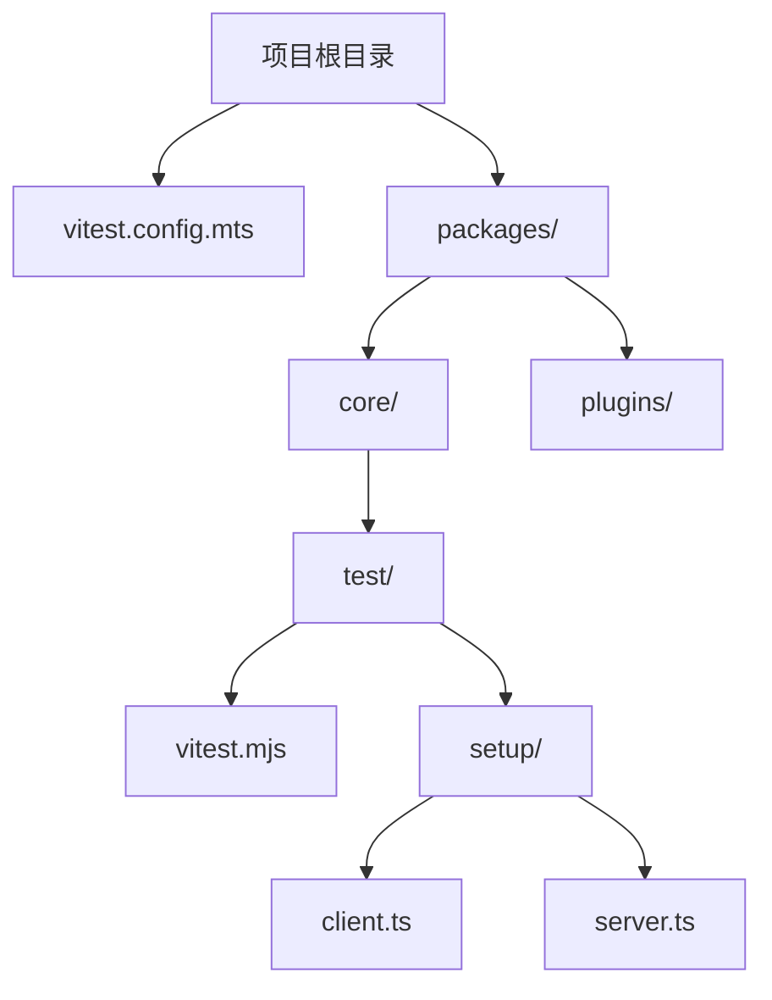

**Diagram sources**
- [vitest.config.mts](file://vitest.config.mts#L1-L4)
- [packages/core/test/vitest.mjs](file://packages/core/test/vitest.mjs#L1-L271)

**Section sources**
- [vitest.config.mts](file://vitest.config.mts#L1-L4)
- [packages/core/test/vitest.mjs](file://packages/core/test/vitest.mjs#L1-L271)

## 核心配置详解
Vitest 配置通过 `@nocobase/test/vitest.mjs` 文件中的 `defineConfig` 函数实现。该函数根据环境变量 `TEST_ENV` 的值，合并通用配置与特定环境配置。

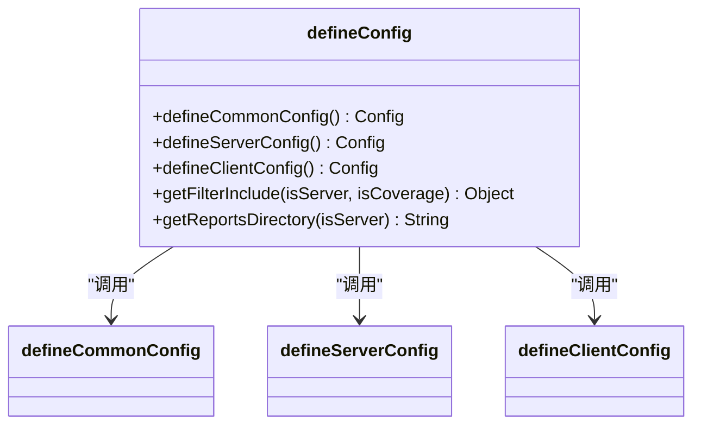

**Diagram sources**
- [packages/core/test/vitest.mjs](file://packages/core/test/vitest.mjs#L229-L270)

**Section sources**
- [packages/core/test/vitest.mjs](file://packages/core/test/vitest.mjs#L229-L270)

## 测试环境配置
测试环境配置分为服务端和客户端两种模式，通过 `TEST_ENV` 环境变量进行区分。服务端测试使用 Node.js 环境，客户端测试使用 jsdom 环境。

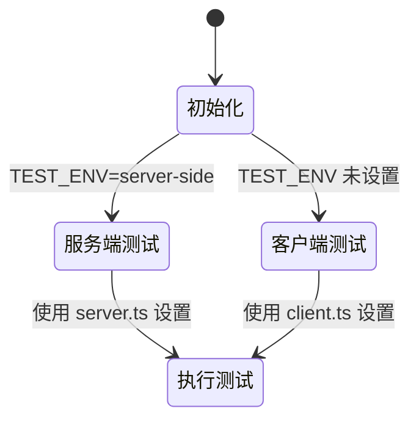

**Diagram sources**
- [packages/core/test/vitest.mjs](file://packages/core/test/vitest.mjs#L230-L232)
- [packages/core/test/setup/server.ts](file://packages/core/test/setup/server.ts#L1-L6)
- [packages/core/test/setup/client.ts](file://packages/core/test/setup/client.ts#L1-L68)

**Section sources**
- [packages/core/test/vitest.mjs](file://packages/core/test/vitest.mjs#L115-L151)
- [packages/core/test/setup/server.ts](file://packages/core/test/setup/server.ts#L1-L6)
- [packages/core/test/setup/client.ts](file://packages/core/test/setup/client.ts#L1-L68)

## 模块模拟与别名处理
配置通过 `tsConfigPathsToAlias` 函数将 TypeScript 的路径映射转换为 Vite 的别名配置，支持模块的路径别名解析。

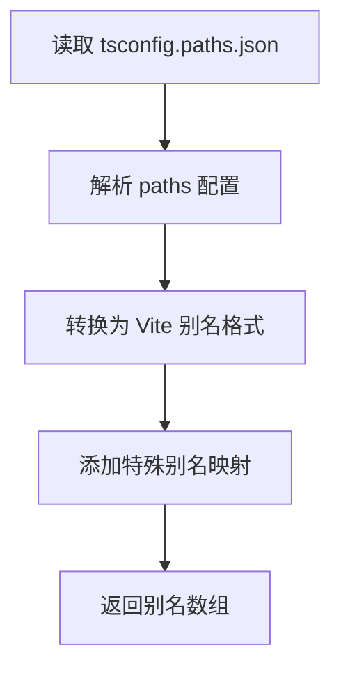

**Diagram sources**
- [packages/core/test/vitest.mjs](file://packages/core/test/vitest.mjs#L18-L50)

**Section sources**
- [packages/core/test/vitest.mjs](file://packages/core/test/vitest.mjs#L18-L50)

## 覆盖率报告配置
覆盖率配置使用 Istanbul 作为提供者，包含详细的包含和排除规则，确保只对源代码进行覆盖率分析。

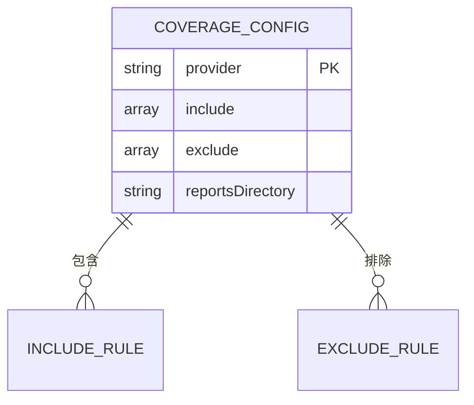

**Diagram sources**
- [packages/core/test/vitest.mjs](file://packages/core/test/vitest.mjs#L86-L103)

**Section sources**
- [packages/core/test/vitest.mjs](file://packages/core/test/vitest.mjs#L86-L103)

## 测试匹配模式
测试匹配模式通过 `include` 和 `exclude` 配置项定义，精确控制哪些文件被纳入测试范围。

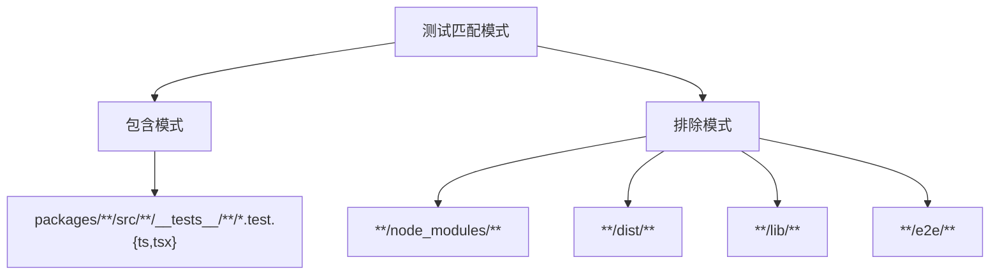

**Diagram sources**
- [packages/core/test/vitest.mjs](file://packages/core/test/vitest.mjs#L64-L85)

**Section sources**
- [packages/core/test/vitest.mjs](file://packages/core/test/vitest.mjs#L64-L85)

## TypeScript 与 ES 模块支持
项目通过 `tsconfig.json` 配置 TypeScript 编译选项，支持 ES 模块和现代 JavaScript 特性。

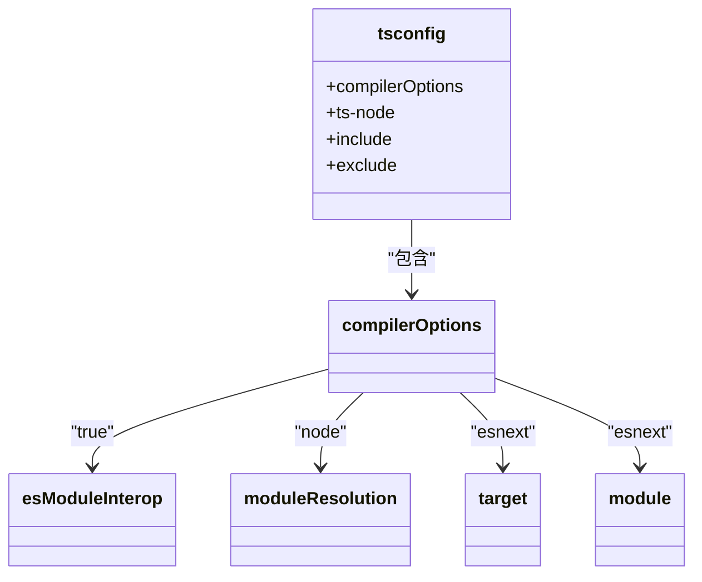

**Diagram sources**
- [tsconfig.json](file://tsconfig.json#L1-L37)

**Section sources**
- [tsconfig.json](file://tsconfig.json#L1-L37)

## 不同测试类型的配置示例
项目提供了针对不同测试类型（单元测试、集成测试）的配置示例，通过不同的脚本命令调用。

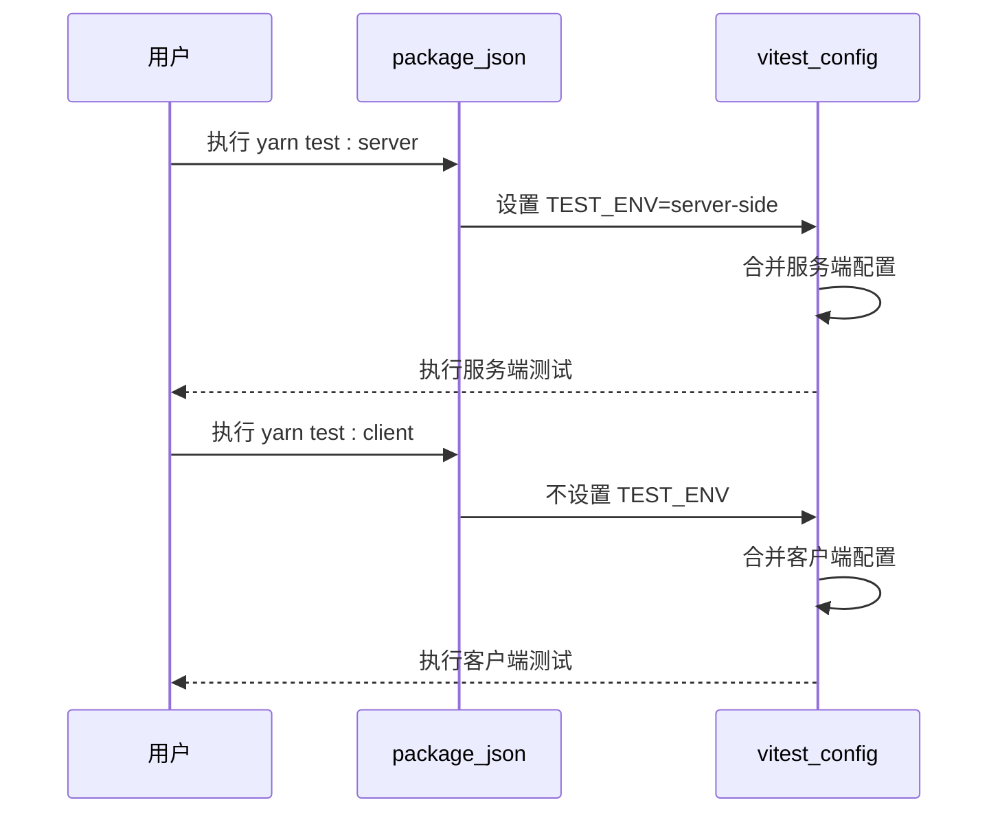

**Diagram sources**
- [package.json](file://package.json#L28-L31)
- [packages/core/test/vitest.mjs](file://packages/core/test/vitest.mjs#L230-L232)

**Section sources**
- [package.json](file://package.json#L28-L31)
- [packages/core/test/vitest.mjs](file://packages/core/test/vitest.mjs#L230-L232)

## 测试钩子与全局设置
通过 setupFiles 配置项引入测试钩子文件，进行全局测试环境的初始化设置。

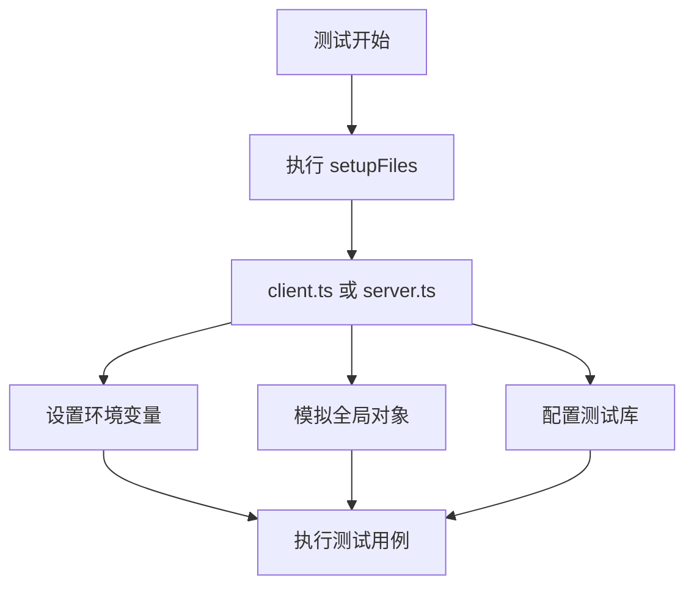

**Diagram sources**
- [packages/core/test/setup/client.ts](file://packages/core/test/setup/client.ts#L1-L68)
- [packages/core/test/setup/server.ts](file://packages/core/test/setup/server.ts#L1-L6)

**Section sources**
- [packages/core/test/setup/client.ts](file://packages/core/test/setup/client.ts#L1-L68)
- [packages/core/test/setup/server.ts](file://packages/core/test/setup/server.ts#L1-L6)

## 性能优化配置
配置中包含多项性能优化设置，如超时时间、并行执行和缓存配置。

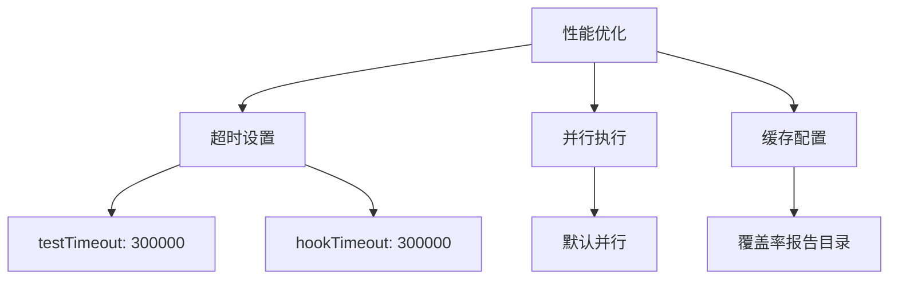

**Diagram sources**
- [packages/core/test/vitest.mjs](file://packages/core/test/vitest.mjs#L61-L62)
- [packages/core/test/vitest.mjs](file://packages/core/test/vitest.mjs#L264-L267)

**Section sources**
- [packages/core/test/vitest.mjs](file://packages/core/test/vitest.mjs#L61-L62)
- [packages/core/test/vitest.mjs](file://packages/core/test/vitest.mjs#L264-L267)

## 常见问题与调试技巧
针对常见的测试配置问题，提供以下调试技巧：

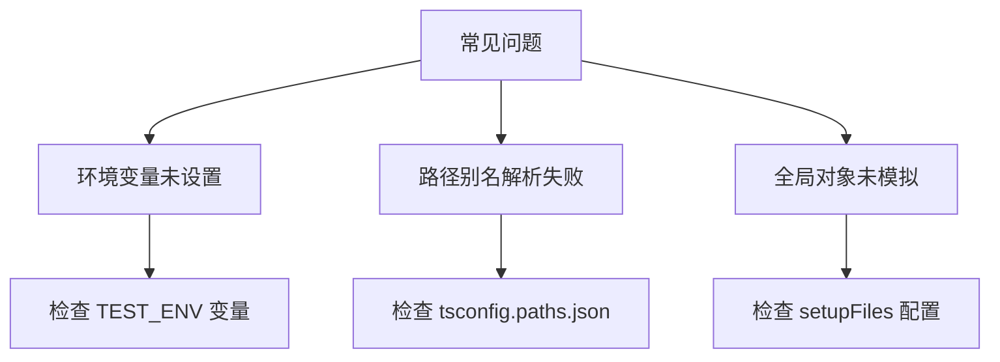

**Diagram sources**
- [packages/core/test/vitest.mjs](file://packages/core/test/vitest.mjs#L230-L232)
- [packages/core/test/setup/client.ts](file://packages/core/test/setup/client.ts#L1-L68)

**Section sources**
- [packages/core/test/vitest.mjs](file://packages/core/test/vitest.mjs#L230-L232)
- [packages/core/test/setup/client.ts](file://packages/core/test/setup/client.ts#L1-L68)