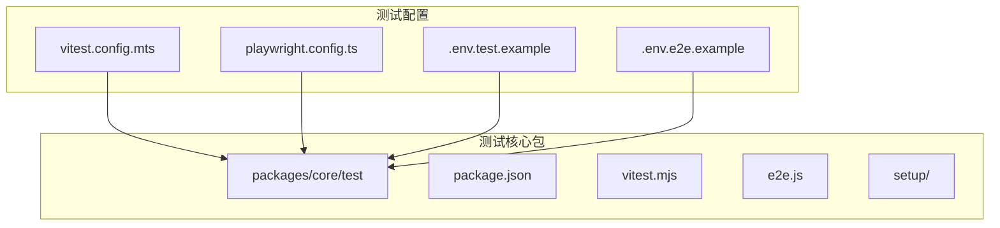
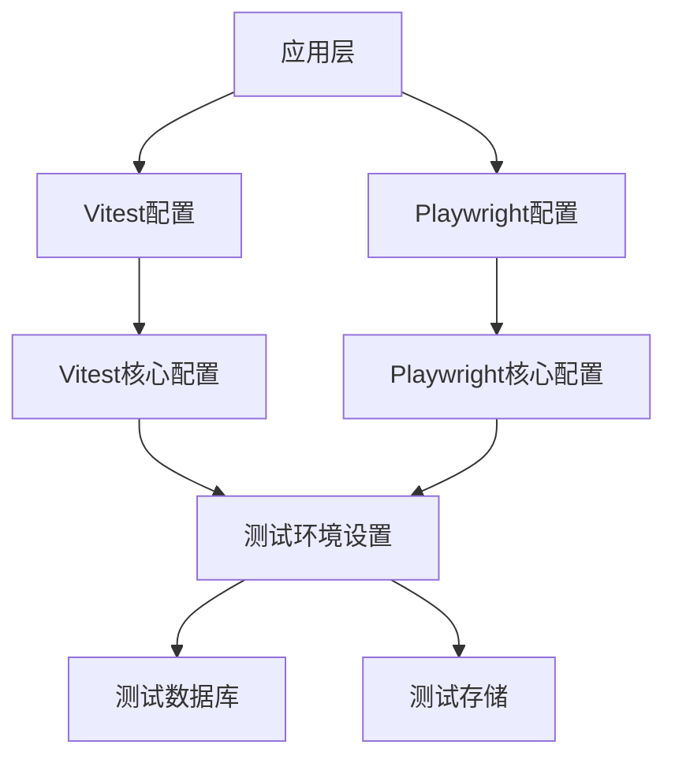
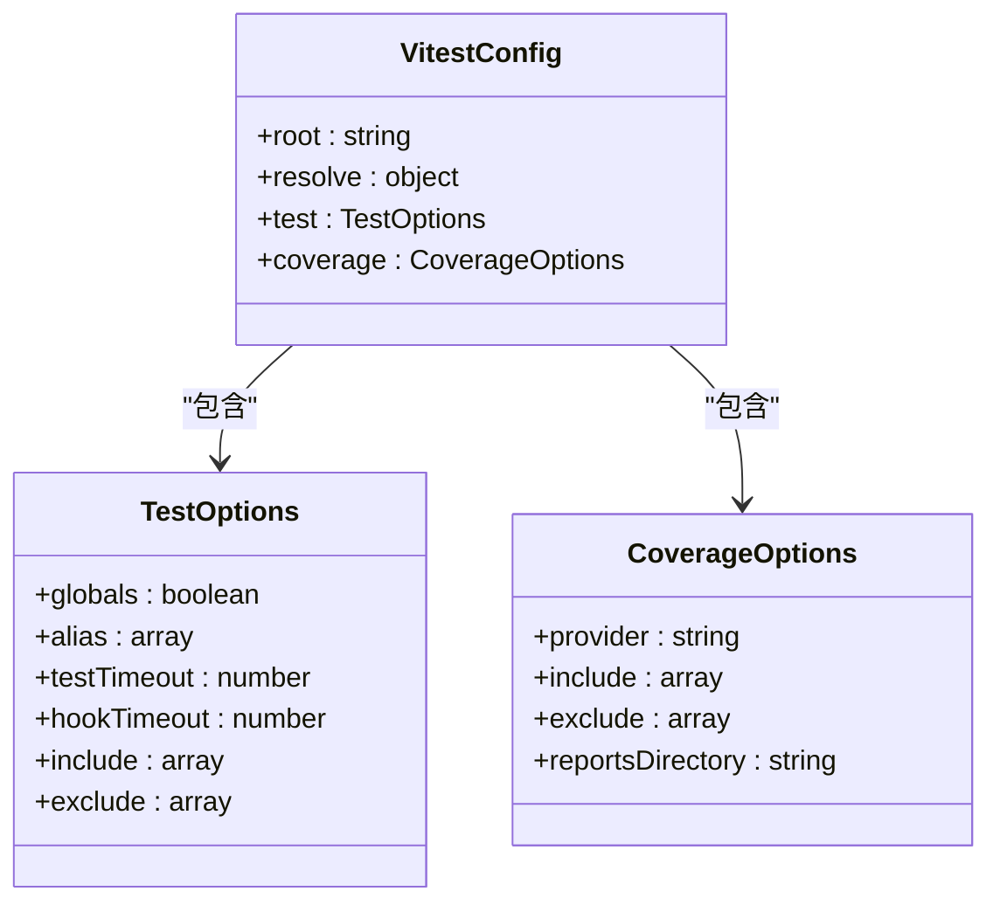
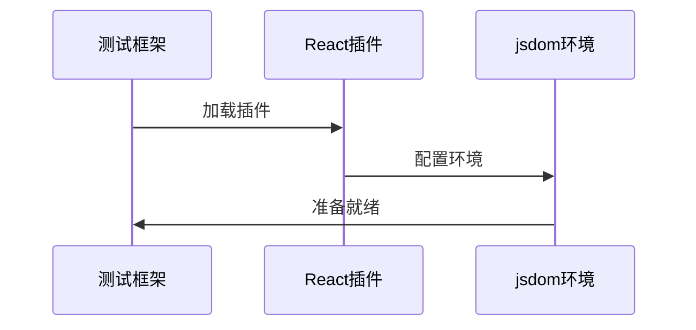
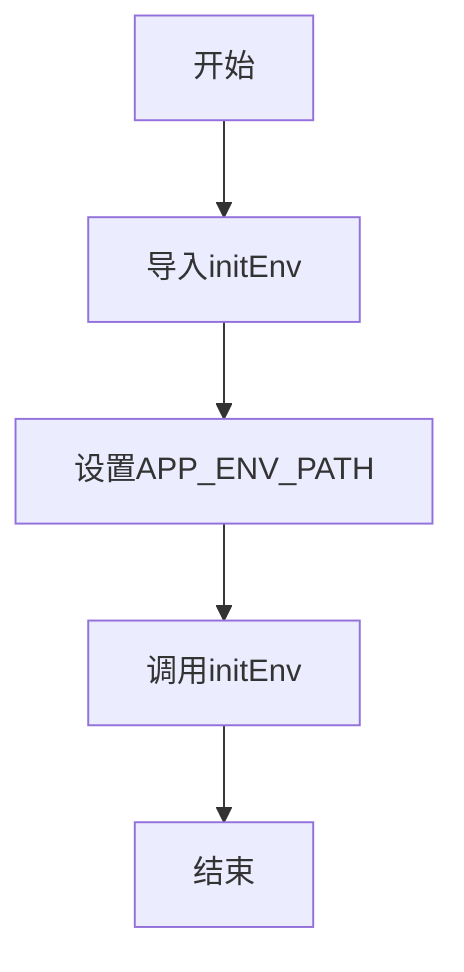
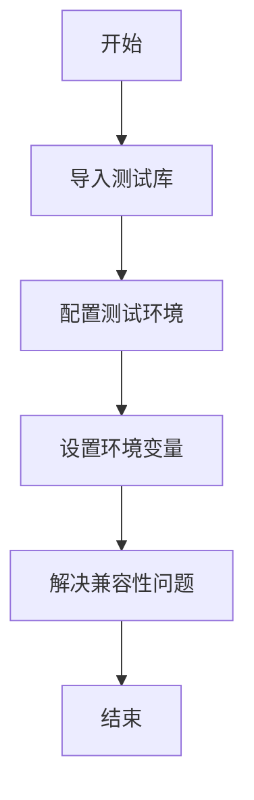

# 测试工具配置

<cite>
**本文档中引用的文件**  
- [vitest.config.mts](file://vitest.config.mts)
- [playwright.config.ts](file://playwright.config.ts)
- [packages/core/test/package.json](file://packages/core/test/package.json)
- [packages/core/test/vitest.mjs](file://packages/core/test/vitest.mjs)
- [packages/core/test/e2e.js](file://packages/core/test/e2e.js)
- [.env.test.example](file://.env.test.example)
- [.env.e2e.example](file://.env.e2e.example)
- [packages/core/test/setup/server.ts](file://packages/core/test/setup/server.ts)
- [packages/core/test/setup/client.ts](file://packages/core/test/setup/client.ts)
- [packages/core/acl/src/__tests__/acl.test.ts](file://packages/core/acl/src/__tests__/acl.test.ts)
</cite>

## 目录
1. [简介](#简介)
2. [项目结构](#项目结构)
3. [核心组件](#核心组件)
4. [架构概述](#架构概述)
5. [详细组件分析](#详细组件分析)
6. [依赖分析](#依赖分析)
7. [性能考虑](#性能考虑)
8. [故障排除指南](#故障排除指南)
9. [结论](#结论)

## 简介
本文档全面介绍了NocoBase项目的测试工具配置，重点涵盖Vitest和Playwright两大测试框架的配置与使用。文档详细说明了测试环境的设置、覆盖率报告的生成、测试执行参数的配置，以及如何配置测试数据库和存储以确保测试环境的隔离性。此外，还提供了测试工具链集成的指导，包括与开发环境和CI/CD系统的集成方法，并包含调试测试用例的技巧和常见配置问题的解决方案。

## 项目结构
NocoBase项目的测试工具配置主要集中在`packages/core/test`目录下，同时在项目根目录提供了环境变量模板文件。测试配置遵循模块化设计，通过不同的配置文件和设置文件来支持单元测试、集成测试和端到端测试。



**图示来源**
- [vitest.config.mts](file://vitest.config.mts)
- [playwright.config.ts](file://playwright.config.ts)
- [packages/core/test](file://packages/core/test)

**本节来源**
- [vitest.config.mts](file://vitest.config.mts)
- [playwright.config.ts](file://playwright.config.ts)
- [.env.test.example](file://.env.test.example)
- [.env.e2e.example](file://.env.e2e.example)

## 核心组件
NocoBase的测试工具配置以`@nocobase/test`包为核心，该包提供了Vitest和Playwright的预配置，简化了测试环境的搭建。Vitest作为主要的单元测试和集成测试框架，配置了服务器端和客户端两种测试环境。Playwright则用于端到端测试，支持浏览器自动化测试和UI交互测试。

**本节来源**
- [packages/core/test/package.json](file://packages/core/test/package.json)
- [packages/core/test/vitest.mjs](file://packages/core/test/vitest.mjs)
- [packages/core/test/e2e.js](file://packages/core/test/e2e.js)

## 架构概述
NocoBase的测试架构采用分层设计，上层通过简单的配置文件调用底层的测试框架配置。这种设计使得开发者可以快速启动测试，同时保留了足够的灵活性来定制测试行为。



**图示来源**
- [vitest.config.mts](file://vitest.config.mts)
- [playwright.config.ts](file://playwright.config.ts)
- [packages/core/test/vitest.mjs](file://packages/core/test/vitest.mjs)

## 详细组件分析

### Vitest配置分析
Vitest配置通过`vitest.config.mts`文件导入`@nocobase/test/vitest.mjs`中的预配置，实现了开箱即用的测试环境。配置文件支持服务器端和客户端两种测试模式，通过环境变量`TEST_ENV`来区分。

#### 配置特点


**图示来源**
- [packages/core/test/vitest.mjs](file://packages/core/test/vitest.mjs#L52-L271)

#### 服务器端测试配置
服务器端测试配置主要通过`defineServerConfig`函数实现，设置了服务器端测试的特定选项，包括测试文件的设置和排除规则。

**本节来源**
- [packages/core/test/vitest.mjs](file://packages/core/test/vitest.mjs#L115-L126)

#### 客户端测试配置
客户端测试配置通过`defineClientConfig`函数实现，特别配置了React插件和jsdom环境，以支持前端组件的测试。



**图示来源**
- [packages/core/test/vitest.mjs](file://packages/core/test/vitest.mjs#L128-L151)

### Playwright配置分析
Playwright配置与Vitest类似，通过`playwright.config.ts`文件导入`@nocobase/test/e2e`中的预配置，实现了端到端测试的快速启动。

**本节来源**
- [playwright.config.ts](file://playwright.config.ts)
- [packages/core/test/e2e.js](file://packages/core/test/e2e.js)

### 测试环境设置
测试环境通过专门的设置文件进行配置，确保测试环境的正确性和一致性。

#### 服务器端测试设置
服务器端测试通过`setup/server.ts`文件进行设置，主要配置了测试环境变量和初始化环境。



**图示来源**
- [packages/core/test/setup/server.ts](file://packages/core/test/setup/server.ts)

#### 客户端测试设置
客户端测试通过`setup/client.ts`文件进行设置，配置了测试库和环境变量，并解决了常见的测试环境问题。



**图示来源**
- [packages/core/test/setup/client.ts](file://packages/core/test/setup/client.ts)

## 依赖分析
NocoBase的测试工具配置依赖于多个外部库和内部包，形成了一个完整的测试生态系统。

```mermaid
graph LR
A[Vitest] --> B[@vitest/coverage-istanbul]
A --> C[@vitejs/plugin-react]
A --> D[jsdom]
E[Playwright] --> F[@playwright/test]
G[@nocobase/test] --> A
G --> E
H[应用] --> G
```

**图示来源**
- [packages/core/test/package.json](file://packages/core/test/package.json)

**本节来源**
- [packages/core/test/package.json](file://packages/core/test/package.json)

## 性能考虑
在测试配置中，性能是一个重要的考虑因素。Vitest配置中设置了较长的测试超时时间（300000毫秒），以应对复杂的测试场景。覆盖率报告的生成也进行了优化，通过排除不必要的文件来提高生成效率。

## 故障排除指南
在使用NocoBase测试工具时，可能会遇到一些常见问题，以下是一些解决方案：

- **问题：测试环境变量未正确加载**
  - **解决方案**：确保在`setup/server.ts`中正确设置了`APP_ENV_PATH`环境变量，并调用了`initEnv()`函数。

- **问题：客户端测试中出现window.matchMedia未定义错误**
  - **解决方案**：在`setup/client.ts`中已经通过mock实现了`window.matchMedia`，确保正确导入了该设置文件。

- **问题：覆盖率报告生成路径错误**
  - **解决方案**：检查`getReportsDirectory`函数的实现，确保测试文件路径正确解析。

**本节来源**
- [packages/core/test/setup/server.ts](file://packages/core/test/setup/server.ts)
- [packages/core/test/setup/client.ts](file://packages/core/test/setup/client.ts)
- [packages/core/test/vitest.mjs](file://packages/core/test/vitest.mjs#L209-L227)

## 结论
NocoBase的测试工具配置提供了一套完整且灵活的测试解决方案，通过Vitest和Playwright两大框架的支持，能够满足从单元测试到端到端测试的各种需求。配置的模块化设计使得开发者可以快速上手，同时保留了足够的定制空间。通过合理的测试环境设置和数据库配置，确保了测试的隔离性和可靠性。整体测试架构设计合理，为NocoBase项目的质量保证提供了坚实的基础。