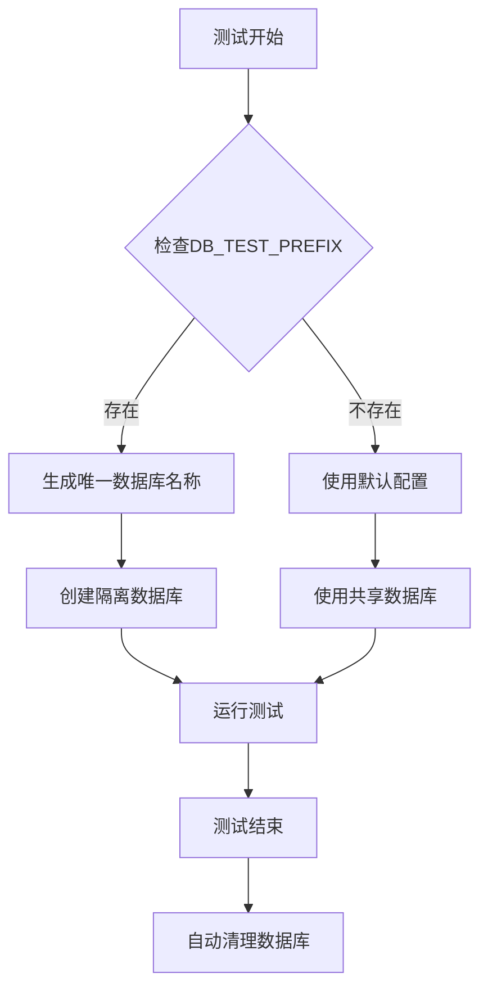
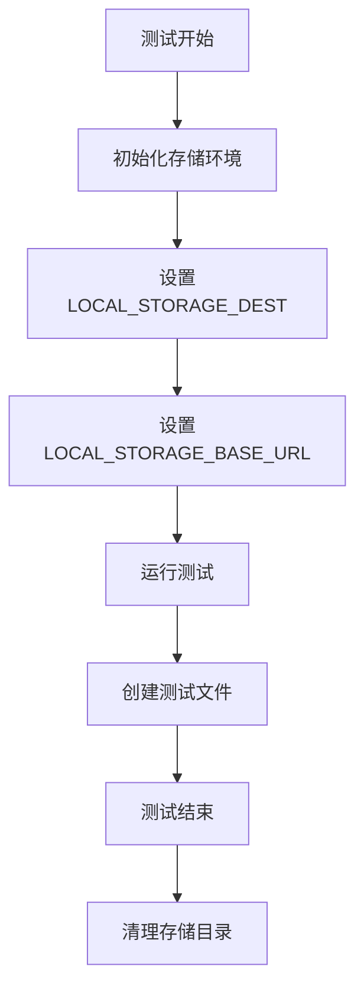
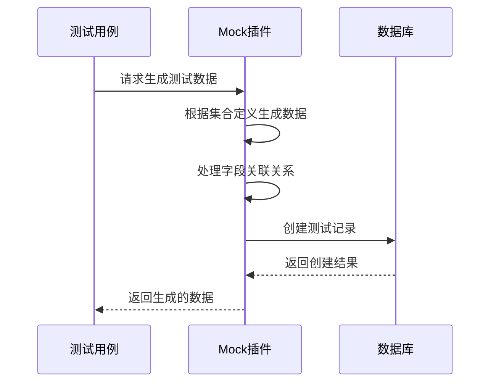
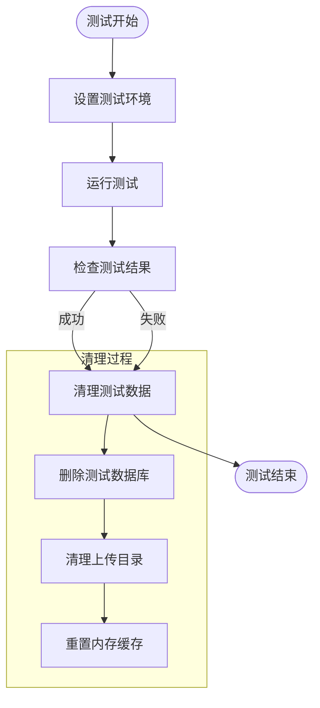
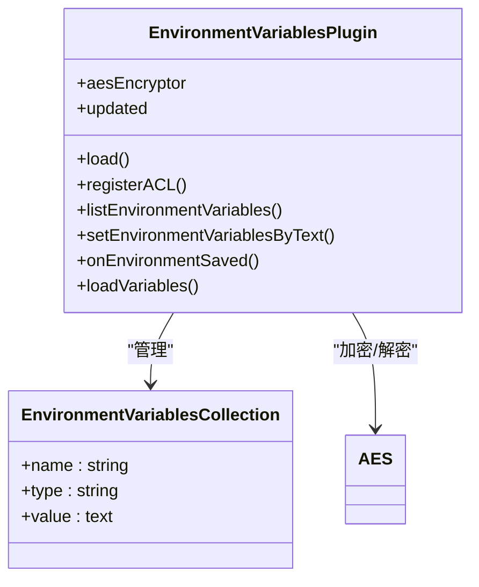
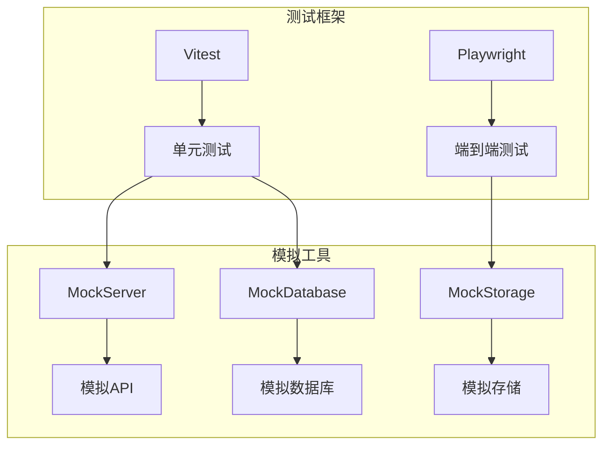
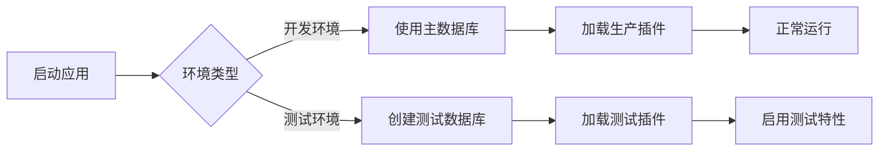
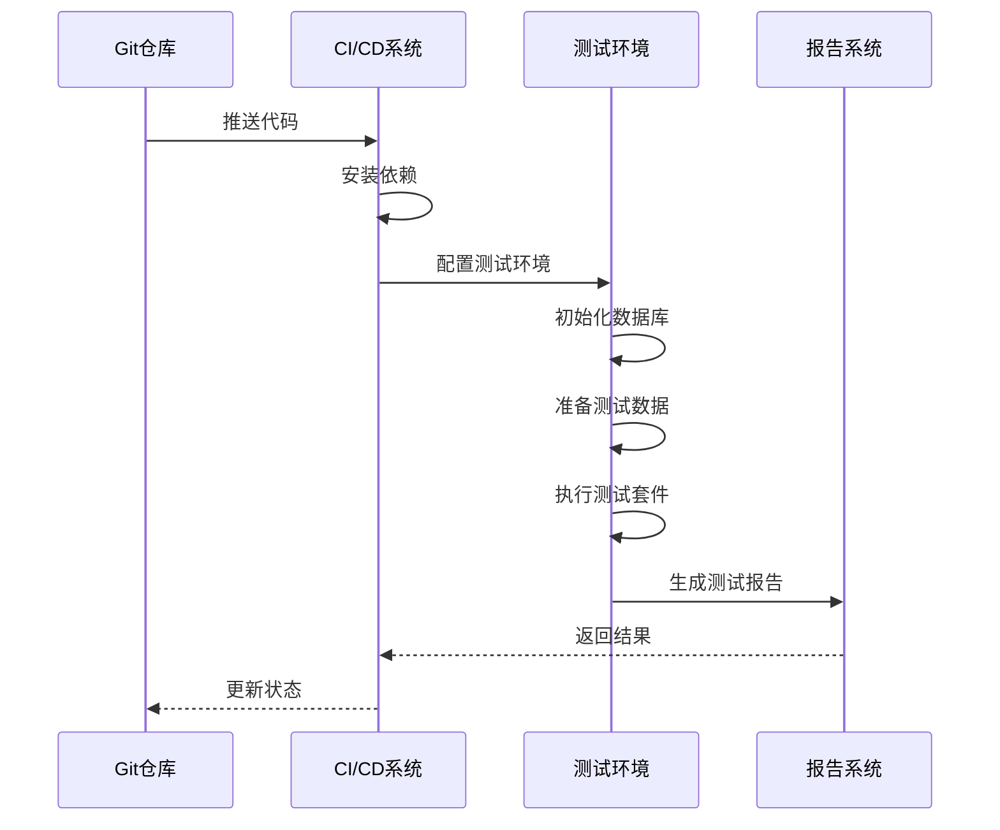

# 测试环境配置

<cite>
**本文档中引用的文件**  
- [.env.test.example](file://.env.test.example)
- [.env.e2e.example](file://.env.e2e.example)
- [vitest.config.mts](file://vitest.config.mts)
- [playwright.config.ts](file://playwright.config.ts)
- [packages/core/test/vitest.mjs](file://packages/core/test/vitest.mjs)
- [packages/core/test/src/scripts/test-db-creator.ts](file://packages/core/test/src/scripts/test-db-creator.ts)
- [packages/core/test/src/scripts/test-db-distributor.ts](file://packages/core/test/src/scripts/test-db-distributor.ts)
- [packages/core/database/src/mock-database.ts](file://packages/core/database/src/mock-database.ts)
- [packages/core/test/src/e2e/e2eUtils.ts](file://packages/core/test/src/e2e/e2eUtils.ts)
- [packages/plugins/@nocobase/plugin-mock-collections/src/server/index.ts](file://packages/plugins/@nocobase/plugin-mock-collections/src/server/index.ts)
- [packages/plugins/@nocobase/plugin-environment-variables/src/server/plugin.ts](file://packages/plugins/@nocobase/plugin-environment-variables/src/server/plugin.ts)
- [packages/plugins/@nocobase/plugin-environment-variables/src/server/collections/environmentVariables.ts](file://packages/plugins/@nocobase/plugin-environment-variables/src/server/collections/environmentVariables.ts)
- [packages/plugins/@nocobase/plugin-workflow-test/src/server/index.ts](file://packages/plugins/@nocobase/plugin-workflow-test/src/server/index.ts)
- [packages/core/test/src/server/mock-server.ts](file://packages/core/test/src/server/mock-server.ts)
</cite>

## 目录
1. [简介](#简介)
2. [测试数据库配置](#测试数据库配置)
3. [存储环境配置](#存储环境配置)
4. [测试数据准备与清理策略](#测试数据准备与清理策略)
5. [测试环境变量管理](#测试环境变量管理)
6. [内存数据库与模拟服务配置](#内存数据库与模拟服务配置)
7. [测试环境与开发环境差异对比](#测试环境与开发环境差异对比)
8. [CI/CD流水线中的环境配置](#cicd流水线中的环境配置)
9. [总结](#总结)

## 简介
NocoBase提供了一套完整的测试环境配置方案，确保测试的可靠性和可重复性。本文档详细介绍了如何配置隔离的测试数据库和存储环境，以及测试数据的准备和清理策略。文档还涵盖了测试环境变量管理的最佳实践，包括敏感信息的处理，以及如何配置内存数据库和模拟服务以提高测试速度。

**测试环境配置的核心目标是确保测试的隔离性、可靠性和可重复性**。通过使用独立的数据库实例、隔离的存储目录和自动化的数据准备与清理机制，NocoBase确保了每个测试都在一个干净、一致的环境中运行。

## 测试数据库配置
NocoBase通过环境变量和自动化脚本实现测试数据库的隔离配置。测试环境使用独立的数据库实例，避免与开发和生产环境相互影响。

### 数据库隔离机制
测试数据库的隔离通过以下机制实现：
- 使用独立的数据库前缀（`DB_TEST_PREFIX`）为每个测试实例创建唯一的数据库名称
- 自动创建和销毁测试数据库，确保测试间的隔离性
- 支持多种数据库类型（SQLite、PostgreSQL、MySQL）



**Diagram sources**
- [.env.test.example](file://.env.test.example#L14-L21)
- [packages/core/database/src/mock-database.ts](file://packages/core/database/src/mock-database.ts#L77-L104)
- [packages/core/test/src/scripts/test-db-creator.ts](file://packages/core/test/src/scripts/test-db-creator.ts#L10-L99)

### 数据库配置文件
测试环境的数据库配置主要通过`.env.test.example`文件定义：

```env
DB_DIALECT=sqlite
DB_STORAGE=storage/db/nocobase-test.sqlite
DB_HOST=localhost
DB_PORT=5432
DB_DATABASE=nocobase-test
DB_USER=nocobase
DB_PASSWORD=nocobase
```

这些配置在运行测试时会被加载，确保测试使用正确的数据库连接信息。

**Section sources**
- [.env.test.example](file://.env.test.example#L14-L21)
- [.env.e2e.example](file://.env.e2e.example#L35-L43)

## 存储环境配置
NocoBase的测试环境配置了独立的存储目录，确保测试文件不会影响开发或生产环境的数据。

### 存储隔离策略
测试环境使用独立的存储路径，通过以下方式实现隔离：
- 为测试环境配置独立的上传目录
- 使用不同的URL前缀区分测试和生产文件
- 自动清理测试期间创建的文件



**Diagram sources**
- [.env.test.example](file://.env.test.example#L37-L42)
- [.env.e2e.example](file://.env.e2e.example#L64-L69)

### 存储配置示例
测试环境的存储配置在环境变量文件中定义：

```env
DEFAULT_STORAGE_TYPE=local
LOCAL_STORAGE_BASE_URL=
LOCAL_STORAGE_DEST=storage/uploads
```

对于端到端测试，使用不同的存储路径以避免冲突：

```env
LOCAL_STORAGE_BASE_URL=/storage/uploads-e2e
LOCAL_STORAGE_DEST=storage/uploads-e2e
```

**Section sources**
- [.env.test.example](file://.env.test.example#L37-L42)
- [.env.e2e.example](file://.env.e2e.example#L64-L69)

## 测试数据准备与清理策略
NocoBase提供了完善的测试数据准备和清理机制，确保测试的可靠性和可重复性。

### 测试工厂与数据生成器
NocoBase使用测试工厂模式和数据生成器来创建测试数据。`plugin-mock-collections`插件提供了强大的数据生成能力：

- 基于集合定义自动生成测试数据
- 支持关联数据的自动填充
- 可配置的数据生成规则



**Diagram sources**
- [packages/plugins/@nocobase/plugin-mock-collections/src/server/index.ts](file://packages/plugins/@nocobase/plugin-mock-collections/src/server/index.ts#L220-L288)
- [packages/core/test/src/e2e/e2eUtils.ts](file://packages/core/test/src/e2e/e2eUtils.ts#L1302-L1333)

### 数据清理机制
测试结束后，NocoBase自动清理测试数据，确保环境的干净：

- 测试数据库在3分钟后自动删除
- 测试文件目录在测试结束后清理
- 内存缓存在测试开始时重置



**Diagram sources**
- [packages/core/test/src/scripts/test-db-creator.ts](file://packages/core/test/src/scripts/test-db-creator.ts#L40-L47)
- [packages/core/test/src/server/mock-server.ts](file://packages/core/test/src/server/mock-server.ts#L347-L351)

## 测试环境变量管理
NocoBase提供了完善的环境变量管理机制，确保测试环境的安全性和灵活性。

### 环境变量配置
测试环境变量通过`.env.test.example`和`.env.e2e.example`文件管理：

```env
APP_ENV=development
APP_PORT=13000
APP_KEY=test-key
INIT_ROOT_EMAIL=admin@nocobase.com
INIT_ROOT_PASSWORD=admin123
```

这些变量在测试开始时加载，为测试提供必要的配置信息。

**Section sources**
- [.env.test.example](file://.env.test.example#L3-L35)
- [.env.e2e.example](file://.env.e2e.example#L13-L62)

### 敏感信息处理
NocoBase通过`plugin-environment-variables`插件安全地处理敏感信息：

- 敏感变量加密存储
- 运行时动态解密
- 严格的访问控制



**Diagram sources**
- [packages/plugins/@nocobase/plugin-environment-variables/src/server/plugin.ts](file://packages/plugins/@nocobase/plugin-environment-variables/src/server/plugin.ts#L12-L219)
- [packages/plugins/@nocobase/plugin-environment-variables/src/server/collections/environmentVariables.ts](file://packages/plugins/@nocobase/plugin-environment-variables/src/server/collections/environmentVariables.ts#L1-L35)

## 内存数据库与模拟服务配置
NocoBase支持内存数据库和模拟服务配置，显著提高测试速度。

### 内存数据库配置
通过配置`storage: ':memory:'`，NocoBase可以使用SQLite内存数据库：

```typescript
export class MockDatabase extends Database {
  constructor(options: IDatabaseOptions) {
    super({
      storage: ':memory:',
      dialect: 'sqlite',
      ...options,
    });
  }
}
```

这种配置避免了磁盘I/O操作，大幅提升了测试执行速度。

**Section sources**
- [packages/core/database/src/mock-database.ts](file://packages/core/database/src/mock-database.ts#L17-L25)

### 模拟服务配置
NocoBase使用Vitest和Playwright进行不同层次的测试：

- 单元测试使用Vitest
- 端到端测试使用Playwright
- 提供模拟服务器和客户端工具



**Diagram sources**
- [vitest.config.mts](file://vitest.config.mts)
- [playwright.config.ts](file://playwright.config.ts)
- [packages/core/test/src/server/mock-server.ts](file://packages/core/test/src/server/mock-server.ts)

## 测试环境与开发环境差异对比
NocoBase的测试环境与开发环境在多个方面存在重要差异，以确保测试的隔离性和可靠性。

### 配置差异对比表
| 配置项 | 开发环境 | 测试环境 | 说明 |
|-------|--------|--------|------|
| `APP_ENV` | development | development | 测试环境也使用开发模式 |
| `DB_STORAGE` | 主数据库文件 | 测试数据库文件 | 使用独立的数据库文件 |
| `LOCAL_STORAGE_DEST` | 主上传目录 | 测试上传目录 | 隔离的文件存储 |
| `APP_KEY` | 实际密钥 | test-key | 使用测试密钥 |
| `INIT_ROOT_PASSWORD` | 实际密码 | admin123 | 使用测试密码 |

### 运行时差异
测试环境在运行时有以下特殊行为：
- 自动创建和销毁数据库
- 启用额外的测试插件
- 启用详细的日志记录
- 禁用某些生产环境特性



**Section sources**
- [.env.test.example](file://.env.test.example)
- [.env.e2e.example](file://.env.e2e.example)
- [.env.example](file://.env.example)

## CI/CD流水线中的环境配置
NocoBase的测试环境配置在CI/CD流水线中发挥着关键作用，确保代码质量。

### CI/CD配置策略
在CI/CD环境中，测试配置需要考虑以下因素：
- 并行测试执行
- 资源隔离
- 快速启动和清理
- 测试结果收集



**Diagram sources**
- [vitest.config.mts](file://vitest.config.mts#L58-L65)
- [packages/core/test/vitest.mjs](file://packages/core/test/vitest.mjs#L58-L65)

### 流水线最佳实践
在CI/CD流水线中配置测试环境的最佳实践包括：
- 使用内存数据库加速测试
- 并行执行独立的测试套件
- 自动清理测试资源
- 收集和分析测试覆盖率

**Section sources**
- [vitest.config.mts](file://vitest.config.mts)
- [packages/core/test/vitest.mjs](file://packages/core/test/vitest.mjs)

## 总结
NocoBase的测试环境配置提供了一套完整的解决方案，确保测试的可靠性、可重复性和高效性。通过隔离的数据库和存储环境、自动化的数据准备与清理机制、安全的环境变量管理，以及内存数据库和模拟服务的支持，NocoBase为开发者提供了强大的测试基础设施。

在CI/CD流水线中，这些配置确保了代码质量的持续保障。建议在实际项目中遵循这些最佳实践，根据具体需求调整测试配置，以达到最佳的测试效果。