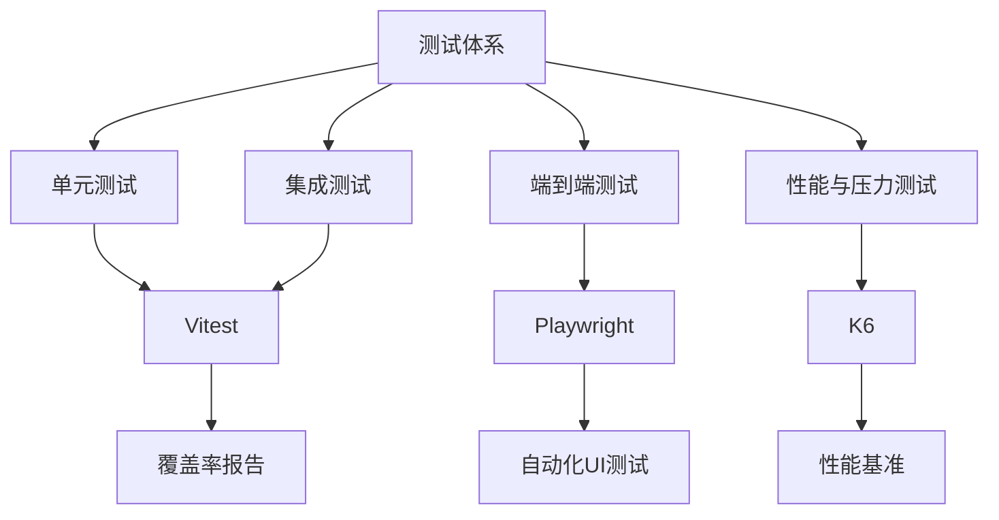
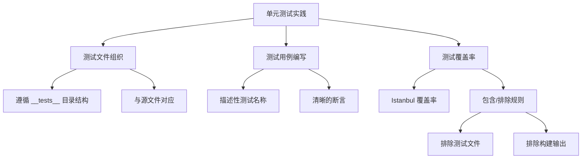
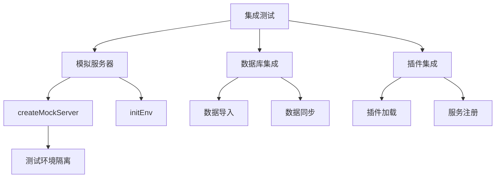
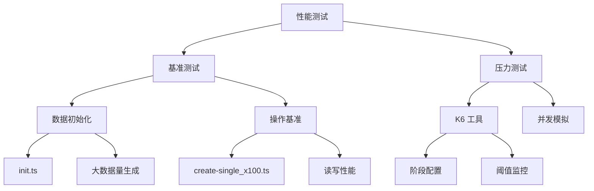
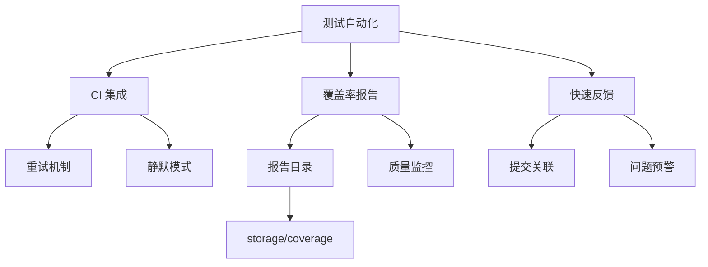

# 测试策略

<cite>
**本文档中引用的文件**  
- [vitest.config.mts](file://vitest.config.mts)
- [playwright.config.ts](file://playwright.config.ts)
- [packages/core/test/package.json](file://packages/core/test/package.json)
- [packages/core/test/vitest.mjs](file://packages/core/test/vitest.mjs)
- [packages/core/test/setup/server.ts](file://packages/core/test/setup/server.ts)
- [packages/core/test/setup/client.ts](file://packages/core/test/setup/client.ts)
- [packages/core/test/perf/scenarios/blog/init.ts](file://packages/core/test/perf/scenarios/blog/init.ts)
- [packages/core/test/perf/scenarios/blog/create-single_x100.ts](file://packages/core/test/perf/scenarios/blog/create-single_x100.ts)
- [packages/core/test/src/index.ts](file://packages/core/test/src/index.ts)
- [packages/core/test/e2e.js](file://packages/core/test/e2e.js)
- [packages/core/test/perf/utils.js](file://packages/core/test/perf/utils.js)
</cite>

## 目录
1. [引言](#引言)
2. [测试体系架构](#测试体系架构)
3. [测试框架与配置](#测试框架与配置)
4. [单元测试实践](#单元测试实践)
5. [集成测试实践](#集成测试实践)
6. [端到端测试实现](#端到端测试实现)
7. [性能与压力测试](#性能与压力测试)
8. [测试自动化与持续集成](#测试自动化与持续集成)
9. [结论](#结论)

## 引言

NocoBase 是一个以可扩展性为核心理念的开源无代码开发平台。为了确保系统的稳定性、可靠性和高性能，NocoBase 建立了一套多层次的测试策略。该策略涵盖了从单元测试到端到端测试，再到性能和压力测试的完整测试体系。本文档详细阐述了 NocoBase 的测试策略，包括测试框架的选择、配置方法、测试用例编写指南以及自动化测试流程。

**Section sources**
- [packages/core/test/README.md](file://packages/core/test/README.md)

## 测试体系架构

NocoBase 的测试体系采用分层设计，主要包括单元测试、集成测试、端到端测试和性能测试四个层次。这种分层结构确保了代码质量从微观到宏观的全面覆盖。



**Diagram sources**
- [vitest.config.mts](file://vitest.config.mts)
- [playwright.config.ts](file://playwright.config.ts)
- [packages/core/test/package.json](file://packages/core/test/package.json)

**Section sources**
- [packages/core/test/vitest.mjs](file://packages/core/test/vitest.mjs)
- [packages/core/test/e2e.js](file://packages/core/test/e2e.js)

## 测试框架与配置

NocoBase 采用 Vitest 作为主要的测试框架，用于单元测试和集成测试。Vitest 是一个基于 Vite 的现代化测试框架，具有快速的启动速度和良好的开发体验。对于端到端测试，NocoBase 使用 Playwright，它能够模拟真实用户在不同浏览器中的操作。

Vitest 的配置通过 `vitest.config.mts` 文件进行定义，该文件导入了 `@nocobase/test/vitest.mjs` 中的通用配置。这种设计使得测试配置可以在不同包之间共享和复用。

```mermaid
graph TD
A[Vitest 配置] --> B[vitest.config.mts]
A --> C[@nocobase/test/vitest.mjs]
C --> D[通用配置]
C --> E[服务器端配置]
C --> F[客户端配置]
D --> G[测试超时设置]
D --> H[覆盖率配置]
E --> I[setupFiles: server.ts]
F --> J[setupFiles: client.ts]
F --> K[JS DOM 环境]
```

**Diagram sources**
- [vitest.config.mts](file://vitest.config.mts)
- [packages/core/test/vitest.mjs](file://packages/core/test/vitest.mjs)
- [packages/core/test/setup/server.ts](file://packages/core/test/setup/server.ts)
- [packages/core/test/setup/client.ts](file://packages/core/test/setup/client.ts)

**Section sources**
- [vitest.config.mts](file://vitest.config.mts)
- [packages/core/test/vitest.mjs](file://packages/core/test/vitest.mjs)

## 单元测试实践

NocoBase 的单元测试遵循严格的组织结构和最佳实践。测试文件通常位于 `__tests__` 目录下，与源代码文件保持对应关系。测试用例的编写注重可读性和可维护性，采用描述性命名来清晰表达测试意图。

测试覆盖率是衡量代码质量的重要指标。NocoBase 的测试配置中启用了覆盖率报告功能，使用 Istanbul 作为覆盖率提供商。测试配置中明确指定了需要包含和排除的文件范围，确保覆盖率统计的准确性。



**Diagram sources**
- [packages/core/test/vitest.mjs](file://packages/core/test/vitest.mjs)
- [packages/core/test/setup/client.ts](file://packages/core/test/setup/client.ts)

**Section sources**
- [packages/core/test/vitest.mjs](file://packages/core/test/vitest.mjs)
- [packages/core/test/setup/client.ts](file://packages/core/test/setup/client.ts)

## 集成测试实践

集成测试在 NocoBase 中扮演着连接单元测试和端到端测试的关键角色。它验证不同模块之间的交互是否符合预期，确保系统的整体功能正确性。

NocoBase 的集成测试通过创建模拟服务器环境来实现。`@nocobase/test` 包提供了 `createMockServer` 工具函数，可以快速搭建一个包含所需插件的测试服务器实例。这种设计使得集成测试既能够覆盖复杂的业务逻辑，又保持了较高的执行效率。



**Diagram sources**
- [packages/core/test/src/index.ts](file://packages/core/test/src/index.ts)
- [packages/core/test/setup/server.ts](file://packages/core/test/setup/server.ts)
- [packages/core/test/perf/scenarios/blog/init.ts](file://packages/core/test/perf/scenarios/blog/init.ts)

**Section sources**
- [packages/core/test/src/index.ts](file://packages/core/test/src/index.ts)
- [packages/core/test/setup/server.ts](file://packages/core/test/setup/server.ts)

## 端到端测试实现

NocoBase 的端到端测试使用 Playwright 实现，能够全面验证用户界面和后端服务的完整交互流程。测试环境的搭建通过 `playwright.config.ts` 文件进行配置，该文件导入了 `@nocobase/test/e2e` 中的通用配置。

端到端测试重点关注用户认证、数据操作和界面交互等核心功能。测试数据的管理通过专门的设置文件（如 `auth.setup.ts`）进行，确保测试环境的一致性和可重复性。

```mermaid
graph TD
A[端到端测试] --> B[Playwright 配置]
A --> C[测试环境]
A --> D[测试数据管理]
A --> E[测试执行流程]
B --> F[playwright.config.ts]
B --> G[@nocobase/test/e2e]
C --> H[浏览器环境]
C --> I[网络拦截]
D --> J[auth.setup.ts]
D --> K[初始化数据]
E --> L[用户登录]
E --> M[数据创建]
E --> N[数据验证]
```

**Diagram sources**
- [playwright.config.ts](file://playwright.config.ts)
- [packages/core/test/e2e.js](file://packages/core/test/e2e.js)
- [packages/core/test/playwright/tests/auth.setup.ts](file://packages/core/test/playwright/tests/auth.setup.ts)

**Section sources**
- [playwright.config.ts](file://playwright.config.ts)
- [packages/core/test/e2e.js](file://packages/core/test/e2e.js)

## 性能与压力测试

NocoBase 的性能测试体系包括基准测试和压力测试两个方面。性能测试场景位于 `packages/core/test/perf` 目录下，涵盖了从数据初始化到各种操作模式的完整测试流程。

性能测试使用 K6 工具进行，能够模拟高并发场景下的系统表现。测试脚本（如 `create-single_x100.ts`）定义了具体的测试场景、阶段配置和性能阈值，确保系统在高负载下的稳定性和响应能力。



**Diagram sources**
- [packages/core/test/perf/scenarios/blog/init.ts](file://packages/core/test/perf/scenarios/blog/init.ts)
- [packages/core/test/perf/scenarios/blog/create-single_x100.ts](file://packages/core/test/perf/scenarios/blog/create-single_x100.ts)
- [packages/core/test/perf/utils.js](file://packages/core/test/perf/utils.js)

**Section sources**
- [packages/core/test/perf/scenarios/blog/init.ts](file://packages/core/test/perf/scenarios/blog/init.ts)
- [packages/core/test/perf/scenarios/blog/create-single_x100.ts](file://packages/core/test/perf/scenarios/blog/create-single_x100.ts)

## 测试自动化与持续集成

NocoBase 的测试自动化流程与持续集成系统紧密集成。测试配置中包含了针对 CI 环境的特殊设置，如重试机制和静默模式，确保测试在自动化环境中稳定运行。

测试覆盖率报告被输出到 `storage/coverage` 目录下，便于持续监控代码质量的变化趋势。通过将测试执行与代码提交关联，NocoBase 实现了快速反馈循环，及时发现和修复潜在问题。



**Diagram sources**
- [packages/core/test/vitest.mjs](file://packages/core/test/vitest.mjs)
- [packages/core/test/setup/server.ts](file://packages/core/test/setup/server.ts)

**Section sources**
- [packages/core/test/vitest.mjs](file://packages/core/test/vitest.mjs)
- [packages/core/test/setup/server.ts](file://packages/core/test/setup/server.ts)

## 结论

NocoBase 的测试策略通过多层次的测试体系，全面保障了系统的质量和稳定性。从单元测试到端到端测试，再到性能和压力测试，每个层次都有明确的目标和实现方法。通过采用现代化的测试框架和工具，NocoBase 实现了高效的测试自动化和持续集成，为平台的可靠性和可扩展性提供了坚实的基础。