# 单元测试

<cite>
**本文档中引用的文件**  
- [vitest.config.mts](file://vitest.config.mts)
- [packages/core/test/vitest.mjs](file://packages/core/test/vitest.mjs)
- [packages/core/test/src/server/mock-server.ts](file://packages/core/test/src/server/mock-server.ts)
- [packages/core/test/src/server/mock-data-source.ts](file://packages/core/test/src/server/mock-data-source.ts)
- [packages/core/test/src/server/mock-isolated-cluster.ts](file://packages/core/test/src/server/mock-isolated-cluster.ts)
- [packages/core/test/setup/server.ts](file://packages/core/test/setup/server.ts)
- [packages/core/test/setup/client.ts](file://packages/core/test/setup/client.ts)
- [packages/core/test/src/index.ts](file://packages/core/test/src/index.ts)
- [packages/core/test/package.json](file://packages/core/test/package.json)
</cite>

## 目录
1. [简介](#简介)
2. [测试配置](#测试配置)
3. [核心测试工具](#核心测试工具)
4. [测试环境隔离](#测试环境隔离)
5. [数据模型测试](#数据模型测试)
6. [服务类测试](#服务类测试)
7. [工具函数测试](#工具函数测试)
8. [测试覆盖率](#测试覆盖率)
9. [性能监控](#性能监控)
10. [CI/CD集成](#cicd集成)

## 简介
NocoBase使用Vitest框架进行单元测试，提供了一套完整的测试工具链来确保核心模块和插件的可靠性。测试框架支持服务器端和客户端两种环境，通过mock-server.ts和mock-data-source.ts等工具实现测试环境的完全隔离，确保测试的独立性和可重复性。

## 测试配置

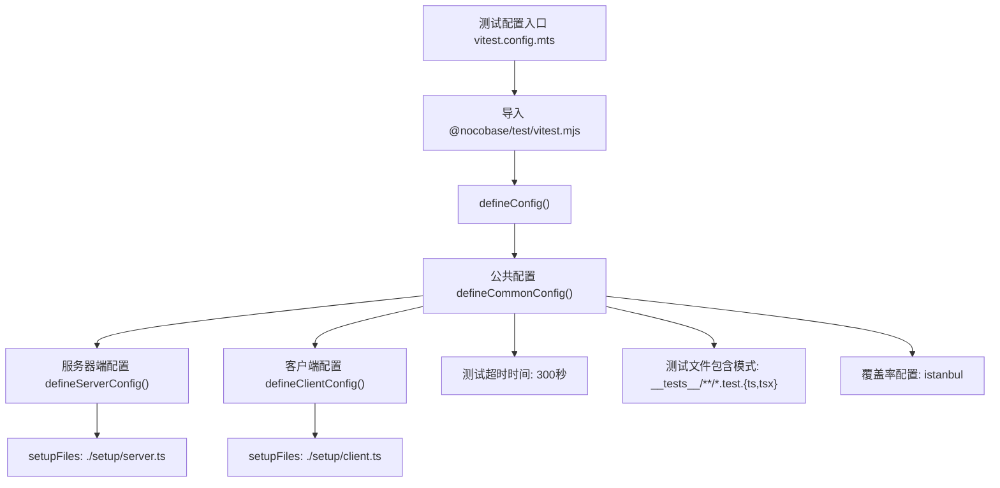

**图示来源**  
- [vitest.config.mts](file://vitest.config.mts#L1-L4)
- [packages/core/test/vitest.mjs](file://packages/core/test/vitest.mjs#L52-L271)

**本节来源**  
- [vitest.config.mts](file://vitest.config.mts#L1-L4)
- [packages/core/test/vitest.mjs](file://packages/core/test/vitest.mjs#L52-L271)

## 核心测试工具

### MockServer类
MockServer是NocoBase单元测试的核心工具，继承自Application类，提供了完整的应用实例模拟功能。

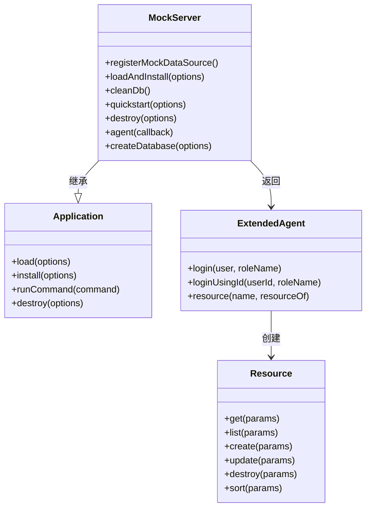

**图示来源**  
- [packages/core/test/src/server/mock-server.ts](file://packages/core/test/src/server/mock-server.ts#L83-L372)

**本节来源**  
- [packages/core/test/src/server/mock-server.ts](file://packages/core/test/src/server/mock-server.ts#L83-L372)

### MockDataSource类
MockDataSource用于模拟数据源连接，确保测试环境与真实数据库隔离。

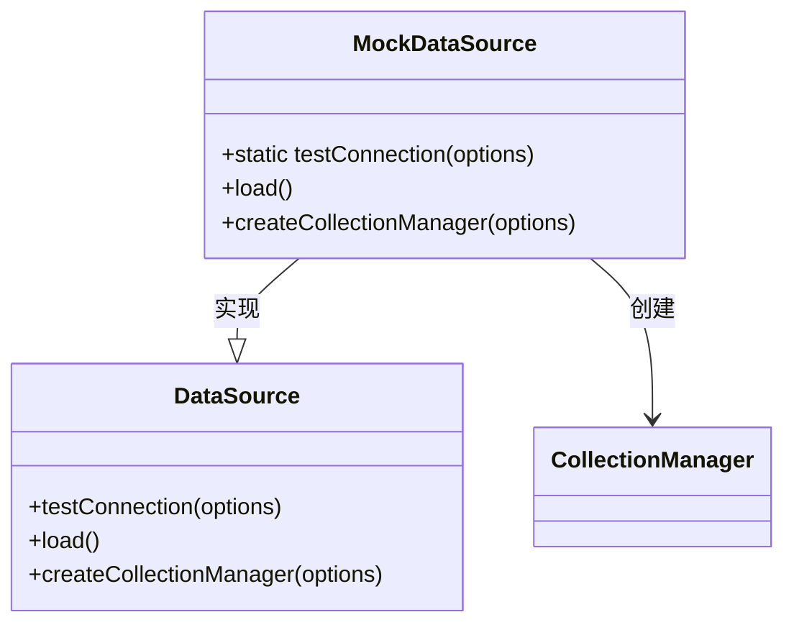

**图示来源**  
- [packages/core/test/src/server/mock-data-source.ts](file://packages/core/test/src/server/mock-data-source.ts#L13-L26)

**本节来源**  
- [packages/core/test/src/server/mock-data-source.ts](file://packages/core/test/src/server/mock-data-source.ts#L13-L26)

## 测试环境隔离

### 服务器端测试设置
服务器端测试通过setup/server.ts文件进行环境初始化。

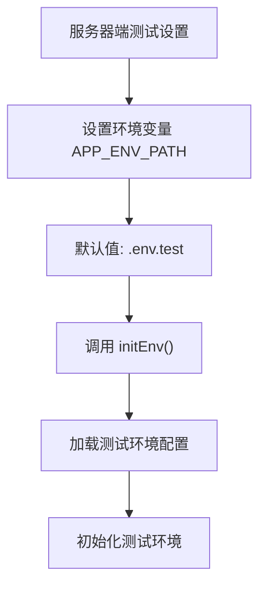

**图示来源**  
- [packages/core/test/setup/server.ts](file://packages/core/test/setup/server.ts#L1-L6)

**本节来源**  
- [packages/core/test/setup/server.ts](file://packages/core/test/setup/server.ts#L1-L6)

### 客户端测试设置
客户端测试通过setup/client.ts文件进行环境初始化，解决jsdom环境中的各种兼容性问题。

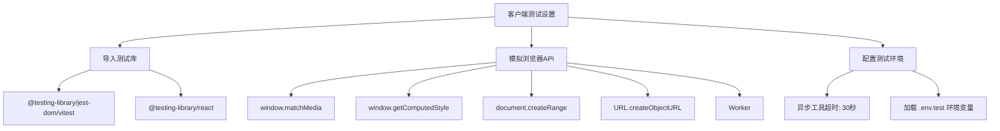

**图示来源**  
- [packages/core/test/setup/client.ts](file://packages/core/test/setup/client.ts#L1-L68)

**本节来源**  
- [packages/core/test/setup/client.ts](file://packages/core/test/setup/client.ts#L1-L68)

## 数据模型测试
使用mock-server.ts提供的工具可以轻松测试数据模型，通过agent()方法创建测试代理，执行各种数据操作。

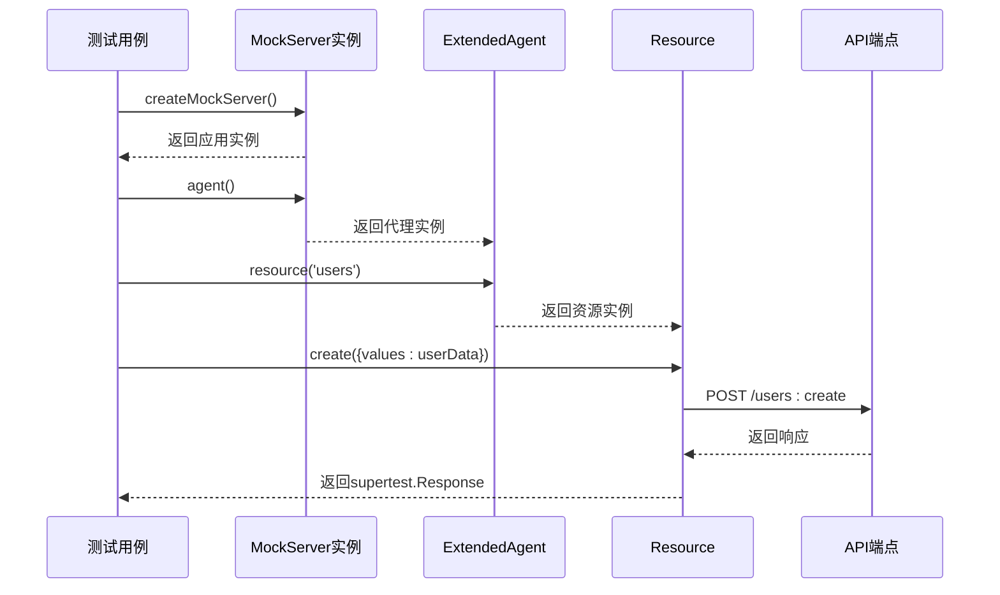

**图示来源**  
- [packages/core/test/src/server/mock-server.ts](file://packages/core/test/src/server/mock-server.ts#L125-L214)

**本节来源**  
- [packages/core/test/src/server/mock-server.ts](file://packages/core/test/src/server/mock-server.ts#L125-L214)

## 服务类测试
服务类测试利用MockServer提供的完整应用上下文，可以测试服务间的依赖关系和业务逻辑。

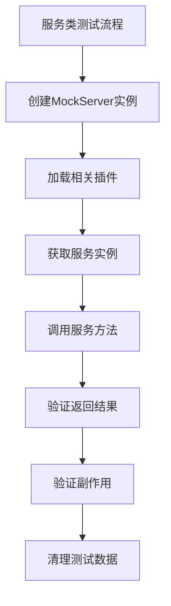

**本节来源**  
- [packages/core/test/src/server/mock-server.ts](file://packages/core/test/src/server/mock-server.ts#L88-L116)

## 工具函数测试
工具函数测试可以直接导入并测试，无需复杂的设置。

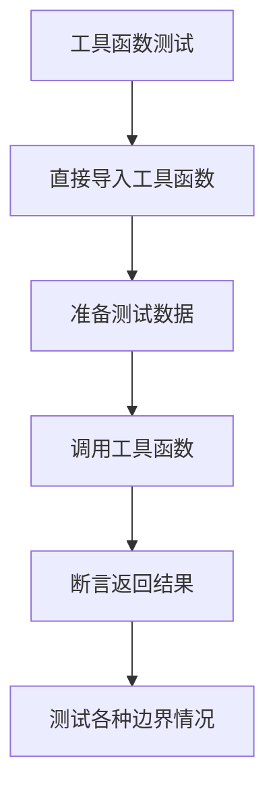

**本节来源**  
- [packages/core/test/src/index.ts](file://packages/core/test/src/index.ts#L1-L11)

## 测试覆盖率
NocoBase使用istanbul作为覆盖率提供商，配置了详细的包含和排除规则。

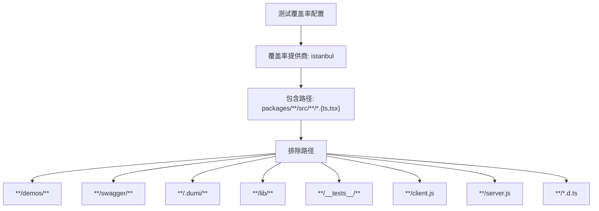

**图示来源**  
- [packages/core/test/vitest.mjs](file://packages/core/test/vitest.mjs#L86-L102)

**本节来源**  
- [packages/core/test/vitest.mjs](file://packages/core/test/vitest.mjs#L86-L102)

## 性能监控
虽然当前代码中没有直接的measure-execution-time.ts文件，但可以通过Vitest的测试超时配置来监控性能。

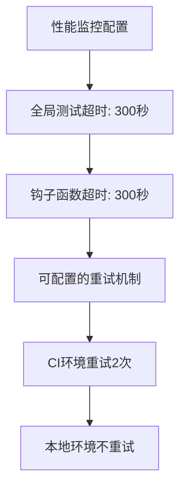

**图示来源**  
- [packages/core/test/vitest.mjs](file://packages/core/test/vitest.mjs#L61-L62)

**本节来源**  
- [packages/core/test/vitest.mjs](file://packages/core/test/vitest.mjs#L61-L62)

## CI/CD集成
单元测试在CI/CD流程中的执行策略通过环境变量和命令行参数进行控制。

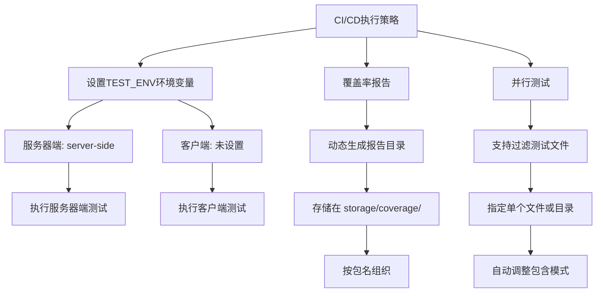

**图示来源**  
- [packages/core/test/vitest.mjs](file://packages/core/test/vitest.mjs#L229-L270)

**本节来源**  
- [packages/core/test/vitest.mjs](file://packages/core/test/vitest.mjs#L229-L270)