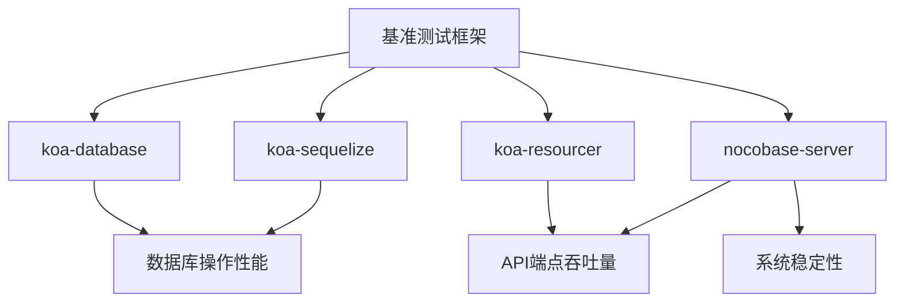
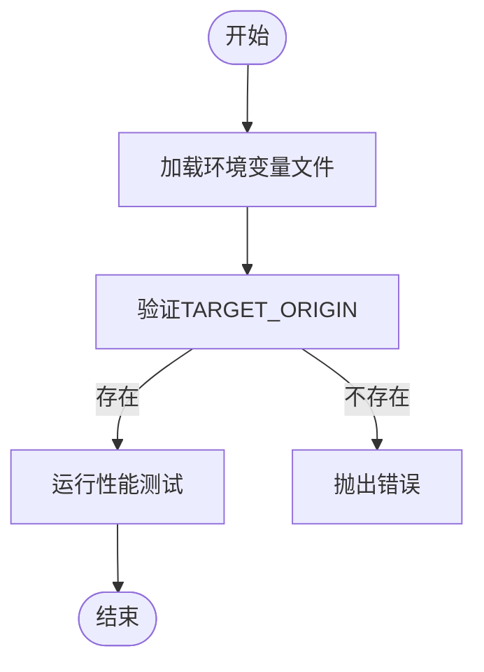
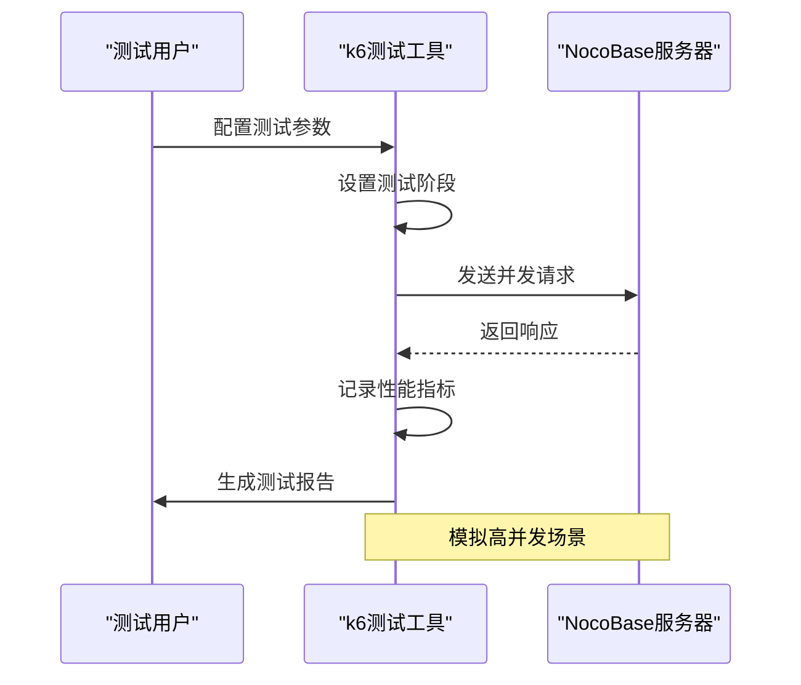
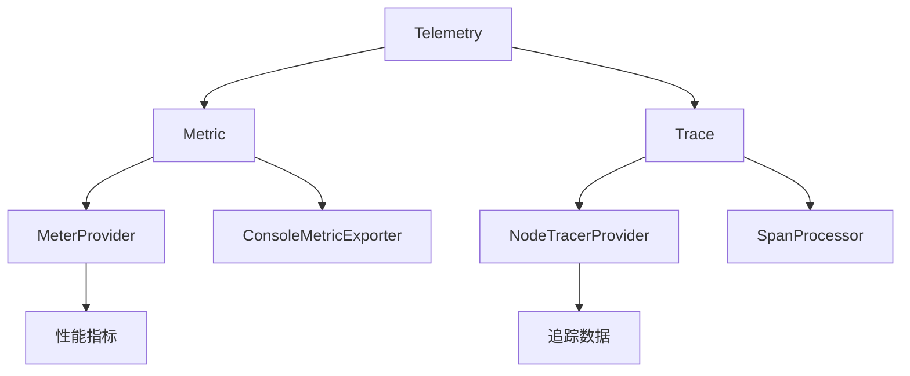

# 性能测试

<cite>
**本文档中引用的文件**  
- [benchmark/README.md](file://benchmark/README.md)
- [benchmark/koa-database/index.js](file://benchmark/koa-database/index.js)
- [benchmark/koa-resourcer/index.js](file://benchmark/koa-resourcer/index.js)
- [benchmark/koa-sequelize/index.js](file://benchmark/koa-sequelize/index.js)
- [benchmark/nocobase-server/index.js](file://benchmark/nocobase-server/index.js)
- [.env.perf.example](file://.env.perf.example)
- [packages/core/cli/src/commands/perf.js](file://packages/core/cli/src/commands/perf.js)
- [packages/core/cli/src/commands/benchmark.js](file://packages/core/cli/src/commands/benchmark.js)
- [packages/core/utils/src/perf-hooks.ts](file://packages/core/utils/src/perf-hooks.ts)
- [packages/core/telemetry/src/telemetry.ts](file://packages/core/telemetry/src/telemetry.ts)
- [packages/core/telemetry/src/metric.ts](file://packages/core/telemetry/src/metric.ts)
- [packages/core/telemetry/src/trace.ts](file://packages/core/telemetry/src/trace.ts)
- [packages/plugins/@nocobase/plugin-workflow/src/server/__benchmarks__/single-process.benchmark.ts](file://packages/plugins/@nocobase/plugin-workflow/src/server/__benchmarks__/single-process.benchmark.ts)
- [packages/core/test/perf/scenarios/blog/create-single_x100.ts](file://packages/core/test/perf/scenarios/blog/create-single_x100.ts)
- [packages/core/test/perf/scenarios/blog/get-by-pk_x100.ts](file://packages/core/test/perf/scenarios/blog/get-by-pk_x100.ts)
</cite>

## 目录
1. [简介](#简介)
2. [基准测试框架](#基准测试框架)
3. [性能测试配置](#性能测试配置)
4. [核心性能测试用例](#核心性能测试用例)
5. [指标收集与分析](#指标收集与分析)
6. [性能监控实现](#性能监控实现)
7. [系统优化与容量规划](#系统优化与容量规划)
8. [结论](#结论)

## 简介
NocoBase提供了一套完整的性能测试框架，用于评估系统在高负载下的性能表现。本文档详细介绍了如何使用benchmark目录中的测试用例来评估数据库操作的响应时间、API端点的吞吐量以及系统在并发访问下的稳定性。通过使用koa-database和nocobase-server的基准测试框架，开发者可以全面了解系统的性能特征，并根据测试结果进行系统优化和容量规划。

## 基准测试框架
NocoBase的基准测试框架基于多种技术栈构建，包括Koa、Sequelize和NocoBase自身的服务器架构。这些测试用例通过模拟高并发场景来评估系统的性能表现。



**图示来源**
- [benchmark/README.md](file://benchmark/README.md)

**本节来源**
- [benchmark/README.md](file://benchmark/README.md)

## 性能测试配置
性能测试需要正确的环境配置才能准确反映系统性能。NocoBase提供了详细的配置文件和命令行工具来管理性能测试环境。

### 环境变量配置
性能测试使用特定的环境变量文件`.env.perf`来配置测试参数。这些参数包括目标服务器地址、API基础URL和认证信息。



**图示来源**
- [.env.perf.example](file://.env.perf.example)
- [packages/core/cli/src/commands/perf.js](file://packages/core/cli/src/commands/perf.js)

**本节来源**
- [.env.perf.example](file://.env.perf.example)
- [packages/core/cli/src/commands/perf.js](file://packages/core/cli/src/commands/perf.js)

## 核心性能测试用例
NocoBase提供了多个核心性能测试用例，覆盖了不同的技术栈和使用场景。

### koa-database测试用例
该测试用例使用NocoBase的数据库模块来评估数据库操作的性能。它创建了一个用户表并测试了查询操作的响应时间。

**本节来源**
- [benchmark/koa-database/index.js](file://benchmark/koa-database/index.js)

### koa-sequelize测试用例
该测试用例使用Sequelize ORM来评估数据库操作性能，作为与NocoBase原生数据库模块的性能对比。

**本节来源**
- [benchmark/koa-sequelize/index.js](file://benchmark/koa-sequelize/index.js)

### koa-resourcer测试用例
该测试用例使用NocoBase的resourcer模块来评估API端点的性能，测试了REST API的吞吐量。

**本节来源**
- [benchmark/koa-resourcer/index.js](file://benchmark/koa-resourcer/index.js)

### nocobase-server测试用例
该测试用例使用完整的NocoBase服务器实例来评估系统在真实场景下的性能表现。

**本节来源**
- [benchmark/nocobase-server/index.js](file://benchmark/nocobase-server/index.js)

## 指标收集与分析
NocoBase的性能测试框架提供了全面的指标收集和分析功能，帮助开发者深入了解系统性能。

### 性能指标类型
NocoBase性能测试收集以下关键指标：

| 指标类型 | 描述 | 收集方法 |
|---------|------|---------|
| CPU使用率 | 系统CPU资源消耗情况 | OpenTelemetry监控 |
| 内存消耗 | 系统内存使用情况 | Node.js性能钩子 |
| 请求延迟 | API请求响应时间 | 性能直方图记录 |
| 吞吐量 | 单位时间处理的请求数 | k6压力测试工具 |
| 错误率 | 请求失败的比例 | k6检查机制 |

**本节来源**
- [packages/core/telemetry/src/metric.ts](file://packages/core/telemetry/src/metric.ts)
- [packages/core/utils/src/perf-hooks.ts](file://packages/core/utils/src/perf-hooks.ts)

### k6测试脚本
NocoBase使用k6作为主要的压力测试工具，通过JavaScript脚本定义测试场景。



**图示来源**
- [packages/core/test/perf/scenarios/blog/create-single_x100.ts](file://packages/core/test/perf/scenarios/blog/create-single_x100.ts)
- [packages/core/test/perf/scenarios/blog/get-by-pk_x100.ts](file://packages/core/test/perf/scenarios/blog/get-by-pk_x100.ts)

**本节来源**
- [packages/core/test/perf/scenarios/blog/create-single_x100.ts](file://packages/core/test/perf/scenarios/blog/create-single_x100.ts)
- [packages/core/test/perf/scenarios/blog/get-by-pk_x100.ts](file://packages/core/test/perf/scenarios/blog/get-by-pk_x100.ts)

## 性能监控实现
NocoBase的性能监控系统基于OpenTelemetry和Node.js性能钩子实现，提供了细粒度的性能数据收集能力。

### 性能钩子实现
NocoBase使用Node.js的perf_hooks模块来记录函数执行时间，通过直方图统计性能数据。

```mermaid
classDiagram
class prePerfHooksWrap {
+handler : any
+options : {name? : string}
+return : async function
}
class postPerfHooksWrap {
+handler : any
+options : {name? : string}
+return : async function
}
class RecordableHistogram {
+record(value : number) : void
+reset() : void
+mean : number
+max : number
}
prePerfHooksWrap --> RecordableHistogram : "使用"
postPerfHooksWrap --> RecordableHistogram : "使用"
```

**图示来源**
- [packages/core/utils/src/perf-hooks.ts](file://packages/core/utils/src/perf-hooks.ts)

**本节来源**
- [packages/core/utils/src/perf-hooks.ts](file://packages/core/utils/src/perf-hooks.ts)

### OpenTelemetry集成
NocoBase集成了OpenTelemetry框架，提供了分布式追踪和指标收集功能。



**图示来源**
- [packages/core/telemetry/src/telemetry.ts](file://packages/core/telemetry/src/telemetry.ts)
- [packages/core/telemetry/src/metric.ts](file://packages/core/telemetry/src/metric.ts)
- [packages/core/telemetry/src/trace.ts](file://packages/core/telemetry/src/trace.ts)

**本节来源**
- [packages/core/telemetry/src/telemetry.ts](file://packages/core/telemetry/src/telemetry.ts)
- [packages/core/telemetry/src/metric.ts](file://packages/core/telemetry/src/metric.ts)
- [packages/core/telemetry/src/trace.ts](file://packages/core/telemetry/src/trace.ts)

## 系统优化与容量规划
基于性能测试结果，可以进行系统优化和容量规划，确保系统在生产环境中稳定运行。

### 性能优化策略
根据性能测试结果，可以采取以下优化策略：

1. **数据库优化**：通过索引优化、查询优化和连接池配置提高数据库性能
2. **缓存策略**：引入Redis等缓存机制减少数据库访问频率
3. **API优化**：优化API响应结构，减少不必要的数据传输
4. **并发处理**：调整线程池大小和并发处理能力
5. **资源限制**：设置合理的内存和CPU使用限制

### 容量规划方法
容量规划需要考虑以下因素：

- **用户增长预测**：基于业务发展预测未来用户数量
- **请求模式分析**：分析用户请求的时间分布和频率
- **资源需求估算**：根据性能测试结果估算所需的服务器资源
- **扩展性设计**：设计可水平扩展的架构以应对流量增长
- **成本效益分析**：平衡性能需求和基础设施成本

**本节来源**
- [benchmark/README.md](file://benchmark/README.md)
- [packages/core/cli/src/commands/benchmark.js](file://packages/core/cli/src/commands/benchmark.js)

## 结论
NocoBase的性能测试框架提供了一套完整的工具和方法，用于评估系统在高负载下的性能表现。通过使用benchmark目录中的测试用例，开发者可以全面了解数据库操作的响应时间、API端点的吞吐量以及系统在并发访问下的稳定性。结合OpenTelemetry和Node.js性能钩子，NocoBase能够收集详细的性能指标，为系统优化和容量规划提供数据支持。建议在生产环境部署前进行全面的性能测试，确保系统能够满足业务需求。