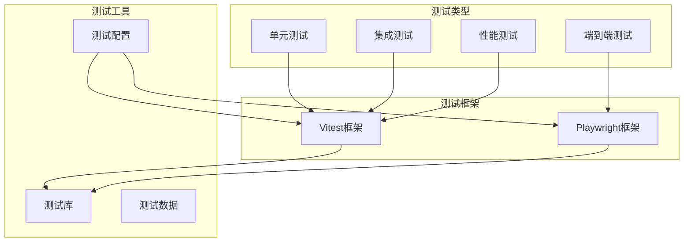
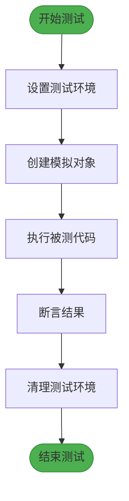
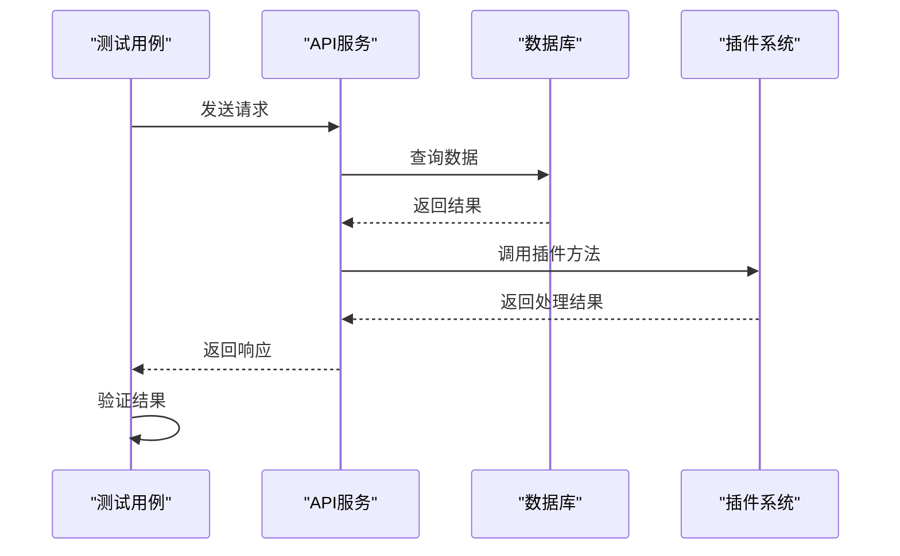
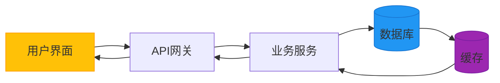
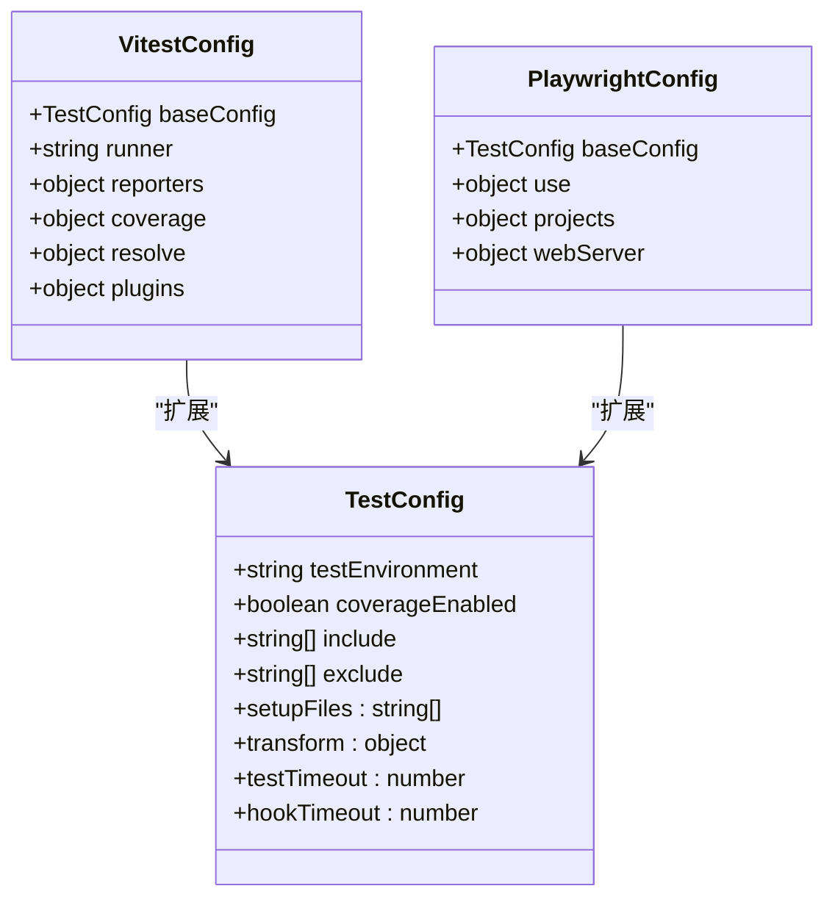
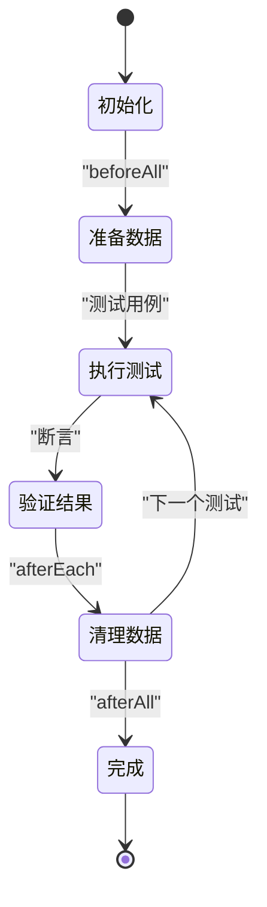
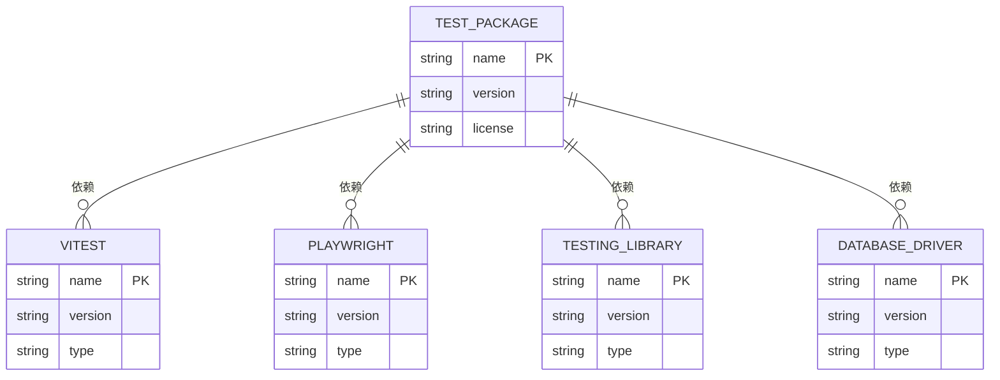
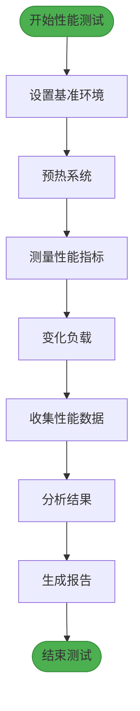
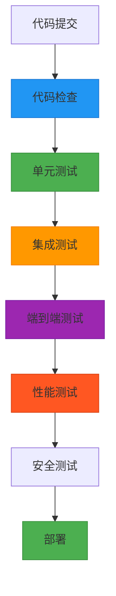

# 测试类型指南

<cite>
**本文档中引用的文件**  
- [package.json](file://packages/core/test/package.json)
- [index.ts](file://packages/core/test/src/index.ts)
- [playwright.config.ts](file://playwright.config.ts)
- [vitest.config.mts](file://vitest.config.mts)
- [server.js](file://packages/core/test/server.js)
- [e2e.js](file://packages/core/test/e2e.js)
- [web.js](file://packages/core/test/web.js)
- [client.js](file://packages/core/test/client.js)
- [app.test.ts](file://examples/app/__tests__/app.test.ts)
- [acl.test.ts](file://packages/core/acl/src/__tests__/acl.test.ts)
- [create-action.test.ts](file://packages/core/actions/src/__tests__/create-action.test.ts)
- [commands.test.ts](file://packages/core/app/src/__tests__/commands.test.ts)
- [benchmark/koa-database/index.js](file://benchmark/koa-database/index.js)
- [benchmark/nocobase-server/index.js](file://benchmark/nocobase-server/index.js)
</cite>

## 目录
1. [简介](#简介)
2. [项目测试架构](#项目测试架构)
3. [核心测试组件](#核心测试组件)
4. [测试类型实现](#测试类型实现)
5. [详细组件分析](#详细组件分析)
6. [依赖分析](#依赖分析)
7. [性能测试指导](#性能测试指导)
8. [CI/CD流程中的测试执行](#cicd流程中的测试执行)
9. [结论](#结论)

## 简介
本文档深入探讨NocoBase中的测试类型实现，涵盖单元测试、集成测试和端到端测试的具体实现方式。文档详细说明了每种测试类型的应用场景和最佳实践，包括如何为插件编写测试、如何测试API端点以及如何验证数据模型的正确性。同时，文档还提供了测试数据准备和清理策略，以及性能测试和压力测试的具体指导。

## 项目测试架构

NocoBase采用分层测试架构，支持多种测试类型，包括单元测试、集成测试和端到端测试。测试框架基于Vitest和Playwright构建，提供了完整的测试解决方案。

**Diagram sources**
- [package.json](file://packages/core/test/package.json)
- [vitest.config.mts](file://vitest.config.mts)
- [playwright.config.ts](file://playwright.config.ts)

**Section sources**
- [package.json](file://packages/core/test/package.json)
- [vitest.config.mts](file://vitest.config.mts)

## 核心测试组件

NocoBase的核心测试组件包括测试服务器、端到端测试工具、Web测试工具和客户端测试工具。这些组件通过模块化设计，提供了灵活的测试能力。

**Section sources**
- [server.js](file://packages/core/test/server.js)
- [e2e.js](file://packages/core/test/e2e.js)
- [web.js](file://packages/core/test/web.js)
- [client.js](file://packages/core/test/client.js)

## 测试类型实现

### 单元测试实现
NocoBase使用Vitest作为单元测试框架，支持对单个函数、类和模块进行测试。单元测试主要关注代码的逻辑正确性，不依赖外部系统。

**Diagram sources**
- [create-action.test.ts](file://packages/core/actions/src/__tests__/create-action.test.ts)
- [acl.test.ts](file://packages/core/acl/src/__tests__/acl.test.ts)

### 集成测试实现
集成测试验证多个组件之间的交互，确保它们能够正确协同工作。NocoBase的集成测试通常涉及数据库操作、API调用和插件交互。

**Diagram sources**
- [app.test.ts](file://examples/app/__tests__/app.test.ts)
- [commands.test.ts](file://packages/core/app/src/__tests__/commands.test.ts)

### 端到端测试实现
端到端测试模拟真实用户场景，从用户界面到后端服务进行全面测试。NocoBase使用Playwright进行端到端测试，确保整个应用流程的正确性。

**Diagram sources**
- [playwright.config.ts](file://playwright.config.ts)
- [e2e.js](file://packages/core/test/e2e.js)

## 详细组件分析

### 测试配置分析
NocoBase的测试配置通过模块化方式组织，支持不同类型的测试需求。主测试配置文件定义了全局测试设置和环境变量。

**Diagram sources**
- [vitest.config.mts](file://vitest.config.mts)
- [playwright.config.ts](file://playwright.config.ts)

### 测试数据管理
NocoBase提供了一套完整的测试数据管理策略，确保测试的可重复性和可靠性。测试数据的准备和清理遵循严格的生命周期管理。

**Diagram sources**
- [app.test.ts](file://examples/app/__tests__/app.test.ts)
- [create-action.test.ts](file://packages/core/actions/src/__tests__/create-action.test.ts)

## 依赖分析

NocoBase的测试系统依赖于多个核心包和工具，这些依赖关系确保了测试框架的完整性和功能性。

**Diagram sources**
- [package.json](file://packages/core/test/package.json)

**Section sources**
- [package.json](file://packages/core/test/package.json)

## 性能测试指导

NocoBase在benchmark目录中提供了性能测试用例，用于评估系统在不同负载下的表现。性能测试重点关注API响应时间、数据库查询效率和系统吞吐量。

**Diagram sources**
- [benchmark/koa-database/index.js](file://benchmark/koa-database/index.js)
- [benchmark/nocobase-server/index.js](file://benchmark/nocobase-server/index.js)

## CI/CD流程中的测试执行

在CI/CD流程中，NocoBase的测试按照特定顺序执行，确保代码质量。测试执行顺序遵循从快速到慢速、从隔离到集成的原则。

**Diagram sources**
- [package.json](file://packages/core/test/package.json)
- [vitest.config.mts](file://vitest.config.mts)
- [playwright.config.ts](file://playwright.config.ts)

## 结论
NocoBase提供了全面的测试解决方案，支持从单元测试到性能测试的多种测试类型。通过合理的测试策略和工具集成，确保了系统的稳定性和可靠性。建议在开发过程中遵循测试最佳实践，充分利用提供的测试框架和工具，持续保证代码质量。