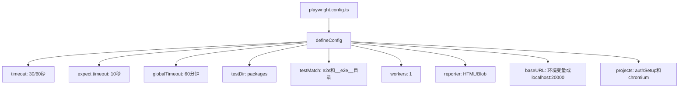
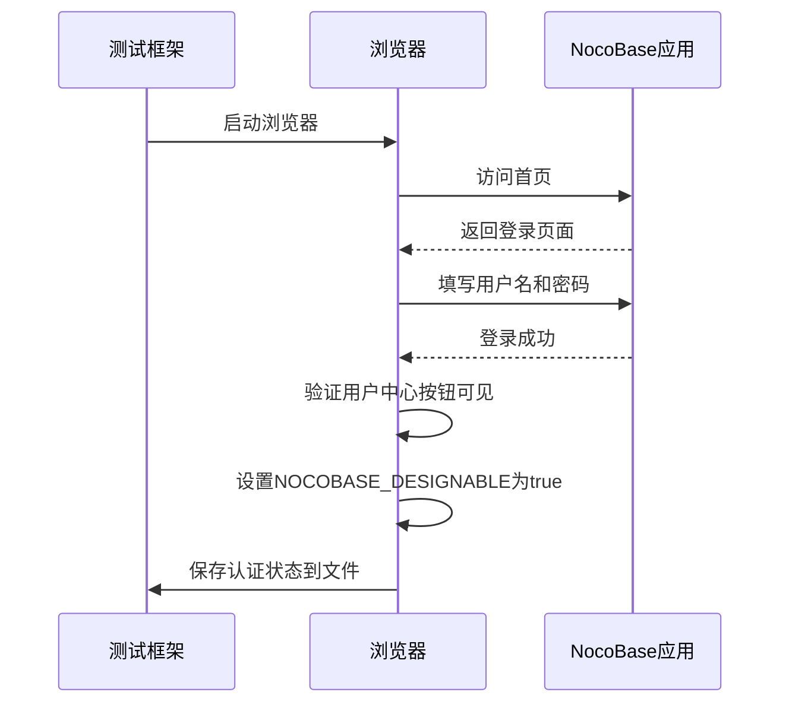
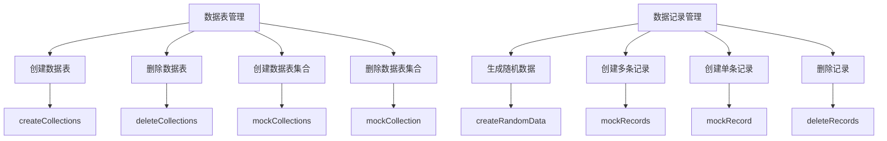
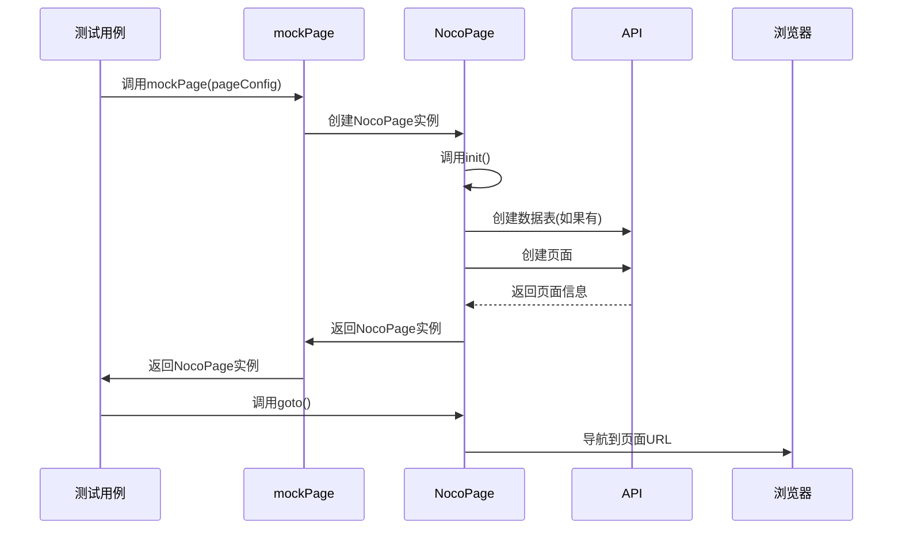
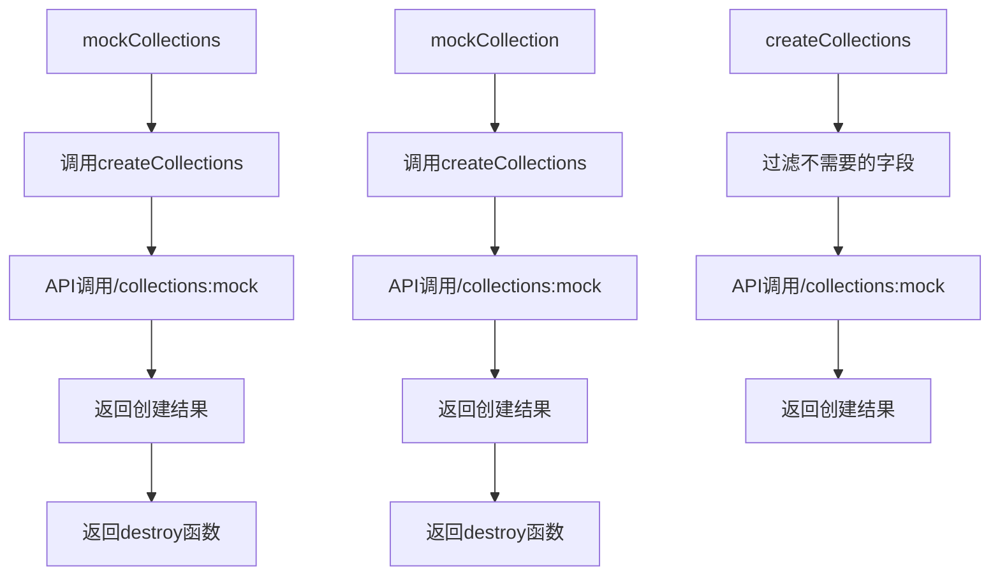
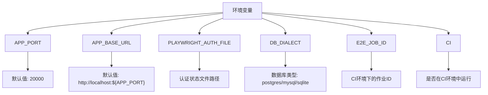
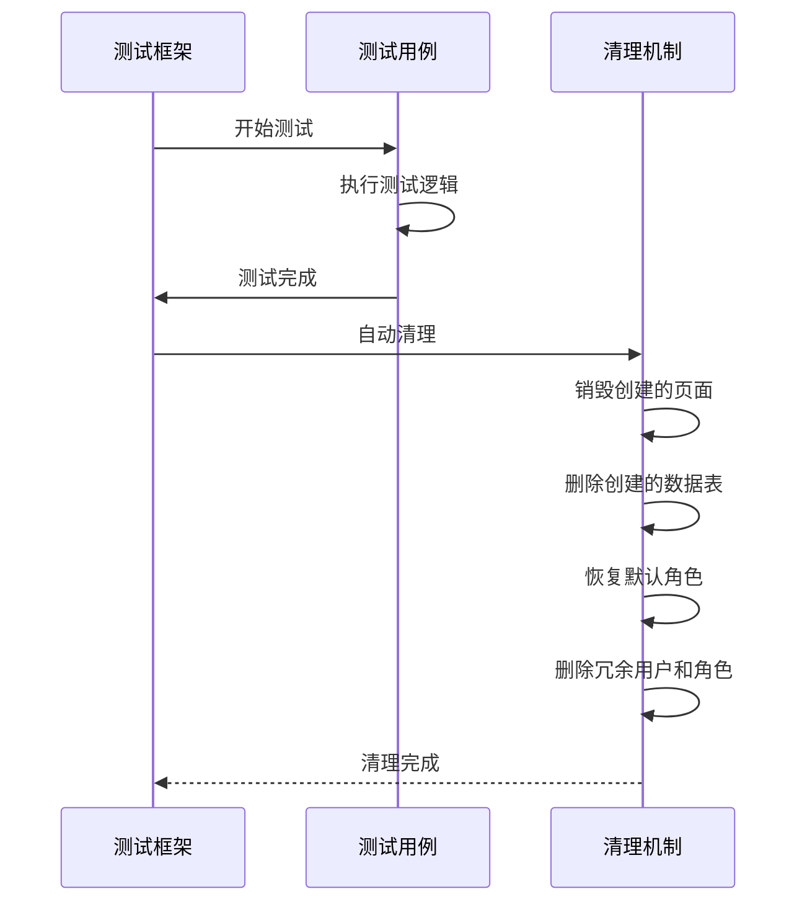
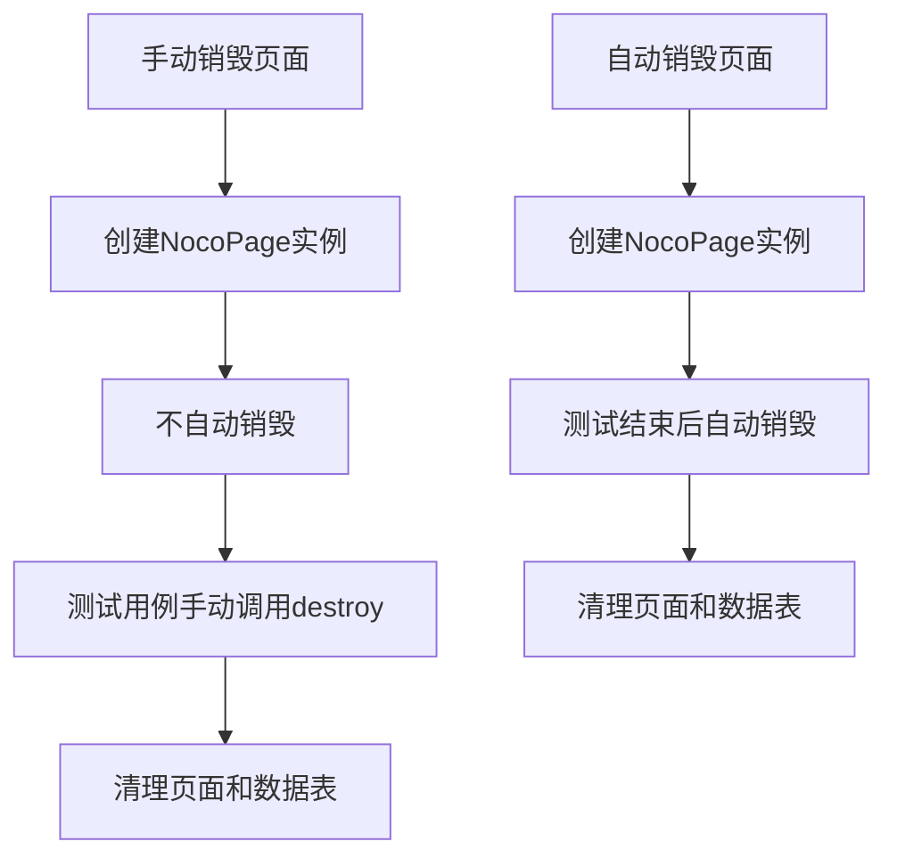

# 端到端测试

<cite>
**本文档引用的文件**
- [playwright.config.ts](file://playwright.config.ts)
- [auth.setup.ts](file://packages/core/test/playwright/tests/auth.setup.ts)
- [e2eUtils.ts](file://packages/core/test/src/e2e/e2eUtils.ts)
- [defineConfig.ts](file://packages/core/test/src/e2e/defineConfig.ts)
- [client.ts](file://packages/core/test/setup/client.ts)
- [server.ts](file://packages/core/test/setup/server.ts)
- [e2e.d.ts](file://packages/core/test/e2e.d.ts)
- [e2eUtils.ts](file://packages/plugins/@nocobase/plugin-workflow-test/src/e2e/e2eUtils.ts)
- [e2eCollectionModel.ts](file://packages/plugins/@nocobase/plugin-workflow-test/src/e2e/e2eCollectionModel.ts)
- [e2ePageObjectModel.ts](file://packages/plugins/@nocobase/plugin-workflow-test/src/e2e/e2ePageObjectModel.ts)
</cite>

## 目录
1. [简介](#简介)
2. [Playwright配置](#playwright配置)
3. [认证设置](#认证设置)
4. [测试工具和实用函数](#测试工具和实用函数)
5. [工作流测试工具](#工作流测试工具)
6. [测试数据管理](#测试数据管理)
7. [页面和数据表模拟](#页面和数据表模拟)
8. [测试环境配置](#测试环境配置)
9. [最佳实践](#最佳实践)

## 简介

NocoBase的端到端测试框架基于Playwright构建，提供了一套完整的测试解决方案，用于验证从用户界面操作到后端服务响应的完整用户工作流。该框架支持多环境测试，包括不同数据库和部署场景，并提供了丰富的工具函数来简化复杂测试场景的实现。

端到端测试在NocoBase中扮演着关键角色，确保了系统各组件之间的集成正确性，验证了用户界面与后端服务的交互，以及业务逻辑的正确执行。通过自动化测试，开发团队能够快速发现和修复问题，提高软件质量和开发效率。

## Playwright配置

NocoBase的Playwright配置文件`playwright.config.ts`定义了测试运行的基本参数和项目设置。该配置文件导入了`@nocobase/test/e2e`包中的`defineConfig`函数，并使用它来创建测试配置。



**Diagram sources**
- [playwright.config.ts](file://playwright.config.ts#L1-L4)
- [defineConfig.ts](file://packages/core/test/src/e2e/defineConfig.ts#L12-L77)

**Section sources**
- [playwright.config.ts](file://playwright.config.ts#L1-L4)
- [defineConfig.ts](file://packages/core/test/src/e2e/defineConfig.ts#L12-L77)

## 认证设置

`auth.setup.ts`文件定义了认证设置，用于在测试开始前登录并保存认证状态，避免在每个测试用例中重复登录操作。



**Diagram sources**
- [auth.setup.ts](file://packages/core/test/playwright/tests/auth.setup.ts#L1-L22)

**Section sources**
- [auth.setup.ts](file://packages/core/test/playwright/tests/auth.setup.ts#L1-L22)

## 测试工具和实用函数

NocoBase提供了丰富的测试工具和实用函数，封装在`e2eUtils.ts`文件中，用于简化测试代码的编写。

### 核心测试扩展

`e2eUtils.ts`文件通过`test.extend`方法扩展了Playwright的测试功能，添加了多个实用的测试工具：

```mermaid
classDiagram
class NocoPage {
+url : string
+uid : string
+desktopRouteId : number
+collectionsName : string[]
+_waitForInit : Promise~void~
+init() : Promise~void~
+goto() : Promise~void~
+getUrl() : Promise~string~
+getUid() : Promise~string~
+getDesktopRouteId() : Promise~number~
+waitForInit() : Promise~NocoPage~
+destroy() : Promise~void~
}
class NocoMobilePage {
+mobileRouteId : number
+title : string
+getTitle() : string
+init() : Promise~void~
+mobileDestroy() : Promise~void~
}
class ExtendUtils {
+page : Page
+mockPage : (pageConfig? : PageConfig) => NocoPage
+mockMobilePage : (pageConfig? : MobilePageConfig) => NocoMobilePage
+mockManualDestroyPage : (pageConfig? : PageConfig) => NocoPage
+mockCollections : (collectionSettings : CollectionSetting[]) => Promise~any~
+mockCollection : (collectionSetting : CollectionSetting) => Promise~any~
+mockRecord : <T = any>(collectionName : string, data? : any, maxDepth? : number) => Promise~T~
+mockRecords : <T = any>(collectionName : string, count? : number, maxDepth? : number) => Promise~T[]~
+createCollections : (collectionSettings : CollectionSetting | CollectionSetting[]) => Promise~void~
+deletePage : (pageName : string) => Promise~void~
+mockRole : <T = any>(roleSetting : AclRoleSetting) => Promise~T~
+updateRole : <T = any>(roleSetting : AclRoleSetting) => Promise~T~
+mockExternalDataSource : <T = any>(DataSourceSetting : DataSourceSetting) => Promise~T~
+destoryExternalDataSource : <T = any>(key : string) => Promise~T~
+clearBlockTemplates : ({immediate}? : {immediate : boolean}) => Promise~void~
}
NocoMobilePage --|> NocoPage
ExtendUtils --> NocoPage
ExtendUtils --> NocoMobilePage
```

**Diagram sources**
- [e2eUtils.ts](file://packages/core/test/src/e2e/e2eUtils.ts#L365-L449)
- [e2eUtils.ts](file://packages/core/test/src/e2e/e2eUtils.ts#L451-L499)
- [e2eUtils.ts](file://packages/core/test/src/e2e/e2eUtils.ts#L509-L725)

**Section sources**
- [e2eUtils.ts](file://packages/core/test/src/e2e/e2eUtils.ts#L365-L725)

## 工作流测试工具

NocoBase的工作流测试工具提供了一套完整的API，用于创建、更新、删除和查询工作流及其节点。

### 工作流测试API

```mermaid
flowchart TD
A["工作流测试工具"] --> B["创建工作流"]
A --> C["更新工作流"]
A --> D["删除工作流"]
A --> E["查询工作流"]
A --> F["更新工作流触发器"]
A --> G["添加工作流节点"]
A --> H["查询工作流节点"]
A --> I["更新工作流节点"]
A --> J["查询节点执行历史"]
A --> K["更新业务表单条数据"]
A --> L["查询业务表单条数据"]
A --> M["查询业务表list"]
A --> N["过滤业务表list"]
A --> O["创建记录触发表单事件"]
A --> P["提交记录触发表单事件"]
A --> Q["获取数据源个数"]
B --> R["apiCreateWorkflow"]
C --> S["apiUpdateWorkflow"]
D --> T["apiDeleteWorkflow"]
E --> U["apiGetWorkflow"]
F --> V["apiUpdateWorkflowTrigger"]
G --> W["apiCreateWorkflowNode"]
H --> X["apiGetWorkflowNode"]
I --> Y["apiUpdateWorkflowNode"]
J --> Z["apiGetWorkflowNodeExecutions"]
K --> AA["apiUpdateRecord"]
L --> AB["apiGetRecord"]
M --> AC["apiGetList"]
N --> AD["apiFilterList"]
O --> AE["apiCreateRecordTriggerFormEvent"]
P --> AF["apiSubmitRecordTriggerFormEvent"]
Q --> AG["apiGetDataSourceCount"]
```



**Diagram sources**
- [e2eUtils.ts](file://packages/plugins/@nocobase/plugin-workflow-test/src/e2e/e2eUtils.ts#L16-L763)

**Section sources**
- [e2eUtils.ts](file://packages/plugins/@nocobase/plugin-workflow-test/src/e2e/e2eUtils.ts#L16-L763)

## 测试数据管理

NocoBase提供了完善的测试数据管理机制，包括数据表的创建、数据记录的生成和清理。

### 数据表和记录管理



**Diagram sources**
- [e2eUtils.ts](file://packages/core/test/src/e2e/e2eUtils.ts#L1157-L1175)
- [e2eUtils.ts](file://packages/core/test/src/e2e/e2eUtils.ts#L1335-L1355)
- [e2eUtils.ts](file://packages/core/test/src/e2e/e2eUtils.ts#L1094-L1113)
- [e2eUtils.ts](file://packages/core/test/src/e2e/e2eUtils.ts#L1120-L1135)

**Section sources**
- [e2eUtils.ts](file://packages/core/test/src/e2e/e2eUtils.ts#L1157-L1175)
- [e2eUtils.ts](file://packages/core/test/src/e2e/e2eUtils.ts#L1335-L1355)
- [e2eUtils.ts](file://packages/core/test/src/e2e/e2eUtils.ts#L1094-L1113)
- [e2eUtils.ts](file://packages/core/test/src/e2e/e2eUtils.ts#L1120-L1135)

## 页面和数据表模拟

NocoBase提供了强大的页面和数据表模拟功能，允许测试用例创建自定义的测试环境。

### 页面模拟



**Diagram sources**
- [e2eUtils.ts](file://packages/core/test/src/e2e/e2eUtils.ts#L513-L525)
- [e2eUtils.ts](file://packages/core/test/src/e2e/e2eUtils.ts#L379-L406)

**Section sources**
- [e2eUtils.ts](file://packages/core/test/src/e2e/e2eUtils.ts#L513-L525)
- [e2eUtils.ts](file://packages/core/test/src/e2e/e2eUtils.ts#L379-L406)

### 数据表模拟



**Diagram sources**
- [e2eUtils.ts](file://packages/core/test/src/e2e/e2eUtils.ts#L592-L607)
- [e2eUtils.ts](file://packages/core/test/src/e2e/e2eUtils.ts#L575-L587)
- [e2eUtils.ts](file://packages/core/test/src/e2e/e2eUtils.ts#L1157-L1175)

**Section sources**
- [e2eUtils.ts](file://packages/core/test/src/e2e/e2eUtils.ts#L592-L607)
- [e2eUtils.ts](file://packages/core/test/src/e2e/e2eUtils.ts#L575-L587)
- [e2eUtils.ts](file://packages/core/test/src/e2e/e2eUtils.ts#L1157-L1175)

## 测试环境配置

NocoBase的测试环境配置通过环境变量和配置文件实现，支持多环境测试。

### 环境变量配置



**Diagram sources**
- [defineConfig.ts](file://packages/core/test/src/e2e/defineConfig.ts#L14-L38)
- [e2eUtils.ts](file://packages/core/test/src/e2e/e2eUtils.ts#L362-L363)

**Section sources**
- [defineConfig.ts](file://packages/core/test/src/e2e/defineConfig.ts#L14-L38)
- [e2eUtils.ts](file://packages/core/test/src/e2e/e2eUtils.ts#L362-L363)

## 最佳实践

### 测试数据初始化和清理

NocoBase的端到端测试框架在测试结束后自动清理测试数据，确保测试环境的干净。



**Diagram sources**
- [e2eUtils.ts](file://packages/core/test/src/e2e/e2eUtils.ts#L529-L538)
- [e2eUtils.ts](file://packages/core/test/src/e2e/e2eUtils.ts#L556-L564)
- [e2eUtils.ts](file://packages/core/test/src/e2e/e2eUtils.ts#L1358-L1365)

**Section sources**
- [e2eUtils.ts](file://packages/core/test/src/e2e/e2eUtils.ts#L529-L538)
- [e2eUtils.ts](file://packages/core/test/src/e2e/e2eUtils.ts#L556-L564)
- [e2eUtils.ts](file://packages/core/test/src/e2e/e2eUtils.ts#L1358-L1365)

### 认证相关测试场景

对于需要特殊认证处理的测试场景，可以使用`mockManualDestroyPage`来手动管理页面生命周期。



**Diagram sources**
- [e2eUtils.ts](file://packages/core/test/src/e2e/e2eUtils.ts#L567-L574)
- [e2eUtils.ts](file://packages/core/test/src/e2e/e2eUtils.ts#L513-L525)

**Section sources**
- [e2eUtils.ts](file://packages/core/test/src/e2e/e2eUtils.ts#L567-L574)
- [e2eUtils.ts](file://packages/core/test/src/e2e/e2eUtils.ts#L513-L525)