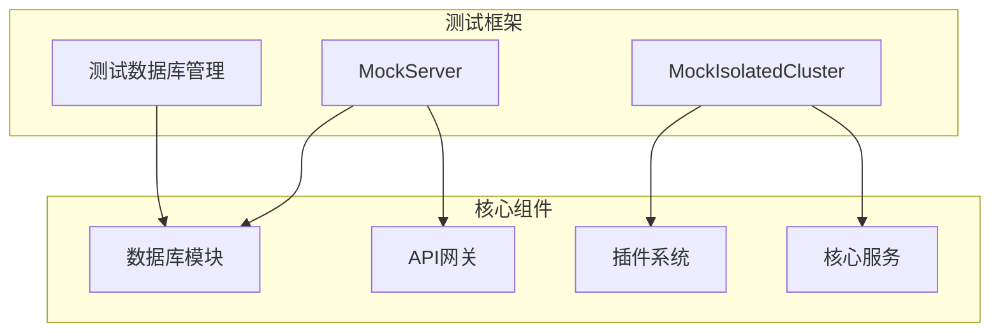
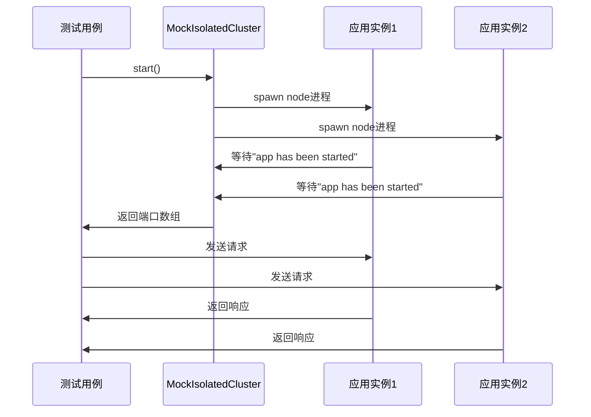
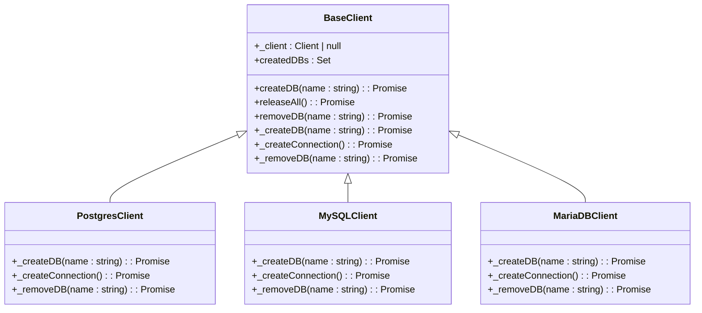
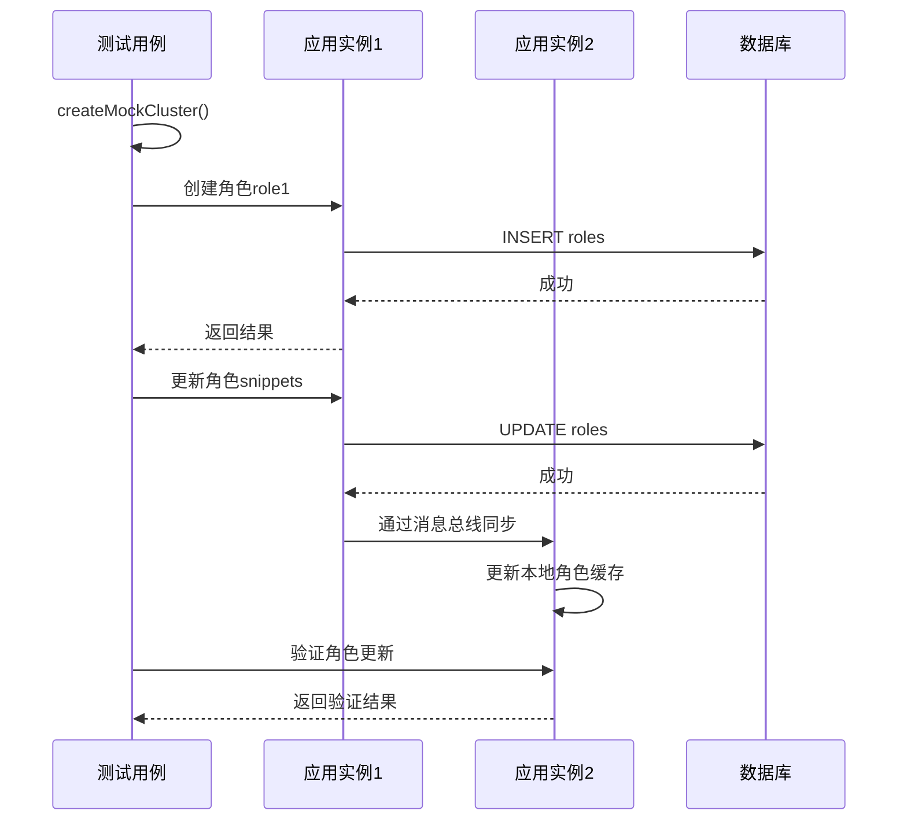
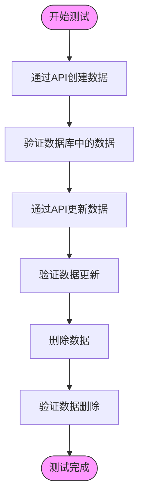
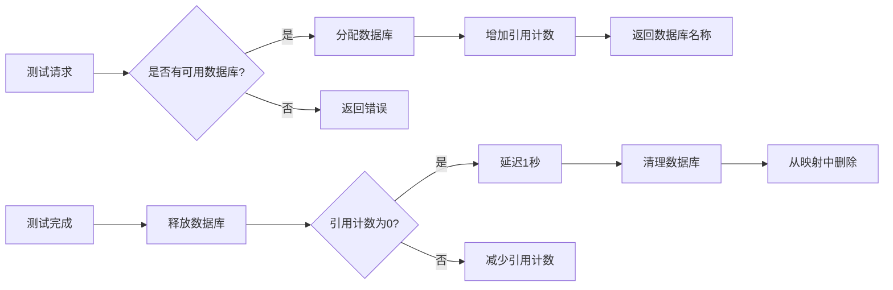
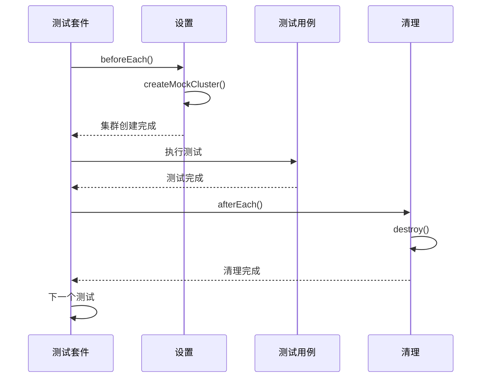

# 集成测试

<cite>
**本文档中引用的文件**  
- [mock-isolated-cluster.ts](file://packages/core/test/src/server/mock-isolated-cluster.ts)
- [test-db-creator.ts](file://packages/core/test/src/scripts/test-db-creator.ts)
- [test-db-distributor.ts](file://packages/core/test/src/scripts/test-db-distributor.ts)
- [mock-server.ts](file://packages/core/test/src/server/mock-server.ts)
- [cluster.test.ts](file://packages/plugins/@nocobase/plugin-acl/src/server/__tests__/cluster.test.ts)
- [cluster.test.ts](file://packages/plugins/@nocobase/plugin-data-source-main/src/server/__tests__/cluster.test.ts)
</cite>

## 目录
1. [简介](#简介)
2. [集成测试架构](#集成测试架构)
3. [分布式环境模拟](#分布式环境模拟)
4. [数据库集成测试](#数据库集成测试)
5. [跨服务调用验证](#跨服务调用验证)
6. [数据流测试](#数据流测试)
7. [测试数据准备策略](#测试数据准备策略)
8. [测试执行顺序与依赖管理](#测试执行顺序与依赖管理)
9. [最佳实践](#最佳实践)

## 简介
NocoBase的集成测试框架旨在验证系统各组件之间的交互，特别是数据库模块与API网关、插件系统与核心服务之间的协作。该框架提供了一套完整的工具来模拟分布式环境、管理测试数据库并验证跨服务调用的正确性。

## 集成测试架构
NocoBase的集成测试架构基于模块化设计，通过mock-server和mock-isolated-cluster等工具构建可扩展的测试环境。测试框架支持多种数据库类型（PostgreSQL、MySQL、MariaDB、SQLite），并提供了统一的API来管理测试生命周期。

**图表来源**  
- [mock-server.ts](file://packages/core/test/src/server/mock-server.ts)
- [mock-isolated-cluster.ts](file://packages/core/test/src/server/mock-isolated-cluster.ts)

**本节来源**  
- [mock-server.ts](file://packages/core/test/src/server/mock-server.ts)
- [mock-isolated-cluster.ts](file://packages/core/test/src/server/mock-isolated-cluster.ts)

## 分布式环境模拟
NocoBase使用`MockIsolatedCluster`类来模拟分布式环境，验证跨服务调用的正确性。该类通过启动多个独立的Node.js进程来模拟集群环境。

### MockIsolatedCluster实现
`MockIsolatedCluster`类通过以下方式实现分布式环境模拟：

1. 创建多个独立的服务器实例
2. 为每个实例分配独立的端口
3. 使用唯一的socket路径进行进程间通信
4. 统一的环境变量配置

**图表来源**  
- [mock-isolated-cluster.ts](file://packages/core/test/src/server/mock-isolated-cluster.ts)

**本节来源**  
- [mock-isolated-cluster.ts](file://packages/core/test/src/server/mock-isolated-cluster.ts)

## 数据库集成测试
NocoBase的数据库集成测试框架提供了完整的数据库管理解决方案，包括数据库创建、清理和连接管理。

### 数据库管理工具
框架提供了两个主要的数据库管理工具：

1. **test-db-creator.ts**: 负责创建和删除测试数据库
2. **test-db-distributor.ts**: 负责数据库连接池管理和资源分配

**图表来源**  
- [test-db-creator.ts](file://packages/core/test/src/scripts/test-db-creator.ts)

**本节来源**  
- [test-db-creator.ts](file://packages/core/test/src/scripts/test-db-creator.ts)
- [test-db-distributor.ts](file://packages/core/test/src/scripts/test-db-distributor.ts)

## 跨服务调用验证
NocoBase通过集群测试验证跨服务调用的正确性，确保在分布式环境中数据同步和状态一致性。

### 集群测试示例
以下是ACL插件的集群测试示例，验证角色权限在多个实例间的同步：

**图表来源**  
- [cluster.test.ts](file://packages/plugins/@nocobase/plugin-acl/src/server/__tests__/cluster.test.ts)

**本节来源**  
- [cluster.test.ts](file://packages/plugins/@nocobase/plugin-acl/src/server/__tests__/cluster.test.ts)
- [mock-server.ts](file://packages/core/test/src/server/mock-server.ts)

## 数据流测试
NocoBase的数据流测试验证数据在多个组件间的完整路径，确保数据从API网关到数据库的正确传输。

### 数据流验证流程
数据流测试遵循以下流程：

1. 通过API创建数据
2. 验证数据库中的数据
3. 通过API更新数据
4. 验证数据更新
5. 删除数据并验证

**图表来源**  
- [cluster.test.ts](file://packages/plugins/@nocobase/plugin-data-source-main/src/server/__tests__/cluster.test.ts)

**本节来源**  
- [cluster.test.ts](file://packages/plugins/@nocobase/plugin-data-source-main/src/server/__tests__/cluster.test.ts)

## 测试数据准备策略
NocoBase采用动态数据库创建和连接池管理策略来准备测试数据。

### 数据库创建策略
`test-db-creator.ts`实现了以下策略：

1. 基于环境变量确定数据库类型
2. 动态创建测试数据库
3. 3分钟后自动清理数据库
4. HTTP接口管理数据库生命周期

### 连接池管理
`test-db-distributor.ts`实现了连接池管理：

1. 预创建多个数据库实例
2. 按需分配数据库
3. 引用计数管理资源释放
4. 延迟释放确保数据一致性

**图表来源**  
- [test-db-distributor.ts](file://packages/core/test/src/scripts/test-db-distributor.ts)

**本节来源**  
- [test-db-creator.ts](file://packages/core/test/src/scripts/test-db-creator.ts)
- [test-db-distributor.ts](file://packages/core/test/src/scripts/test-db-distributor.ts)

## 测试执行顺序与依赖管理
NocoBase的集成测试框架通过生命周期钩子和依赖注入管理测试执行顺序。

### 测试生命周期
测试框架提供了以下生命周期钩子：

1. `beforeEach`: 每个测试前执行
2. `afterEach`: 每个测试后执行
3. `beforeAll`: 所有测试前执行
4. `afterAll`: 所有测试后执行

### 依赖管理
框架通过以下方式管理依赖：

1. 插件依赖声明
2. 服务启动顺序
3. 数据库同步机制
4. 消息总线通信

**图表来源**  
- [mock-server.ts](file://packages/core/test/src/server/mock-server.ts)

**本节来源**  
- [mock-server.ts](file://packages/core/test/src/server/mock-server.ts)
- [mock-isolated-cluster.ts](file://packages/core/test/src/server/mock-isolated-cluster.ts)

## 最佳实践
基于NocoBase的集成测试框架，以下是推荐的最佳实践：

1. **使用MockIsolatedCluster模拟生产环境**
   - 配置与生产环境相同的插件
   - 使用真实的数据库类型
   - 模拟多实例部署

2. **合理管理测试数据**
   - 使用test-db-distributor进行资源分配
   - 避免测试间的数据污染
   - 及时清理测试数据

3. **编写可维护的测试用例**
   - 保持测试用例的独立性
   - 使用描述性的测试名称
   - 添加适当的等待时间

4. **性能考虑**
   - 批量创建测试数据
   - 复用测试环境
   - 监控测试执行时间

5. **错误处理**
   - 验证异常情况下的行为
   - 测试边界条件
   - 验证错误信息的准确性

**本节来源**  
- [mock-isolated-cluster.ts](file://packages/core/test/src/server/mock-isolated-cluster.ts)
- [test-db-creator.ts](file://packages/core/test/src/scripts/test-db-creator.ts)
- [test-db-distributor.ts](file://packages/core/test/src/scripts/test-db-distributor.ts)