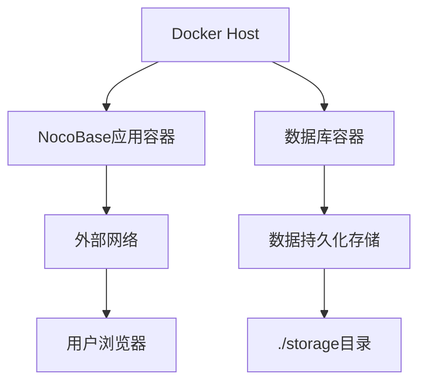
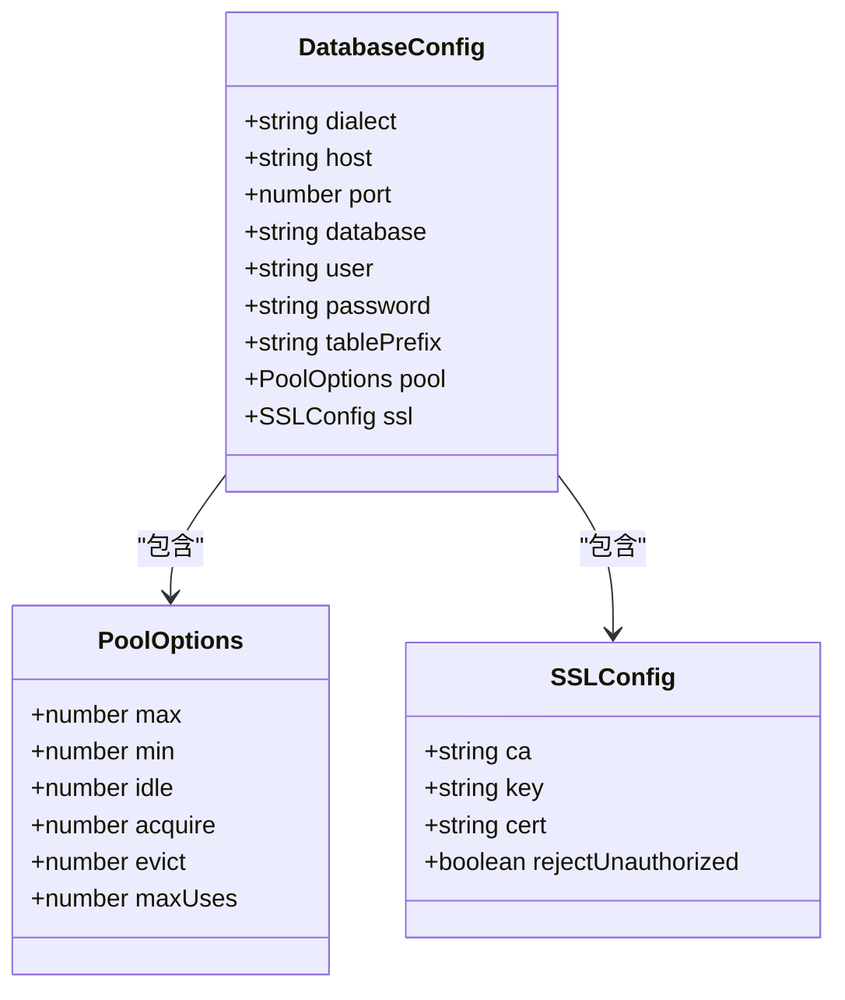
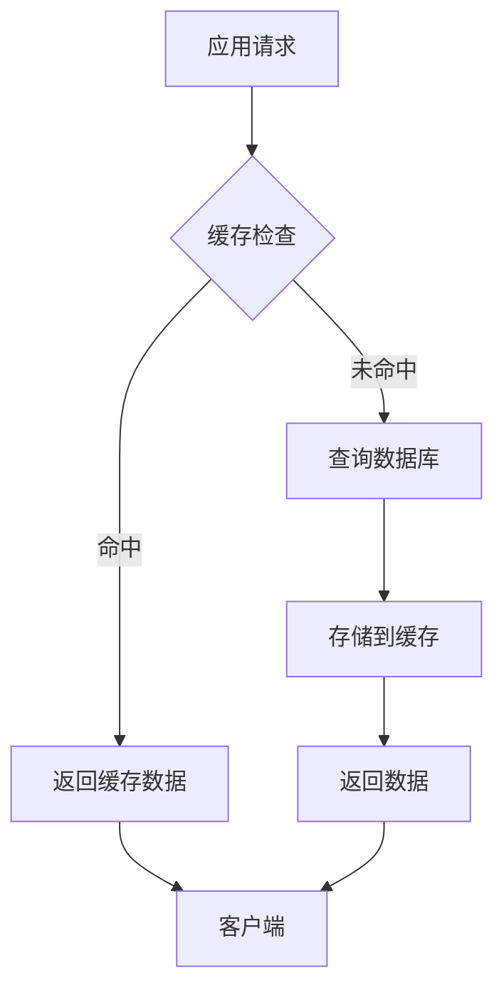
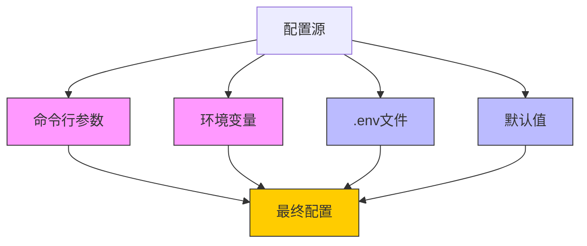
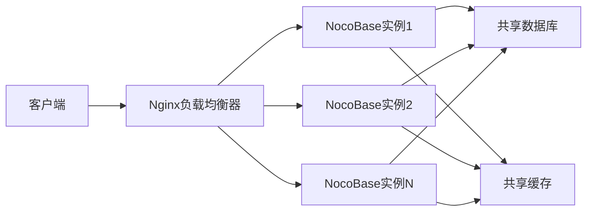

# 部署与配置

<cite>
**本文档中引用的文件**  
- [.env.example](file://.env.example)
- [docker-compose.yml](file://docker-compose.yml)
- [Dockerfile](file://Dockerfile)
- [Dockerfile.pro](file://Dockerfile.pro)
- [docker/nocobase/docker-entrypoint.sh](file://docker/nocobase/docker-entrypoint.sh)
- [docker/nocobase/nocobase.conf](file://docker/nocobase/nocobase.conf)
- [docker/app-postgres/docker-compose.yml](file://docker/app-postgres/docker-compose.yml)
- [docker/app-mysql/docker-compose.yml](file://docker/app-mysql/docker-compose.yml)
- [docker/app-mariadb/docker-compose.yml](file://docker/app-mariadb/docker-compose.yml)
- [docker/app-sqlite/docker-compose.yml](file://docker/app-sqlite/docker-compose.yml)
- [packages/core/server/src/environment.ts](file://packages/core/server/src/environment.ts)
- [packages/plugins/@nocobase/plugin-environment-variables/src/server/plugin.ts](file://packages/plugins/@nocobase/plugin-environment-variables/src/server/plugin.ts)
- [packages/core/database/src/helpers.ts](file://packages/core/database/src/helpers.ts)
- [packages/core/app/src/config/cache.ts](file://packages/core/app/src/config/cache.ts)
- [packages/core/logger/src/config.ts](file://packages/core/logger/src/config.ts)
</cite>

## 目录
1. [简介](#简介)
2. [生产环境部署最佳实践](#生产环境部署最佳实践)
   - [Docker部署](#docker部署)
   - [Kubernetes部署](#kubernetes部署)
   - [传统服务器部署](#传统服务器部署)
3. [配置选项详解](#配置选项详解)
   - [数据库连接配置](#数据库连接配置)
   - [缓存设置](#缓存设置)
   - [日志级别配置](#日志级别配置)
   - [安全配置](#安全配置)
4. [环境变量使用方法与优先级规则](#环境变量使用方法与优先级规则)
5. [性能调优指南](#性能调优指南)
   - [数据库优化](#数据库优化)
   - [缓存策略](#缓存策略)
   - [负载均衡配置](#负载均衡配置)
6. [高可用性部署方案](#高可用性部署方案)
   - [集群模式](#集群模式)
   - [故障转移](#故障转移)
   - [数据备份与恢复](#数据备份与恢复)
7. [监控与告警配置建议](#监控与告警配置建议)
8. [结论](#结论)

## 简介

NocoBase是一款开源的无代码/低代码开发平台，支持多种部署方式和灵活的配置选项。本文档旨在为系统管理员和开发人员提供全面的部署与配置指南，涵盖从基础部署到高可用性架构的各个方面。文档将详细介绍Docker、Kubernetes和传统服务器三种主要部署方式的最佳实践，深入解析各种配置选项的作用和使用方法，并提供性能调优、高可用性部署以及监控告警的完整解决方案。

**Section sources**
- [.env.example](file://.env.example)
- [docker-compose.yml](file://docker-compose.yml)

## 生产环境部署最佳实践

### Docker部署

NocoBase提供了完善的Docker部署支持，通过Docker Compose可以快速搭建包含数据库和应用的完整环境。项目根目录下的`docker-compose.yml`文件定义了多个服务，包括PostgreSQL、MySQL、MariaDB、Kingbase等数据库服务以及NocoBase应用服务。

对于生产环境，推荐使用专门的Docker Compose配置文件，如`docker/app-postgres/docker-compose.yml`，该文件配置了PostgreSQL数据库和NocoBase应用的组合。部署时需要设置必要的环境变量，包括`APP_KEY`（应用密钥）、`ENCRYPTION_FIELD_KEY`（加密字段密钥）、数据库连接信息等。

**Diagram sources**
- [docker-compose.yml](file://docker-compose.yml)
- [docker/app-postgres/docker-compose.yml](file://docker/app-postgres/docker-compose.yml)

**Section sources**
- [docker-compose.yml](file://docker-compose.yml)
- [docker/app-postgres/docker-compose.yml](file://docker/app-postgres/docker-compose.yml)
- [docker/app-mysql/docker-compose.yml](file://docker/app-mysql/docker-compose.yml)
- [docker/app-mariadb/docker-compose.yml](file://docker/app-mariadb/docker-compose.yml)

### Kubernetes部署

虽然项目中没有直接提供Kubernetes部署文件，但基于Docker镜像可以轻松创建Kubernetes部署。建议创建Deployment、Service和Ingress资源来管理NocoBase应用，同时使用StatefulSet管理数据库服务以确保数据持久性。

在Kubernetes环境中，应使用ConfigMap和Secret来管理配置和敏感信息，如数据库凭证和应用密钥。持久化存储应通过PersistentVolume和PersistentVolumeClaim实现，确保数据的安全性和可靠性。

**Section sources**
- [Dockerfile](file://Dockerfile)
- [Dockerfile.pro](file://Dockerfile.pro)

### 传统服务器部署

对于传统服务器部署，可以通过源码编译或使用预构建的Docker镜像进行安装。部署流程包括安装Node.js运行环境、配置数据库、设置环境变量和启动应用。

推荐使用PM2等进程管理工具来管理NocoBase应用进程，确保应用的稳定运行和自动重启。同时，应配置Nginx作为反向代理服务器，处理静态文件请求和负载均衡。

**Section sources**
- [Dockerfile](file://Dockerfile)
- [docker/nocobase/docker-entrypoint.sh](file://docker/nocobase/docker-entrypoint.sh)

## 配置选项详解

### 数据库连接配置

NocoBase支持多种数据库后端，包括PostgreSQL、MySQL、MariaDB和SQLite。数据库连接通过环境变量进行配置，主要配置项包括：

- `DB_DIALECT`: 数据库类型（postgres、mysql、mariadb、kingbase）
- `DB_HOST`: 数据库主机地址
- `DB_PORT`: 数据库端口
- `DB_DATABASE`: 数据库名称
- `DB_USER`: 数据库用户名
- `DB_PASSWORD`: 数据库密码
- `DB_TABLE_PREFIX`: 表名前缀

数据库连接池配置也通过环境变量实现，包括最大连接数(`DB_POOL_MAX`)、最小连接数(`DB_POOL_MIN`)、空闲超时(`DB_POOL_IDLE`)等参数，可根据实际负载情况进行调整。

**Diagram sources**
- [packages/core/database/src/helpers.ts](file://packages/core/database/src/helpers.ts)
- [.env.example](file://.env.example)

**Section sources**
- [.env.example](file://.env.example)
- [packages/core/database/src/helpers.ts](file://packages/core/database/src/helpers.ts)

### 缓存设置

NocoBase提供了灵活的缓存机制，支持内存缓存和Redis缓存。缓存配置通过以下环境变量控制：

- `CACHE_DEFAULT_STORE`: 默认缓存存储类型（memory或redis）
- `CACHE_MEMORY_MAX`: 内存缓存最大条目数
- `CACHE_REDIS_URL`: Redis连接URL

系统使用`cache-manager`库实现缓存管理，支持多种存储后端。内存缓存适用于单实例部署，而Redis缓存更适合分布式环境，可以实现多实例间的缓存共享。

**Diagram sources**
- [packages/core/app/src/config/cache.ts](file://packages/core/app/src/config/cache.ts)
- [packages/core/cache/src/cache-manager.ts](file://packages/core/cache/src/cache-manager.ts)

**Section sources**
- [packages/core/app/src/config/cache.ts](file://packages/core/app/src/config/cache.ts)
- [packages/core/cache/src/cache-manager.ts](file://packages/core/cache/src/cache-manager.ts)

### 日志级别配置

NocoBase的日志系统提供了多种配置选项，可以根据环境需求进行调整。主要配置项包括：

- `LOGGER_TRANSPORT`: 日志输出方式（console、file、dailyRotateFile）
- `LOGGER_BASE_PATH`: 日志文件基础路径
- `LOGGER_LEVEL`: 日志级别（error、warn、info、debug、trace）
- `LOGGER_MAX_FILES`: 日志文件最大保留数量
- `LOGGER_MAX_SIZE`: 单个日志文件最大大小
- `LOGGER_FORMAT`: 日志格式（console、json、logfmt、delimiter）

在生产环境中，建议使用`dailyRotateFile`作为日志输出方式，并设置适当的日志级别（通常为`info`或`warn`），以平衡日志详细程度和存储空间。

**Section sources**
- [.env.example](file://.env.example)
- [packages/core/logger/src/config.ts](file://packages/core/logger/src/config.ts)
- [packages/core/app/src/config/logger.ts](file://packages/core/app/src/config/logger.ts)

### 安全配置

安全配置是生产环境部署的关键部分，主要包括：

- `APP_KEY`: 应用密钥，用于数据加密和会话管理
- `ENCRYPTION_FIELD_KEY`: 加密字段密钥，用于敏感数据加密存储
- SSL配置：支持通过环境变量配置数据库SSL连接
- 环境变量管理：通过`plugin-environment-variables`插件实现环境变量的安全管理

建议在生产环境中使用强密码生成器创建足够长度的密钥，并定期轮换密钥以提高安全性。

**Section sources**
- [.env.example](file://.env.example)
- [packages/plugins/@nocobase/plugin-environment-variables/src/server/plugin.ts](file://packages/plugins/@nocobase/plugin-environment-variables/src/server/plugin.ts)

## 环境变量使用方法与优先级规则

NocoBase使用环境变量作为主要的配置机制，环境变量的优先级规则如下：

1. 命令行参数 > 环境变量 > 配置文件 > 默认值
2. `.env`文件中的变量会被系统环境变量覆盖
3. 插件可以定义自己的环境变量，并通过优先级规则进行合并

环境变量管理插件(`plugin-environment-variables`)允许在运行时动态修改环境变量，并自动通知相关组件重新加载配置。该插件还支持敏感变量的加密存储，确保密钥等敏感信息的安全性。

**Diagram sources**
- [packages/core/server/src/environment.ts](file://packages/core/server/src/environment.ts)
- [packages/plugins/@nocobase/plugin-environment-variables/src/server/plugin.ts](file://packages/plugins/@nocobase/plugin-environment-variables/src/server/plugin.ts)

**Section sources**
- [packages/core/server/src/environment.ts](file://packages/core/server/src/environment.ts)
- [packages/plugins/@nocobase/plugin-environment-variables/src/server/plugin.ts](file://packages/plugins/@nocobase/plugin-environment-variables/src/server/plugin.ts)

## 性能调优指南

### 数据库优化

数据库性能优化是提升系统整体性能的关键。建议措施包括：

- 为常用查询字段创建适当的索引
- 定期分析和优化数据库表结构
- 根据负载情况调整数据库连接池大小
- 使用数据库读写分离架构分散负载
- 对大表进行分区分片处理

对于PostgreSQL，建议启用`wal_level=logical`以支持逻辑复制和变更数据捕获。

**Section sources**
- [docker-compose.yml](file://docker-compose.yml)
- [packages/core/database/src/helpers.ts](file://packages/core/database/src/helpers.ts)

### 缓存策略

有效的缓存策略可以显著提升系统性能。建议：

- 对频繁读取但不常变更的数据使用缓存
- 设置合理的缓存过期时间，避免数据陈旧
- 在分布式环境中使用Redis等集中式缓存
- 实现缓存穿透、缓存击穿和缓存雪崩的防护机制
- 监控缓存命中率，及时调整缓存策略

**Section sources**
- [packages/core/cache/src/cache-manager.ts](file://packages/core/cache/src/cache-manager.ts)
- [packages/core/app/src/config/cache.ts](file://packages/core/app/src/config/cache.ts)

### 负载均衡配置

Nginx配置文件`docker/nocobase/nocobase.conf`提供了完整的负载均衡配置示例。关键配置包括：

- 静态文件缓存：对JavaScript和CSS文件设置长期缓存
- API请求代理：将API请求转发到后端应用服务器
- WebSocket支持：配置WebSocket连接代理
- 访问日志格式：定义详细的访问日志格式用于分析

在高并发场景下，建议部署多个应用实例，并通过Nginx实现负载均衡。

**Diagram sources**
- [docker/nocobase/nocobase.conf](file://docker/nocobase/nocobase.conf)

**Section sources**
- [docker/nocobase/nocobase.conf](file://docker/nocobase/nocobase.conf)

## 高可用性部署方案

### 集群模式

NocoBase支持通过`CLUSTER_MODE`环境变量启用集群模式。在集群模式下，多个应用实例可以协同工作，提高系统的可用性和性能。

集群模式需要配合分布式架构插件使用，确保各实例间的状态同步和任务协调。建议使用Redis作为分布式锁和状态共享的基础设施。

**Section sources**
- [.env.example](file://.env.example)

### 故障转移

故障转移机制通过以下方式实现：

- 数据库主从复制：确保数据库层面的高可用性
- 应用实例冗余：多个应用实例避免单点故障
- 健康检查：通过Nginx或Kubernetes的健康检查机制自动剔除故障实例
- 自动恢复：使用PM2或Kubernetes的自动重启机制恢复故障实例

**Section sources**
- [docker-compose.yml](file://docker-compose.yml)
- [docker/nocobase/nocobase.conf](file://docker/nocobase/nocobase.conf)

### 数据备份与恢复

数据安全是高可用性部署的核心。建议的备份策略包括：

- 定期数据库备份：使用数据库自带的备份工具或脚本
- 文件系统备份：备份`storage`目录中的上传文件和配置
- 备份验证：定期测试备份文件的可恢复性
- 异地备份：将备份文件存储在不同的物理位置

`docker/app-postgres/docker-compose.yml`中配置了PostgreSQL的备份卷，为数据备份提供了基础设施支持。

**Section sources**
- [docker/app-postgres/docker-compose.yml](file://docker/app-postgres/docker-compose.yml)
- [storage](file://storage)

## 监控与告警配置建议

为了确保系统的稳定运行，建议配置全面的监控和告警系统。监控指标应包括：

- 系统资源：CPU、内存、磁盘使用率
- 应用性能：请求响应时间、错误率、吞吐量
- 数据库性能：查询延迟、连接数、慢查询
- 缓存性能：命中率、内存使用
- 业务指标：关键业务流程的执行情况

告警规则应根据业务重要性和影响程度设置不同的告警级别，并通过邮件、短信或即时通讯工具及时通知运维人员。

**Section sources**
- [docker/nocobase/nocobase.conf](file://docker/nocobase/nocobase.conf)
- [packages/core/logger/src/config.ts](file://packages/core/logger/src/config.ts)

## 结论

NocoBase提供了灵活多样的部署选项和丰富的配置能力，能够满足从开发测试到生产环境的各种需求。通过合理的部署架构设计和配置优化，可以构建高性能、高可用的NocoBase应用系统。

在生产环境中，建议采用Docker或Kubernetes部署方式，结合Nginx负载均衡和Redis缓存，实现系统的可扩展性和高可用性。同时，应重视安全配置、性能调优和监控告警，确保系统的稳定可靠运行。