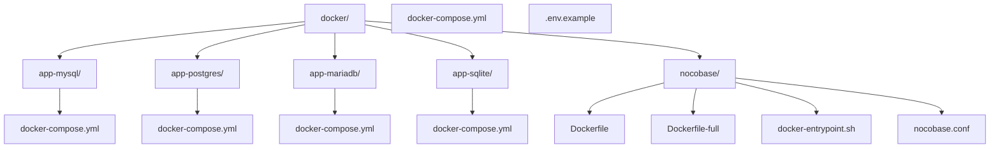
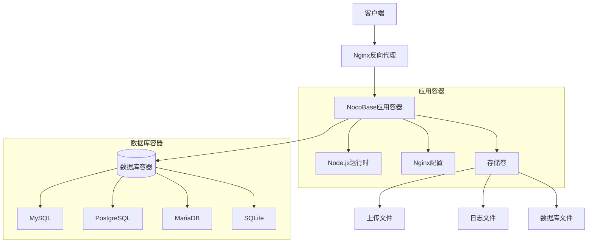
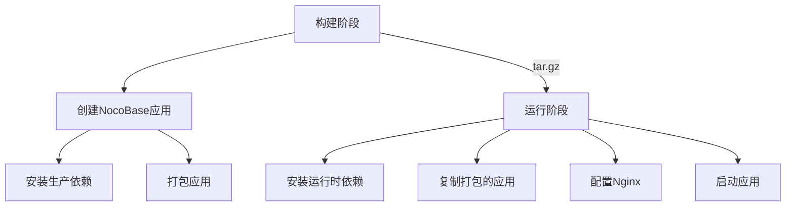
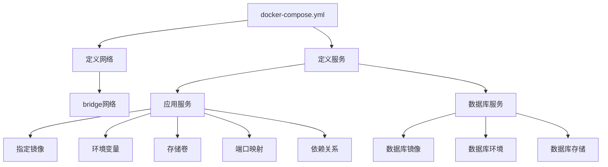
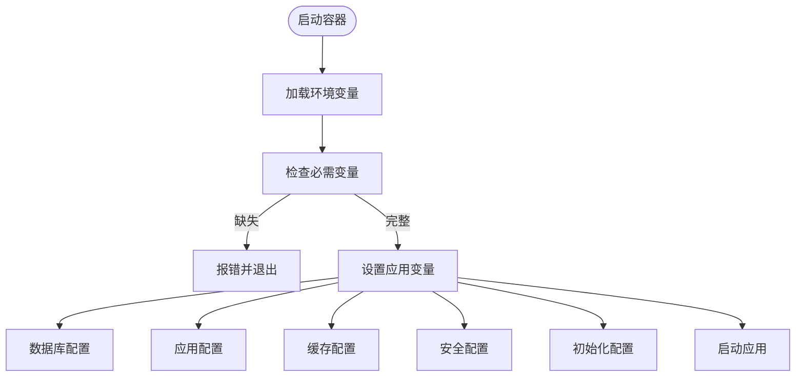
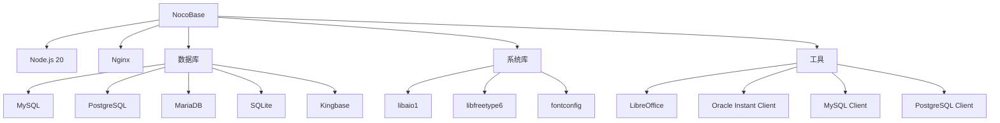

# Docker部署

<cite>
**本文档中引用的文件**  
- [Dockerfile](file://Dockerfile)
- [Dockerfile.pro](file://Dockerfile.pro)
- [docker-compose.yml](file://docker-compose.yml)
- [docker/nocobase/Dockerfile](file://docker/nocobase/Dockerfile)
- [docker/nocobase/Dockerfile-full](file://docker/nocobase/Dockerfile-full)
- [docker/nocobase/docker-entrypoint.sh](file://docker/nocobase/docker-entrypoint.sh)
- [docker/nocobase/nocobase.conf](file://docker/nocobase/nocobase.conf)
- [docker/app-mysql/docker-compose.yml](file://docker/app-mysql/docker-compose.yml)
- [docker/app-postgres/docker-compose.yml](file://docker/app-postgres/docker-compose.yml)
- [docker/app-mariadb/docker-compose.yml](file://docker/app-mariadb/docker-compose.yml)
- [docker/app-sqlite/docker-compose.yml](file://docker/app-sqlite/docker-compose.yml)
- [.env.example](file://.env.example)
- [packages/plugins/@nocobase/plugin-environment-variables/src/server/plugin.ts](file://packages/plugins/@nocobase/plugin-environment-variables/src/server/plugin.ts)
- [packages/plugins/@nocobase/plugin-environment-variables/src/server/collections/environmentVariables.ts](file://packages/plugins/@nocobase/plugin-environment-variables/src/server/collections/environmentVariables.ts)
</cite>

## 目录
1. [简介](#简介)
2. [项目结构](#项目结构)
3. [核心组件](#核心组件)
4. [架构概述](#架构概述)
5. [详细组件分析](#详细组件分析)
6. [依赖分析](#依赖分析)
7. [性能考虑](#性能考虑)
8. [故障排除指南](#故障排除指南)
9. [结论](#结论)

## 简介
NocoBase 是一个高度可扩展的AI驱动的无代码平台，支持通过Docker进行快速部署。本文档详细介绍了NocoBase的Docker部署方法，包括单机部署和多容器部署的配置方式，涵盖不同数据库后端（MySQL、PostgreSQL、MariaDB、SQLite）的容器化部署配置，以及生产环境中的资源限制、存储卷配置和安全最佳实践。

## 项目结构
NocoBase的Docker相关文件主要位于`docker`目录下，包含多个子目录和配置文件。项目根目录下也提供了通用的`docker-compose.yml`文件用于开发环境部署。



**图示来源**
- [docker/app-mysql/docker-compose.yml](file://docker/app-mysql/docker-compose.yml)
- [docker/app-postgres/docker-compose.yml](file://docker/app-postgres/docker-compose.yml)
- [docker/app-mariadb/docker-compose.yml](file://docker/app-mariadb/docker-compose.yml)
- [docker/app-sqlite/docker-compose.yml](file://docker/app-sqlite/docker-compose.yml)
- [docker/nocobase/Dockerfile](file://docker/nocobase/Dockerfile)
- [docker/nocobase/Dockerfile-full](file://docker/nocobase/Dockerfile-full)
- [docker/nocobase/docker-entrypoint.sh](file://docker/nocobase/docker-entrypoint.sh)
- [docker/nocobase/nocobase.conf](file://docker/nocobase/nocobase.conf)
- [docker-compose.yml](file://docker-compose.yml)

**章节来源**
- [docker/](file://docker/)
- [docker-compose.yml](file://docker-compose.yml)

## 核心组件
NocoBase的Docker部署核心组件包括基础镜像构建、多数据库支持的部署配置、环境变量管理以及Nginx反向代理配置。系统通过`docker-entrypoint.sh`脚本在容器启动时自动配置Nginx并启动应用。

**章节来源**
- [docker/nocobase/Dockerfile](file://docker/nocobase/Dockerfile)
- [docker/nocobase/docker-entrypoint.sh](file://docker/nocobase/docker-entrypoint.sh)
- [docker/nocobase/nocobase.conf](file://docker/nocobase/nocobase.conf)

## 架构概述
NocoBase的Docker部署采用多阶段构建策略，分离构建环境和运行环境，确保最终镜像的轻量化。系统支持单容器部署（SQLite）和多容器部署（MySQL、PostgreSQL、MariaDB），通过docker-compose.yml文件定义服务依赖关系。



**图示来源**
- [docker/nocobase/Dockerfile](file://docker/nocobase/Dockerfile)
- [docker/app-mysql/docker-compose.yml](file://docker/app-mysql/docker-compose.yml)
- [docker/app-postgres/docker-compose.yml](file://docker/app-postgres/docker-compose.yml)
- [docker/app-mariadb/docker-compose.yml](file://docker/app-mariadb/docker-compose.yml)
- [docker/app-sqlite/docker-compose.yml](file://docker/app-sqlite/docker-compose.yml)

## 详细组件分析

### Docker镜像构建分析
NocoBase提供了两种Docker镜像构建方式：基础镜像和完整镜像。基础镜像仅包含运行所需的基本组件，而完整镜像包含了额外的数据库客户端工具。



**图示来源**
- [docker/nocobase/Dockerfile](file://docker/nocobase/Dockerfile)
- [docker/nocobase/Dockerfile-full](file://docker/nocobase/Dockerfile-full)

**章节来源**
- [docker/nocobase/Dockerfile](file://docker/nocobase/Dockerfile)
- [docker/nocobase/Dockerfile-full](file://docker/nocobase/Dockerfile-full)

### Docker Compose配置分析
NocoBase为不同数据库提供了专门的docker-compose.yml配置文件，统一采用bridge网络模式进行服务间通信。



**图示来源**
- [docker/app-mysql/docker-compose.yml](file://docker/app-mysql/docker-compose.yml)
- [docker/app-postgres/docker-compose.yml](file://docker/app-postgres/docker-compose.yml)
- [docker/app-mariadb/docker-compose.yml](file://docker/app-mariadb/docker-compose.yml)

**章节来源**
- [docker/app-mysql/docker-compose.yml](file://docker/app-mysql/docker-compose.yml)
- [docker/app-postgres/docker-compose.yml](file://docker/app-postgres/docker-compose.yml)
- [docker/app-mariadb/docker-compose.yml](file://docker/app-mariadb/docker-compose.yml)
- [docker/app-sqlite/docker-compose.yml](file://docker/app-sqlite/docker-compose.yml)

### 环境变量管理
NocoBase通过环境变量进行系统配置，支持在docker-compose.yml文件中直接定义或通过.env文件加载。



**图示来源**
- [.env.example](file://.env.example)
- [packages/plugins/@nocobase/plugin-environment-variables/src/server/plugin.ts](file://packages/plugins/@nocobase/plugin-environment-variables/src/server/plugin.ts)

**章节来源**
- [.env.example](file://.env.example)
- [packages/plugins/@nocobase/plugin-environment-variables/src/server/plugin.ts](file://packages/plugins/@nocobase/plugin-environment-variables/src/server/plugin.ts)
- [packages/plugins/@nocobase/plugin-environment-variables/src/server/collections/environmentVariables.ts](file://packages/plugins/@nocobase/plugin-environment-variables/src/server/collections/environmentVariables.ts)

## 依赖分析
NocoBase的Docker部署依赖于多个外部组件和服务，包括数据库服务、Nginx反向代理和Node.js运行时环境。



**图示来源**
- [Dockerfile](file://Dockerfile)
- [Dockerfile.pro](file://Dockerfile.pro)
- [docker/nocobase/Dockerfile](file://docker/nocobase/Dockerfile)
- [docker/nocobase/Dockerfile-full](file://docker/nocobase/Dockerfile-full)

**章节来源**
- [Dockerfile](file://Dockerfile)
- [Dockerfile.pro](file://Dockerfile.pro)
- [docker-compose.yml](file://docker-compose.yml)

## 性能考虑
在生产环境中部署NocoBase时，需要考虑资源限制、存储配置和网络优化等方面。

### 资源限制
建议为NocoBase容器设置适当的资源限制，防止资源耗尽：

```yaml
# docker-compose.yml 片段
services:
  app:
    # ...
    deploy:
      resources:
        limits:
          cpus: '2'
          memory: 4G
        reservations:
          cpus: '0.5'
          memory: 512M
```

### 存储卷配置
使用持久化存储卷确保数据持久性：

```yaml
# docker-compose.yml 片段
services:
  app:
    volumes:
      - ./storage:/app/nocobase/storage
  mysql:
    volumes:
      - ./storage/db/mysql:/var/lib/mysql
```

### 网络配置
使用自定义bridge网络确保服务间通信：

```yaml
# docker-compose.yml 片段
networks:
  nocobase:
    driver: bridge
```

**章节来源**
- [docker/app-mysql/docker-compose.yml](file://docker/app-mysql/docker-compose.yml)
- [docker/app-postgres/docker-compose.yml](file://docker/app-postgres/docker-compose.yml)
- [docker/app-mariadb/docker-compose.yml](file://docker/app-mariadb/docker-compose.yml)
- [docker/app-sqlite/docker-compose.yml](file://docker/app-sqlite/docker-compose.yml)

## 故障排除指南
### 常见问题及解决方案

1. **数据库连接失败**
   - 检查数据库服务是否已启动
   - 验证环境变量中的数据库主机名是否正确
   - 确认数据库端口映射是否正确

2. **应用启动失败**
   - 检查`APP_KEY`和`ENCRYPTION_FIELD_KEY`是否已设置
   - 验证存储卷权限是否正确
   - 查看容器日志获取详细错误信息

3. **页面无法访问**
   - 确认端口映射是否正确
   - 检查Nginx配置是否已正确生成
   - 验证防火墙设置

4. **数据持久化问题**
   - 确保存储卷路径正确映射
   - 检查宿主机目录权限
   - 验证数据库文件是否已正确创建

**章节来源**
- [docker/nocobase/docker-entrypoint.sh](file://docker/nocobase/docker-entrypoint.sh)
- [docker/nocobase/nocobase.conf](file://docker/nocobase/nocobase.conf)
- [docker/app-mysql/docker-compose.yml](file://docker/app-mysql/docker-compose.yml)

## 结论
NocoBase提供了完善的Docker部署方案，支持多种数据库后端和灵活的配置选项。通过多阶段构建和容器化部署，确保了应用的可移植性和一致性。建议在生产环境中使用多容器部署模式，并配置适当的资源限制和持久化存储，以确保系统的稳定性和可靠性。