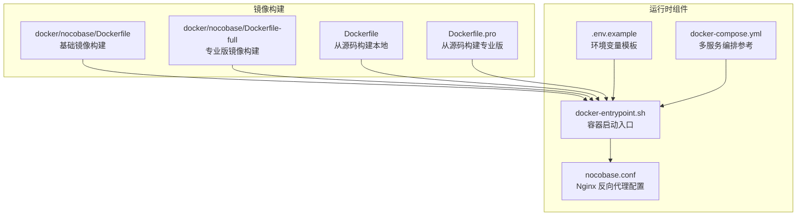
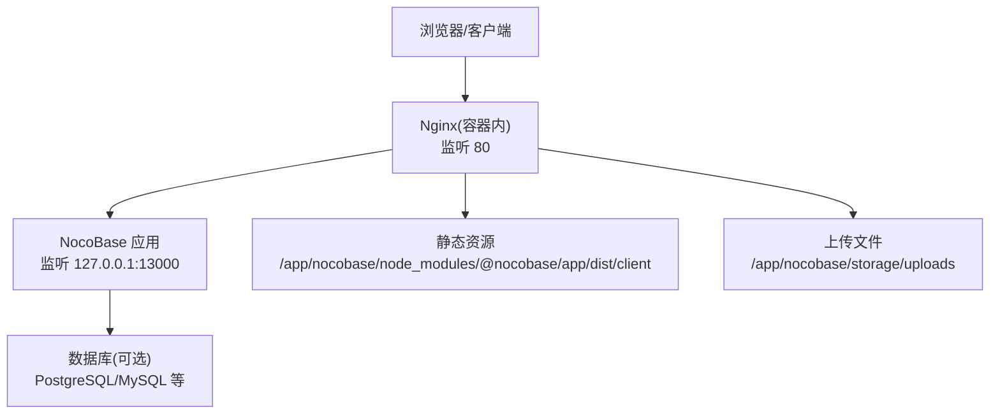
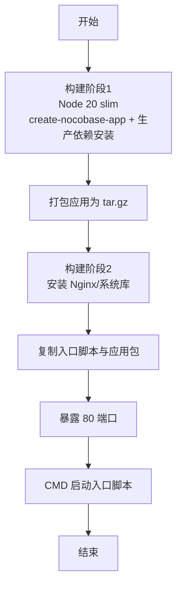
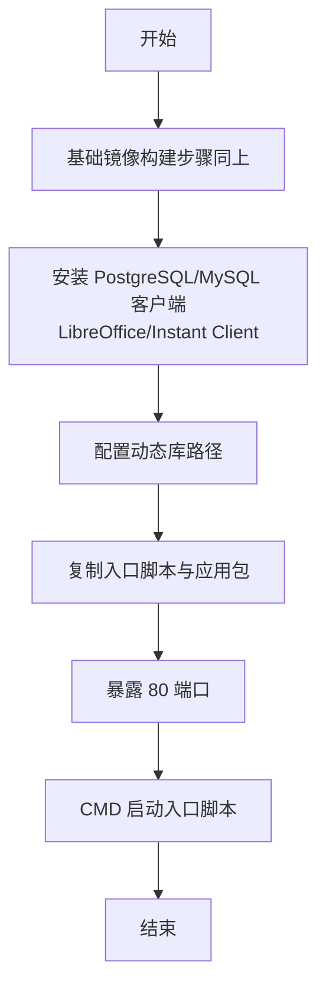
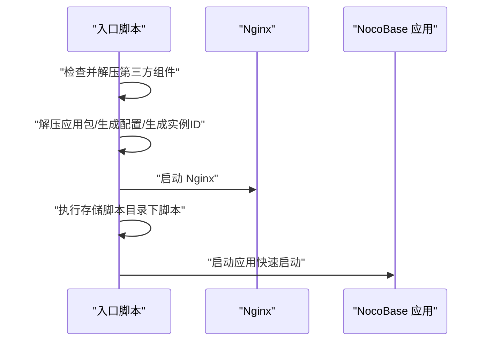
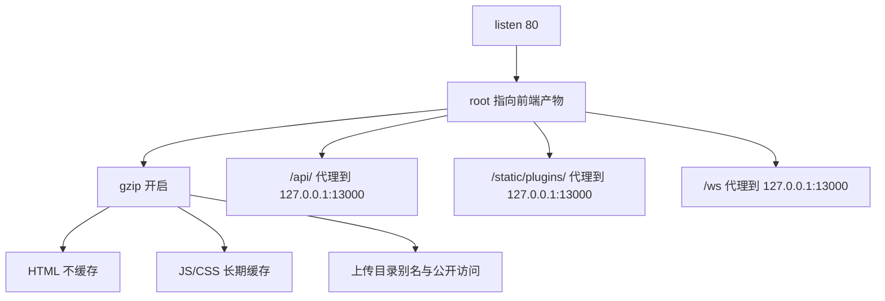
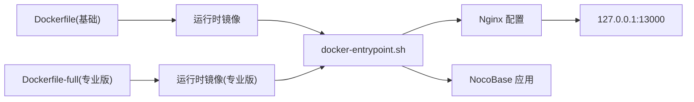

# 单机部署

<cite>
**本文引用的文件**
- [docker/nocobase/Dockerfile](file://docker/nocobase/Dockerfile)
- [docker/nocobase/Dockerfile-full](file://docker/nocobase/Dockerfile-full)
- [docker/nocobase/docker-entrypoint.sh](file://docker/nocobase/docker-entrypoint.sh)
- [docker/nocobase/nocobase.conf](file://docker/nocobase/nocobase.conf)
- [Dockerfile](file://Dockerfile)
- [Dockerfile.pro](file://Dockerfile.pro)
- [.env.example](file://.env.example)
- [docker-compose.yml](file://docker-compose.yml)
</cite>

## 目录
1. [简介](#简介)
2. [项目结构](#项目结构)
3. [核心组件](#核心组件)
4. [架构总览](#架构总览)
5. [详细组件分析](#详细组件分析)
6. [依赖关系分析](#依赖关系分析)
7. [性能与资源优化](#性能与资源优化)
8. [故障排查指南](#故障排查指南)
9. [结论](#结论)
10. [附录：构建与运行命令示例](#附录构建与运行命令示例)

## 简介
本指南面向希望在单机环境中使用 Docker 快速部署 NocoBase 的用户，覆盖以下内容：
- 使用官方 Dockerfile 构建基础镜像与“专业版”镜像（包含数据库客户端与文档处理依赖）
- 解析 Dockerfile 各层指令与构建参数的作用
- 提供完整的构建与运行命令示例
- 说明容器端口映射、卷挂载与环境变量配置
- 介绍容器生命周期管理（启动、停止、重启、日志查看）
- 给出单机部署的性能优化建议与资源限制配置思路

## 项目结构
与单机 Docker 部署直接相关的目录与文件如下：
- docker/nocobase：包含单机部署所需的 Dockerfile、入口脚本与 Nginx 配置
- 根目录 Dockerfile 与 Dockerfile.pro：用于从源码构建镜像（适用于本地二次打包或自定义）
- .env.example：应用与数据库等环境变量模板
- docker-compose.yml：多服务编排示例（可作为参考）

图表来源
- [docker/nocobase/Dockerfile](file://docker/nocobase/Dockerfile#L1-L49)
- [docker/nocobase/Dockerfile-full](file://docker/nocobase/Dockerfile-full#L1-L62)
- [docker/nocobase/docker-entrypoint.sh](file://docker/nocobase/docker-entrypoint.sh#L1-L56)
- [docker/nocobase/nocobase.conf](file://docker/nocobase/nocobase.conf#L1-L91)
- [Dockerfile](file://Dockerfile#L1-L89)
- [Dockerfile.pro](file://Dockerfile.pro#L1-L63)
- [.env.example](file://.env.example#L1-L98)
- [docker-compose.yml](file://docker-compose.yml#L1-L80)

章节来源
- [docker/nocobase/Dockerfile](file://docker/nocobase/Dockerfile#L1-L49)
- [docker/nocobase/Dockerfile-full](file://docker/nocobase/Dockerfile-full#L1-L62)
- [docker/nocobase/docker-entrypoint.sh](file://docker/nocobase/docker-entrypoint.sh#L1-L56)
- [docker/nocobase/nocobase.conf](file://docker/nocobase/nocobase.conf#L1-L91)
- [Dockerfile](file://Dockerfile#L1-L89)
- [Dockerfile.pro](file://Dockerfile.pro#L1-L63)
- [.env.example](file://.env.example#L1-L98)
- [docker-compose.yml](file://docker-compose.yml#L1-L80)

## 核心组件
- 基础镜像 Dockerfile：基于 Node 20 slim 镜像，通过 create-nocobase-app 创建生产环境应用，并打包为 tar 供运行时镜像使用；运行时安装 Nginx 并暴露 80 端口，入口为 docker-entrypoint.sh。
- 专业版 Dockerfile：在基础镜像基础上，额外安装 PostgreSQL 客户端、MySQL 客户端、LibreOffice、Oracle Instant Client 等，适合需要导出与多数据库连接的场景。
- 运行时入口脚本：负责解压应用包、生成 Nginx 配置、软链到站点启用目录、启动 Nginx、执行存储脚本、启动 NocoBase 应用进程。
- Nginx 配置：反向代理静态资源与 API 到 127.0.0.1:13000，WebSocket 转发，设置缓存策略与访问日志格式。
- 环境变量模板：包含应用环境、数据库、缓存、初始化账号等关键配置项。
- 多服务编排：提供 Verdaccio、MySQL、Kingbase、Postgres、Adminer 等服务示例（可用于开发测试环境）。

章节来源
- [docker/nocobase/Dockerfile](file://docker/nocobase/Dockerfile#L1-L49)
- [docker/nocobase/Dockerfile-full](file://docker/nocobase/Dockerfile-full#L1-L62)
- [docker/nocobase/docker-entrypoint.sh](file://docker/nocobase/docker-entrypoint.sh#L1-L56)
- [docker/nocobase/nocobase.conf](file://docker/nocobase/nocobase.conf#L1-L91)
- [.env.example](file://.env.example#L1-L98)
- [docker-compose.yml](file://docker-compose.yml#L1-L80)

## 架构总览
单机部署采用“Nginx + 应用”的组合模式：Nginx 作为反向代理与静态资源服务，应用监听 13000 端口并通过 Nginx 暴露给外部。

图表来源
- [docker/nocobase/nocobase.conf](file://docker/nocobase/nocobase.conf#L15-L90)
- [docker/nocobase/docker-entrypoint.sh](file://docker/nocobase/docker-entrypoint.sh#L30-L46)

## 详细组件分析

### 组件一：基础镜像构建流程（docker/nocobase/Dockerfile）
- 分阶段构建：第一阶段使用 Node 20 slim，通过 create-nocobase-app 创建空应用并仅安装生产依赖，清理冗余文件后打包为 tar。
- 第二阶段：安装 Nginx 与必要系统库，复制入口脚本与打包的应用，暴露 80 端口，CMD 指定入口脚本。
- 关键点：
  - 生产环境 APP_ENV=production，避免开发期特性影响。
  - 通过 ARG CNA_VERSION 控制应用骨架版本。
  - 入口脚本负责生成 Nginx 配置并启动 Nginx 与应用。

图表来源
- [docker/nocobase/Dockerfile](file://docker/nocobase/Dockerfile#L1-L49)

章节来源
- [docker/nocobase/Dockerfile](file://docker/nocobase/Dockerfile#L1-L49)

### 组件二：专业版镜像构建流程（docker/nocobase/Dockerfile-full）
- 在基础镜像基础上，额外安装 PostgreSQL 客户端、MySQL 客户端、LibreOffice、Oracle Instant Client 等，便于文档导出与多数据库连接。
- 通过 wget 下载并安装客户端工具，配置动态链接库路径，确保应用侧可调用相应命令行工具。
- 适合需要导出 PDF、Excel 或连接多种数据库的单机部署场景。

图表来源
- [docker/nocobase/Dockerfile-full](file://docker/nocobase/Dockerfile-full#L1-L62)

章节来源
- [docker/nocobase/Dockerfile-full](file://docker/nocobase/Dockerfile-full#L1-L62)

### 组件三：运行时入口脚本（docker/nocobase/docker-entrypoint.sh）
- 初始化：标记运行于 Docker 环境，解压 LibreOffice 与 Oracle Instant Client（如存在）。
- 应用准备：若应用目录不存在则解压应用包；生成 Nginx 配置、生成实例 ID；软链站点配置到启用目录。
- 启动服务：启动 Nginx；遍历并执行存储脚本目录下的脚本；启动 NocoBase 应用（快速启动模式）。
- 命令兼容：若第一个参数以 - 开头或不是系统命令，则自动以 node 执行该命令，便于交互式调试。

图表来源
- [docker/nocobase/docker-entrypoint.sh](file://docker/nocobase/docker-entrypoint.sh#L1-L56)

章节来源
- [docker/nocobase/docker-entrypoint.sh](file://docker/nocobase/docker-entrypoint.sh#L1-L56)

### 组件四：Nginx 反向代理配置（docker/nocobase/nocobase.conf）
- 监听 80 端口，根目录指向前端产物，开启 gzip。
- 对静态资源（JS/CSS）设置长期缓存；对 HTML 不缓存；对上传目录设置公开访问与关闭访问日志。
- 将 /api/ 与 /static/plugins/ 代理至 127.0.0.1:13000，WebSocket 路径 /ws 也转发至应用。
- 设置请求超时与代理头，确保长连接与代理正常。

图表来源
- [docker/nocobase/nocobase.conf](file://docker/nocobase/nocobase.conf#L15-L90)

章节来源
- [docker/nocobase/nocobase.conf](file://docker/nocobase/nocobase.conf#L1-L91)

### 组件五：环境变量与配置要点（.env.example）
- 应用环境与端口：APP_ENV、APP_PORT、APP_KEY 等。
- 日志与集群：日志传输类型、级别、文件大小与天数、是否启用集群模式与 Worker 模式。
- 数据库：DB_DIALECT、DB_HOST、DB_PORT、DB_DATABASE、DB_USER、DB_PASSWORD 等。
- 缓存：CACHE_DEFAULT_STORE、REDIS_URL 等。
- 初始化：INIT_ROOT_* 等首次初始化管理员账户信息。
- 加密字段：ENCRYPTION_FIELD_KEY。
- 包认证：NOCOBASE_PKG_USERNAME/PASSWORD（平台服务账号）。

章节来源
- [.env.example](file://.env.example#L1-L98)

### 组件六：多服务编排参考（docker-compose.yml）
- 提供 Verdaccio、MySQL、Kingbase、Postgres、Adminer、NocoBase 等服务示例。
- 端口映射与网络隔离，便于开发测试环境快速搭建。
- 注意：该文件主要用于多服务编排参考，单机部署可按需简化。

章节来源
- [docker-compose.yml](file://docker-compose.yml#L1-L80)

## 依赖关系分析
- 构建阶段依赖：Node 20、yarn、create-nocobase-app、打包工具。
- 运行时依赖：Nginx、libaio1、数据库客户端（专业版）、字体与图形库（LibreOffice）。
- 入口脚本依赖：应用包、Nginx 配置生成、存储脚本目录。
- Nginx 依赖：反向代理目标地址与路径规则。

图表来源
- [docker/nocobase/Dockerfile](file://docker/nocobase/Dockerfile#L1-L49)
- [docker/nocobase/Dockerfile-full](file://docker/nocobase/Dockerfile-full#L1-L62)
- [docker/nocobase/docker-entrypoint.sh](file://docker/nocobase/docker-entrypoint.sh#L1-L56)
- [docker/nocobase/nocobase.conf](file://docker/nocobase/nocobase.conf#L1-L91)

## 性能与资源优化
- Nginx 层优化
  - 静态资源缓存：对 JS/CSS 设置长期缓存，减少带宽与服务器压力。
  - 压缩：开启 gzip，降低传输体积。
  - 访问日志：上传目录关闭访问日志，减少磁盘 IO。
- 应用层优化
  - 生产环境 APP_ENV=production，避免开发期特性开销。
  - 合理设置日志级别与输出位置，避免频繁落盘。
  - 若启用集群模式，需确保插件支持分布式架构，否则可能出现异常。
- 数据库连接池
  - 根据并发与资源情况调整数据库连接池参数（最大连接数、空闲时间、获取超时等），避免连接争用。
- 存储与卷
  - 将上传目录与日志目录挂载到持久化卷，避免容器重建导致数据丢失。
- 资源限制
  - 通过 Docker 资源限制（CPU、内存）控制容器资源占用，避免与其他服务互相影响。
- 端口与网络
  - 单机部署建议仅开放必要端口（如 80），内部服务尽量使用桥接网络或不对外暴露。

[本节为通用建议，无需特定文件来源]

## 故障排查指南
- 启动后无法访问
  - 检查 Nginx 是否启动成功（入口脚本会打印启动日志）。
  - 确认 Nginx 配置已软链到启用目录，且代理目标 127.0.0.1:13000 可达。
- WebSocket 无法连接
  - 确认 /ws 路径已正确代理至应用端口。
- 上传文件无法访问
  - 检查 /storage/uploads/ 别名与权限，确认挂载路径正确。
- 应用启动失败
  - 查看入口脚本执行日志，确认应用包解压完成、实例 ID 已生成。
  - 检查数据库连接参数与可达性。
- 日志定位
  - Nginx 访问日志位于 /var/log/nginx/nocobase.log（由配置定义）。
  - 应用日志可通过容器日志查看。

章节来源
- [docker/nocobase/docker-entrypoint.sh](file://docker/nocobase/docker-entrypoint.sh#L30-L46)
- [docker/nocobase/nocobase.conf](file://docker/nocobase/nocobase.conf#L1-L91)

## 结论
通过上述 Dockerfile 与运行时组件，可在单机环境中快速部署 NocoBase。基础镜像适合轻量部署，专业版镜像适合需要导出与多数据库连接的场景。结合合理的环境变量、卷挂载与资源限制，可获得稳定、高性能的单机运行体验。

[本节为总结，无需特定文件来源]

## 附录：构建与运行命令示例

- 构建基础镜像
  - 基于 docker/nocobase/Dockerfile 构建，指定应用骨架版本参数（如需要）。
  - 示例命令（请根据实际路径与参数调整）：
    - docker build -f docker/nocobase/Dockerfile -t nocobase:latest .
    - 如需指定应用骨架版本：docker build --build-arg CNA_VERSION=... -f docker/nocobase/Dockerfile -t nocobase:latest .

- 构建专业版镜像
  - 基于 docker/nocobase/Dockerfile-full 构建，将包含 PostgreSQL/MySQL 客户端与文档处理依赖。
  - 示例命令：
    - docker build -f docker/nocobase/Dockerfile-full -t nocobase-full:latest .

- 从源码构建（本地二次打包）
  - 基于根目录 Dockerfile/Dockerfile.pro，适用于需要从源码构建镜像的场景。
  - 示例命令：
    - docker build -f Dockerfile -t nocobase-src:latest .
    - docker build -f Dockerfile.pro -t nocobase-src-full:latest .

- 运行单机容器
  - 基础镜像运行（示例）：
    - docker run -d --name nocobase -p 80:80 -v /宿主/持久化路径:/app/nocobase/storage --env-file .env.example nocobase:latest
  - 专业版镜像运行（示例）：
    - docker run -d --name nocobase-full -p 80:80 -v /宿主/持久化路径:/app/nocobase/storage --env-file .env.example nocobase-full:latest
  - 注意：容器内应用监听 127.0.0.1:13000，Nginx 暴露 80 端口，因此只需映射 80 端口即可访问。

- 容器生命周期管理
  - 启动：docker start nocobase
  - 停止：docker stop nocobase
  - 重启：docker restart nocobase
  - 查看日志：docker logs -f nocobase
  - 进入容器调试：docker exec -it nocobase /bin/bash

- 环境变量与卷挂载
  - 环境变量：建议使用 --env-file 指向 .env.example（按需修改）。
  - 卷挂载：建议将 /app/nocobase/storage 挂载到持久化目录，保存上传文件、日志与初始化数据。

- 端口与网络
  - 默认暴露 80 端口（Nginx），应用内部监听 127.0.0.1:13000。
  - 单机部署建议使用默认桥接网络，避免跨主机复杂性。

章节来源
- [docker/nocobase/Dockerfile](file://docker/nocobase/Dockerfile#L1-L49)
- [docker/nocobase/Dockerfile-full](file://docker/nocobase/Dockerfile-full#L1-L62)
- [docker/nocobase/docker-entrypoint.sh](file://docker/nocobase/docker-entrypoint.sh#L1-L56)
- [docker/nocobase/nocobase.conf](file://docker/nocobase/nocobase.conf#L1-L91)
- [.env.example](file://.env.example#L1-L98)
- [docker-compose.yml](file://docker-compose.yml#L1-L80)