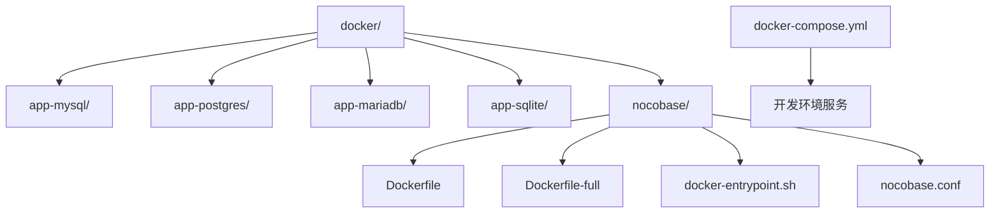
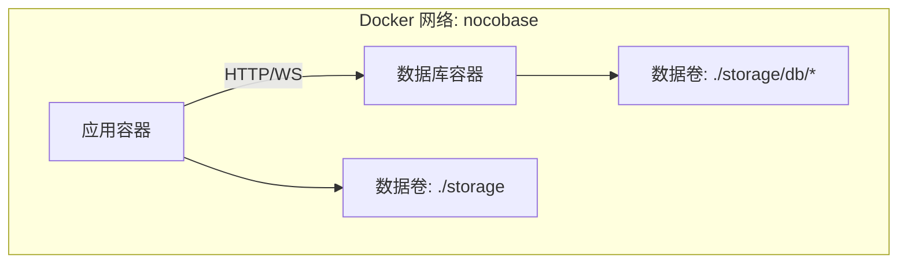
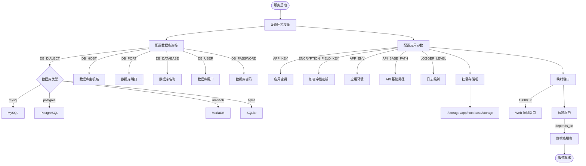
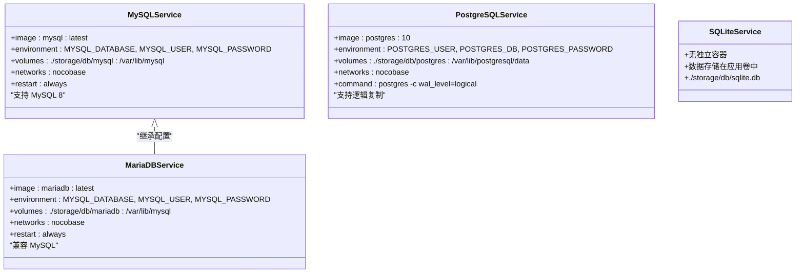
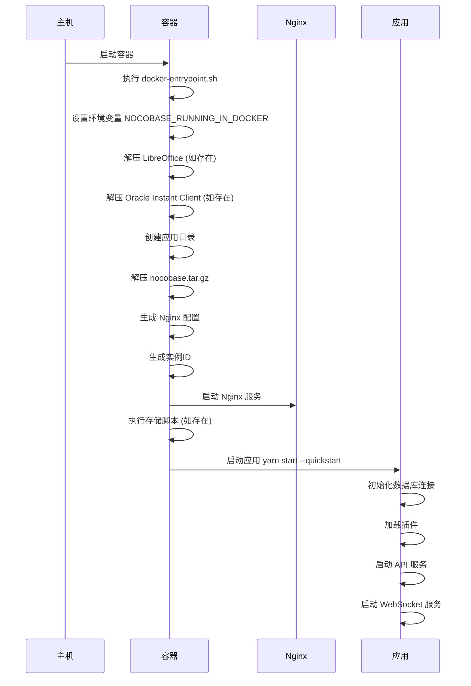
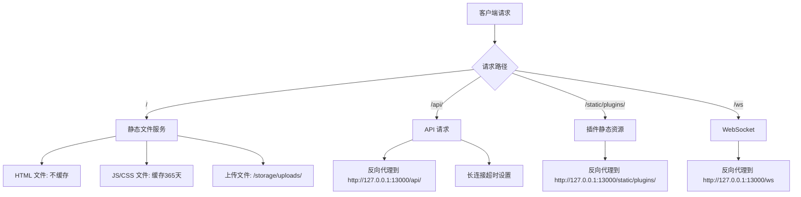
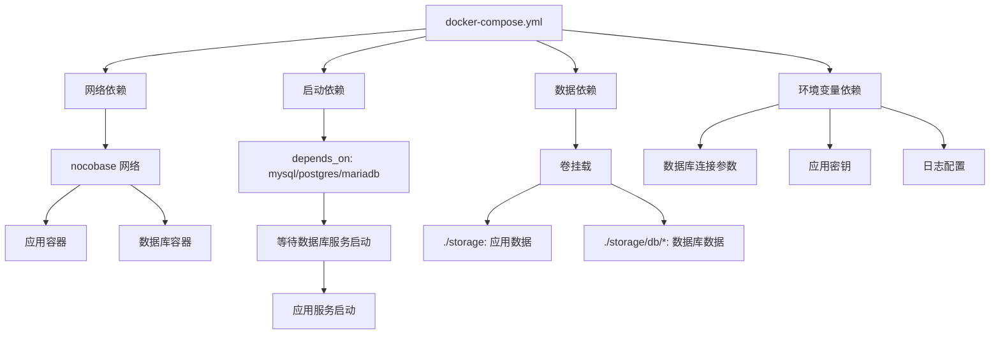

# 多容器部署

<cite>
**本文档中引用的文件**  
- [app-mysql/docker-compose.yml](file://docker/app-mysql/docker-compose.yml)
- [app-postgres/docker-compose.yml](file://docker/app-postgres/docker-compose.yml)
- [app-mariadb/docker-compose.yml](file://docker/app-mariadb/docker-compose.yml)
- [app-sqlite/docker-compose.yml](file://docker/app-sqlite/docker-compose.yml)
- [docker-compose.yml](file://docker-compose.yml)
- [docker/nocobase/Dockerfile](file://docker/nocobase/Dockerfile)
- [docker/nocobase/Dockerfile-full](file://docker/nocobase/Dockerfile-full)
- [docker/nocobase/docker-entrypoint.sh](file://docker/nocobase/docker-entrypoint.sh)
- [docker/nocobase/nocobase.conf](file://docker/nocobase/nocobase.conf)
- [.env.example](file://.env.example)
- [packages/plugins/@nocobase/plugin-environment-variables/src/server/plugin.ts](file://packages/plugins/@nocobase/plugin-environment-variables/src/server/plugin.ts)
- [packages/core/database/src/helpers.ts](file://packages/core/database/src/helpers.ts)
</cite>

## 目录
1. [简介](#简介)
2. [项目结构](#项目结构)
3. [核心组件](#核心组件)
4. [架构概述](#架构概述)
5. [详细组件分析](#详细组件分析)
6. [依赖分析](#依赖分析)
7. [性能考虑](#性能考虑)
8. [故障排除指南](#故障排除指南)
9. [结论](#结论)

## 简介
NocoBase 是一个高度可扩展的AI驱动的无代码平台，支持通过 Docker 和 docker-compose 进行多容器部署。本指南详细介绍了如何使用 `docker-compose.yml` 文件配置和管理多个容器的部署，涵盖应用服务与不同数据库后端（如 MySQL、PostgreSQL、MariaDB 和 SQLite）的组合部署。文档还解释了 `docker-compose.yml` 文件的结构和关键配置项，包括服务定义、网络配置、卷挂载和依赖关系，并提供针对不同数据库的部署示例。

## 项目结构
NocoBase 的多容器部署配置位于 `docker/` 目录下，每个子目录包含针对特定数据库类型的 `docker-compose.yml` 配置文件。主项目根目录也包含一个通用的 `docker-compose.yml` 文件用于开发环境。



**图示来源**
- [docker/app-mysql/docker-compose.yml](file://docker/app-mysql/docker-compose.yml)
- [docker/app-postgres/docker-compose.yml](file://docker/app-postgres/docker-compose.yml)
- [docker/app-mariadb/docker-compose.yml](file://docker/app-mariadb/docker-compose.yml)
- [docker/app-sqlite/docker-compose.yml](file://docker/app-sqlite/docker-compose.yml)
- [docker-compose.yml](file://docker-compose.yml)

**本节来源**
- [docker/app-mysql/docker-compose.yml](file://docker/app-mysql/docker-compose.yml)
- [docker/app-postgres/docker-compose.yml](file://docker/app-postgres/docker-compose.yml)
- [docker/app-mariadb/docker-compose.yml](file://docker/app-mariadb/docker-compose.yml)
- [docker/app-sqlite/docker-compose.yml](file://docker/app-sqlite/docker-compose.yml)
- [docker-compose.yml](file://docker-compose.yml)

## 核心组件
NocoBase 的多容器部署由应用容器和数据库容器组成，通过 Docker 网络进行通信。应用容器基于官方镜像 `nocobase/nocobase:latest` 构建，数据库容器则使用标准的 MySQL、PostgreSQL、MariaDB 或 SQLite 镜像。环境变量用于配置数据库连接参数和应用密钥。

**本节来源**
- [app-mysql/docker-compose.yml](file://docker/app-mysql/docker-compose.yml)
- [app-postgres/docker-compose.yml](file://docker/app-postgres/docker-compose.yml)
- [app-mariadb/docker-compose.yml](file://docker/app-mariadb/docker-compose.yml)
- [app-sqlite/docker-compose.yml](file://docker/app-sqlite/docker-compose.yml)

## 架构概述
NocoBase 的多容器部署采用标准的微服务架构模式，其中应用服务与数据库服务分离，通过自定义 Docker 网络进行通信。数据持久化通过卷挂载实现，确保容器重启后数据不丢失。



**图示来源**
- [app-mysql/docker-compose.yml](file://docker/app-mysql/docker-compose.yml)
- [app-postgres/docker-compose.yml](file://docker/app-postgres/docker-compose.yml)
- [app-mariadb/docker-compose.yml](file://docker/app-mariadb/docker-compose.yml)

## 详细组件分析

### 应用服务配置分析
NocoBase 应用服务通过 `docker-compose.yml` 文件中的 `app` 服务定义进行配置，包含环境变量、卷挂载和端口映射等关键设置。

#### 服务定义与环境变量


**图示来源**
- [app-mysql/docker-compose.yml](file://docker/app-mysql/docker-compose.yml)
- [app-postgres/docker-compose.yml](file://docker/app-postgres/docker-compose.yml)
- [app-mariadb/docker-compose.yml](file://docker/app-mariadb/docker-compose.yml)
- [.env.example](file://.env.example)

#### 数据库服务配置


**图示来源**
- [app-mysql/docker-compose.yml](file://docker/app-mysql/docker-compose.yml)
- [app-postgres/docker-compose.yml](file://docker/app-postgres/docker-compose.yml)
- [app-mariadb/docker-compose.yml](file://docker/app-mariadb/docker-compose.yml)
- [app-sqlite/docker-compose.yml](file://docker/app-sqlite/docker-compose.yml)

**本节来源**
- [app-mysql/docker-compose.yml](file://docker/app-mysql/docker-compose.yml)
- [app-postgres/docker-compose.yml](file://docker/app-postgres/docker-compose.yml)
- [app-mariadb/docker-compose.yml](file://docker/app-mariadb/docker-compose.yml)
- [app-sqlite/docker-compose.yml](file://docker/app-sqlite/docker-compose.yml)
- [.env.example](file://.env.example)

### Docker 镜像与入口脚本分析
NocoBase 的 Docker 镜像基于 Node.js 构建，包含完整的应用包和必要的系统依赖。入口脚本负责初始化应用环境和启动服务。

#### Dockerfile 结构
```mermaid
graph TD
A[Dockerfile] --> B[构建阶段]
B --> C[使用 node:20-bookworm-slim]
C --> D[创建应用: create-nocobase-app]
D --> E[安装生产依赖]
E --> F[打包应用: nocobase.tar.gz]
A --> G[运行阶段]
G --> H[安装系统依赖: nginx, libaio1]
H --> I[解压应用包]
I --> J[复制入口脚本]
J --> K[启动入口脚本]
K --> L[/app/docker-entrypoint.sh]
```

**图示来源**
- [docker/nocobase/Dockerfile](file://docker/nocobase/Dockerfile)
- [docker/nocobase/Dockerfile-full](file://docker/nocobase/Dockerfile-full)

#### 入口脚本执行流程


**图示来源**
- [docker/nocobase/docker-entrypoint.sh](file://docker/nocobase/docker-entrypoint.sh)
- [docker/nocobase/Dockerfile](file://docker/nocobase/Dockerfile)

**本节来源**
- [docker/nocobase/Dockerfile](file://docker/nocobase/Dockerfile)
- [docker/nocobase/Dockerfile-full](file://docker/nocobase/Dockerfile-full)
- [docker/nocobase/docker-entrypoint.sh](file://docker/nocobase/docker-entrypoint.sh)

### Nginx 配置分析
NocoBase 使用 Nginx 作为反向代理服务器，处理静态文件服务和 API 请求转发。



**图示来源**
- [docker/nocobase/nocobase.conf](file://docker/nocobase/nocobase.conf)

**本节来源**
- [docker/nocobase/nocobase.conf](file://docker/nocobase/nocobase.conf)

## 依赖分析
NocoBase 多容器部署的依赖关系主要体现在服务启动顺序和网络通信上。应用服务依赖于数据库服务，必须在数据库就绪后才能启动。



**图示来源**
- [app-mysql/docker-compose.yml](file://docker/app-mysql/docker-compose.yml)
- [app-postgres/docker-compose.yml](file://docker/app-postgres/docker-compose.yml)
- [app-mariadb/docker-compose.yml](file://docker/app-mariadb/docker-compose.yml)

**本节来源**
- [app-mysql/docker-compose.yml](file://docker/app-mysql/docker-compose.yml)
- [app-postgres/docker-compose.yml](file://docker/app-postgres/docker-compose.yml)
- [app-mariadb/docker-compose.yml](file://docker/app-mariadb/docker-compose.yml)
- [app-sqlite/docker-compose.yml](file://docker/app-sqlite/docker-compose.yml)

## 性能考虑
在多容器部署环境中，性能优化主要集中在数据库连接池配置、静态文件缓存和资源限制等方面。通过合理配置环境变量，可以优化 NocoBase 的运行性能。

- **数据库连接池**: 可通过 `DB_POOL_MAX`、`DB_POOL_MIN` 等环境变量配置
- **日志级别**: 生产环境建议设置 `LOGGER_LEVEL=error` 减少日志输出
- **静态文件缓存**: Nginx 配置中对 JS/CSS 文件设置了 365 天缓存
- **资源限制**: 可在 `docker-compose.yml` 中添加 `mem_limit` 和 `cpu_shares` 配置

**本节来源**
- [.env.example](file://.env.example)
- [docker/nocobase/nocobase.conf](file://docker/nocobase/nocobase.conf)
- [packages/core/database/src/helpers.ts](file://packages/core/database/src/helpers.ts)

## 故障排除指南
在部署和运行 NocoBase 多容器环境时，可能遇到以下常见问题及解决方案：

**本节来源**
- [app-mysql/docker-compose.yml](file://docker/app-mysql/docker-compose.yml)
- [app-postgres/docker-compose.yml](file://docker/app-postgres/docker-compose.yml)
- [docker/nocobase/docker-entrypoint.sh](file://docker/nocobase/docker-entrypoint.sh)
- [packages/plugins/@nocobase/plugin-environment-variables/src/server/plugin.ts](file://packages/plugins/@nocobase/plugin-environment-variables/src/server/plugin.ts)

### 数据库连接失败
当应用无法连接到数据库时，请检查：
- 数据库服务是否已启动 (`docker-compose ps`)
- 环境变量中的 `DB_HOST` 是否正确（应使用服务名称）
- 数据库用户和密码是否匹配
- 数据库端口映射是否正确

### 数据持久化问题
确保卷挂载配置正确，数据目录具有适当的读写权限：
- `./storage:/app/nocobase/storage` 用于应用数据
- `./storage/db/*` 用于数据库数据
- 检查主机目录权限

### 环境变量未生效
NocoBase 支持从文件读取环境变量值，特别是 SSL 配置：
- `DB_DIALECT_OPTIONS_SSL_CA` 可指向证书文件
- `DB_DIALECT_OPTIONS_SSL_KEY` 可指向密钥文件
- 系统会自动读取文件内容作为环境变量值

### 应用启动缓慢
首次启动时，应用需要初始化数据库和生成静态文件：
- 等待 `yarn start --quickstart` 完成
- 检查日志输出中的初始化进度
- 确保有足够的磁盘空间和内存

## 结论
NocoBase 提供了完善的多容器 Docker 部署方案，支持多种数据库后端。通过 `docker-compose.yml` 文件可以轻松配置和管理应用服务与数据库服务的组合部署。文档中提供的配置示例涵盖了 MySQL、PostgreSQL、MariaDB 和 SQLite 等主流数据库，满足不同场景的部署需求。通过合理配置环境变量、网络和卷挂载，可以实现高可用、可扩展的生产级部署。