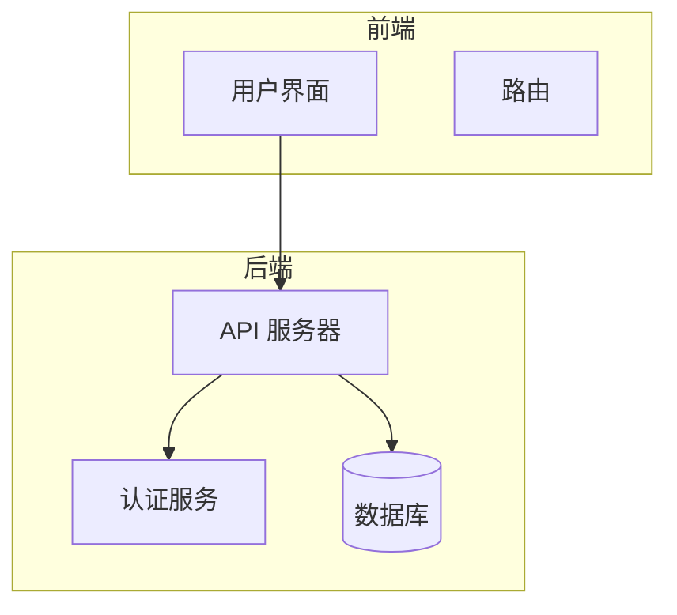
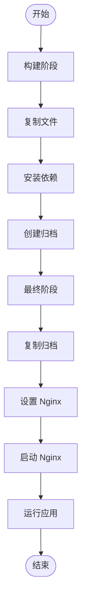
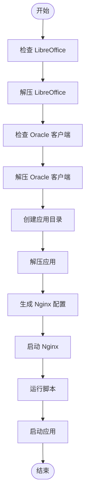
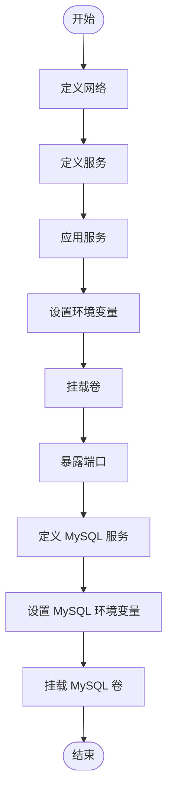
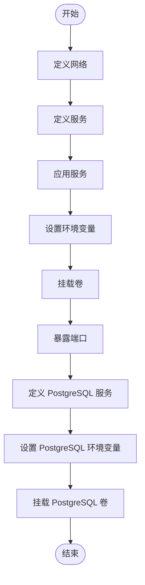
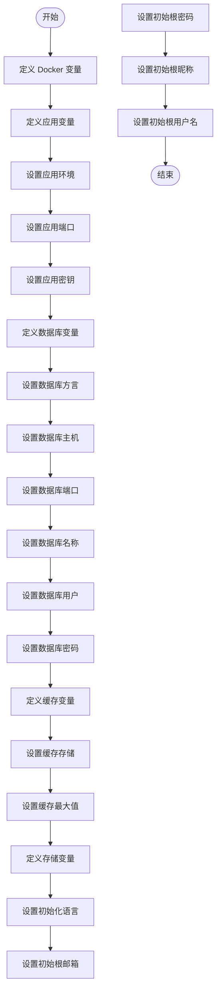
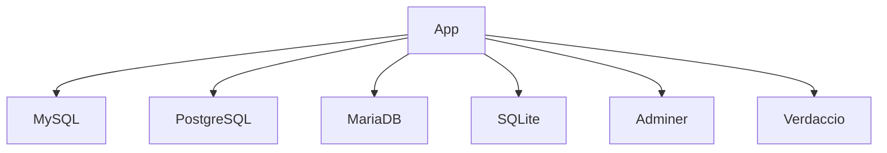

# Kubernetes部署

<cite>
**本文档中引用的文件**  
- [Dockerfile](file://docker/nocobase/Dockerfile)
- [Dockerfile-full](file://docker/nocobase/Dockerfile-full)
- [docker-entrypoint.sh](file://docker/nocobase/docker-entrypoint.sh)
- [docker-compose.yml](file://docker-compose.yml)
- [.env.example](file://.env.example)
- [app-mysql/docker-compose.yml](file://docker/app-mysql/docker-compose.yml)
- [app-postgres/docker-compose.yml](file://docker/app-postgres/docker-compose.yml)
- [app-mariadb/docker-compose.yml](file://docker/app-mariadb/docker-compose.yml)
- [app-sqlite/docker-compose.yml](file://docker/app-sqlite/docker-compose.yml)
</cite>

## 目录

1. [简介](#简介)
2. [项目结构](#项目结构)
3. [核心组件](#核心组件)
4. [架构概述](#架构概述)
5. [详细组件分析](#详细组件分析)
6. [依赖分析](#依赖分析)
7. [性能考虑](#性能考虑)
8. [故障排除指南](#故障排除指南)
9. [结论](#结论)

## 简介

NocoBase 是一个高度可扩展的AI驱动的无代码平台，支持多种部署方式。本指南详细说明如何将 NocoBase 部署到 Kubernetes 集群中，包括 Helm Chart 的配置和使用方法。我们将涵盖从 Docker Compose 到 Kubernetes 的迁移指南，以及高可用性、持久化存储、监控和安全配置。

## 项目结构

NocoBase 项目的结构清晰，主要包含以下几个目录：

- `benchmark/`：性能基准测试相关代码
- `docker/`：Docker 相关配置和文件
- `examples/`：示例代码
- `locales/`：多语言支持文件
- `packages/`：核心包和插件
- `patches/`：补丁文件
- `scripts/`：脚本文件
- `storage/`：存储目录

**Diagram sources**
- [Dockerfile](file://docker/nocobase/Dockerfile#L1-L49)
- [Dockerfile-full](file://docker/nocobase/Dockerfile-full#L1-L62)

## 核心组件

NocoBase 的核心组件包括：

- **Dockerfile**：用于构建 NocoBase 的 Docker 镜像
- **docker-entrypoint.sh**：Docker 容器的入口脚本
- **docker-compose.yml**：Docker Compose 配置文件，用于本地开发和测试

**Section sources**
- [Dockerfile](file://docker/nocobase/Dockerfile#L1-L49)
- [docker-entrypoint.sh](file://docker/nocobase/docker-entrypoint.sh#L1-L56)
- [docker-compose.yml](file://docker-compose.yml#L1-L80)

## 架构概述

NocoBase 的架构设计为微内核架构，所有功能都以插件形式存在。这种设计使得 NocoBase 具有极高的可扩展性和灵活性。

**Diagram sources**
- [Dockerfile](file://docker/nocobase/Dockerfile#L1-L49)
- [docker-compose.yml](file://docker-compose.yml#L1-L80)

## 详细组件分析

### Docker 配置分析

NocoBase 提供了多个 Docker 配置文件，包括 `Dockerfile` 和 `Dockerfile-full`。`Dockerfile` 用于构建基本的 NocoBase 镜像，而 `Dockerfile-full` 包含了更多的依赖项，适用于生产环境。

#### Dockerfile 分析

**Diagram sources**
- [Dockerfile](file://docker/nocobase/Dockerfile#L1-L49)

#### docker-entrypoint.sh 分析

**Diagram sources**
- [docker-entrypoint.sh](file://docker/nocobase/docker-entrypoint.sh#L1-L56)

### Docker Compose 配置分析

NocoBase 提供了多个 Docker Compose 配置文件，支持不同的数据库类型，包括 MySQL、PostgreSQL、MariaDB 和 SQLite。

#### app-mysql/docker-compose.yml 分析

**Diagram sources**
- [app-mysql/docker-compose.yml](file://docker/app-mysql/docker-compose.yml#L1-L38)

#### app-postgres/docker-compose.yml 分析

**Diagram sources**
- [app-postgres/docker-compose.yml](file://docker/app-postgres/docker-compose.yml#L1-L37)

### 环境变量配置分析

NocoBase 使用 `.env.example` 文件来定义环境变量。这些变量控制应用的行为，包括数据库连接、日志记录、缓存等。

#### .env.example 分析

**Diagram sources**
- [.env.example](file://.env.example#L1-L98)

## 依赖分析

NocoBase 的依赖关系复杂，涉及多个数据库和外部服务。通过 Docker Compose 文件，可以清晰地看到各个服务之间的依赖关系。

**Diagram sources**
- [docker-compose.yml](file://docker-compose.yml#L1-L80)

## 性能考虑

在 Kubernetes 部署中，性能是一个重要的考虑因素。NocoBase 通过以下方式优化性能：

- 使用 Nginx 作为反向代理，提高静态文件的访问速度
- 使用 Redis 作为缓存，减少数据库查询次数
- 使用 PostgreSQL 的逻辑复制，提高数据同步的效率

## 故障排除指南

在部署过程中，可能会遇到各种问题。以下是一些常见的故障排除方法：

- 检查日志文件，确保所有服务都正常启动
- 检查环境变量，确保所有配置都正确
- 检查网络配置，确保服务之间的通信正常

**Section sources**
- [docker-entrypoint.sh](file://docker/nocobase/docker-entrypoint.sh#L1-L56)
- [docker-compose.yml](file://docker-compose.yml#L1-L80)

## 结论

NocoBase 是一个功能强大且高度可扩展的无代码平台，支持多种部署方式。通过本指南，您可以轻松地将 NocoBase 部署到 Kubernetes 集群中，并配置高可用性、持久化存储、监控和安全。希望本指南对您有所帮助。