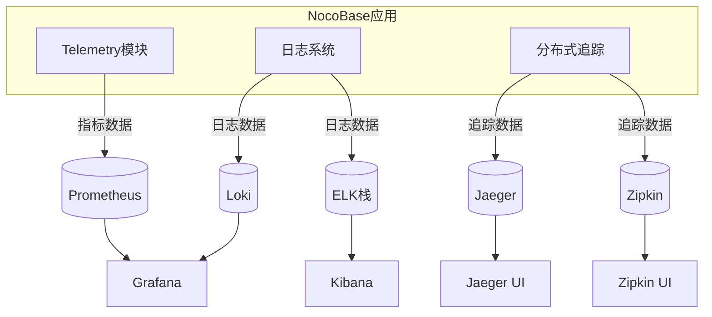
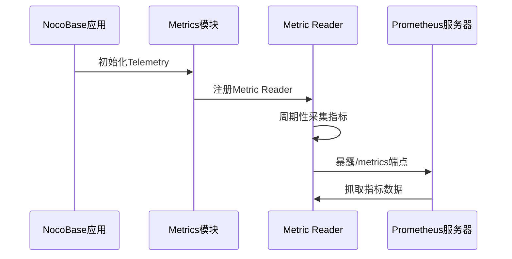
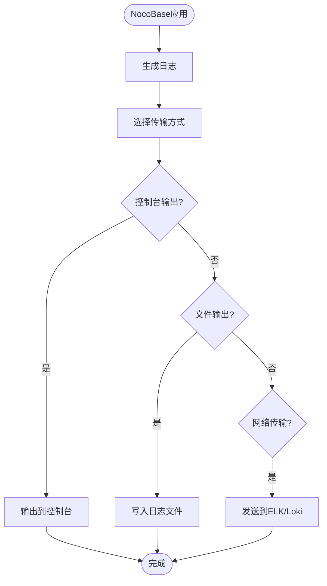
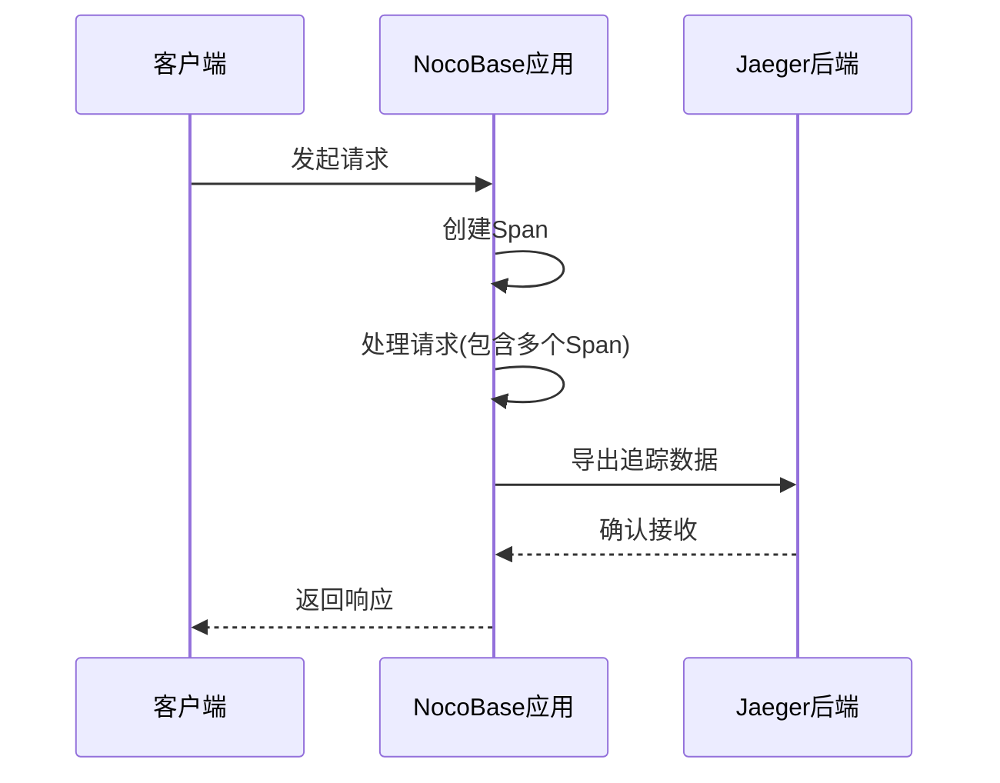

# 监控集成

<cite>
**本文档中引用的文件**  
- [telemetry.ts](file://packages/core/telemetry/src/telemetry.ts)
- [trace.ts](file://packages/core/telemetry/src/trace.ts)
- [metric.ts](file://packages/core/telemetry/src/metric.ts)
- [telemetry.ts](file://packages/core/app/src/config/telemetry.ts)
- [system-logger.ts](file://packages/core/logger/src/system-logger.ts)
- [logger.ts](file://packages/core/logger/src/logger.ts)
- [config.ts](file://packages/core/logger/src/config.ts)
- [transports.ts](file://packages/core/logger/src/transports.ts)
- [logger.ts](file://packages/plugins/@nocobase/plugin-logger/src/server/resourcer/logger.ts)
</cite>

## 目录
1. [引言](#引言)
2. [监控架构概述](#监控架构概述)
3. [Prometheus集成与Metrics暴露](#prometheus集成与metrics暴露)
4. [Grafana仪表板配置](#grafana仪表板配置)
5. [日志收集与ELK/Loki集成](#日志收集与elkloki集成)
6. [分布式追踪配置](#分布式追踪配置)
7. [告警规则配置](#告警规则配置)
8. [监控数据持久化与保留策略](#监控数据持久化与保留策略)

## 引言
NocoBase提供了一套完整的监控解决方案，基于OpenTelemetry标准实现指标、日志和追踪的统一收集。本指南详细说明如何将NocoBase与主流监控工具集成，包括Prometheus、Grafana、ELK栈、Loki、Jaeger和Zipkin等，以实现全面的系统可观测性。

## 监控架构概述
NocoBase的监控架构基于OpenTelemetry实现，支持指标、日志和分布式追踪三大支柱。系统通过Telemetry模块统一管理监控数据的采集和导出，支持多种后端存储和可视化工具。



**图表来源**  
- [telemetry.ts](file://packages/core/telemetry/src/telemetry.ts)
- [logger.ts](file://packages/core/logger/src/logger.ts)

## Prometheus集成与Metrics暴露
NocoBase通过OpenTelemetry Metrics API暴露系统性能指标。指标采集通过环境变量配置，支持多种导出器。

### Metrics配置
NocoBase使用`@opentelemetry/sdk-metrics`库实现指标采集。通过环境变量`TELEMETRY_METRIC_READER`配置指标导出器，支持console、prometheus等多种格式。



**图表来源**  
- [metric.ts](file://packages/core/telemetry/src/metric.ts)
- [telemetry.ts](file://packages/core/telemetry/src/telemetry.ts)

### 环境变量配置
通过环境变量控制Metrics功能：

- `TELEMETRY_ENABLED=on`：启用监控功能
- `TELEMETRY_METRIC_READER=prometheus`：设置指标导出器为Prometheus
- `TELEMETRY_TRACE_PROCESSOR=jaeger`：设置追踪处理器为Jaeger

**监控来源**  
- [telemetry.ts](file://packages/core/app/src/config/telemetry.ts)
- [metric.ts](file://packages/core/telemetry/src/metric.ts)

## Grafana仪表板配置
Grafana用于可视化NocoBase的性能指标。通过配置数据源连接Prometheus，然后导入或创建仪表板来展示关键指标。

### 仪表板设计
建议的仪表板包含以下关键视图：

- **系统概览**：CPU、内存、磁盘使用率
- **请求性能**：API响应时间、请求率、错误率
- **数据库性能**：查询延迟、连接数、慢查询
- **队列监控**：任务队列长度、处理延迟

### 数据源配置
在Grafana中添加Prometheus数据源，指向NocoBase暴露的Metrics端点。通常为`http://nocobase-host:9090/metrics`。

**监控来源**  
- [metric.ts](file://packages/core/telemetry/src/metric.ts)

## 日志收集与ELK/Loki集成
NocoBase使用Winston日志库实现结构化日志记录，支持多种传输方式，可轻松集成ELK栈或Loki进行日志收集和分析。

### 日志配置
通过环境变量配置日志系统：

- `LOGGER_LEVEL=info`：设置日志级别
- `LOGGER_TRANSPORTS=console,dailyRotateFile`：设置日志传输方式
- `LOGGER_FORMAT=json`：设置日志格式为JSON
- `LOGGER_BASE_PATH=/var/log/nocobase`：设置日志存储路径



**图表来源**  
- [config.ts](file://packages/core/logger/src/config.ts)
- [transports.ts](file://packages/core/logger/src/transports.ts)

### ELK栈集成
将NocoBase日志发送到ELK栈的配置步骤：

1. 配置Filebeat监控NocoBase日志目录
2. 设置日志格式为JSON以便Elasticsearch解析
3. 在Logstash中配置管道处理日志数据
4. 在Kibana中创建可视化仪表板

### Loki集成
通过Promtail将NocoBase日志发送到Loki：

1. 配置Promtail监控日志文件
2. 设置标签提取规则
3. 配置Loki为Grafana数据源
4. 使用LogQL查询和分析日志

**监控来源**  
- [logger.ts](file://packages/core/logger/src/logger.ts)
- [system-logger.ts](file://packages/core/logger/src/system-logger.ts)

## 分布式追踪配置
NocoBase基于OpenTelemetry实现分布式追踪，支持Jaeger和Zipkin作为后端存储。

### 追踪配置
通过环境变量`TELEMETRY_TRACE_PROCESSOR`配置追踪处理器：

- `TELEMETRY_TRACE_PROCESSOR=jaeger`：使用Jaeger作为追踪后端
- `TELEMETRY_TRACE_PROCESSOR=zipkin`：使用Zipkin作为追踪后端



**图表来源**  
- [trace.ts](file://packages/core/telemetry/src/trace.ts)
- [telemetry.ts](file://packages/core/telemetry/src/telemetry.ts)

### 追踪数据结构
NocoBase追踪数据包含以下关键信息：

- **Trace ID**：全局追踪标识
- **Span ID**：单个操作标识
- **服务名**：标识服务实例
- **操作名**：描述操作类型
- **开始时间**：操作开始时间戳
- **持续时间**：操作持续时间
- **标签**：附加的元数据

**监控来源**  
- [trace.ts](file://packages/core/telemetry/src/trace.ts)

## 告警规则配置
基于Prometheus的告警规则，可以对NocoBase的关键指标设置阈值告警。

### 关键告警规则
建议配置以下告警规则：

- **高错误率**：API错误率超过5%持续5分钟
- **高延迟**：P95响应时间超过1秒
- **服务不可用**：健康检查端点连续3次失败
- **资源耗尽**：内存使用率超过80%
- **数据库问题**：数据库连接数超过阈值

### 告警配置示例
```yaml
groups:
  - name: nocobase-alerts
    rules:
      - alert: HighErrorRate
        expr: rate(http_requests_total{status=~"5.."}[5m]) / rate(http_requests_total[5m]) > 0.05
        for: 5m
        labels:
          severity: critical
        annotations:
          summary: "High error rate on NocoBase"
          description: "NocoBase is experiencing a high error rate: {{ $value }}%"
```

**监控来源**  
- [metric.ts](file://packages/core/telemetry/src/metric.ts)

## 监控数据持久化与保留策略
合理的数据持久化和保留策略对于监控系统的长期运行至关重要。

### 数据持久化
- **指标数据**：Prometheus本地存储，建议配置持久化卷
- **日志数据**：存储在文件系统，按天轮转
- **追踪数据**：存储在Jaeger/Zipkin后端，支持多种存储后端

### 保留策略
- **指标数据**：保留30天
- **日志数据**：保留90天，可配置
- **追踪数据**：保留7天，可配置

通过环境变量`LOGGER_TRANSPORTS`和`TELEMETRY_METRIC_READER`可以灵活配置数据存储和保留策略。

**监控来源**  
- [config.ts](file://packages/core/logger/src/config.ts)
- [telemetry.ts](file://packages/core/app/src/config/telemetry.ts)