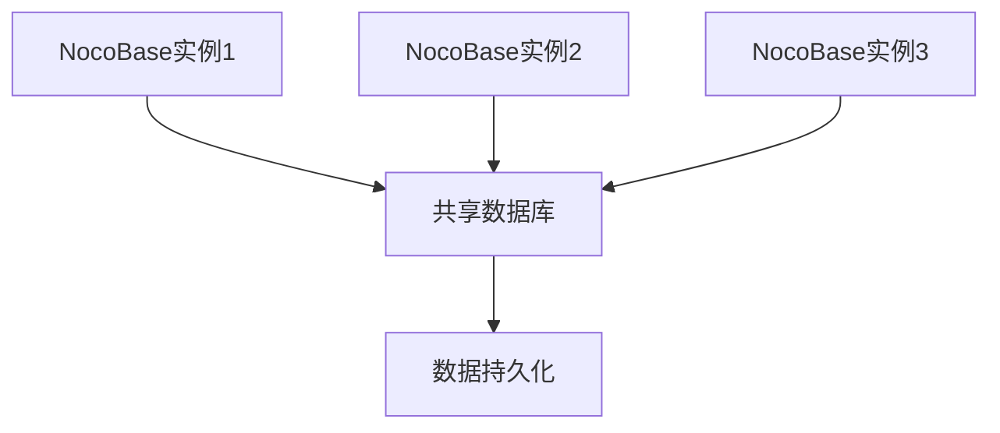
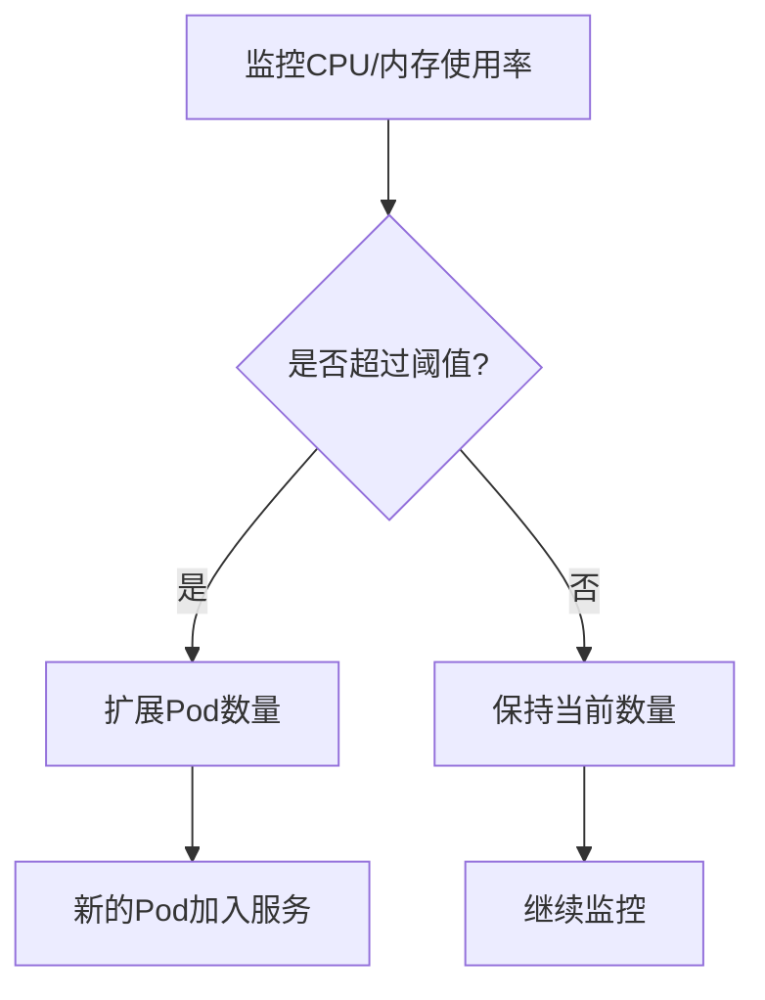
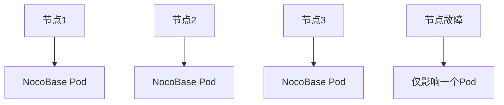
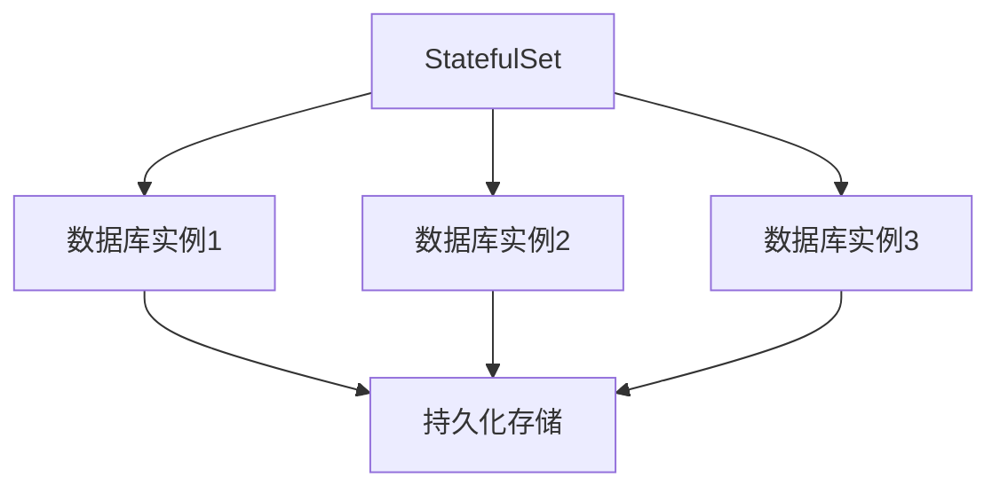
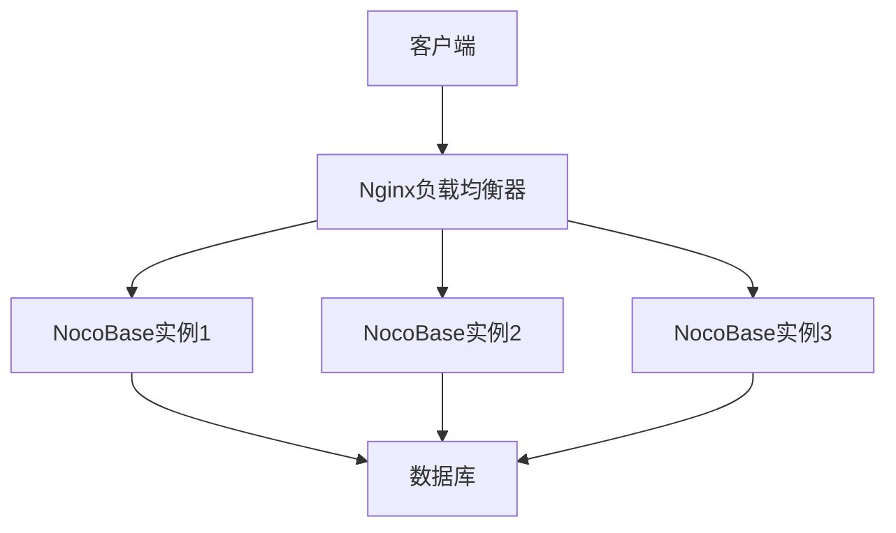
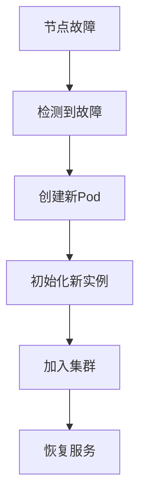

# 高可用配置

<cite>
**本文档中引用的文件**  
- [docker-compose.yml](file://docker-compose.yml)
- [.env.example](file://.env.example)
- [docker/nocobase/Dockerfile](file://docker/nocobase/Dockerfile)
- [docker/nocobase/docker-entrypoint.sh](file://docker/nocobase/docker-entrypoint.sh)
- [docker/nocobase/nocobase.conf](file://docker/nocobase/nocobase.conf)
- [packages/core/database/src/helpers.ts](file://packages/core/database/src/helpers.ts)
- [packages/core/app/src/config/database.ts](file://packages/core/app/src/config/database.ts)
- [packages/core/server/src/worker-id-allocator.ts](file://packages/core/server/src/worker-id-allocator.ts)
</cite>

## 目录
1. [简介](#简介)
2. [多副本Deployment配置](#多副本deployment配置)
3. [Horizontal Pod Autoscaler配置](#horizontal-pod-autoscaler配置)
4. [Pod反亲和性配置](#pod反亲和性配置)
5. [有状态服务的StatefulSet配置](#有状态服务的statefulset配置)
6. [服务发现与负载均衡配置](#服务发现与负载均衡配置)
7. [故障转移与恢复策略](#故障转移与恢复策略)
8. [总结](#总结)

## 简介
NocoBase是一个无代码开发平台，支持通过Docker和Kubernetes进行部署。本指南详细说明如何配置NocoBase实现高可用性，包括多副本Deployment、自动扩展、Pod分布策略、有状态服务管理、服务发现和故障恢复等方面。通过合理配置，可以确保NocoBase在生产环境中具备高可用性和弹性伸缩能力。

## 多副本Deployment配置
为了实现NocoBase服务的高可用性，需要配置多副本Deployment。通过在Kubernetes中运行多个NocoBase实例，可以避免单点故障，提高系统的容错能力。在Docker Compose配置中，可以通过设置多个服务实例来模拟多副本部署。

在NocoBase的Docker配置中，使用`docker-compose.yml`文件定义服务。通过设置多个`app`服务实例，并配置共享的数据库和存储，可以实现多副本部署。环境变量`CLUSTER_MODE`用于控制集群模式，当设置该值时，应用将以集群模式运行，处理所有请求和后台作业。

**图示来源**  
- [docker-compose.yml](file://docker-compose.yml#L5-L80)
- [.env.example](file://.env.example#L32-L36)

**本节来源**  
- [docker-compose.yml](file://docker-compose.yml#L5-L80)
- [.env.example](file://.env.example#L32-L36)

## Horizontal Pod Autoscaler配置
Horizontal Pod Autoscaler (HPA)可以根据CPU和内存使用率自动扩展Pod数量。在NocoBase中，可以通过监控资源使用情况来动态调整实例数量，以应对流量变化。

虽然代码库中没有直接的HPA配置，但可以通过Kubernetes的HPA功能结合NocoBase的性能指标来实现自动扩展。通过设置资源请求和限制，HPA可以基于CPU和内存使用率来决定是否需要扩展Pod数量。

**图示来源**  
- [.env.example](file://.env.example#L21-L30)

**本节来源**  
- [.env.example](file://.env.example#L21-L30)

## Pod反亲和性配置
为了提高容错能力，需要配置Pod反亲和性，确保NocoBase的Pod分布在不同的节点上。这样可以避免单个节点故障导致所有实例不可用。

在Kubernetes中，可以通过设置Pod反亲和性规则来实现这一目标。虽然代码库中没有直接的反亲和性配置，但可以通过Kubernetes的部署配置来实现。通过确保Pod分布在不同的物理节点上，可以提高系统的可用性。

**图示来源**  
- [docker-compose.yml](file://docker-compose.yml#L5-L80)

**本节来源**  
- [docker-compose.yml](file://docker-compose.yml#L5-L80)

## 有状态服务的StatefulSet配置
对于有状态服务，如数据库，需要使用StatefulSet来管理。NocoBase支持多种数据库，包括PostgreSQL、MySQL、MariaDB等。通过StatefulSet，可以确保数据库实例的稳定性和数据持久性。

在`docker-compose.yml`文件中，定义了多个数据库服务，如PostgreSQL、MySQL等。这些服务使用持久化存储来保存数据，确保在Pod重启后数据不会丢失。通过配置StatefulSet，可以实现有状态服务的高可用性。

**图示来源**  
- [docker-compose.yml](file://docker-compose.yml#L45-L58)
- [docker/app-postgres/docker-compose.yml](file://docker/app-postgres/docker-compose.yml#L1-L36)

**本节来源**  
- [docker-compose.yml](file://docker-compose.yml#L45-L58)
- [docker/app-postgres/docker-compose.yml](file://docker/app-postgres/docker-compose.yml#L1-L36)

## 服务发现与负载均衡配置
NocoBase通过Nginx实现服务发现和负载均衡。在`docker/nocobase/nocobase.conf`文件中，配置了Nginx作为反向代理，将请求转发到后端的NocoBase实例。

通过配置Nginx的负载均衡策略，可以将流量均匀分配到多个NocoBase实例上。同时，Nginx还负责静态文件的缓存和SSL终止，提高系统的性能和安全性。

**图示来源**  
- [docker/nocobase/nocobase.conf](file://docker/nocobase/nocobase.conf#L1-L91)
- [docker/nocobase/docker-entrypoint.sh](file://docker/nocobase/docker-entrypoint.sh#L1-L56)

**本节来源**  
- [docker/nocobase/nocobase.conf](file://docker/nocobase/nocobase.conf#L1-L91)
- [docker/nocobase/docker-entrypoint.sh](file://docker/nocobase/docker-entrypoint.sh#L1-L56)

## 故障转移与恢复策略
为了确保系统在节点故障时能快速恢复，需要配置故障转移和恢复策略。NocoBase通过集群模式和健康检查机制来实现故障转移。

当某个NocoBase实例发生故障时，Kubernetes会自动创建新的Pod来替代故障的实例。同时，通过配置健康检查，可以确保只有健康的实例才会接收流量。在`docker-entrypoint.sh`脚本中，包含了启动和配置NocoBase实例的逻辑，确保实例能够正确启动并加入集群。

**图示来源**  
- [docker/nocobase/docker-entrypoint.sh](file://docker/nocobase/docker-entrypoint.sh#L1-L56)
- [packages/core/server/src/worker-id-allocator.ts](file://packages/core/server/src/worker-id-allocator.ts#L1-L35)

**本节来源**  
- [docker/nocobase/docker-entrypoint.sh](file://docker/nocobase/docker-entrypoint.sh#L1-L56)
- [packages/core/server/src/worker-id-allocator.ts](file://packages/core/server/src/worker-id-allocator.ts#L1-L35)

## 总结
通过配置多副本Deployment、Horizontal Pod Autoscaler、Pod反亲和性、StatefulSet、服务发现和负载均衡，以及故障转移和恢复策略，可以实现NocoBase的高可用性。这些配置确保了系统在面对流量变化和节点故障时能够稳定运行，为用户提供可靠的服务。