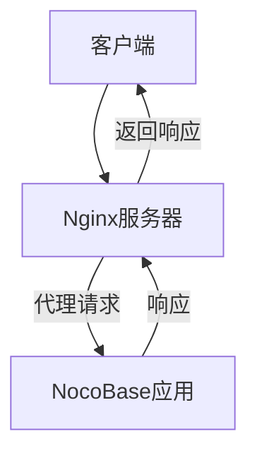
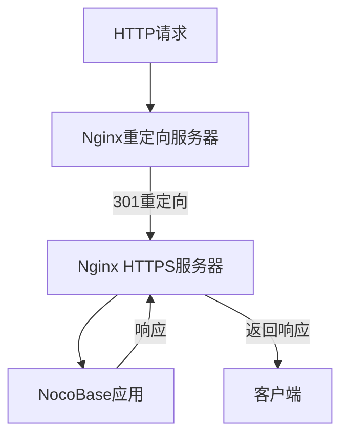
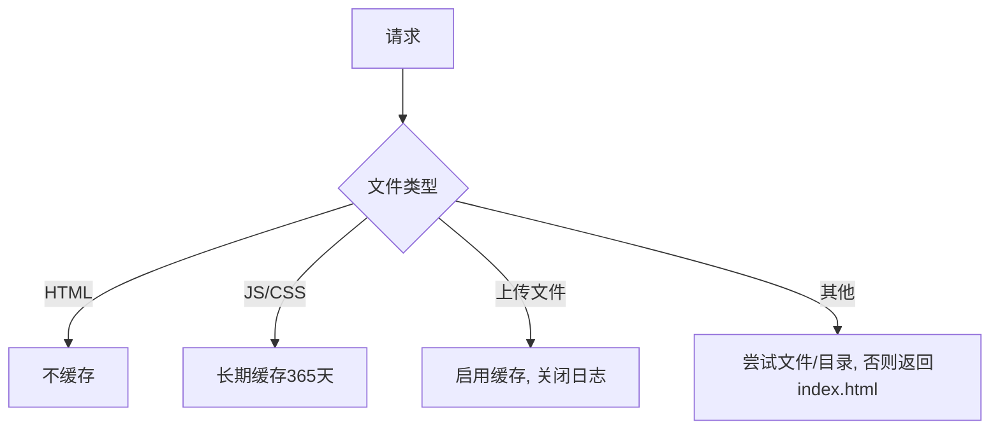
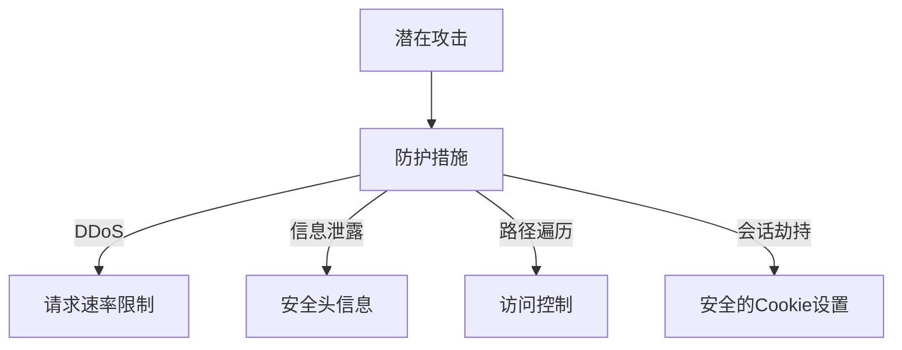

# Nginx配置

<cite>
**本文档中引用的文件**   
- [nocobase.conf](file://docker/nocobase/nocobase.conf)
- [nocobase.conf.tpl](file://packages/core/cli/nocobase.conf.tpl)
- [Dockerfile](file://docker/nocobase/Dockerfile)
- [.env.example](file://.env.example)
</cite>

## 目录
1. [简介](#简介)
2. [基本代理配置](#基本代理配置)
3. [SSL证书配置](#ssl证书配置)
4. [HTTP到HTTPS重定向](#http到https重定向)
5. [负载均衡配置](#负载均衡配置)
6. [静态文件服务优化](#静态文件服务优化)
7. [安全配置](#安全配置)
8. [WebSocket代理配置](#websocket代理配置)
9. [总结](#总结)

## 简介
NocoBase是一个无代码开发平台，可以通过Nginx反向代理来提高性能、安全性和可扩展性。本指南详细介绍了如何配置Nginx作为NocoBase应用的反向代理服务器，包括基本代理配置、SSL证书安装、负载均衡、静态文件优化和安全配置等关键方面。

**Section sources**
- [nocobase.conf](file://docker/nocobase/nocobase.conf#L1-L91)
- [nocobase.conf.tpl](file://packages/core/cli/nocobase.conf.tpl#L1-L93)

## 基本代理配置
Nginx的基本代理配置是将客户端请求转发到NocoBase应用服务器的核心。以下是NocoBase提供的标准Nginx配置：



**Diagram sources**
- [nocobase.conf](file://docker/nocobase/nocobase.conf#L15-L90)

Nginx配置文件定义了服务器的基本行为：

- 监听80端口
- 设置访问日志格式为APM（应用性能监控）
- 启用Gzip压缩以减少传输数据大小
- 配置客户端请求体大小限制为0（无限制）

API请求通过`proxy_pass`指令被代理到本地运行的NocoBase服务（127.0.0.1:13000）。关键的代理设置包括：

- `proxy_http_version 1.1`：使用HTTP/1.1协议
- `proxy_set_header`：设置必要的请求头，包括Host、X-Forwarded-For等
- 长时间的超时设置（600秒），以支持长时间运行的操作

**Section sources**
- [nocobase.conf](file://docker/nocobase/nocobase.conf#L15-L90)

## SSL证书配置
为NocoBase配置SSL证书可以确保数据传输的安全性。虽然提供的配置文件主要针对HTTP，但可以通过添加SSL相关指令来启用HTTPS。

要配置SSL，需要在server块中进行以下修改：

```nginx
server {
    listen 443 ssl;
    server_name your-domain.com;
    
    ssl_certificate /path/to/your/certificate.crt;
    ssl_certificate_key /path/to/your/private.key;
    
    ssl_protocols TLSv1.2 TLSv1.3;
    ssl_ciphers ECDHE-RSA-AES256-GCM-SHA512:DHE-RSA-AES256-GCM-SHA512;
    ssl_prefer_server_ciphers off;
    
    # 其余配置保持不变
}
```

从环境变量文件中可以看到，NocoBase支持数据库连接的SSL配置，这表明系统设计时考虑了安全性：

```env
# DB_DIALECT_OPTIONS_SSL_CA=
# DB_DIALECT_OPTIONS_SSL_KEY=
# DB_DIALECT_OPTIONS_SSL_CERT=
# DB_DIALECT_OPTIONS_SSL_REJECT_UNAUTHORIZED=true
```

这些环境变量可用于配置数据库连接的安全性，与Nginx的SSL配置相辅相成，形成端到端的安全架构。

**Section sources**
- [nocobase.conf](file://docker/nocobase/nocobase.conf#L15-L90)
- [.env.example](file://.env.example#L68-L72)

## HTTP到HTTPS重定向
为了确保所有流量都通过安全连接，应配置HTTP到HTTPS的自动重定向。这可以通过添加一个额外的server块来实现：



**Diagram sources**
- [nocobase.conf](file://docker/nocobase/nocobase.conf#L15-L90)

具体的重定向配置如下：

```nginx
server {
    listen 80;
    server_name your-domain.com;
    return 301 https://$server_name$request_uri;
}
```

这个配置会监听80端口的所有HTTP请求，并将其永久重定向（301状态码）到相应的HTTPS地址。这种重定向不仅提高了安全性，还有利于SEO，因为搜索引擎会将HTTP和HTTPS版本视为同一资源。

**Section sources**
- [nocobase.conf](file://docker/nocobase/nocobase.conf#L15-L90)

## 负载均衡配置
NocoBase可以通过Nginx的负载均衡功能实现高可用性和横向扩展。虽然提供的配置文件没有直接展示负载均衡，但可以通过upstream模块轻松实现。

负载均衡配置示例：

```nginx
upstream nocobase_backend {
    server 127.0.0.1:13000;
    server 127.0.0.1:13001;
    server 127.0.0.1:13002;
    
    # 可以使用不同的负载均衡算法
    # least_conn; # 最少连接
    # ip_hash; # 基于IP的会话保持
    # hash $request_uri consistent; # 一致性哈希
}

server {
    listen 80;
    server_name your-domain.com;
    
    location /api/ {
        proxy_pass http://nocobase_backend/api/;
        # 其余代理设置...
    }
}
```

在Docker环境中，可以通过docker-compose.yml文件定义多个NocoBase服务实例，然后由Nginx作为负载均衡器分发请求。这种架构可以实现：

- 高可用性：单个实例故障不会导致服务中断
- 横向扩展：根据负载动态增加或减少实例数量
- 维护灵活性：可以逐个更新实例而不停机

**Section sources**
- [docker-compose.yml](file://docker-compose.yml#L68-L80)
- [nocobase.conf](file://docker/nocobase/nocobase.conf#L56-L67)

## 静态文件服务优化
NocoBase的Nginx配置包含了针对静态文件服务的多项优化措施，可以显著提高前端资源的加载性能。

主要优化策略包括：



**Diagram sources**
- [nocobase.conf](file://docker/nocobase/nocobase.conf#L26-L54)

具体优化措施：

1. **Gzip压缩**：启用Gzip并指定压缩的MIME类型，减少传输数据大小
2. **智能缓存策略**：
   - HTML文件：不缓存，确保用户总是获取最新版本
   - JavaScript和CSS文件：缓存365天，提高重复访问性能
   - 上传文件：启用缓存，关闭访问日志以提高性能
3. **高效文件查找**：使用`try_files`指令实现前端路由，支持单页应用的客户端路由

这些优化措施可以显著减少页面加载时间，提高用户体验。

**Section sources**
- [nocobase.conf](file://docker/nocobase/nocobase.conf#L23-L54)

## 安全配置
NocoBase的Nginx配置包含了多项安全相关的设置，以保护应用免受常见攻击。

关键安全配置包括：



**Diagram sources**
- [nocobase.conf](file://docker/nocobase/nocobase.conf#L15-L90)

具体安全措施：

1. **访问控制**：对插件静态资源的访问进行了精细控制，只允许特定路径的访问
2. **安全头信息**：为HTML页面添加`X-Robots-Tag`头，防止搜索引擎索引
3. **缓存控制**：对API响应设置`no-cache, no-store`，防止敏感数据被缓存
4. **长连接管理**：设置合理的超时时间，平衡性能和资源使用

此外，通过环境变量系统，NocoBase支持动态配置安全相关的设置，如数据库SSL连接等。

**Section sources**
- [nocobase.conf](file://docker/nocobase/nocobase.conf#L15-L90)
- [.env.example](file://.env.example#L68-L72)

## WebSocket代理配置
NocoBase支持实时通信功能，通过WebSocket协议实现。Nginx配置中包含了WebSocket代理的完整设置。

WebSocket代理配置：

```mermaid
flowchart TD
Client[客户端] --> |WebSocket连接| Nginx[Nginx]
Nginx --> |升级请求| NocoBase[NocoBase]
NocoBase --> |WebSocket响应| Nginx
Nginx --> |保持连接| Client
Client <-实时通信-> NocoBase
```

**Diagram sources**
- [nocobase.conf](file://docker/nocobase/nocobase.conf#L83-L89)
- [WebSocketClient.ts](file://packages/core/client/src/application/WebSocketClient.ts#L1-L132)

关键配置指令：

```nginx
location /ws {
    proxy_pass http://127.0.0.1:13000/ws;
    proxy_http_version 1.1;
    proxy_set_header Upgrade $http_upgrade;
    proxy_set_header Connection "Upgrade";
    proxy_set_header Host $host;
}
```

这些设置确保了WebSocket连接能够正确地从HTTP升级到WebSocket协议。`Upgrade`和`Connection`头信息的正确设置是WebSocket代理工作的关键。

在客户端代码中，WebSocketClient类处理了连接、重连和心跳机制，与Nginx的代理配置协同工作，确保实时通信的稳定性和可靠性。

**Section sources**
- [nocobase.conf](file://docker/nocobase/nocobase.conf#L83-L89)
- [WebSocketClient.ts](file://packages/core/client/src/application/WebSocketClient.ts#L1-L132)

## 总结
NocoBase提供了完善的Nginx反向代理配置，涵盖了从基本代理到高级功能的各个方面。通过合理配置Nginx，可以显著提升NocoBase应用的性能、安全性和可扩展性。

关键配置要点总结：
- 基本代理设置确保请求正确转发到后端服务
- SSL配置提供端到端的数据加密
- HTTP到HTTPS重定向强制安全连接
- 负载均衡支持横向扩展和高可用性
- 静态文件优化提高前端性能
- 安全配置防护常见攻击
- WebSocket代理支持实时通信功能

这些配置共同构成了一个健壮、安全、高性能的NocoBase部署架构。

**Section sources**
- [nocobase.conf](file://docker/nocobase/nocobase.conf#L1-L91)
- [nocobase.conf.tpl](file://packages/core/cli/nocobase.conf.tpl#L1-L93)
- [Dockerfile](file://docker/nocobase/Dockerfile#L1-L49)
- [.env.example](file://.env.example#L1-L98)