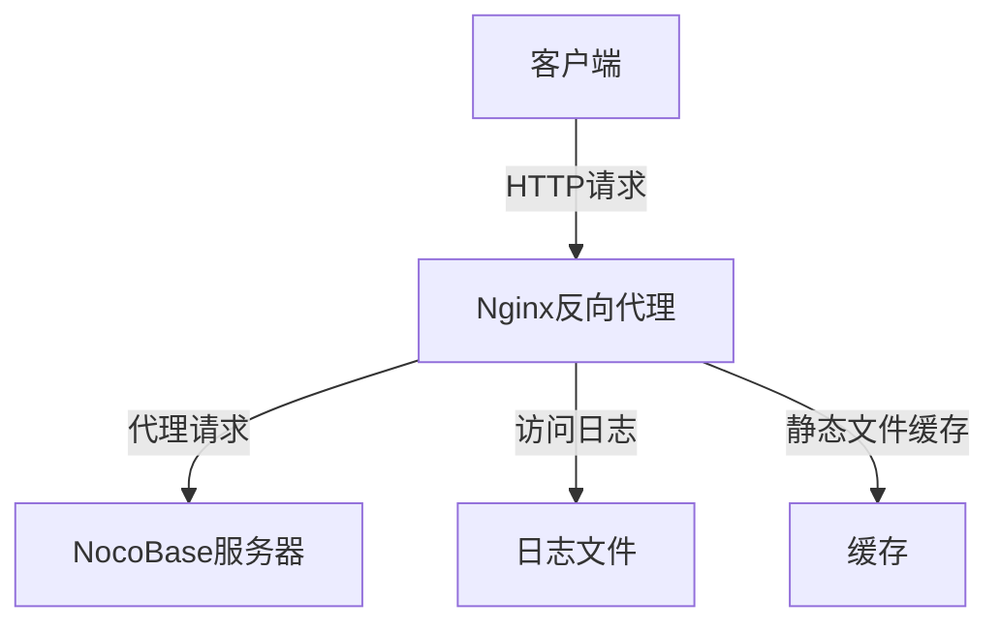
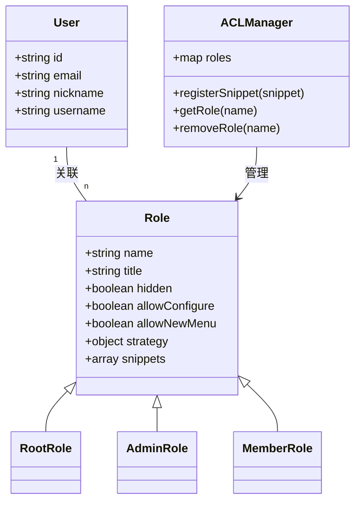
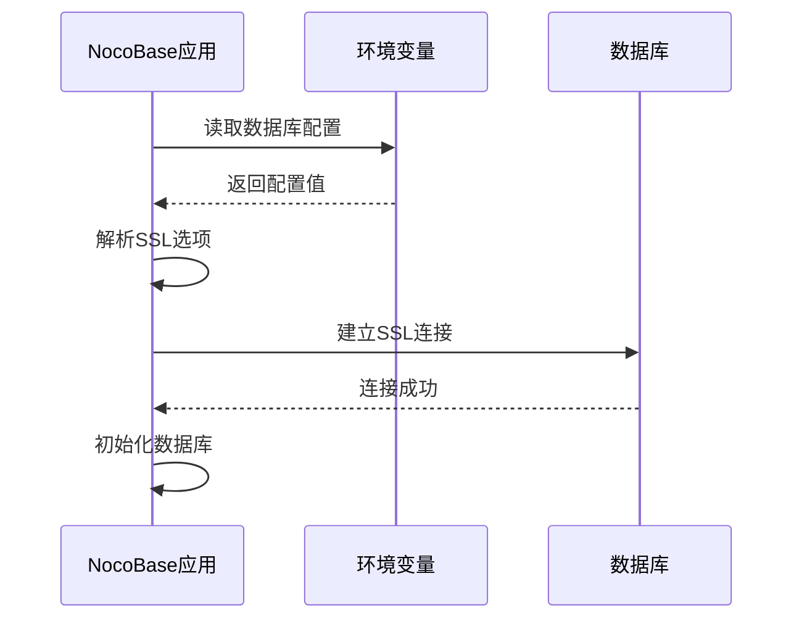
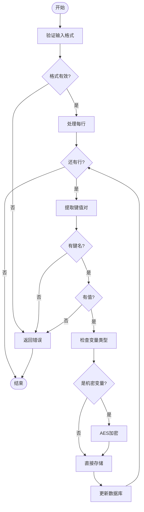
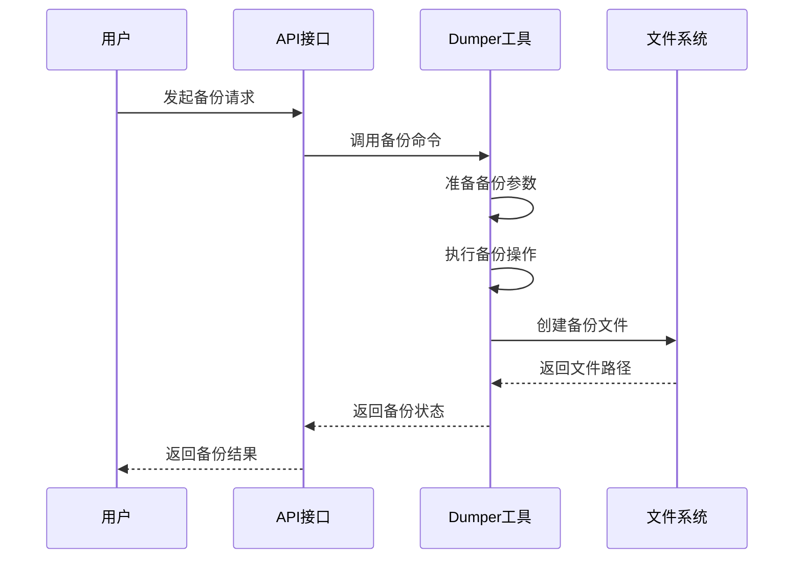
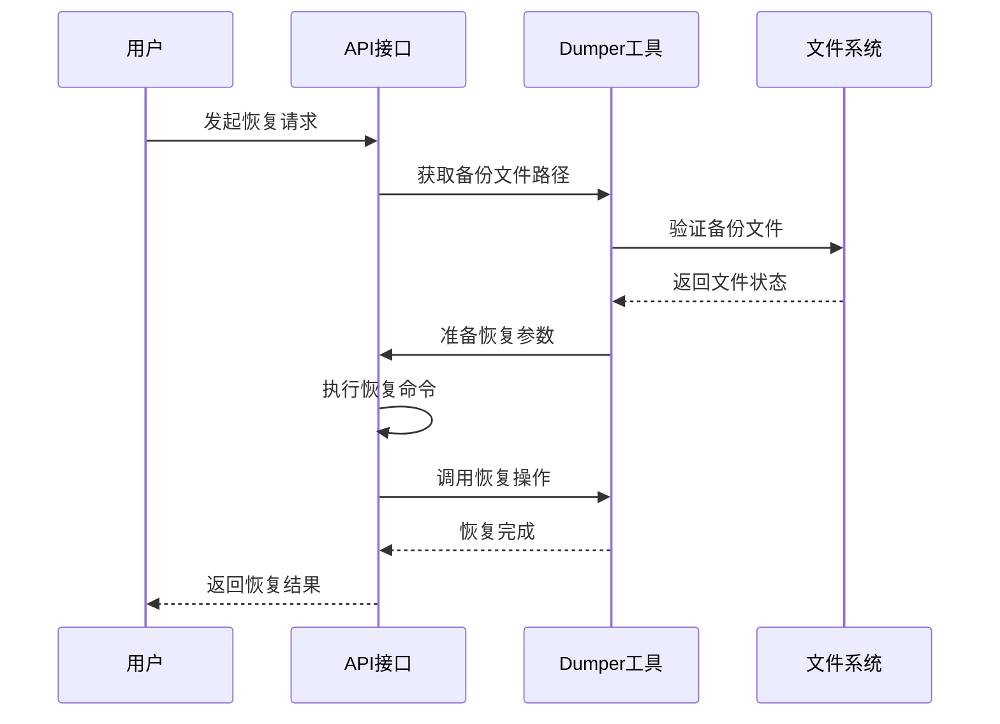
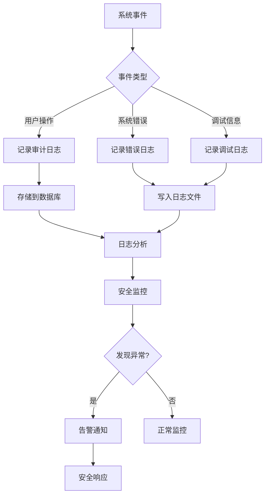

# 安全加固

<cite>
**本文档中引用的文件**  
- [SECURITY.md](file://SECURITY.md)
- [.env.example](file://.env.example)
- [docker/nocobase/nocobase.conf](file://docker/nocobase/nocobase.conf)
- [packages/core/database/src/helpers.ts](file://packages/core/database/src/helpers.ts)
- [packages/core/database/src/database.ts](file://packages/core/database/src/database.ts)
- [packages/plugins/@nocobase/plugin-backup-restore/src/server/server.ts](file://packages/plugins/@nocobase/plugin-backup-restore/src/server/server.ts)
- [packages/plugins/@nocobase/plugin-backup-restore/src/server/resourcers/backup-files.ts](file://packages/plugins/@nocobase/plugin-backup-restore/src/server/resourcers/backup-files.ts)
- [packages/plugins/@nocobase/plugin-backup-restore/src/client/index.tsx](file://packages/plugins/@nocobase/plugin-backup-restore/src/client/index.tsx)
- [packages/plugins/@nocobase/plugin-backup-restore/src/client/Configuration.tsx](file://packages/plugins/@nocobase/plugin-backup-restore/src/client/Configuration.tsx)
- [packages/plugins/@nocobase/plugin-environment-variables/src/server/plugin.ts](file://packages/plugins/@nocobase/plugin-environment-variables/src/server/plugin.ts)
- [packages/plugins/@nocobase/plugin-environment-variables/src/server/collections/environmentVariables.ts](file://packages/plugins/@nocobase/plugin-environment-variables/src/server/collections/environmentVariables.ts)
- [packages/plugins/@nocobase/plugin-acl/src/server/server.ts](file://packages/plugins/@nocobase/plugin-acl/src/server/server.ts)
- [packages/plugins/@nocobase/plugin-auth/src/server/plugin.ts](file://packages/plugins/@nocobase/plugin-auth/src/server/plugin.ts)
- [packages/core/logger/src/config.ts](file://packages/core/logger/src/config.ts)
</cite>

## 目录
1. [引言](#引言)
2. [防火墙配置](#防火墙配置)
3. [系统用户权限管理](#系统用户权限管理)
4. [数据库连接安全配置](#数据库连接安全配置)
5. [环境变量安全管理](#环境变量安全管理)
6. [定期备份策略](#定期备份策略)
7. [安全监控和日志审计](#安全监控和日志审计)
8. [结论](#结论)

## 引言

NocoBase是一个以可扩展性为首要目标的开源无代码开发平台。为了确保生产环境的安全性，必须实施一系列安全加固措施。本指南详细说明了在生产环境中部署NocoBase时应采取的安全配置措施，包括防火墙配置、系统用户权限管理、数据库连接安全、环境变量管理、定期备份策略以及安全监控和日志审计。

**Section sources**
- [SECURITY.md](file://SECURITY.md)

## 防火墙配置

在生产环境中，必须使用防火墙来限制对NocoBase服务器的访问。推荐使用ufw或iptables来设置访问规则。

NocoBase的Docker配置文件中包含了一个Nginx配置文件`nocobase.conf`，该文件定义了反向代理规则。通过Nginx可以实现更精细的访问控制。

关键配置包括：
- 监听80端口
- 配置访问日志格式
- 启用gzip压缩
- 配置静态文件缓存策略
- 设置API请求的反向代理



**Diagram sources**
- [docker/nocobase/nocobase.conf](file://docker/nocobase/nocobase.conf)

**Section sources**
- [docker/nocobase/nocobase.conf](file://docker/nocobase/nocobase.conf)

## 系统用户权限管理

NocoBase应用应以专用运行用户身份运行，遵循最小权限原则。通过创建专用用户并配置适当的权限，可以降低安全风险。

NocoBase的访问控制插件（ACL）实现了基于角色的权限管理。系统预定义了三种角色：
- **root**: 拥有所有权限的超级管理员
- **admin**: 管理员，拥有配置界面和插件的权限
- **member**: 普通成员，仅能查看自己的数据

权限通过"snippets"机制进行管理，例如：
- `ui.*`: 允许配置界面
- `pm`: 允许安装、激活、禁用插件
- `pm.*`: 允许配置插件



**Diagram sources**
- [packages/plugins/@nocobase/plugin-acl/src/server/server.ts](file://packages/plugins/@nocobase/plugin-acl/src/server/server.ts)

**Section sources**
- [packages/plugins/@nocobase/plugin-acl/src/server/server.ts](file://packages/plugins/@nocobase/plugin-acl/src/server/server.ts)

## 数据库连接安全配置

数据库连接的安全配置是生产环境安全的关键环节。NocoBase支持多种数据库（PostgreSQL、MySQL、MariaDB、Kingbase），并提供了SSL连接和连接凭证保护机制。

### SSL连接配置

通过环境变量配置数据库SSL连接：

```env
# SSL配置
DB_DIALECT_OPTIONS_SSL_CA=路径或内容
DB_DIALECT_OPTIONS_SSL_KEY=路径或内容
DB_DIALECT_OPTIONS_SSL_CERT=路径或内容
DB_DIALECT_OPTIONS_SSL_REJECT_UNAUTHORIZED=true
```

在代码中，这些环境变量被解析为SSL选项：

```typescript
function extractSSLOptionsFromEnv() {
  return Promise.all([
    getValueOrFileContent('DB_DIALECT_OPTIONS_SSL_MODE'),
    getValueOrFileContent('DB_DIALECT_OPTIONS_SSL_CA'),
    getValueOrFileContent('DB_DIALECT_OPTIONS_SSL_KEY'),
    getValueOrFileContent('DB_DIALECT_OPTIONS_SSL_CERT'),
    getValueOrFileContent('DB_DIALECT_OPTIONS_SSL_REJECT_UNAUTHORIZED'),
  ]).then(([mode, ca, key, cert, rejectUnauthorized]) => {
    const sslOptions = {};
    if (mode) sslOptions['mode'] = mode;
    if (ca) sslOptions['ca'] = ca;
    if (key) sslOptions['key'] = key;
    if (cert) sslOptions['cert'] = cert;
    if (rejectUnauthorized) sslOptions['rejectUnauthorized'] = rejectUnauthorized === 'true';
    return sslOptions;
  });
}
```

### 连接凭证保护

数据库连接凭证通过环境变量进行管理，避免硬编码在代码中：

```env
DB_DIALECT=postgres
DB_HOST=localhost
DB_PORT=5432
DB_DATABASE=nocobase
DB_USER=nocobase
DB_PASSWORD=nocobase
```



**Diagram sources**
- [packages/core/database/src/helpers.ts](file://packages/core/database/src/helpers.ts)
- [packages/core/database/src/database.ts](file://packages/core/database/src/database.ts)

**Section sources**
- [packages/core/database/src/helpers.ts](file://packages/core/database/src/helpers.ts)
- [packages/core/database/src/database.ts](file://packages/core/database/src/database.ts)

## 环境变量安全管理

环境变量是存储敏感信息的重要方式。NocoBase提供了环境变量管理插件，用于安全地管理和保护环境变量。

### 环境变量类型

环境变量分为两种类型：
- **default**: 普通环境变量
- **secret**: 机密环境变量，会进行加密存储

### 机密环境变量加密

机密环境变量在存储时会进行AES加密：

```typescript
onEnvironmentSaved() {
  this.db.on('environmentVariables.beforeSave', async (model) => {
    if (model.type === 'secret' && model.changed('value')) {
      const encrypted = await this.aesEncryptor.encrypt(model.value);
      model.set('value', encrypted);
    }
  });
  
  this.db.on('environmentVariables.afterSave', async (model, { transaction }) => {
    if (model.type === 'secret') {
      try {
        const decrypted = await this.aesEncryptor.decrypt(model.value);
        model.set('value', decrypted);
      } catch (error) {
        this.app.log.error(error);
      }
    }
    this.app.environment.setVariable(model.name, model.value);
    this.sendSyncMessage({ type: 'setVariable', name: model.name, value: model.value }, { transaction });
  });
}
```

### 环境变量验证

在设置环境变量时，会进行严格的格式验证：

```typescript
public validateTexts(texts: Array<{ text: string; secret: boolean }>) {
  if (!Array.isArray(texts)) {
    throw new Error('texts parameter must be an array');
  }

  for (const item of texts) {
    if (!item || typeof item !== 'object') {
      throw new Error('Each item in texts must be an object');
    }

    if (typeof item.text !== 'string' || !item.text.trim()) {
      throw new Error('text property must be a non-empty string');
    }

    if (typeof item.secret !== 'boolean') {
      throw new Error('secret property must be a boolean');
    }

    // 检查每行的格式
    const lines = item.text
      .split('\n')
      .map((line) => line.trim())
      .filter((line) => line && !line.startsWith('#'));

    for (const line of lines) {
      const equalIndex = line.indexOf('=');
      if (equalIndex === -1) {
        throw new Error(`Invalid environment variable format: ${line}`);
      }

      const key = line.slice(0, equalIndex).trim();
      const value = line.slice(equalIndex + 1).trim();

      if (!key) {
        throw new Error(`Environment variable name cannot be empty`);
      }

      if (!value) {
        throw new Error(`Environment variable "${key}" must have a value`);
      }
    }
  }
}
```



**Diagram sources**
- [packages/plugins/@nocobase/plugin-environment-variables/src/server/plugin.ts](file://packages/plugins/@nocobase/plugin-environment-variables/src/server/plugin.ts)

**Section sources**
- [packages/plugins/@nocobase/plugin-environment-variables/src/server/plugin.ts](file://packages/plugins/@nocobase/plugin-environment-variables/src/server/plugin.ts)
- [packages/plugins/@nocobase/plugin-environment-variables/src/server/collections/environmentVariables.ts](file://packages/plugins/@nocobase/plugin-environment-variables/src/server/collections/environmentVariables.ts)

## 定期备份策略

定期备份是确保数据安全的关键措施。NocoBase提供了备份与恢复插件，支持数据库和配置文件的备份与恢复。

### 备份功能

备份插件提供了以下API端点：
- `GET /api/backupFiles`: 获取备份文件列表
- `POST /api/backupFiles:create`: 创建备份
- `GET /api/backupFiles:download`: 下载备份文件
- `POST /api/backupFiles:restore`: 恢复备份
- `POST /api/backupFiles:destroy`: 删除备份文件

### 备份数据类型

备份支持三种数据类型：
- **meta**: 元数据
- **config**: 配置数据
- **business**: 业务数据

### 备份流程



### 恢复流程



**Diagram sources**
- [packages/plugins/@nocobase/plugin-backup-restore/src/server/server.ts](file://packages/plugins/@nocobase/plugin-backup-restore/src/server/server.ts)
- [packages/plugins/@nocobase/plugin-backup-restore/src/server/resourcers/backup-files.ts](file://packages/plugins/@nocobase/plugin-backup-restore/src/server/resourcers/backup-files.ts)

**Section sources**
- [packages/plugins/@nocobase/plugin-backup-restore/src/server/server.ts](file://packages/plugins/@nocobase/plugin-backup-restore/src/server/server.ts)
- [packages/plugins/@nocobase/plugin-backup-restore/src/server/resourcers/backup-files.ts](file://packages/plugins/@nocobase/plugin-backup-restore/src/server/resourcers/backup-files.ts)
- [packages/plugins/@nocobase/plugin-backup-restore/src/client/index.tsx](file://packages/plugins/@nocobase/plugin-backup-restore/src/client/index.tsx)
- [packages/plugins/@nocobase/plugin-backup-restore/src/client/Configuration.tsx](file://packages/plugins/@nocobase/plugin-backup-restore/src/client/Configuration.tsx)

## 安全监控和日志审计

安全监控和日志审计是及时发现和响应安全事件的重要手段。NocoBase提供了完善的日志记录和审计功能。

### 日志配置

通过环境变量配置日志系统：

```env
# 日志传输方式
LOGGER_TRANSPORT=console,file,dailyRotateFile

# 日志基础路径
LOGGER_BASE_PATH=storage/logs

# 日志级别
LOGGER_LEVEL=error,warn,info,debug,trace

# 最大文件数量
LOGGER_MAX_FILES=

# 最大文件大小
LOGGER_MAX_SIZE=

# 日志格式
LOGGER_FORMAT=console,json,logfmt,delimiter
```

### 日志级别

日志级别从高到低分为：
- **error**: 错误级别
- **warn**: 警告级别
- **info**: 信息级别
- **debug**: 调试级别
- **trace**: 跟踪级别

### 审计日志

NocoBase的审计日志插件记录了所有关键操作，包括：
- 用户登录/登出
- 数据创建、更新、删除
- 配置更改
- 权限变更

审计日志包含以下信息：
- 操作时间
- 用户信息
- 操作类型
- 目标资源
- 请求详情
- 响应状态



**Diagram sources**
- [packages/core/logger/src/config.ts](file://packages/core/logger/src/config.ts)

**Section sources**
- [packages/core/logger/src/config.ts](file://packages/core/logger/src/config.ts)

## 结论

通过实施上述安全加固措施，可以显著提高NocoBase生产环境的安全性。建议按照以下步骤进行安全配置：

1. **部署防火墙**: 使用Nginx反向代理并配置访问控制规则
2. **配置专用用户**: 创建专用运行用户并遵循最小权限原则
3. **启用SSL连接**: 配置数据库SSL连接以保护数据传输安全
4. **保护连接凭证**: 使用环境变量管理敏感信息，并对机密变量进行加密
5. **实施备份策略**: 定期备份数据库和配置文件，并测试恢复流程
6. **启用日志审计**: 配置详细的日志记录和审计功能，及时发现安全事件

这些措施共同构成了NocoBase生产环境的安全防线，确保系统的稳定运行和数据安全。