# 部署指南

<cite>
**本文档中引用的文件**  
- [Dockerfile](file://Dockerfile)
- [Dockerfile.pro](file://Dockerfile.pro)
- [docker-compose.yml](file://docker-compose.yml)
- [docker/nocobase/Dockerfile](file://docker/nocobase/Dockerfile)
- [docker/nocobase/Dockerfile-full](file://docker/nocobase/Dockerfile-full)
- [docker/nocobase/docker-entrypoint.sh](file://docker/nocobase/docker-entrypoint.sh)
- [docker/nocobase/nocobase.conf](file://docker/nocobase/nocobase.conf)
- [docker/app-mysql/docker-compose.yml](file://docker/app-mysql/docker-compose.yml)
- [docker/app-postgres/docker-compose.yml](file://docker/app-postgres/docker-compose.yml)
- [docker/app-mariadb/docker-compose.yml](file://docker/app-mariadb/docker-compose.yml)
- [docker/app-sqlite/docker-compose.yml](file://docker/app-sqlite/docker-compose.yml)
- [.env.example](file://.env.example)
- [.env.e2e.example](file://.env.e2e.example)
</cite>

## 目录
1. [简介](#简介)
2. [Docker部署](#docker部署)
3. [Kubernetes部署](#kubernetes部署)
4. [传统服务器部署](#传统服务器部署)
5. [数据库后端配置](#数据库后端配置)
6. [生产环境最佳实践](#生产环境最佳实践)
7. [故障排查指南](#故障排查指南)
8. [结论](#结论)

## 简介
NocoBase是一个高度可扩展的AI驱动的无代码平台，支持多种部署方式以满足不同场景的需求。本指南详细介绍了NocoBase的各种部署方法，包括Docker单机和多容器部署、Kubernetes集群部署以及传统服务器部署。文档涵盖了不同数据库后端的配置注意事项、生产环境的最佳实践以及常见问题的解决方案，帮助用户顺利完成NocoBase的部署和运维。

## Docker部署

NocoBase提供了完善的Docker部署方案，包括单机部署和多容器部署配置。项目根目录下的`docker-compose.yml`文件和`docker`目录中的各种配置文件为不同场景提供了灵活的部署选项。

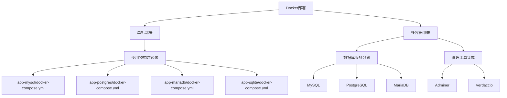

**图示来源**
- [docker-compose.yml](file://docker-compose.yml)
- [docker/app-mysql/docker-compose.yml](file://docker/app-mysql/docker-compose.yml)
- [docker/app-postgres/docker-compose.yml](file://docker/app-postgres/docker-compose.yml)

### 单机部署配置

NocoBase为不同的数据库后端提供了专门的Docker Compose配置文件，位于`docker/app-*`目录下。这些配置文件简化了单机部署的复杂性，用户可以根据需要选择合适的数据库类型。

#### MySQL部署配置
使用`docker/app-mysql/docker-compose.yml`文件可以快速部署基于MySQL的NocoBase实例。该配置文件定义了应用容器和MySQL数据库容器，通过Docker网络进行通信。

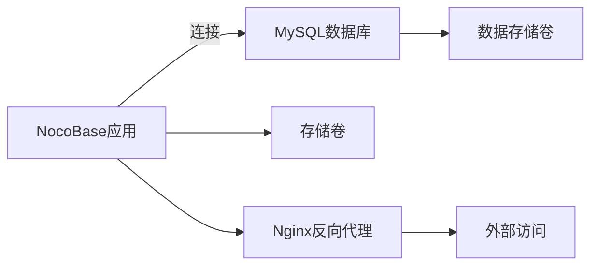

**图示来源**
- [docker/app-mysql/docker-compose.yml](file://docker/app-mysql/docker-compose.yml)

#### PostgreSQL部署配置
`docker/app-postgres/docker-compose.yml`文件提供了基于PostgreSQL的部署方案。与MySQL配置类似，它包含了应用服务和数据库服务的定义，并特别设置了逻辑复制模式以支持某些高级功能。

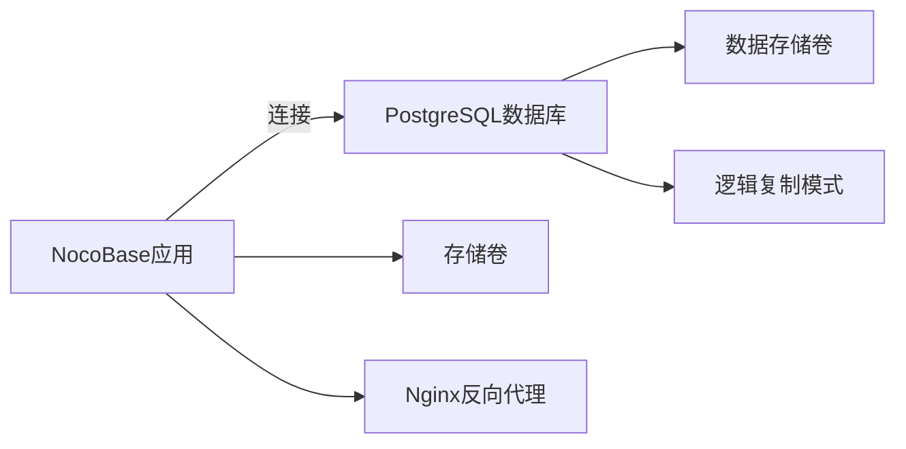

**图示来源**
- [docker/app-postgres/docker-compose.yml](file://docker/app-postgres/docker-compose.yml)

#### MariaDB部署配置
对于需要MariaDB作为后端数据库的用户，`docker/app-mariadb/docker-compose.yml`提供了相应的配置。该文件与MySQL配置非常相似，但在环境变量中明确指定了MariaDB方言。

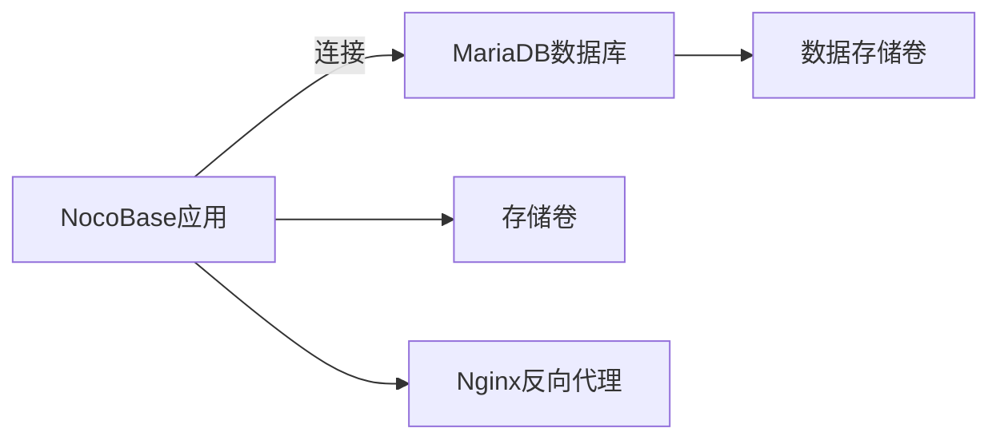

**图示来源**
- [docker/app-mariadb/docker-compose.yml](file://docker/app-mariadb/docker-compose.yml)

#### SQLite部署配置
对于轻量级部署需求，`docker/app-sqlite/docker-compose.yml`提供了基于SQLite的配置。这种部署方式不需要单独的数据库容器，所有数据都存储在应用容器的文件系统中。

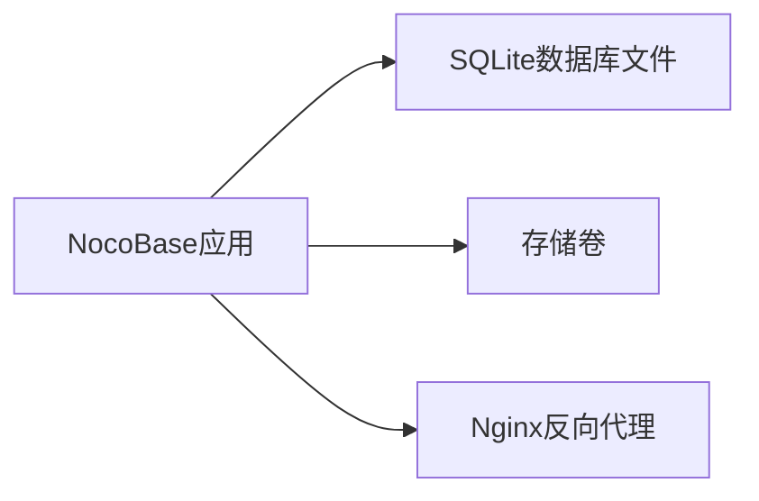

**图示来源**
- [docker/app-sqlite/docker-compose.yml](file://docker/app-sqlite/docker-compose.yml)

### 多容器部署配置

根目录下的`docker-compose.yml`文件展示了更复杂的多容器部署方案，包含了多个服务组件，适用于开发和测试环境。

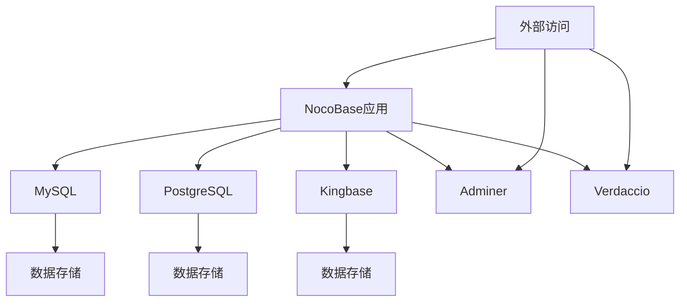

**图示来源**
- [docker-compose.yml](file://docker-compose.yml)

### Docker镜像构建

NocoBase提供了多个Dockerfile用于构建不同的镜像，包括基础镜像、完整功能镜像和专业版镜像。

#### 基础Dockerfile
`docker/nocobase/Dockerfile`定义了NocoBase的基础镜像构建过程，采用多阶段构建策略以减小最终镜像的大小。


**图示来源**
- [docker/nocobase/Dockerfile](file://docker/nocobase/Dockerfile)

#### 完整功能Dockerfile
`docker/nocobase/Dockerfile-full`在基础镜像的基础上增加了更多功能组件，如LibreOffice、Oracle Instant Client和MySQL客户端工具，适用于需要完整功能集的生产环境。

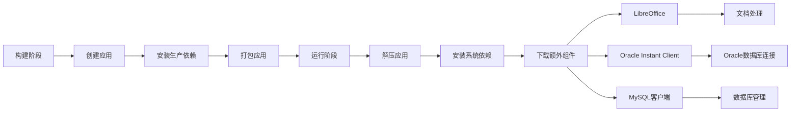

**图示来源**
- [docker/nocobase/Dockerfile-full](file://docker/nocobase/Dockerfile-full)

### Docker入口脚本

`docker/nocobase/docker-entrypoint.sh`是NocoBase容器的入口脚本，负责在容器启动时执行必要的初始化操作。

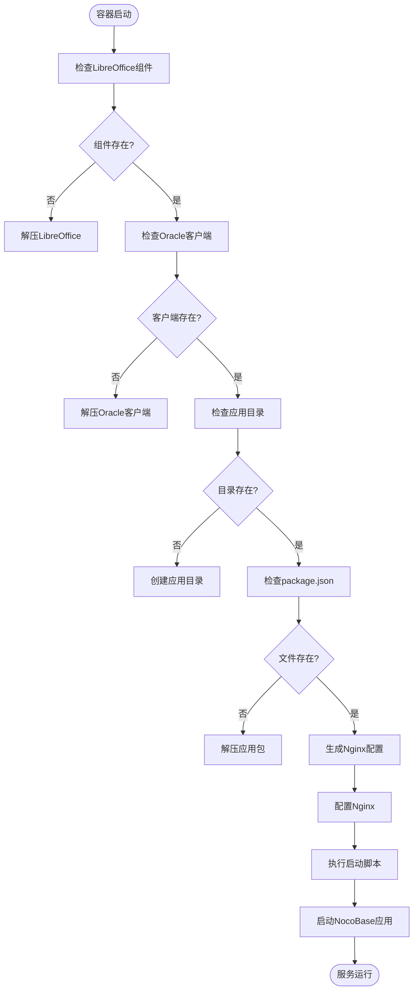

**图示来源**
- [docker/nocobase/docker-entrypoint.sh](file://docker/nocobase/docker-entrypoint.sh)

### Nginx配置

`docker/nocobase/nocobase.conf`文件定义了Nginx服务器的配置，用于反向代理和静态文件服务。

```mermaid
graph TD
A[Nginx服务器] --> B[HTTP监听80端口]
B --> C[静态文件服务]
C --> D[HTML文件: 不缓存]
C --> E[JS/CSS文件: 缓存365天]
C --> F[上传文件: 不记录访问日志]
B --> G[API代理]
G --> H[/api/路径: 代理到127.0.0.1:13000]
G --> I[/static/plugins/路径: 代理到插件服务]
G --> J[/ws路径: WebSocket代理]
H --> K[设置代理头信息]
I --> K
J --> K
K --> L[超时设置: 600秒]
```

**图示来源**
- [docker/nocobase/nocobase.conf](file://docker/nocobase/nocobase.conf)

## Kubernetes部署

虽然代码库中没有直接的Kubernetes配置文件，但基于Docker部署方案，可以推导出NocoBase的Kubernetes部署架构。NocoBase的微服务架构特性使其非常适合在Kubernetes集群中部署和管理。

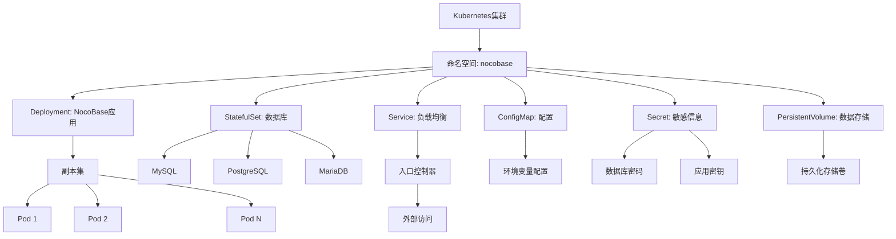

**图示来源**
- [docker-compose.yml](file://docker-compose.yml)
- [Dockerfile](file://Dockerfile)

### Helm Chart配置建议

基于NocoBase的部署特性，建议的Helm Chart配置应包含以下组件：

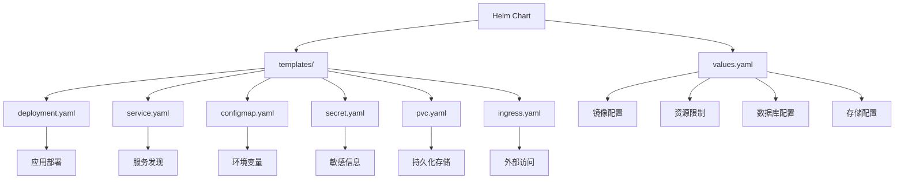

**图示来源**
- [Dockerfile](file://Dockerfile)
- [.env.example](file://.env.example)

## 传统服务器部署

对于不使用容器化技术的传统服务器部署，NocoBase提供了基于PM2进程管理和Nginx反向代理的部署方案。

### PM2进程管理

PM2是Node.js应用的进程管理工具，可以确保NocoBase应用在服务器上稳定运行。

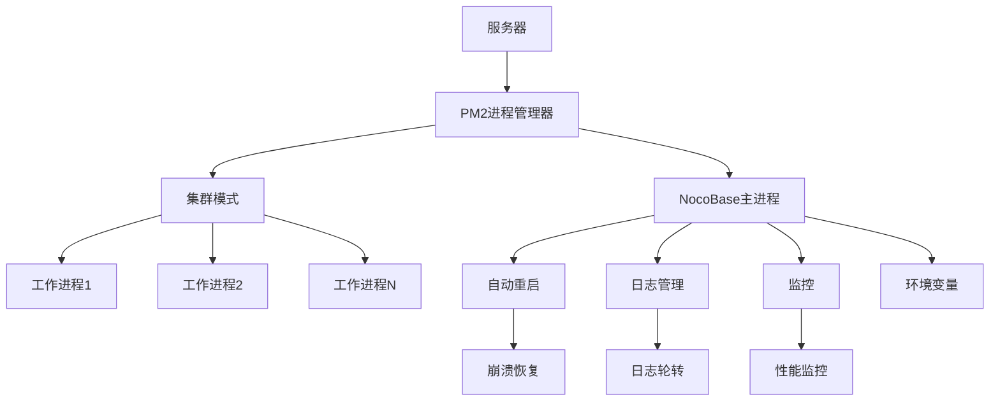

**图示来源**
- [.env.example](file://.env.example)

### Nginx反向代理配置

传统部署中，Nginx作为反向代理服务器，负责将外部请求转发到NocoBase应用。

```mermaid
graph TD
A[外部用户] --> B[Nginx反向代理]
B --> C[HTTP/HTTPS监听]
C --> D[静态文件服务]
D --> E[缓存策略]
D --> F[Gzip压缩]
C --> G[API代理]
G --> H[/api/路径代理]
G --> I[/ws路径代理]
G --> J[超时设置]
H --> K[NocoBase应用]
I --> K
J --> K
K --> L[Node.js服务器]
```

**图示来源**
- [docker/nocobase/nocobase.conf](file://docker/nocobase/nocobase.conf)

## 数据库后端配置

NocoBase支持多种数据库后端，包括MySQL、PostgreSQL、MariaDB和SQLite。每种数据库都有其特定的配置要求和注意事项。

### MySQL配置

MySQL是NocoBase支持的主要数据库之一，配置时需要注意以下几点：

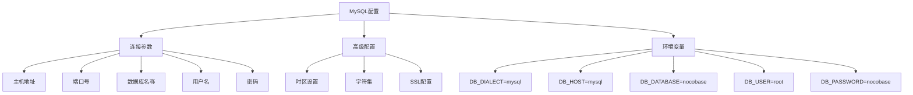

**图示来源**
- [docker/app-mysql/docker-compose.yml](file://docker/app-mysql/docker-compose.yml)
- [.env.example](file://.env.example)

### PostgreSQL配置

PostgreSQL配置与MySQL类似，但有一些特定的要求：

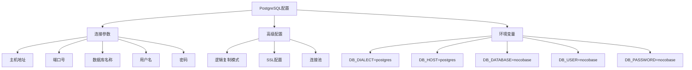

**图示来源**
- [docker/app-postgres/docker-compose.yml](file://docker/app-postgres/docker-compose.yml)
- [.env.example](file://.env.example)

### MariaDB配置

MariaDB作为MySQL的分支，配置方式与MySQL基本相同：

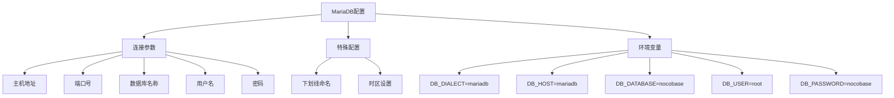

**图示来源**
- [docker/app-mariadb/docker-compose.yml](file://docker/app-mariadb/docker-compose.yml)
- [.env.example](file://.env.example)

### SQLite配置

SQLite是一种轻量级的嵌入式数据库，配置最为简单：

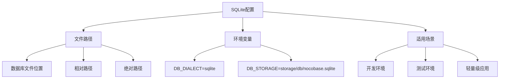

**图示来源**
- [docker/app-sqlite/docker-compose.yml](file://docker/app-sqlite/docker-compose.yml)
- [.env.e2e.example](file://.env.e2e.example)

## 生产环境最佳实践

为了确保NocoBase在生产环境中的稳定性和安全性，建议遵循以下最佳实践。

### 资源分配

合理的资源分配是确保系统稳定运行的关键：

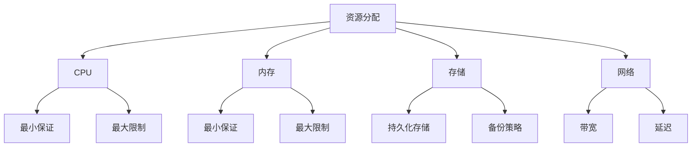

**图示来源**
- [.env.example](file://.env.example)

### 网络配置

安全的网络配置可以有效防止未经授权的访问：

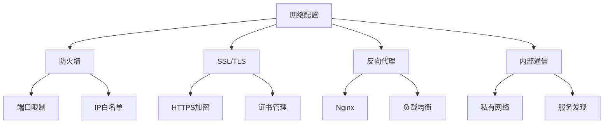

**图示来源**
- [docker/nocobase/nocobase.conf](file://docker/nocobase/nocobase.conf)

### 安全加固措施

实施全面的安全措施保护系统免受攻击：

```mermaid
flowchart TD
A[安全加固] --> B[身份验证]
B --> C[应用密钥]
B --> D[加密字段密钥]
A --> E[数据安全]
E --> F[数据库加密]
E --> G[传输加密]
A --> H[访问控制]
H --> I[角色权限]
H --> J[IP限制]
A --> K[日志审计]
K --> L[访问日志]
K --> M[操作日志]
A --> N[备份恢复]
N --> O[定期备份]
N --> P[灾难恢复]
```

**图示来源**
- [.env.example](file://.env.example)

## 故障排查指南

本节提供常见部署问题的诊断和解决方案。

### 常见问题及解决方案

```mermaid
flowchart TD
A[问题诊断] --> B[服务无法启动]
B --> C[检查日志]
C --> D[权限问题]
C --> E[端口冲突]
C --> F[依赖缺失]
A --> G[数据库连接失败]
G --> H[检查连接参数]
H --> I[主机地址]
H --> J[端口号]
H --> K[认证信息]
A --> L[性能问题]
L --> M[资源监控]
M --> N[CPU使用率]
M --> O[内存使用]
M --> P[磁盘I/O]
A --> Q[网络问题]
Q --> R[防火墙设置]
R --> S[端口开放]
R --> T[SSL配置]
```

**图示来源**
- [docker/nocobase/docker-entrypoint.sh](file://docker/nocobase/docker-entrypoint.sh)
- [.env.example](file://.env.example)

### 日志分析

有效的日志分析是故障排查的关键：

```mermaid
graph TD
A[日志分析] --> B[访问日志]
B --> C[请求路径]
B --> D[响应状态]
B --> E[客户端信息]
A --> F[错误日志]
F --> G[异常堆栈]
F --> H[错误时间]
F --> I[错误级别]
A --> J[性能日志]
J --> K[响应时间]
J --> L[数据库查询]
J --> M[内存使用]
```

**图示来源**
- [docker/nocobase/nocobase.conf](file://docker/nocobase/nocobase.conf)

## 结论

NocoBase提供了灵活多样的部署方案，从简单的单机部署到复杂的Kubernetes集群部署，满足不同规模和需求的应用场景。通过Docker容器化技术，用户可以快速部署和管理NocoBase实例，而传统的服务器部署方式则为有特定需求的用户提供更多控制权。无论选择哪种部署方式，都应遵循生产环境的最佳实践，确保系统的稳定性、安全性和可维护性。随着业务的发展，用户可以根据需要灵活调整部署架构，充分利用NocoBase的可扩展性优势。