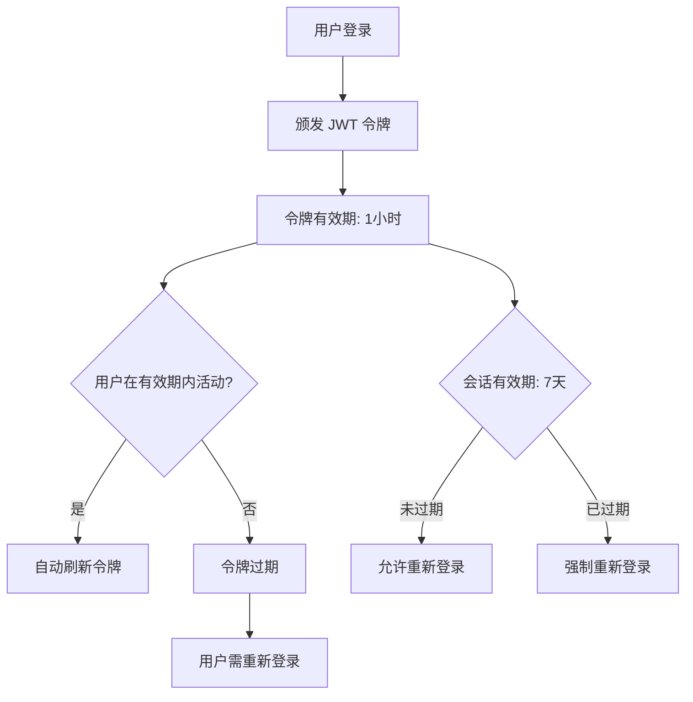

# 安全环境变量

<cite>
**本文档中引用的文件**  
- [.env.example](file://.env.example)
- [packages/core/auth/src/auth-manager.ts](file://packages/core/auth/src/auth-manager.ts)
- [packages/core/database/src/fields/encryption-field/utils.ts](file://packages/core/database/src/fields/encryption-field/utils.ts)
- [packages/core/server/src/aes-encryptor.ts](file://packages/core/server/src/aes-encryptor.ts)
- [packages/plugins/@nocobase/plugin-environment-variables/src/server/plugin.ts](file://packages/plugins/@nocobase/plugin-environment-variables/src/server/plugin.ts)
- [packages/plugins/@nocobase/plugin-auth/src/server/plugin.ts](file://packages/plugins/@nocobase/plugin-auth/src/server/plugin.ts)
- [packages/plugins/@nocobase/plugin-auth/src/server/token-controller.ts](file://packages/plugins/@nocobase/plugin-auth/src/server/token-controller.ts)
</cite>

## 目录
1. [引言](#引言)
2. [核心安全环境变量](#核心安全环境变量)
3. [密钥生成与轮换策略](#密钥生成与轮换策略)
4. [安全存储最佳实践](#安全存储最佳实践)
5. [密钥泄露应急处理](#密钥泄露应急处理)
6. [系统安全加固建议](#系统安全加固建议)

## 引言

NocoBase 是一个低代码开发平台，其安全性依赖于正确配置和管理一系列敏感的环境变量。这些变量在身份验证、数据加密和访问控制中起着关键作用。本文档全面列出与系统安全相关的环境变量，包括 JWT 密钥（JWT_SECRET）、加密盐值（CRYPTO_SALT）、会话密钥（SESSION_SECRET）、API 密钥（API_KEY）等，并详细说明其生成方法、长度要求、轮换策略以及在系统中的具体作用。同时，提供安全存储这些变量的最佳实践和密钥泄露后的应急处理流程。

## 核心安全环境变量

NocoBase 系统通过环境变量来管理其核心安全配置。这些变量主要分为两类：用于身份验证的密钥和用于数据加密的密钥。

### 身份验证相关密钥

身份验证密钥主要用于生成和验证 JSON Web Tokens (JWT)，确保用户会话的安全性。

- **APP_KEY**: 这是 NocoBase 应用程序的主要密钥，用于生成 JWT 令牌。它在 `.env.example` 文件中被定义，并在 `auth-manager.ts` 中作为 JWT 密钥的首选来源。如果未设置，系统会自动生成一个 32 字节的密钥并存储在 `storage/apps/main/jwt_secret.dat` 文件中。
- **JWT_SECRET**: 虽然在代码中没有直接以 `JWT_SECRET` 命名的环境变量，但 `APP_KEY` 的作用等同于此。其长度必须为 32 字节，以满足 AES-256 加密算法的要求。

### 数据加密相关密钥

数据加密密钥用于保护存储在数据库中的敏感字段。

- **ENCRYPTION_FIELD_KEY**: 此环境变量是加密字段功能的核心密钥。它必须是一个 32 个字符的字符串，用于 AES-256-CBC 加密算法。如果未设置此变量，系统将抛出 `EncryptionError` 错误，阻止应用启动。该密钥的验证逻辑在 `utils.ts` 文件中实现。
- **ENCRYPTION_FIELD_IV**: 这是加密字段的初始化向量（IV），默认值为 `'Vc53-4G(rTi0vg@a'`，长度为 16 个字符。它与 `ENCRYPTION_FIELD_KEY` 配合使用，增加加密的随机性。

### 其他安全相关密钥

- **APP_AES_SECRET_KEY**: 此环境变量用于为 `AesEncryptor` 类提供主密钥。如果设置了此变量，它将优先于从文件系统加载的密钥。该密钥同样必须是 32 字节长。

**Section sources**
- [.env.example](file://.env.example#L15)
- [packages/core/auth/src/auth-manager.ts](file://packages/core/auth/src/auth-manager.ts#L154-L172)
- [packages/core/database/src/fields/encryption-field/utils.ts](file://packages/core/database/src/fields/encryption-field/utils.ts#L13-L14)
- [packages/core/server/src/aes-encryptor.ts](file://packages/core/server/src/aes-encryptor.ts#L90-L97)

## 密钥生成与轮换策略

### 密钥生成方法

NocoBase 在密钥未通过环境变量提供时，会自动安全地生成密钥。

- **JWT 密钥生成**: 当 `APP_KEY` 未设置或使用默认值（如 `test-key`）时，`getDefaultJWTSecret` 方法会使用 `crypto.randomBytes(32)` 生成一个 32 字节的随机密钥，并将其安全地写入 `storage/apps/main/jwt_secret.dat` 文件，文件权限设置为 `0o600`（仅所有者可读写）。
- **AES 加密密钥生成**: 对于 `AesEncryptor`，如果 `APP_AES_SECRET_KEY` 未设置，系统会检查 `storage/apps/{appName}/aes_key.dat` 文件。如果文件不存在，则使用 `crypto.randomBytes(32)` 生成一个新的密钥并保存。

### 长度要求

所有核心加密密钥都必须严格遵守长度要求，以确保加密强度：
- **APP_KEY** 和 **ENCRYPTION_FIELD_KEY** 必须恰好为 **32 个字符**。
- **ENCRYPTION_FIELD_IV** 必须恰好为 **16 个字符**。
- **APP_AES_SECRET_KEY** 必须为 **32 字节**。

### 轮换策略

NocoBase 提供了灵活的密钥轮换机制：
- **环境变量优先**: 系统始终优先使用环境变量中的密钥。管理员可以通过更新环境变量来轮换密钥，而无需修改代码或文件。
- **文件存储作为后备**: 当环境变量未设置时，系统依赖于文件存储的密钥。轮换这些密钥需要管理员手动替换相应的 `.dat` 文件。
- **自动加载**: `plugin-environment-variables` 插件在启动时会从数据库中加载所有环境变量，并在变量更新时通过事件监听器同步到应用环境中，确保新密钥能被及时应用。

**Section sources**
- [packages/core/auth/src/auth-manager.ts](file://packages/core/auth/src/auth-manager.ts#L154-L172)
- [packages/core/server/src/aes-encryptor.ts](file://packages/core/server/src/aes-encryptor.ts#L57-L73)
- [packages/plugins/@nocobase/plugin-environment-variables/src/server/plugin.ts](file://packages/plugins/@nocobase/plugin-environment-variables/src/server/plugin.ts#L148-L195)

## 安全存储最佳实践

为了最大限度地降低安全风险，必须遵循以下最佳实践来存储 NocoBase 的安全环境变量。

### 使用环境变量而非硬编码

绝对禁止将密钥硬编码在代码中。应始终使用环境变量（如 `APP_KEY`, `ENCRYPTION_FIELD_KEY`）来注入密钥。这不仅符合 12-Factor 应用原则，还能轻松地在不同环境（开发、测试、生产）中使用不同的密钥。

### 避免提交到版本控制系统

包含密钥的配置文件（如 `.env`）必须被添加到 `.gitignore` 文件中，以防止意外提交到 Git 仓库。`.env.example` 文件可以作为模板，其中包含示例值（如 `test-key`），但绝不应包含真实的生产密钥。

### 使用专用的密钥管理系统

对于生产环境，建议使用专业的密钥管理服务（KMS），如 Hashicorp Vault、AWS KMS 或 Azure Key Vault。这些服务提供了密钥的集中管理、审计日志、自动轮换和细粒度的访问控制。

### 限制文件系统权限

当密钥存储在文件系统（如 `jwt_secret.dat`）时，必须确保文件权限设置正确。NocoBase 在创建 `jwt_secret.dat` 文件时会使用 `0o600` 模式，这确保了只有文件所有者才能读取和写入该文件。

### 加密存储在数据库中的密钥

`plugin-environment-variables` 插件提供了一个安全的机制来在数据库中存储“秘密”类型的环境变量。当创建一个类型为 `secret` 的环境变量时，`beforeSave` 事件会触发，使用 `AesEncryptor` 对其值进行加密后再存储。在读取时，`afterSave` 事件会将其解密并注入到应用环境中。这确保了即使数据库被泄露，密钥也不会以明文形式暴露。

```mermaid
flowchart TD
A[用户输入环境变量] --> B{类型为 "secret"?}
B --> |是| C[触发 beforeSave 事件]
C --> D[使用 AesEncryptor 加密]
D --> E[将加密值存入数据库]
B --> |否| F[将明文值存入数据库]
E --> G[触发 afterSave 事件]
F --> G
G --> H[解密 secret 值]
H --> I[注入到应用环境]
```

**Diagram sources**
- [packages/plugins/@nocobase/plugin-environment-variables/src/server/plugin.ts](file://packages/plugins/@nocobase/plugin-environment-variables/src/server/plugin.ts#L154-L189)

**Section sources**
- [.env.example](file://.env.example)
- [packages/plugins/@nocobase/plugin-environment-variables/src/server/plugin.ts](file://packages/plugins/@nocobase/plugin-environment-variables/src/server/plugin.ts#L154-L189)
- [.gitignore](file://.gitignore)

## 密钥泄露应急处理

一旦怀疑或确认密钥泄露，必须立即采取行动以限制损害。

### 立即轮换密钥

首要步骤是立即轮换所有可能泄露的密钥。
1.  生成新的、强随机的密钥。
2.  更新环境变量（如 `APP_KEY`, `ENCRYPTION_FIELD_KEY`）。
3.  重启 NocoBase 应用，使新密钥生效。

### 使旧会话失效

轮换 JWT 密钥后，所有使用旧密钥签名的令牌将立即失效。这意味着所有用户需要重新登录。这是预期的安全行为，可以有效阻止攻击者利用窃取的令牌进行持久化访问。

### 审计日志审查

检查 NocoBase 的审计日志（由 `plugin-audit-logs` 提供），查找在密钥泄露期间是否有任何可疑的活动，例如：
-  异常的登录尝试（来自未知 IP 地址）
-  大量的数据导出操作
-  用户或角色权限的非授权更改

### 通知相关方

根据事件的严重程度，可能需要通知受影响的用户、管理层或监管机构。

## 系统安全加固建议

除了管理环境变量外，还应采取以下措施来全面加固 NocoBase 系统的安全性。

### 定期更新和打补丁

始终保持 NocoBase 核心、插件和所有依赖项为最新版本。及时应用安全补丁是防御已知漏洞的最有效方法。

### 最小权限原则

为数据库用户、API 密钥和系统用户配置最小必要权限。避免使用具有管理员权限的账户进行日常操作。

### 启用 HTTPS

在生产环境中，必须通过 HTTPS 提供 NocoBase 服务，以加密客户端和服务器之间的所有通信，防止中间人攻击和凭证窃听。

### 配置会话策略

通过 `plugin-auth` 的“Token policy”设置，可以配置会话的有效期。建议将 `tokenExpirationTime` 设置为较短的时间（例如 1 小时），并启用自动刷新。同时，将 `sessionExpirationTime` 设置为一个合理的值（例如 7 天），以平衡安全性和用户体验。



**Diagram sources**
- [packages/plugins/@nocobase/plugin-auth/src/server/plugin.ts](file://packages/plugins/@nocobase/plugin-auth/src/server/plugin.ts#L307-L317)
- [packages/plugins/@nocobase/plugin-auth/src/server/token-controller.ts](file://packages/plugins/@nocobase/plugin-auth/src/server/token-controller.ts#L53-L63)

**Section sources**
- [packages/plugins/@nocobase/plugin-auth/src/server/plugin.ts](file://packages/plugins/@nocobase/plugin-auth/src/server/plugin.ts#L307-L317)
- [packages/plugins/@nocobase/plugin-auth/src/server/token-controller.ts](file://packages/plugins/@nocobase/plugin-auth/src/server/token-controller.ts#L53-L63)